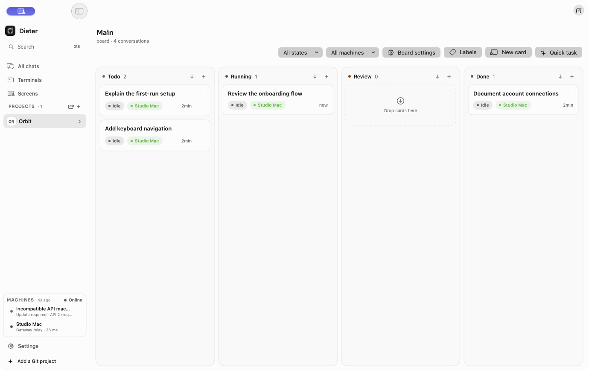

<p align="center">
  <picture>
    <source media="(prefers-color-scheme: dark)" srcset="assets/brand/assets/svg/logo-horizontal-light.svg">
    
  </picture>
</p>

<h1 align="center">Close your laptop.<br>Keep your agents running.</h1>

<p align="center">
  Run coding agents on always-on Macs and headless Linux hosts.<br>Follow the work from your Mac or phone.<br>
  Open source. Native apps. Self-hostable.
</p>

<p align="center">
  <a href="https://github.com/dbpprt/dieter/actions/workflows/ci.yml"></a>
  <a href="https://github.com/dbpprt/dieter/releases/latest"></a>
  <a href="LICENSE"></a>
</p>

<p align="center">
  <a href="https://getdieter.com/">Website</a> ·
  <a href="https://getdieter.com/docs/">Documentation</a> ·
  <a href="https://getdieter.com/docs/tour/">Product tour</a> ·
  <a href="https://github.com/dbpprt/dieter/releases/latest">Downloads</a>
</p>



Dieter is a native workspace for **Codex, Claude Code, Pi, Oh My Pi, and DeepSeek
Harness**. A local daemon runs agents on the machine with your Git checkout,
credentials, and tools. Native clients bring those machines together.
Managed OMP discovery and turns use the same pinned build. Dieter selects the
advertised model when launching OMP and keeps its catalog focused on GPT-6 Luna,
Sol, Astra, and the Tailscale GLM route. Dieter installs OMP's pinned Bun runtime
lazily, so hosts do not need a separate global OMP or Bun installation.

Your laptop is the remote control. An agent on another host keeps running when
you close the app, disconnect, or put your laptop to sleep. Keep that execution
host powered on and awake; a headless Linux host needs no desktop.

- **Give work a home.** Boards, standalone chats, labels, and schedules. Every
  task keeps one durable conversation.
- **Keep context beside the chat.** Open files, diffs, web pages, terminals, and
  background processes in the optional Mac conversation workspace.
- **Work across machines.** One shared project can have checkouts on your laptop,
  workstation, and Linux server. Each conversation keeps its execution owner.
- **Pick up from your phone.** Android provides Activity, boards, chats, files,
  terminals, and machine tools. iPhone and iPad support is in beta.
- **Step in when needed.** Queue a follow-up, review a result, or open an
  authenticated remote screen with explicit input control.

[See the native apps in action →](https://getdieter.com/docs/tour/)

## Quick start

You need a configured agent account on the host and access to a Dieter gateway.
Use your own gateway origin below; [self-hosting is documented](https://getdieter.com/docs/gateway/).

On **Apple Silicon macOS**:

```sh
brew install dbpprt/tap/dieter
dieter setup --gateway https://dieter.example.com
dieter project open ~/Development/my-project

brew install --cask dbpprt/tap/dieter-app
open -a Dieter
```

Sign in to the same gateway in the app, open your project, and create a task.
`setup` enrolls the machine and starts its service. `project open` separately
registers an existing Git working tree.

The standard gateway is `https://gateway.getdieter.com`, with STUN/TURN at
`turn.getdieter.com`. Access requires an allowed account. Existing installations
retain their identity when the endpoint moves; see the
[gateway migration guide](https://getdieter.com/docs/gateway/#moving-a-gateway-endpoint).

If a machine was accidentally re-enrolled and its earlier conversations still
belong to its revoked ID, keep the original `DIETER_HOME` and private key. On
that machine, after updating the gateway and CLI, run
`dieter daemon recover --old-id ORIGINAL_ID --confirm RECOVER`. Recovery requires
the active replacement and revoked original to belong to the same account and
share the original key. Restart the daemon service, verify the original chats,
then explicitly revoke the replacement ID. Do not edit gateway storage or
`identity.json` directly; see `dieter daemon recover --help`.

On **Linux amd64/arm64**, install Node.js 22.19+, npm, Git, and
[cosign](https://docs.sigstore.dev/cosign/system_config/installation/), then:

```sh
curl -fsSL https://github.com/dbpprt/dieter/releases/latest/download/install.sh | sh
dieter setup --gateway https://dieter.example.com
dieter project open ~/Development/my-project
dieter doctor
```

| Client | Get it |
| --- | --- |
| macOS 26+, Apple Silicon | Homebrew cask above or [release downloads](https://github.com/dbpprt/dieter/releases/latest) |
| Android 8+ | [Download the APK](https://github.com/dbpprt/dieter/releases/latest/download/Dieter-Android.apk) |
| iOS 18+, iPhone and iPad | [Beta and source-build guide](apps/ios/README.md) |

The daemon supports headless Linux hosts. Screen hosting needs an active desktop
and [platform dependencies](docs/linux-support.md).
[Full installation guide →](https://getdieter.com/docs/installation/)

## How it works

**Daemon → gateway → native client.** The daemon owns local execution and
replicates shared project metadata with your other daemons. The gateway handles
account identity, machine discovery, and bounded relay. Clients prefer verified
direct TLS, then supported WebRTC. Native clients start a parallel authenticated
relay connection after one second if WebRTC is still connecting, use the first
healthy route, and close the unused attempt. Application requests are sent once.

The gateway stores control metadata and normalized quota snapshots, **not**
repositories, transcripts, or provider credentials. Relay requests can pass
through it. Agents run with your user permissions, without a Dieter sandbox;
cloud model providers may receive prompts and code according to their settings.
Read the [security model](https://getdieter.com/docs/security/).

There is no browser application or hosted agent runtime. The website is the
project's documentation; your agents run on your machines.

## Find your way

| You want to… | Read |
| --- | --- |
| Run your first agent | [Quick start](https://getdieter.com/docs/quickstart/) |
| Understand tasks, worktrees, and review | [Projects & tasks](https://getdieter.com/docs/projects/) |
| Automate through the daemon | [CLI guide](https://getdieter.com/docs/cli/) |
| Add machines or host a gateway | [Machines](https://getdieter.com/docs/machines/) · [Self-hosting](https://getdieter.com/docs/gateway/) |
| Understand internals | [Architecture](https://getdieter.com/docs/architecture/) · [Technical index](docs/README.md) |
| Fix a connection or setup problem | [Troubleshooting](https://getdieter.com/docs/troubleshooting/) |

## Contribute

See [CONTRIBUTING.md](CONTRIBUTING.md) for setup, repository structure, and review
expectations. Start local validation with:

```sh
just check-changed --dry-run
just check-changed
```

Run Android journeys with `just e2e run --suite smoke`. The
[native test guide](tests/e2e/README.md) covers YAML cases, suite selection,
failure evidence, and iOS preparation; Mac execution is disabled.

[Mac](apps/mac/README.md) · [Android](apps/android/README.md) ·
[iOS](apps/ios/README.md) · [Website](landingpage/README.md)

Dieter is [MIT-licensed](LICENSE). Pronounced **DEE-ter**. Made in Berlin.

### Unseen model replies

Activity on macOS and Android shows **Needs attention** for completed model
replies that have not been viewed and for questions waiting for an answer.
Viewing the latest transcript in the foreground acknowledges that reply across
clients. A Review lane alone does not imply an unread reply.

Card/chat metadata includes `responseSeq`, `responseMessageId`, and
`seenResponseSeq`. Automation can acknowledge a displayed response using
`dieter card read --response-seq SEQ CARD` (also `chat read`). The command supports
local, direct TLS, and relay routes with global `--machine`. Stale receipts never
clear newer replies. Board comments and the card/chat comment commands are removed.
