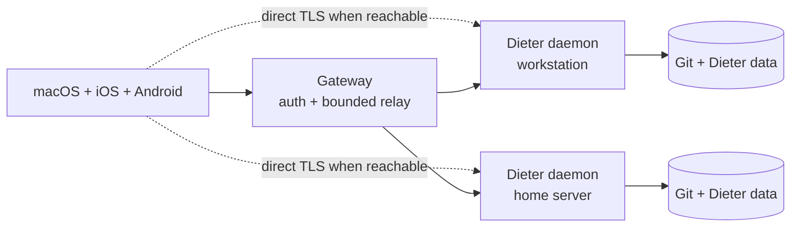

<p align="center">
  
</p>

<h1 align="center">Dieter</h1>

<p align="center">
  <strong>Many agents, many machines, one interface.</strong><br>
  Run coding agents wherever the code lives, and control them from macOS, iOS, or Android.
</p>

<p align="center">
  <a href="https://github.com/dbpprt/dieter/actions/workflows/release.yml"></a>
  <a href="LICENSE"></a>
  <a href="https://dbpprt.github.io/dieter/"></a>
</p>

<p align="center">
  <a href="#quick-start">Quick start</a> ·
  <a href="#how-it-works">How it works</a> ·
  <a href="#self-hosting">Self-hosting</a> ·
  <a href="#development">Development</a>
</p>

Dieter (pronounced **DEE-ter**) is an open-source control plane for local coding
agents. It runs [Codex](https://github.com/openai/codex),
[Claude Code](https://github.com/anthropics/claude-code),
[Pi](https://github.com/badlogic/pi-mono), and
[Oh My Pi](https://github.com/can1357/oh-my-pi), and
[DeepSeek Harness](https://github.com/deepseek-ai/deepseek-harness) on the
machines that hold your Git working trees, credentials, and tools—then brings
them together in one native workspace.

- **Work across machines.** Enroll a laptop, workstation, or home server and
  see their projects in one place.
- **Keep execution local.** Agents run beside the code without sending project
  data or harness credentials through the gateway.
- **Resume real work.** Chats, boards, queues, terminals, files, schedules, and
  conversation history survive client disconnects and daemon restarts.
- **Steer without losing your place.** Follow-ups wait visibly behind the
  active turn and can be steered next, removed, or returned to the composer for
  editing before they run.
- **Use native clients.** The macOS, iOS, and Android apps automatically route
  each project to the machine that owns it. The iPhone and iPad app is
  currently in beta.
- **Bring your existing agent setup.** Dieter uses each harness's normal local
  configuration and supports per-card model and effort settings.

There is no web UI or cloud agent runtime. Dieter began as a personal system
for running coding agents at scale and remains MIT-licensed. Issues and pull
requests are welcome.

> [!WARNING]
> Harness workers have the permissions of the user running the daemon. Keep the
> raw daemon data plane loopback-only; use the authenticated gateway or a
> verified direct TLS route for remote access.

## Quick start

Supported releases and beta builds cover these roles:

| Role | Linux amd64 | Linux arm64 | Apple Silicon macOS | iOS 18+ | Android 8+ |
| --- | --- | --- | --- | --- | --- |
| CLI and daemon host | Yes | Yes | Yes | No | No |
| Gateway | Yes | Yes | Build from source | No | No |
| Native viewer client | No | No | Yes | Beta | Yes |
| Screen capture/control host | Yes¹ | Yes¹ | Yes | No | No |

¹ Linux hosting requires an active X11 or Wayland desktop plus the feature-scoped
GStreamer/portal packages in the [Linux host guide](docs/linux-support.md).

### Linux daemon host

On a systemd-based Linux host, install Node.js 22.19 or newer, npm, Git,
[`cosign`](https://docs.sigstore.dev/cosign/system_config/installation/), and
`tmux`. Screen hosts additionally need GStreamer and the desktop portal/X11
packages listed below. Then install the signed amd64/arm64 release and register
a Git working tree:

```sh
curl -fsSL https://github.com/dbpprt/dieter/releases/latest/download/install.sh | sh
dieter setup ~/Development/my-project
dieter doctor
```

Remote desktop is deliberately opt-in. Installing the helper and detecting a
display do not enable screen access. Run the interactive service-side check to
verify capture and input, then enable viewing and control:

```sh
dieter daemon permissions
dieter screen settings
dieter screen capabilities
```

The final capability response should contain `"enabled": true` and
`"ready": true`. For view-only hosting, run `dieter screen permissions` and
then `dieter screen update --enabled=true --control=false`. An authorized
non-interactive control setup can use `dieter screen permissions
--request-control` followed by `dieter screen update --enabled=true
--control=true`. Disable all screen access with `dieter screen update
--enabled=false --control=false`. These commands also accept the global
`--machine ID|NAME` selector.

The installer verifies the Sigstore-signed release manifest and archive
checksum, replaces each executable by atomic rename, and creates a private
systemd user service when a user manager is available. The release and managed updater stage the daemon and
`dieter-capture` helper as one verified pair. Linux hosts support X11 capture and
XTest control, plus Wayland capture/control through the XDG ScreenCast and
RemoteDesktop portals with PipeWire. Missing desktop/media packages degrade only
screen hosting; projects, agents, schedules, terminals, remote execution,
telemetry, power operations, and managed updates continue to work. `tmux` is
required only for terminals to survive daemon restarts, but is recommended on
every daemon host. See the
[Linux host guide](docs/linux-support.md) for distro commands and the complete
feature-scoped dependency list.

### macOS daemon and app

On Apple Silicon macOS, install the daemon and register a Git working tree:

```sh
brew install dbpprt/tap/dieter
dieter setup ~/Development/my-project
```

`dieter setup` enrolls the machine, registers the project, starts the daemon as
a Homebrew service, and verifies optional screen-sharing permissions through
that running service. Add
`--skip-screen-sharing` on hosts that should never capture their display.

The Homebrew service runs signed, regular executable files at
`$(brew --prefix)/var/dieter/service/bin/{dieter,dieter-capture}`. The CLI remains
in the Cellar; all user data stays in `DIETER_HOME` (default `~/.dieter`).
`brew upgrade dieter` verifies and stages a release without modifying the running
pair. `brew services restart dieter` activates it at the same real paths, before
workers or capture start. An activation that fails before the API listener binds
is rolled back on the next service start. The installation lock and service
lifetime lock prevent partial-pair activation and concurrent service ownership.

When upgrading from the old Cellar service, restart it once to update its launch
definition, then run `dieter daemon permissions`. Grant the fixed **daemon** path
Screen & System Audio Recording and Accessibility access. Existing grants for
versioned Cellar paths do not transfer. Signing requirements remain compatible
across releases; grant retention must be verified with the signed upgrade
acceptance procedure in [the runtime guide](docs/homebrew-service-runtime.md).

`dieter daemon permissions --check` and `dieter screen permissions` always query
the running daemon (also with global `--machine ID|NAME`). They discard a captured
frame and check input permission without injecting input or changing settings.
They fail when the daemon is unreachable; the caller's own permissions never
substitute for the service's. Onboarding does not automatically restart a daemon.
If macOS asks for a restart after granting access, restart the service explicitly
and repeat the check. Keychain access is separate from these screen permissions.

Stop the service before uninstalling with Homebrew. Homebrew preserves `var`, so
the fixed runtime remains after uninstall alongside the separately preserved
user data. Remove `$(brew --prefix)/var/dieter/service` only after stopping the
service and deciding that this installation is no longer needed.

Install the native Mac app separately:

```sh
brew install --cask dbpprt/tap/dieter-app
open -a Dieter
```

Sign in to the configured gateway. Projects from every enrolled machine appear
in one workspace; Dieter selects the correct daemon automatically. See the
[macOS](apps/mac/README.md), [iOS](apps/ios/README.md), and
[Android](apps/android/README.md) guides for source builds and platform-specific
details.

The Mac workspace uses native blurred glass. For solid surfaces, turn off
**Window transparency** under **Settings → General → Appearance**. The setting
works with every design and light/dark mode; macOS **Reduce Transparency** also
disables translucency while preserving your preference.

Useful daemon commands:

```sh
dieter daemon status
dieter daemon logs --follow
dieter daemon permissions --check
brew services restart dieter
```

`dieter daemon status` reports the gateway tunnel state and the most recent
acknowledged tunnel heartbeat. A healthy local API remains available while a
failed gateway tunnel reconnects; reconnecting the transport does not stop a
running agent turn.

`dieter watch sync` (also with `--machine`) streams workspace metadata and deltas.
A transport heartbeat proves reachability; it does not mean the workspace is
current. `observedCursor` is the daemon's durable highwater, while `cursor`
identifies applied data. Never persist a heartbeat cursor or a partial batch
(`projectionPending=true`). Native clients request metadata first, then bounded
recent/active transcript tails; the selected chat loads its own detailed history.
Resume uses an exact retained projection identity, or an explicit reset if that
projection is unavailable. Frames stay below 8 MiB; large directories use pages.

The same `dieter` binary is a complete daemon client. Local commands use the
running daemon on this machine. To control another enrolled machine, sign in
once and select it globally; the CLI prefers verified direct TLS and falls back
to the gateway relay. State, sync, conversation, terminal, execution, and
Git-operation watches renew direct credentials and resume after transient
failures. Recovery uses the last delivered sequence or complete sync projection,
with up to five retries between frames. Revoked credentials and permanent errors
stop recovery. Mutations, process starts, and stdin writes are never replayed:

```sh
dieter auth login
dieter machine list --format jsonl
dieter machine gateway
dieter machine info
dieter --machine <machine-id> status
dieter --machine <machine-id> machine info
dieter --machine <machine-id> project list --format jsonl
dieter --machine <machine-id> remote exec --project <project-id> -- uname -a
dieter --machine <machine-id> terminal list --format jsonl
dieter --machine <machine-id> terminal create --home --name shell --format id
```

`machine list`, `machine show`, and `machine watch` expose both the Dieter
release version and the data-plane API version. `machine gateway` reports the
gateway release and control-plane API versions. `machine info` returns live
host telemetry, including optional Apple, NVIDIA, and AMD GPU data with absent
sensors kept distinct from real zero values. Native clients use API versions
to keep compatible machines in a mixed-version fleet available.

Restart, shutdown, and daemon update use the same authenticated local,
direct-TLS, or relay route as every other machine operation and require exact
confirmation phrases:

```sh
dieter --machine <machine-id> machine restart --confirm RESTART
dieter --machine <machine-id> machine shutdown --confirm "SHUT DOWN"
dieter --machine <machine-id> machine update --confirm UPDATE
```

macOS uses the signed-in user's normal System Events authorization. Linux uses
non-interactive systemd-logind authorization and never accepts a sudo password;
an administrator must grant the daemon user the relevant PolicyKit permission
before the commands are advertised as available.

Messages submitted during an active turn wait in that conversation's durable
queue. Native clients can steer the next message, discard any queued message,
or return it to the composer for editing. Automation can dequeue the complete
payload (including attachments) as JSON:

Steering acknowledges as soon as cancellation is requested. The queued message
stays durable and starts only after the active turn has actually finished its
provider cleanup, even when that cleanup takes longer than the client request.

```sh
dieter card queue remove --message <message-id> <card-id>
```

Automatic daemon update supports Homebrew-managed macOS services and
Dieter-managed Linux systemd user services. Linux verifies the GitHub OIDC
Sigstore signature and SHA-256 manifest, stages the static executable in a
fixed runtime, restarts through a separate systemd update unit, and commits only
after listener readiness. An unacknowledged activation rolls back on the next
service start. Foreground and distro-package-managed daemons report why
self-update is unavailable.

`dieter status` reports daemon-wide active project, board, card, and chat
counts in one snapshot, including when the selected machine is remote.

For agent automation, `dieter remote` is the SSH-like secondary interface. It
runs exact argv on the selected daemon, keeps stdout and stderr distinct,
propagates the remote exit code, supports idempotent admission, and allows
bounded output to resume by sequence after a disconnect. `remote shell` adds a
native PTY when one is actually needed:

```sh
dieter --machine <machine-id> remote exec --project <project-id> \
  --idempotency-key build-42 --format jsonl -- go test ./...
dieter --machine <machine-id> remote wait <execution-id>
dieter --machine <machine-id> remote shell --project <project-id>
```

The gateway only transports these authenticated RPCs. Execution state and
output remain on the daemon host, and dropping a watch does not stop its
process; cancellation is always explicit.

Run `dieter --help` for the complete surface and
`dieter help <group> <action>` for command-specific flags. Projects, cards and
chats, files, remote executions, terminals, workspaces and Git operations, schedules, prompts,
admission settings, screen signaling, and machine control all use the same
daemon API as the native apps. Schedule lists and occurrence history use
bounded, cursor-paginated queries so high-frequency schedules do not make
native views or CLI calls grow with all retained history:

```sh
dieter schedule list --project <project-id> --page-size 50
dieter schedule runs <schedule-id> --page-size 50
# Continue either command with the opaque NEXT PAGE value it returned:
dieter schedule runs <schedule-id> --page-token <token>
```

## How it works

Every Dieter card and standalone chat maps to one durable AI SDK Harness
conversation in a real Git working tree.

At creation, each conversation explicitly chooses one of two execution modes:

- **New worktree** gives the card/chat its own daemon-managed directory and Git
  branch. Its local changes are shown inside that conversation.
- **Project directory** runs in the registered checkout exactly as it currently
  exists, including its currently checked-out branch. Dieter never calls this
  mode “main” and does not switch branches. Because the directory is shared,
  its local changes are shown once under the project's **Files → Changes**
  surface, not attributed to individual project-mode cards.

The Changes API reports only uncommitted Git state and keeps the index and
working tree separate. The same path can therefore appear in both **Staged**
and **Changes**. Commits are history, not working changes. By default a commit
operation commits only the staged index; explicitly staging all is a separate
choice. Project-directory staging, unstaging, staged-only commits, per-file
discard with recovery artifacts, and validation all run on the owning daemon
and use optimistic changeset revisions.

The CLI exposes the same two scopes:

```sh
dieter workspace changes WORKTREE_CARD_ID
dieter workspace diff --section unstaged --path path/to/file.go WORKTREE_CARD_ID
dieter workspace changes --project PROJECT_ID
dieter workspace run --project PROJECT_ID --kind stage \
  --revision REVISION --param path=path/to/file.go --wait
dieter workspace run --project PROJECT_ID --kind commit \
  --revision REVISION --param subject="Focused change" --wait
```



The system has three components:

1. **Daemon and CLI** — own projects, conversations, terminals, schedules,
   files, and local harness workers on each machine.
2. **Gateway** — authenticates one allowed GitHub identity and connects enrolled
   daemons through a bounded relay.
3. **Native clients** — combine projects from all online daemons and prefer a
   verified direct TLS route when one is reachable.

Both network paths expose the same `dieter.v1.DieterService` API. The gateway
stores account sessions, daemon identities, presence, and route metadata. It
never stores project code, transcripts, schedules, files, or harness
credentials. Daemons prove possession of their Ed25519 identity on each tunnel
connection.

All domain data lives under `DIETER_HOME` on the daemon host (by default
`~/.dieter`). Writes are atomic and cross-process locked. Graceful shutdowns
preserve provider continuation state so work can resume without replaying the
user prompt.

### Linked content beside a conversation on macOS

Click a file or web link in a conversation to expand the chat and open a resizable
content pane on the right. Markdown opens in the native rich editor, code and text
open in a selectable syntax view (including linked line numbers), images support
zoom, PDFs use PDFKit, and web URLs open in a browser with Back, Forward, Reload,
and Open in default browser. Other files offer Save a Copy.
Bare development addresses such as `127.0.0.1:4018`, `localhost:3000`, and
`[::1]:8080` are clickable in prose and inline code. Fenced code stays literal.

Files are read from the conversation's machine and workspace through the existing
file API. Markdown saves check the file revision; conflicts preserve your edits.
Opening another item or closing an edited document offers Save, Discard Changes,
or Cancel. Switching conversations retains the current unsaved document until
you return or choose another item. Closing the content pane restores the previous
board or chat-list layout. Right-click a file link for **Open in** (supported
installed apps) or **Show in Finder** on its owning local workspace. Remote files
offer **Download File** for a local copy; their paths are never opened as local
files. Command-click keeps the system's external link action.

Agents can register exact-argv background commands with `start_background_process`;
`list_background_processes`, `read_background_process`, and
`stop_background_process` stay bound to the owning conversation. CLI automation
uses `dieter remote exec --card ID --detach --format json -- COMMAND ARG…`.
The **Processes** workspace tab shows running and exit state, separate bounded
stdout/stderr, and an explicit **Stop** action. Closing a tab or finishing a turn
detaches observers; processes end on exit, timeout, explicit stop, or daemon
shutdown.

### Markdown files on macOS

Markdown files in **Files** open in **Edit**, using SwiftMarkdownEngine for native
rich editing with headings, formatting, lists, links, and tables. Mermaid and
Vega/Vega-Lite fences appear as rendered diagrams and charts. Click a diagram to
edit its code; moving the caret outside the block renders it again. The original
fenced Markdown remains the saved source.

Use **Edit · Source** to switch between rich editing and Markdown source. Both
views share the current draft, retain their native editors when switching modes,
and use the same separate **Save** action. Files always open in Edit mode.

Right-click the rich editor to **Copy as Rich Text** or **Copy as
Markdown**. A selection copies only that content; without a selection, the whole
document is copied. Rich text uses formatted HTML with a plain-text fallback.

Vega-Lite charts adapt to the editor pane even when their Markdown specifies a
fixed width. Titles and subtitles wrap; axes, labels, and chart annotations stay
within the pane. Authored heights and colors are preserved. Composed, stepped,
and Vega charts fit proportionally when their layout cannot reflow. Resizing the
pane does not modify the saved chart specification.

Fenced `mermaid` blocks render diagrams. Use `vega-lite` (or `vegalite`) fences
for Vega-Lite charts, or `vega` for Vega specifications, with inline chart data
such as `data.values`. Tables, ordinary code blocks, and links also render. The
renderer and its libraries are bundled for offline use; it does not fetch
external images, datasets, or scripts. A diagram error stays beside that block
while the rest of the document remains visible. Mermaid source is limited to
100 KB; Vega/Vega-Lite JSON has a separate 1 MB limit for embedded datasets.

The file header's name and path are selectable, with **Copy File Name** and
**Copy Path** actions. **Open in** lists installed applications for verified
local files, with **Save As…** for a local copy. A visible **Show in Finder**
control is available for every file type in Files and the conversation workspace.
Files on remote machines can be saved as a local copy; remote paths are never
opened on this Mac.

Markdown files offer **Export PDF…** and **Export HTML…** from the file toolbar
in Files and the conversation workspace.
Exports include the current unsaved draft and rendered diagrams and charts. PDF
uses a light appearance and paginated A4 pages; HTML is a standalone document.

## Self-hosting

### Requirements

These are source-development requirements. Published daemon releases do not
require Go or `just`; their runtime and optional feature dependencies are
documented in the [Linux host guide](docs/linux-support.md) and the platform app
guides.

- Go 1.26.8 or newer
- Node.js 22.19 or newer on daemon hosts
- [just](https://just.systems/) 1.58 or newer for development commands
- Git working trees for registered projects
- a configured Codex, Claude Code, Pi, Oh My Pi, or DeepSeek Harness
  installation
- macOS 26+, iOS 18+, or Android 8+ for the native clients

Build the CLI/daemon and gateway:

```sh
just build
# Or independently:
just daemon build
just gateway build
```

The Go binaries are written to `bin/dieter` and `bin/dieter-gateway`. Linux
screen-host development builds `dieter-capture` with
`native/linux-capture/build.sh`; published Linux daemon archives already include
the helper. A headless source-built agent needs only `dieter`; the public host
needs only `dieter-gateway`.

Install a source build into a directory already on `PATH` (override `PREFIX` or
`DESTDIR` for packaging). Linux and macOS install the matching capture helper by
default and therefore require the platform build dependencies:

```sh
just install "$HOME/.local"
```

For a deliberately headless source installation, omit the helper explicitly:

```sh
just install "$HOME/.local" "" false
```

Published macOS and Linux archives also contain `install.sh`. For a one-command
user install, the script defaults to `/usr/local/bin` when writable and
otherwise uses `~/.local/bin`:

```sh
curl -fsSL https://github.com/dbpprt/dieter/releases/latest/download/install.sh | sh
```

The installer requires `cosign` and rejects unsigned manifests, mismatched
checksums, and unexpected archive paths. It accepts `--version VERSION`,
`--install-dir DIR`, and `--no-service`; the existing `DIETER_VERSION`,
`DIETER_INSTALL_DIR`, and `DIETER_NO_SERVICE=1` environment forms remain
available for automation. On Linux it atomically replaces each CLI/helper
executable and installs or refreshes the systemd user service, whose fixed runtime
activates the verified pair together, when a user manager is available.
The portable macOS archive installs the CLI and capture helper without registering
a service; Homebrew remains the managed macOS route. For example, this pins a
foreground installation:

```sh
curl -fsSL https://github.com/dbpprt/dieter/releases/latest/download/install.sh \
  | sh -s -- --version 0.4.123 --install-dir "$HOME/.local/bin" --no-service
```

Linux service removal preserves all data:

```sh
dieter daemon service status
dieter daemon service restart
dieter daemon service uninstall
```

Apple Developer ID releases additionally include a notarized, stapled
`dieter-darwin-arm64.pkg`. It installs a versioned daemon and capture helper
without changing a running service or a Homebrew installation. See
[Apple release signing](docs/apple-release-signing.md) for installation paths,
dedicated signing credentials, and GitHub release access.

### Daemon

For a manual installation, register a project and start the local daemon:

```sh
dieter project open ~/Development/my-project
dieter daemon start
```

Create a story-only quick task with the same daemon-side GPT Spark 4–6 word
title generation used by the native Kanban popover. Creation returns immediately
with a usable task and a brief-derived title; Spark updates that same task in the
background without changing its ID or overwriting later title edits. If Spark is
unavailable, the saved title remains. Use `--lane running` to start immediately,
equivalent to **Run task** beside **Add task** in every Mac Quick Task entry point:

```sh
dieter card create --project PROJECT --board BOARD --lane todo \
  --auto-title --prompt "Add keyboard navigation to the board" \
  --workspace worktree
```

Each board can snapshot its own Git remote into newly created cards and choose
how reviewed work is published. `manual` keeps remote actions explicit,
`pull_request` routes delivery through a PR, and `push_base` pushes the
validated local integration to the configured base branch:

```sh
dieter board git --base-remote private --remote-publish pull_request BOARD_ID
```

To reach it through your gateway, enroll the machine once:

```sh
dieter daemon enroll \
  --gateway https://dieter.example.com \
  --name "Studio Mac"
```

After GitHub sign-in, check the machine name and enrollment code on the
gateway's confirmation page, then approve that machine. The page also displays
its public-key fingerprint. Opening a verification link alone does not approve
enrollment.

The raw data plane remains on `127.0.0.1:4242`. To add a trusted LAN or
tailnet route, expose a separate authenticated TLS listener—never raw port
4242:

```sh
dieter daemon start \
  --direct-addr 0.0.0.0:4244 \
  --direct-host 100.64.0.10 \
  --direct-network tailscale
```

### Gateway

Create a GitHub OAuth App, copy [`.env.example`](.env.example) to
`$DIETER_GATEWAY_HOME/.env`, and set the allowed account IDs to their immutable
numeric GitHub IDs. Use `DIETER_GITHUB_ALLOWED_USER_IDS` with a comma-separated
list for multiple isolated accounts; the singular variable remains supported.
Then run:

```sh
DIETER_GATEWAY_HOME=/var/lib/dieter-gateway just gateway run
```

The gateway can sit behind a same-host HTTPS reverse proxy or terminate TLS
itself. Proxy mode requires a loopback listener and an HTTPS
`DIETER_PUBLIC_URL`; direct TLS requires `DIETER_GATEWAY_TLS_CERT` and
`DIETER_GATEWAY_TLS_KEY`. All unspecified public routes, including `/`, return
404 by design.

Daemon enrollment and CLI gateway connections require HTTPS. HTTP is accepted
only for literal loopback addresses such as `http://127.0.0.1:8080` in isolated
local setups; hostnames and other IP addresses require TLS.

Run `just gateway vulncheck` and `just daemon vulncheck` to scan both binaries
with the pinned release Go toolchain. CI gates gateway images and downloadable
daemon/gateway releases on the corresponding vulnerability scan.

### Harnesses

| Harness | Default configuration |
| --- | --- |
| Codex | `~/.codex` or `CODEX_HOME` |
| Claude Code | `~/.claude` or `CLAUDE_CONFIG_DIR` |
| Pi | `~/.pi/agent` or `PI_AGENT_DIR` |
| Oh My Pi | `~/.omp/agent`, with `OMP_PROFILE` when set |
| DeepSeek Harness | `~/.dsh` or `DSH_HOME` |

Supported models and provider options live in
[`config/harnesses.yaml`](config/harnesses.yaml). Override the registry with
`$DIETER_HOME/harnesses.yaml`, `DIETER_HARNESS_CONFIG`, or `--harness-config`.
DeepSeek Harness is installed lazily at its exact tested version through the
AI SDK ACP bootstrap; a global `dsh` installation is not required. DSH owns its
provider and credential configuration. Dieter discovers the models advertised
by DSH's standard ACP session options and returns only those models to clients.
Model catalogs are machine-local: native clients load the catalog from the
daemon that owns the selected project and never reuse another machine's model
list. A daemon retains its last successfully discovered catalog across
transient refresh failures and performs one bounded provider refresh when a
create or resume request names a model that is not in its current catalog.
For OMP turns, Dieter supplies a private runtime overlay that allows 30 minutes
for the first model event and 30 minutes between model stream events. This
overrides OMP model defaults that can otherwise stop long-running delegated
work after 10 silent minutes; it does not impose a total turn duration limit or
modify the user's OMP configuration.
See the [DSH integration proposal and operational notes](docs/deepseek-dsh-harness.md).
An optional model `defaultEffort` is Dieter's default for new conversations and
overrides the provider-discovered default when that model supports the selected
level. Pass `--effort default` to explicitly use the provider's native default.
Codex advertises a mutable `fast_mode` option for GPT-5.4, GPT-5.5, GPT-5.6,
and GPT-6 Astra models: native clients expose it for chats, board tasks, and
scheduled task templates, while the CLI accepts
`--provider-option fast_mode=true`. GPT-5.3 Codex and Spark do not expose Fast
mode. Turning it off explicitly selects the standard service tier for that
conversation.

Dieter pins Codex SDK/CLI 0.155.0 and links its harness bridge to that same
runtime; updating a separate global `codex` command does not update Dieter's
bundled CLI. Astra, Sol, and Terra support Max and Ultra; Luna supports Max.
Ultra is Codex's native mode with automatic task delegation, rather than an
API reasoning-effort value. Model-specific choices also apply when resuming
an existing conversation.

## Development

For local iteration, detect changes and run only the affected components:

```sh
just check-changed --dry-run
just check-changed
just check-changed --base origin/main
```

This requires Python 3 and includes staged, unstaged, deleted, renamed, and
untracked files. By default it compares with `HEAD`; `--base REF` includes branch
changes since the merge base with that ref. Documentation-only edits skip tests.
Go changes run race tests and vet for affected packages and their reverse
dependencies (including test imports and embedded files). Native changes run
the affected client's complete unit test suite because each client is one
application module. App code, resources, or build configuration also select
that client's integration tests. macOS selects smoke suites by component: for
example, Island views run `island`, while board and conversation panel hosts run
`core`, `board`, `conversation`, and `workspace` to cover panel resizing,
maximizing, and workspace tabs. Mixed changes run the union once, with one build. Shared
app/store/theme code, build configuration, shared fixtures, and unknown Mac paths
fall back to all eight suites. A changed smoke runner selects its own suite
(`NativeUISmokeRunner` selects both `core` and `board`). The mapping lives in
`scripts/check_changed.py`; add coverage when introducing a new component.
Android app changes select connected tests. Unit-test-only edits do not select
device tests. Shared protobuf and native fixture changes select both clients.
Harness and website changes select their own checks.

To run a known subset directly, use `just mac smoke-suites board conversation island`.
It builds once and runs suites serially with the existing cache and
isolated smoke driver. Explicit `just mac smoke-all` and CI still run every suite.

Checks stop on the first failure. Mac smoke tests require no Dieter app to be
running; Android connected tests require a healthy configured emulator and use
the existing instrumentation configuration, including its opt-in gateway tests.
The command never stops an app or daemon, starts an emulator, or changes gateway
credentials. `--dry-run` shows the exact commands without executing them.

Install the pinned JavaScript harness runtime and run the full Go checks:

```sh
just harness install
just check
```

Run the native client test suites separately:

```sh
just mac test
just ios smoke
just android test
```

Every component has a discoverable command module:

```sh
just daemon
just gateway
just harness
just mac
just ios
just android
just site
just release
```

GitHub Actions keeps orchestration, permissions, caches, secrets, and artifact
transfer in YAML. Every executable repository step enters through one of these
Just modules, so the same build and packaging commands can be exercised
locally without copying workflow shell blocks.

Apple signing uses credentials dedicated to Dieter, configured through
`just release configure-apple-signing --platform macos|ios|all`. See
[Apple release signing](docs/apple-release-signing.md) for Mac notarization,
iOS distribution credentials, and the manual TestFlight workflow. The default
setup platform remains `macos`. `just release test` validates the release tools
without using real signing credentials or installing a daemon. A published
release is assembled only when Linux amd64/arm64 daemon and gateway archives,
the Apple Silicon daemon archive and package, and both native client artifacts
are present. The release also publishes `install.sh`, a SHA-256 manifest, and
its GitHub OIDC Sigstore bundle.

Android builds use Android Studio's bundled JBR. If needed, set:

```sh
export JAVA_HOME="/Applications/Android Studio.app/Contents/jbr/Contents/Home"
```

The protobuf contracts are
[`dieter.proto`](api/proto/dieter/v1/dieter.proto) and
[`gateway.proto`](api/proto/dieter/gateway/v1/gateway.proto). Regenerate checked-in
outputs with `just proto`.

Daemon RPC and CLI feature parity is enforced by descriptor-driven contract
tests in `internal/server/rpc_parity_test.go` and
`internal/cli/help_contract_test.go`. Any native operation change must update
the CLI implementation, offline help, end-to-end route coverage, README, and
the Dieter CLI agent skill in the same change.

Agents can present deliverables in the current conversation's native workspace
pane with the `present_content` harness tool. It is available across providers
and bound to the owning conversation. The equivalent daemon commands are:

```sh
dieter card present CARD --path docs/plan.md --title "Implementation plan"
dieter card present CARD --path src/main.go --line 42
dieter --machine MACHINE chat present CHAT --url https://example.com
```

The daemon validates file paths against that conversation's own worktree and
stores the latest explicit presentation request with a stable ID. Paths may be
relative or absolute within that worktree; regular files up to 5 MiB are allowed,
while `.git` and symlink escapes are rejected. URLs use HTTP(S) without embedded
credentials. Native clients choose the matching file renderer or browser tab.
Presentation neither wakes an agent nor confirms the user viewed the content.
Transcript links remain links; arbitrary message text never opens a pane.

Before opening a pull request, keep changes focused, add tests for changed
behavior, run the relevant checks above, and confirm `git diff --check` passes.
Repository hooks for `gofmt` and secret scanning are available with:

```sh
brew install pre-commit
just hooks
```

Bug reports, design discussions, and contributions are welcome in
[GitHub Issues](https://github.com/dbpprt/dieter/issues).

## License

Dieter is available under the [MIT License](LICENSE). Brand assets and usage
guidance live in [`assets/brand`](assets/brand/README.md).

<p align="center"><sub>Made with &hearts; in Berlin.</sub></p>

Kanban cards display cumulative provider-reported token usage, with input/output
counts (hover on macOS). `dieter card show CARD` includes `card.tokenUsage`, and
`dieter card context CARD` includes `tokenUsage`; JSON card lists carry it too.
The aggregate counts each assistant message once, preferring cumulative
`totalUsage` over the last request's `usage`. Last-request-only data, missing
messages, and missing input/output categories are marked partial. Missing usage
is not presented as zero. Existing transcripts are included; copied fork history
and separate subagent counters are excluded to avoid attributing inherited or
potentially overlapping usage. These are reported tokens, not cost estimates.

### Merge a card's request into another task

`dieter card merge --into TARGET CARD` queues the source card's initial request
and attachments in a started target on the same board, moves the idle source to
Done, and saves its `mergedIntoCardId` link. The source must have no active turn
or queued messages. Retrying the same merge is safe. Both conversations and
workspaces are retained; this operation does not merge Git branches.

On macOS, drag a card over a started task and hold for two seconds. A merge icon
and “Release to merge request” appear; dropping then performs the merge.
Dropping earlier keeps the usual card ordering behavior.

Draft agent settings can be changed in Edit card or with
`dieter card update --provider codex --model MODEL --effort high --provider-option fast_mode=true CARD`.
The draft editor is locked once the initial request has been sent. For later
messages, `card send` and `chat send` accept `--model`, `--effort`, and mutable
`--provider-option` settings within the same provider. Codex, Claude Code and
Pi support model and reasoning changes between turns; OMP and DSH support
model changes. OMP thinking stays fixed after the first message. Use
`--effort default` to reset reasoning. A message queued during an active turn
retains its own selection; it does not reconfigure the current turn. Queue
removal returns that selection with the message so editing preserves it.
These commands also
support the global `--machine ID|NAME` option for direct TLS or gateway relay.

### Capture a Quick Task on macOS

Use **Capture task** in the expanded Dieter Island, then drag to select a screen
area (Escape cancels). The screenshot opens in a Quick Task draft with project
and board selection, the usual agent controls, and an editable page URL when
the foreground app is a supported browser. **Add task** saves a draft; **Run task**
creates and starts it immediately. Safari and Chromium browsers can request macOS Automation access to read
the current tab; Firefox uses existing Accessibility access. If the URL cannot
be read, paste it into the draft. Screen capture requires macOS Screen Recording
permission. Temporary capture files are removed after attachment import.

The screenshot editor appears to the right of the inputs, or below them in a
narrow window. Draw, highlight, add arrows or shapes, choose colors, and undo
marks before applying them. **Apply** replaces only the staged attachment;
**Cancel** preserves it. The same markup editor is available on image attachments
in chat, new conversations, Quick Task, and draft editing.

This uses the existing card-creation API; CLI automation can create the same
request with `dieter card create --project PROJECT --board BOARD --auto-title --prompt TEXT --attach SCREENSHOT` and include the page URL in the prompt.

### Browser capture project routing

Agents can maintain browser host mappings, with optional ports, on a project
through the daemon:

```sh
dieter project update --hostname app.example.com --hostname localhost:4018 PROJECT_ID
dieter project show PROJECT_ID
dieter project update --clear-hostnames PROJECT_ID
```

`--hostname` is repeatable and replaces the complete list; omitting both hostname
flags preserves it. Use `--machine ID|NAME` for projects on another daemon.
Mappings are stored centrally with project metadata. CLI inputs accept DNS names
(punycode for international names) or IPv4 addresses, optionally followed by
`:port`. Use bare IPv6 addresses for host-only mappings and brackets for an IPv6
address with a port, such as `'[::1]:4018'`. Ports must be numeric and between 1
and 65535. Hostnames are lowercased and trailing dots removed; IP addresses and
ports are canonicalized. The list is deduplicated, sorted, and limited to 64
entries. CLI inputs cannot contain URLs, paths, or wildcards; subdomains require
their own entries.

Capture task checks board mappings before mappings on active projects. Within each scope,
an exact host-and-port match wins; if none exists, a bare-host mapping matches
that host on any port. Matching uses the URL's explicit port, or port 80 for HTTP
and 443 for HTTPS when omitted. For example, `localhost:4018` takes priority over
`localhost` within board mappings. Multiple equally specific destinations require
a manual choice; no match also asks for a destination. The user still reviews
and submits the Quick Task. Mappings do not grant access to a website or start
any task.

Local Mac builds automatically use the sole available Apple Development signing
identity, so macOS privacy grants can survive rebuilds. Set
`DIETER_MAC_SIGNING_IDENTITY` to a specific certificate fingerprint when multiple
identities are installed, or `-` for ad-hoc signing. CI and machines without a
single development identity retain ad-hoc signing. Switching from an old ad-hoc
build may require granting Screen Recording to the newly signed Dieter app once.

Board hostname mappings take priority over project mappings for Capture task.
Users can edit URLs/host mappings in Board settings or remember a captured URL's
host mapping for the selected board when saving a Quick Task. Global Quick Task is
available in the sidebar and always shows project and board selectors. Unmatched
or ambiguous captures stage a draft with no destination until the user chooses.
Capture alone does not start an agent; choose **Add task** or **Run task**. The sidebar and board
Quick Task popovers keep their draft in memory when dismissed, including attachments
and agent settings. Submitting or restarting clears task text and attachments,
while the last project, board per project, and agent settings are remembered.
Projects without a previous board selection default to their first board.

```sh
dieter board hostnames --hostname localhost:4018 --hostname '[::1]:4018' BOARD_ID
dieter board hostnames --append --hostname preview.example.com BOARD_ID
dieter board hostnames --clear BOARD_ID
dieter board show BOARD_ID
```

The default replaces the full list; `--append` adds atomically and deduplicates.
CLI inputs use the host or host-and-port format above. Board settings also accepts
HTTP(S) URLs and stores their hostname plus an explicit port when present. The
same normalization, matching rules, and 64-entry limit apply.

## iPhone and iPad client

The native iOS 18+ SwiftUI client is currently in beta. Install it from a
TestFlight invitation or compile it yourself by opening
`apps/ios/DieterIOS.xcodeproj` in Xcode. Use `just ios build` and
`just ios smoke` for command-line development and validation. The app connects
to enrolled remote nodes through the authenticated gateway and verified direct
TLS routes. See [iOS setup, signing, TestFlight, and remote
workflows](apps/ios/README.md).

### Native screen sharing

In the Mac viewer, **Settings → General → Capture keyboard in fullscreen**
forwards system shortcuts such as Cmd-Tab while the fullscreen viewer has focus
and control. Allow Dieter in macOS Accessibility to enable interception. Keep
**Cmd-Shift-Escape** local to release input; click the video to capture again.
Cmd-Control-F is forwarded while captured and toggles Dieter's fullscreen window
after release. Focus loss, control loss, disconnection, or a disabled event tap
releases capture. Protected system input and hardware/system gestures are not
included. Ordinary input remains available when capture permission is denied.

**Settings → Experimental → Match remote resolution in fullscreen** is off by
default. It temporarily changes the selected remote monitor to the closest
supported desktop size and Retina scale, independently of encoded video ceilings.
This affects other viewers and anyone using that monitor. Only the controlling
session may change modes. Fullscreen exit, disabling the option, changing displays,
control handoff, and session closure restore the original mode. A subsequent local
mode change takes precedence. macOS also reverts the helper's app-scoped changes
when it exits; permanent display preferences are never written. Unsupported modes,
mirrored displays and older helpers leave streaming available with a status message.
Arbitrary virtual displays are not created.

The daemon CLI exposes the same experimental operations over local, direct TLS,
and relay routes. Use IDs from a fresh response; stale requests are rejected:

```sh
dieter screen resolution modes SESSION
dieter screen resolution set SESSION --display DISPLAY_ID --mode MODE_ID --expected-current CURRENT_MODE_ID
dieter screen resolution restore SESSION
```

Native command acknowledgments and heartbeats are independent of encoder
configuration and downstream cursor/state delivery. Keepalives run at a fixed
cadence without waiting for an individual reply; other acknowledged commands
also prove helper liveness. The three-second silent-helper/daemon bound remains
enforced, with command-age diagnostics and bounded client recovery after a native
capture interruption. A brief receiver heartbeat
gap releases held input and pauses control without closing video; fresh feedback
resumes control in the same session. Peer/signaling grace periods and the session
lease still bound disconnected sessions.
Fresh, epoch-validated WebRTC heartbeats renew that lease while the authenticated
signaling subscription remains open, so delayed unary renewals do not kill healthy
video. Detaching or revoking signaling still ends the share after its bounded
grace period. Mac renewal runs independently of the UI thread; recoverable session
expiry opens a fresh authenticated route with at most three backoff attempts.

Mac hosting uses ScreenCaptureKit and VideoToolbox H.264 or opt-in HEVC. Linux
hosting uses the companion native helper with in-process GStreamer: portal-selected
PipeWire capture on Wayland, XImage/XDamage capture on X11, H.264 hardware
encoders when qualified, and bounded x264/OpenH264 fallback. X11 control uses
XTest; Wayland control uses the standard RemoteDesktop portal notification API.
On a controlling Mac, the Linux capture stream hides its baked-in pointer and
the viewer draws the pointer locally, so mouse feedback does not wait for the
video round trip. View-only and touch-client sessions retain an embedded pointer.
The helper never runs as root, uses `/dev/uinput`, or sends raw desktop pixels to
the daemon. Portal source selection remains locally user-mediated. Linux text,
image/file clipboard transfer, separate cursor metadata, HEVC, and physical mode
switching are not advertised until their backend-specific contracts qualify.

On Android, one finger moves the remote cursor like a trackpad. Two fingers
continuously zoom and pan the desktop canvas in both axes, including below its
initial fit size. The point between the fingers follows the gesture; lifting and
replacing one finger resumes it without moving the remote cursor. A small visible
edge keeps the desktop reachable, and **Fit screen** restores the centered view.
These gestures transform the local GPU view without changing capture quality.
Three fingers scroll the remote screen; the bottom bar provides keyboard and
special keys.

Each Mac viewer session is a machine-scoped Screens tab. It remains connected when
the user navigates to another Dieter workspace, and the Screens sidebar count shows
currently live tabs. General settings provides an optional inactivity timeout,
disabled by default, with a 30-minute duration when enabled. Mouse, keyboard,
tab-selection, and screen-option activity reset it. System sleep pauses the timer;
waking resets it and immediately reconnects an open tab. A deliberately timed-out
connection can be reconnected from its tab.

The viewer follows its window’s pixel size, up to 3840×2160 at 60 fps and 12 Mbps
by default. Screen options and `dieter screen configure SESSION --fps 120` select
30/60/90/120 fps ceilings on updated hosts. Rates above 60 use at most 1920×1080
to stay within the negotiated H.264 level. Actual cadence depends on capture,
encoder/decoder capacity and the viewer display. Older hosts retain their 60 fps
ceiling. The host adapts bitrate,
frame rate and resolution using transport-wide congestion feedback, encoder cost,
and fresh receiver decode/loss measurements. Automatic/detail modes lower cadence
before pixels and require at least 12 seconds between reductions. Responsive motion
mode reduces pixels first while above its 640-pixel floor, with sustained pressure
and at least four seconds between resizes; compute capacity still limits cadence. Recovery preserves measured headroom across quiet intervals
without counting idle time as capacity evidence. Low estimates alone do not remove
pixels; reductions require fresh loss or sustained transport queue growth. RTT
changes alone do not discard acknowledged bandwidth. Receiver heartbeats
carry independent measurement identities and ages, so stalled statistics cannot
replay an old overload sample. Deliberate packet pacing is not counted as congestion.
Bitrate and cadence updates keep the native encoder session alive. Transport returns
one frame credit after sending a complete H.264 access unit; while it waits, capture
retains only the newest raw surface. Pipe writes run independently of capture and
input. Mac renders on a dedicated thread from decoder completion, with one GPU
submission and one replaceable decoded frame. Android renders directly from
decoder completion; Mac callbacks are
bound to the renderer generation so a released decoder cannot draw into a new
session. Both viewers send the first pointer movement immediately and coalesce
subsequent movement over four milliseconds. Compatible receivers negotiate
immediate playout. Packet repair uses fresh RTT and frame cadence to bound useful
retransmissions (50–250 ms from the first packet, reserving outward transit time);
missing/stale timing retains the bounded compatibility window. Expired repair
requests trigger a rate-limited keyframe refresh. Healthy receivers permit
bounded recovery probes during active or resumed video: at most double the current
rate, 64 KiB / 250 ms, once per three seconds. Small RTP padding completes probes
after sparse frames. A degraded idle desktop requests a refresh at most once per
three seconds so acknowledged probes can restore bitrate and redraw a sharp image.
Silence alone never raises quality. Only actual transport acknowledgments establish
capacity; loss or sustained queue growth revokes it. The daemon
log records quality changes, sample age, delivered rate, queue growth and GCC state.
Screen options select a display,
prefer sharp text or smooth motion, or request an idle-screen refresh. Cursor shape,
hotspot and position travel separately from video. Temporary cursor-shape lookup
failures retain the last valid shape (or the initial arrow); embedded capture
remains an explicit compatibility option.
Physical USB HID keys, left/right modifiers, pointer dragging and precise scrolling
are supported. Enable local text composition in Screen options for IME input.
Focus loss releases held input; ⌘⇧Esc releases input locally. Fullscreen keyboard
capture forwards system shortcuts when Accessibility permission is available;
protected system input and hardware/system gestures remain local.

The CLI works on local, verified direct TLS and authenticated relay routes:

```sh
dieter screen capabilities
dieter screen permissions
dieter screen sessions
dieter screen control take <session-id>
dieter screen control release <session-id>
dieter screen status SESSION
dieter screen configure SESSION --quality detail --fps 30 --bitrate 8000
dieter screen configure SESSION --display DISPLAY_ID
dieter screen refresh SESSION
```

Configuration flags preserve unspecified values. Width, height, FPS and bitrate
are ceilings, not promises. `status` reports active dimensions, frame rate, bitrate,
encoder time, frame drops, display generation and input acknowledgments. Timing
fields separate socket work (`queueMs`), total paced send (`sendMs`), approximate
capture-to-send age (`captureToSendMs`, including encoder/pipe delivery), receiver
jitter-buffer residence (`jitterBufferMs`), and decoded-frame-to-output timing
(`renderMs`). `renderMeasurement` identifies actual Metal presentation on Mac or
EGL submission on Android. `pacingBitrateKbps` includes packet pacing headroom.
Receiver timings require updated clients and use interval means;
zero may mean no new timed frame. These overlapping stages must not be summed as a
physical glass-to-glass measurement. The native fixture reports same-host capture
to actual Metal presentation median/p95 and idle recovery using the shared host
clock; measuring display scanout/photons still requires an external camera. `start`
accepts a protobuf JSON WebRTC offer; media and input use the encrypted peer
connection. Clients negotiate signed input protocol v3 for control handoff and retain v2
compatibility with older daemons.

Text, image and file clipboard sharing is available on updated Mac and Android viewers. Enable
**Share clipboard** in Screen options (Mac) or the bottom bar (Android). Mac
⌘C/⌘X and remote app menus copy back to the local clipboard; ⌘V transfers the
local content and then invokes the host paste shortcut. Android provides Copy and
Paste buttons, IME clipboard actions and the host's ⌘V hardware shortcut.
Synchronization runs only for the focused controlling viewer. View-only viewers
cannot read or write it. Connecting or taking control does not overwrite either
clipboard; subsequent supported changes sync in both directions. Clipboard access can
require an OS pasteboard grant; a denied request leaves video running.

UTF-8 plain text supports up to 1 MiB, including empty text, Unicode and newlines.
PNG, JPEG, TIFF and WebP images and up to 64 regular files support 8 MiB combined.
Folders, symbolic links, duplicate filenames and rich-text formatting are not
transferred. Binary clipboard support is negotiated; older daemons require an update.
A dedicated encrypted
WebRTC channel uses 16 KiB chunks and bounded buffering. Native clipboard IPC runs
in a separate instance of the installed helper, outside capture and heartbeat
queues. A stale control grant is rejected before a mutation. Clipboard shortcuts
wait for prior selection input, and subsequent typing waits for the shortcut
acknowledgment. Failed/uncertain
pastes are never automatically retried; the daemon retains the most recent 128
mutation results per session for duplicate detection. Reconnecting creates a new
session and never replays clipboard operations. Contents never enter Dieter history
or logs. Native file URLs use private staging under `DIETER_HOME/clipboard` (the
Android app uses its private files directory and granted content URIs). The next
file transfer removes batches older than 24 hours and retains at most eight batches
(64 MiB); disconnecting does not invalidate the most recently copied files.

The CLI uses the same daemon implementation over local, direct TLS or relay:

```sh
dieter screen clipboard enable SESSION
dieter screen clipboard read SESSION
dieter screen clipboard write SESSION --file clipboard.txt
dieter screen clipboard paste SESSION --file - < clipboard.txt
dieter screen clipboard paste SESSION --image screenshot.png
dieter screen clipboard paste SESSION --attach report.pdf --attach diagram.png
dieter screen clipboard copy SESSION
dieter screen clipboard read SESSION --output-dir ./received-files
dieter screen clipboard cut SESSION
dieter screen clipboard disable SESSION
```

`read` prints protobuf JSON, including `hasText`, `changed`, `revision`, `text` and
`items` (binary data is base64). `--output-dir` saves binary items into a new
directory without overwriting files and omits their data from the JSON output.
`write` only changes the host clipboard; `paste` also invokes its paste shortcut.
`copy` and `cut` invoke the host shortcut and return the resulting content after the
clipboard changes.
`write` and `paste` require exactly one of `--file` (UTF-8; `-` reads stdin),
`--image`, or repeatable `--attach`. All operations require
an existing controlling session; they do not silently take control. Clipboard
errors are surfaced separately; a broken clipboard channel reopens the screen
session without replaying the interrupted paste. Transient connection failures
retry while the screen tab stays open: 250 ms initially, capped at five seconds,
with no attempt limit. Mac wake and Android resume reopen the authenticated route.
Explicit Disconnect, closing the tab, and permanent permission/identity/policy
errors stop recovery. Mac inactivity disconnect is optional and disabled by
default; explicitly configured inactivity limits remain honored.

Native screen regression checks:

```sh
just mac screens-native-test
just mac screens-test
DIETER_TEST_SCREEN_QUALITY_SOAK_SECONDS=180 just mac screens-test
DIETER_TEST_SCREEN_CAPTURE_REAL=1 just mac screens-test
DIETER_SCREEN_TEST_MULTI=1 DIETER_SCREEN_TEST_SOURCE=screen just android screens-test
```

The first three use generated pixels and dry-run input; the 180-second run includes
45 seconds idle, intermittent updates and resumed motion. The last two require Screen
Recording and event-posting permission and send events only to an owned native
fixture window. All use random loopback listeners and disposable daemon data;
the installed daemon is untouched. Viewer integration refuses to start while an
operator Dieter app is running. Evidence paths are printed by the test.

Screen sharing supports up to four clients per machine. Matching display,
codec profile, and stream settings share a hardware encoder when decoded-reference
recovery is disabled. Recovery-enabled viewers use independent encoders so one
viewer cannot invalidate another viewer’s references. All renditions still use
one native capture stream per physical display, with at most four encoders.
Each viewer adapts independently and can change displays or disconnect without
closing another session. Only one client controls mouse and keyboard at a time.
The first control-capable client receives control; other clients use Take Control
(or `dieter screen control take SESSION`). Release Control leaves the video open.
Handoff requires protocol 3; an older controlling client must disconnect first.
`dieter screen sessions` reports connected clients and allocated capture resources.

### Screen codec selection

Native viewers start with H.264. Their video quality menu can select Automatic
or strict HEVC. HEVC uses hardware encoding/decoding, 8-bit 4:2:0 SDR Main,
up to 1920×1080 at 60 fps. `screen capabilities` exposes codec-specific modes.
Automatic selects HEVC only when both endpoints advertise a compatible mode;
codec initialization or first-frame decoding failure retries H.264 once per
connection. Transient reconnects retain that decision. Strict HEVC reports an
unsupported mode instead of silently changing codecs. Changing codecs creates a
fresh authenticated session and releases held input.

`dieter screen start --request offer.json --codec auto|h264|hevc` overrides the
protobuf JSON codec preference without rewriting SDP. The request must include
an offer supporting the requested codec. Omitting the flag preserves the JSON
preference (an absent field means automatic). CLI signaling supports the same
local, verified direct TLS, and authenticated relay routes. Existing H.264-only
clients and hosts remain compatible. HEVC remains opt-in pending matched-quality
bandwidth and physical-device latency benchmarks.

Screen congestion feedback also has a fast downward bitrate path. Fresh TWCC loss
or repeated queue growth can update the encoder at most every 100 ms, independently
of the slower cadence/resolution controller. Quiet traffic, stale feedback and
RTT changes alone do not trigger it. Shared viewers retain separate ceilings;
a bitrate-only change on an exclusive encoder preserves its reference frames.
Recovery waits at least two seconds after a fast cut and retains the normal
quality controller's measured recovery rules.

For isolated latency experiments, `DIETER_SCREEN_FAST_BITRATE=0` on the daemon
restores the slower adaptation path. On the Mac viewer,
`DIETER_SCREEN_PRESENTATION=display-link` selects display-timed rendering with
`CAMetalDisplayLink`; `immediate` is the default. Both modes render independently
of the UI thread and pause when idle. These are process-environment diagnostics,
not session RPC options. Restart only a disposable test process to compare them.

`DIETER_TEST_SCREEN_LATENCY_MATRIX=1 just mac screens-test` runs H.264/HEVC,
immediate/display-link, and fast adaptation off/on against an isolated native
fixture. Add `DIETER_TEST_SCREEN_CAPTURE_REAL=1` to measure owned-application
input to actual display presentation; that run requires native capture/input
permissions. Each run prints its evidence directory and writes JSON labeled with
the codec and both experiment settings. The runner refuses an existing Dieter
app and never manages the operator daemon. Network-drop coverage runs separately
in `TestFastBitrateReceivesRealTWCCOnConstrainedWebRTC` on an isolated virtual
network; synthetic and physical input measurements must not be compared as if
identical workloads.

### Screen reference recovery and adaptive FEC

Native Mac and Android viewers negotiate decoded-reference recovery for H.264
and HEVC. Supporting VideoToolbox encoders recover from an acknowledged long-term
reference after loss. Decoder completion, frame identity, display generation,
and the authenticated input epoch scope each acknowledgement. Unsupported
hardware, older clients, expired references, or an unacknowledged recovery use
the existing keyframe path. Each recovery viewer gets its own bounded encoder.

`dieter screen start --request offer.json --reference-recovery` opts an automation
receiver into this protocol. The offer must advertise the generic frame descriptor
RTP extension, and the receiver must acknowledge `reference` host events only
after successful decoding through `decodedReferences` in receiver feedback.
Omitting the flag preserves the request JSON; `--reference-recovery=false`
explicitly disables it. Signaling works over local, direct TLS, and relay routes.

FlexFEC-03 protection is negotiated automatically. Fresh moderate loss without
queue growth selects a 10% or 20% repair-byte allowance; stale feedback, sustained
clean traffic, excessive loss, or queue growth disables repair. Encoder bitrate
reserves this allowance within the existing bandwidth budget. Media never waits
for a parity group. Protection adds redundancy and cannot repair every loss burst.
`screen sessions` / `screen status SESSION` report `referenceRecovery`,
`referenceAcks`, `referenceRecoveryFrames`, `referenceRecoveries` (decoded),
`fecPercent`, `fecPackets`, and `fecBytes`.

For disposable-process A/B tests, `DIETER_SCREEN_LTR=0` disables reference recovery
and `DIETER_SCREEN_FEC=0` disables FEC negotiation. Do not restart an operator daemon
for these comparisons. `DIETER_TEST_SCREEN_RECOVERY=1 just mac screens-test`
runs the native H.264/HEVC recovery matrix. Android coverage uses
`DIETER_SCREEN_TEST_CLASS=com.dbpprt.dieter.screens.ScreenRecoveryEndToEndTest just android screens-test`.
Both use authenticated disposable fixtures and targeted packet loss, without
altering saved credentials or system network configuration.

### Mac screen-share windows

The expand button in Screens undocks the selected live share into its own native
macOS full-screen window. The same media session, decoder, Metal surface, and
clipboard connection move with it. Other tabs and shares remain usable. Move the
pointer to the top of full screen to reveal the native toolbar, with screen
options, control handoff, **Return to Dieter**, and the full-screen toggle.
**Control–Command–F** enters/exits full screen from the viewer; ordinary Escape
continues to reach the remote application. Exiting full screen leaves a movable,
resizable window; closing that window returns the share to Dieter. Closing its
Screens tab disconnects and closes its separate window.

A controlling Mac viewer uses the local system pointer with the host's cursor
shape and hotspot. Pointer motion does not wait for video or network feedback,
and hovering over the video hides the delayed remote-position overlay even
before keyboard focus is acquired. View-only and explicitly embedded-cursor
sessions show the remote cursor and suppress the local pointer only inside the
video. Letterboxing, toolbar areas, and other windows keep the normal Mac cursor.
**Command–Shift–Escape** releases held input and pauses pointer forwarding until
the viewer is focused again. Window and application focus changes release held
keys and buttons.

`DIETER_TEST_SCREEN_UNDOCK=1 just mac screens-test` runs the authenticated,
isolated native full-screen journey, verifies session continuity and input,
and records docked/full-screen input-to-Metal timing and screenshots. It never
replaces or restarts the operator daemon.

### Screen performance qualification

`screen status SESSION` also reports actual decoder identity, optional hardware
and low-latency acceptance, encoder setting/fallback diagnostics, native damage
fraction and content classification. Absent optional booleans mean unknown.
Accepted codec configuration is not proof of a latency improvement.

`mediaRtpBytes`, `repairRtpBytes`, `probeRtpBytes` and `fecRtpBytes` count serialized
RTP headers, payload and padding after successful sending. They exclude
SRTP/RTCP/SCTP/ICE and IP/UDP/TURN overhead and must not be called total wire bytes.
`recoveryDiagnostics` exposes history hits/misses, cap evictions, expired repairs,
duplicate requests and retained packets/bytes. History is bounded to 4,096 packets
and 4 MiB per session across SSRCs, with 250 ms maximum useful retention.
Generation changes retire old repair history and queued repairs recheck deadlines.

New experiments preserve compatibility defaults: `DIETER_SCREEN_PRESENTATION=bounded`
limits compositor submissions; `low-latency` tests unsynchronized presentation.
`DIETER_SCREEN_CONTENT_ADAPTATION=1` enables the damage/cost controller;
`DIETER_SCREEN_ENCODER_BURST_MS=100|250|500` tests shorter encoder caps with 1.5×
headroom; `DIETER_SCREEN_OVERLAP=1` admits at most one extra fresh encode behind
a send when both helper and daemon support it. These are disposable-process
experiments, not reasons to restart an operator daemon.
Android low-latency configuration, SurfaceView/EGL, and direct MediaCodec output
remain fixture switches until physical performance qualification. Use
`DIETER_SCREEN_TEST_DIRECT_SURFACE=1` with the isolated Android runner for real
decoder output to an owned SurfaceView; `DIETER_SCREEN_TEST_SURFACE=1` selects
the separate EGL experiment. The direct path reports Android frame-render
callbacks, which may be batched and are not physical scanout timestamps.
The reproducible [SDK extension](native/android-webrtc/README.md) preserves all
four pinned JNI binaries and uses real dequeued output buffers.

Run repeatable physical/local qualification with:

```sh
python3 scripts/qualify_screens.py --manifest docs/screenshare-qualification-local.json \
  --output /tmp/dieter-screen-qualification-UNIQUE --serial EXACT_PHYSICAL_SERIAL
```

The runner records source identity, exact settings, hardware, results and bounded
evidence. `--baseline /path/to/results.json` compares matching latency/cadence
cases. Missing mandatory cases fail; an external-device or optical case is
reported unavailable. The physical Android fixture uses its own app ID and never
replaces the operator app. See [decoder adapter contract](apps/android/webrtc-adapter.md)
and [implementation evidence](docs/screenshare-performance-implementation-2026-09-18.md).
