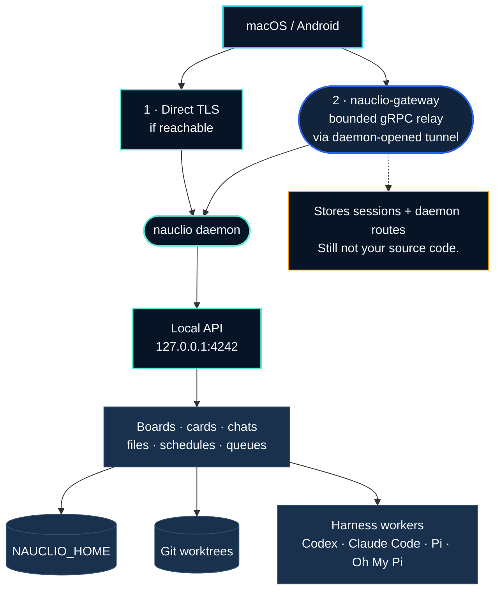

<p align="center">
  
</p>

<h1 align="center">Nauclio</h1>

<p align="center">
  <strong>One command deck. Every coding agent.</strong><br>
  <sub>Run any harness, on any machine, from any device.</sub>
</p>

<p align="center">
  <a href="https://github.com/dbpprt/nauclio/actions/workflows/release.yml"></a>
  <a href="LICENSE"></a>
</p>

<p align="center">
  <a href="#quick-start">Quick start</a> ·
  <a href="#architecture">Architecture</a> ·
  <a href="#native-clients">Native clients</a> ·
  <a href="#harness-configuration">Harnesses</a> ·
  <a href="#verify">Build &amp; verify</a>
</p>

Nauclio is a native command deck for local coding agents. It keeps the human at
the helm while every agent runs on the machine that owns the code—close to its
Git working tree, credentials, tools, and durable conversation history.

| Human at the helm | Code stays home | Conversations endure |
| --- | --- | --- |
| Direct the fleet from macOS or Android. | Project data and harness credentials remain on your daemon hosts. | Every card and standalone chat resumes one durable harness session. |

## Why Nauclio?

**Nauclio is pronounced NAW-klee-oh (/ˈnɔː.kli.oʊ/).**

The name is inspired by Greek *naúklēros* and Latin *nauclērus*: the shipmaster
responsible for a vessel and its crew. The identity translates that idea into a
developer product: the human remains at the helm while multiple agent harnesses
and shell sessions work as a coordinated fleet.

The system has three parts:

- `nauclio daemon start` owns projects, durable conversations, schedules, files,
  and local AI SDK Harness workers;
- `nauclio-gateway` authenticates one GitHub account and connects any number of
  enrolled daemons; and
- the native macOS and Android clients select a daemon and use the same
  `nauclio.v1.NauclioService` API either through the gateway relay or over a
  verified direct TLS route.

There is no web UI and no cloud agent runtime. The public gateway is a
machine-to-machine control and relay service; Nauclio data and harness
credentials never leave their daemon host.

The native clients build their own project directory by querying every online
daemon through the authenticated relay. Each project is shown with its owning
hostname, and opening its board, chats, files, or schedules automatically moves
the active connection to that daemon. The gateway never sees or stores that
directory.

Codex, Claude Code, Pi, and Oh My Pi run through pinned
[Vercel AI SDK Harnesses](https://ai-sdk.dev/docs/ai-sdk-harnesses/overview)
without a sandbox. Every nauclio card and standalone chat is exactly one durable
conversation in a real Git working tree.

> [!WARNING]
> Harnesses have the permissions of the user running the daemon. Never expose
> the raw loopback data plane. Native clients use the gateway or an
> authenticated TLS route advertised by the daemon.

## Quick start

On Apple Silicon macOS, Homebrew installs the daemon and the native app as two
separate packages.

### Install the daemon

The formula includes the `nauclio` CLI and local daemon:

```sh
brew install dbpprt/tap/nauclio
nauclio setup ~/Development/my-project
```

`nauclio setup` registers the Git working tree, enrolls the Mac, and starts the
daemon as a Homebrew service.

### Install the Mac app

The cask installs `Nauclio.app`:

```sh
brew install --cask dbpprt/tap/nauclio-app
open -a Nauclio
```

Sign in to the configured gateway and select the enrolled Mac. The same
workspace is then available from the Android client. For source builds, gateway
hosting, additional machines, and private-network routes, continue below.

## Architecture



The client tries direct TLS, then falls back to the gateway. Both paths expose
the same `nauclio.v1.NauclioService` API, so the UI does not care which one won.

Gateway access is binary: the configured GitHub identity is allowed or it is
not. There are no scopes. The gateway stores sessions, daemon identities,
presence, and route metadata—never projects, transcripts, files, or harness
credentials. Each daemon proves its Ed25519 key on every tunnel connection, and
each relayed request carries a short-lived, method- and payload-bound assertion.

Direct routes use a verified daemon certificate and a five-minute bearer.
Revoking a daemon closes its relay immediately and invalidates direct access as
those bearers expire. Relay messages are capped at 16 MiB, buffers and streams
are bounded, and canceling an RPC does not accidentally stop the agent.

## Requirements

- Go 1.26.5 or newer
- Node.js 22.19 or newer on each daemon host
- Git working trees for registered projects
- one configured harness login or API key
- macOS 15+ or Android 8+ for the official clients

The first agent turn installs the exact JavaScript harness runtime from
`internal/harness/runtime/package-lock.json` under `NAUCLIO_HOME`.

## Build

```sh
make build
```

This produces separate `bin/nauclio` and `bin/nauclio-gateway` executables. A normal
daemon machine installs only `nauclio`; the public host installs only
`nauclio-gateway`.

## Run a daemon

### Homebrew installation (Apple Silicon)

Install the daemon and complete GitHub authorization, project registration,
and launch-at-login setup:

```sh
brew install dbpprt/tap/nauclio
nauclio setup ~/Development/my-project
```

The setup command opens the configured gateway's GitHub authorization page,
registers each explicit Git working tree by canonical path, starts the user
Homebrew service, and waits for both the local API and gateway tunnel. It never
stores a GitHub token on the daemon host. When upgrading from the old manual
LaunchAgent, setup unloads it and preserves its plist with a `.disabled`
suffix before starting the Homebrew-managed service.

Inspect or operate the service later with:

```sh
nauclio daemon status
nauclio daemon logs --follow
brew services restart nauclio
brew upgrade nauclio
```

Managed logs are bounded and stored under
`$NAUCLIO_HOME/logs` (default `~/.nauclio/logs`). Homebrew uninstall removes
the service and binary but intentionally preserves `NAUCLIO_HOME`.

### Manual installation

Nauclio state defaults to `~/.nauclio`. Register projects and use the direct-storage
CLI exactly as before:

```sh
nauclio project open ~/Development/my-project
nauclio daemon start
```

The raw local data plane listens on `127.0.0.1:4242`. An enrolled daemon also
creates a separate authenticated TLS listener on an ephemeral loopback port;
native clients discover it automatically through the gateway. `nauclio serve`
remains an alias for `nauclio daemon start` for service-manager compatibility.

Enroll the machine once:

```sh
nauclio daemon enroll \
  --gateway https://nauclio.example.com \
  --name "Studio Mac"
```

The command opens GitHub, displays a verification code, stores the resulting
device identity under `NAUCLIO_HOME/daemon`, and never stores a GitHub token. On
the next `nauclio daemon start`, the daemon maintains its outbound tunnel and
reconnects with exponential backoff after network or gateway restarts.

No flags are needed for same-device access. To advertise an additional direct
route, expose a dedicated TLS port only on a trusted LAN or tailnet and name
the address clients can actually reach:

```sh
nauclio daemon start \
  --direct-addr 0.0.0.0:4244 \
  --direct-host 100.64.0.10 \
  --direct-network tailscale
```

The direct listener does not accept the gateway session itself. It requires a
short-lived token targeted to this daemon and serves the enrolled daemon
certificate. Do not advertise raw port 4242; that port stays loopback-only.

## Run the gateway

Register a GitHub OAuth App with:

- homepage: `https://nauclio.example.com`
- callback: `https://nauclio.example.com/auth/github/callback`
- Device Flow disabled

Copy [`.env.example`](.env.example) to
`$NAUCLIO_GATEWAY_HOME/.env` (default `~/.nauclio-gateway/.env`), fill its values,
and set mode 0600. `NAUCLIO_GITHUB_ALLOWED_USER_ID` must be the immutable numeric
GitHub ID; the login is display-only.

Behind a same-host HTTPS reverse proxy:

```sh
NAUCLIO_GATEWAY_HOME=/var/lib/nauclio-gateway nauclio-gateway
```

Keep `NAUCLIO_GATEWAY_ADDR` on loopback, enable `NAUCLIO_GATEWAY_PROXY_MODE=1`, and
proxy HTTP/2 to it. Proxy mode requires an HTTPS `NAUCLIO_PUBLIC_URL` and refuses
non-loopback listeners. The external hop is TLS and every daemon link still
uses its cryptographic challenge, so a forwarded daemon ID is never trusted.

If the gateway terminates TLS itself, disable proxy mode and set
`NAUCLIO_GATEWAY_TLS_CERT` and `NAUCLIO_GATEWAY_TLS_KEY`. It enforces TLS 1.3.

The public origin intentionally serves only:

- `/healthz`;
- the minimal GitHub OAuth start, callback, exchange, and completion routes;
- `nauclio.gateway.v1.GatewayService` and `DaemonLinkService`; and
- authenticated `nauclio.v1.NauclioService` relay calls.

All other paths, including `/`, return 404.

## Native clients

The macOS app stores the gateway session unencrypted in a user-only local file
under `~/Library/Application Support/com.dbpprt.nauclio.mac` and never accesses
Keychain. Android encrypts it with a device-bound Android Keystore key. Both
clients:

1. sign in to one gateway origin with OAuth + native PKCE;
2. list the account's enrolled daemons;
3. allow switching machines without another sign-in;
4. prefer reachable direct routes and otherwise use the relay; and
5. retain no GitHub token or harness credential.

See [apps/mac/README.md](apps/mac/README.md) and
[apps/android/README.md](apps/android/README.md) for platform builds.

## Harness configuration

Nauclio uses each harness's normal user configuration:

| Harness | Configuration |
| --- | --- |
| Codex | `~/.codex` or `CODEX_HOME` |
| Claude Code | `~/.claude` or `CLAUDE_CONFIG_DIR` |
| Pi | `~/.pi/agent` or `PI_AGENT_DIR` |
| Oh My Pi | `~/.omp/agent`, with `OMP_PROFILE` when set |

The model, effort, context, capability, and typed provider-option registry is
[`config/harnesses.yaml`](config/harnesses.yaml). Override the entire registry
with `$NAUCLIO_HOME/harnesses.yaml`, `NAUCLIO_HARNESS_CONFIG`, or
`--harness-config`.

## Persistence and restarts

Each daemon owns all domain data under `NAUCLIO_HOME`: projects, boards, cards,
transcripts, queues, schedules, labels, runtime sessions, and worker recovery
records. It uses atomic writes and a cross-process mutation lock. Graceful
daemon shutdown parks active harness turns with provider continuation state;
startup resumes them without replaying the user prompt. An unverifiable
orphaned worker is interrupted instead of risking duplicate tool effects.

The gateway owns a separate SQLite database under `NAUCLIO_GATEWAY_HOME` plus its
private signing and daemon-CA keys. It stores account sessions, pending OAuth
and enrollment records, daemon public identities, revocation generations,
presence, and route metadata—never projects, transcripts, schedules, files, or
harness credentials.

## Protocol development

The source contracts are:

- [`api/proto/nauclio/v1/nauclio.proto`](api/proto/nauclio/v1/nauclio.proto)
- [`api/proto/nauclio/gateway/v1/gateway.proto`](api/proto/nauclio/gateway/v1/gateway.proto)

Regenerate Go and native inputs with:

```sh
./scripts/generate-proto.sh
```

The application has no REST data API. The daemon's generated Connect handler
is retained as the HTTP/2 gRPC server implementation, while native clients and
the raw gateway relay use protobuf gRPC.

## Verify

### Commit hooks

Install the repository hooks once per clone:

```sh
brew install pre-commit
make hooks
```

Before every commit, the hooks run `gofmt` on staged Go files and scan the
staged diff with Gitleaks. If `gofmt` changes a file, review it, stage it again,
and commit. Gitleaks output is redacted.

Run the configured hooks manually with:

```sh
make pre-commit
```

### Full check

```sh
npm --prefix internal/harness/runtime ci
make check
swift test --package-path apps/mac
zsh -lic 'cd apps/android && ./gradlew testDebugUnitTest'
git diff --check
```

`internal/gateway/e2e_test.go` runs a real gateway, enrollment, signed daemon
link, local Nauclio data plane, unary relay, streaming relay, token exchange, and
direct TLS call in one test.

## License

[MIT](LICENSE)

The complete visual identity, production artwork, portable design tokens, and
usage guide live in [`assets/brand`](assets/brand/README.md).
