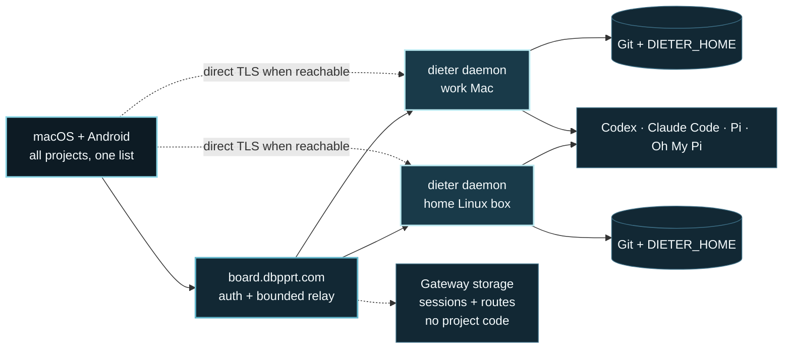

<p align="center">
  
</p>

<h1 align="center">Dieter</h1>

<p align="center">
  <strong>Many agents, many machines, one interface.</strong><br>
  <sub>Run your coding agents across every machine you own.</sub>
</p>

<p align="center">
  <a href="https://github.com/dbpprt/dieter/actions/workflows/release.yml"></a>
  <a href="LICENSE"></a>
  <a href="https://dbpprt.github.io/dieter/"></a>
</p>

<p align="center">
  <strong>Website:</strong> <a href="https://dbpprt.github.io/dieter/">dbpprt.github.io/dieter</a>
  <sub>(getdieter.com once the domain is live)</sub>
</p>

<p align="center">
  <a href="#quick-start">Quick start</a> ·
  <a href="#architecture">Architecture</a> ·
  <a href="#native-clients">Native clients</a> ·
  <a href="#harness-configuration">Harnesses</a> ·
  <a href="#verify">Build &amp; verify</a>
</p>

Dieter is pronounced **DEE-ter** (/ˈdiː.tər/).

Dieter runs your local coding agents (Codex, Claude Code, Pi, and Oh My Pi)
across every machine you own and puts them behind one macOS and Android app. Each
agent runs on the machine that holds the code, close to its Git working tree,
credentials, tools, and durable conversation history. You keep control from
anywhere.

Dieter started as my own setup for working with coding agents at scale. It is
open source and will stay that way. Contributions and issues are welcome.

| Every machine | Every agent | From anywhere |
| --- | --- | --- |
| Enroll your office Mac mini, a home server, your laptop—and see one project list. | Codex, Claude Code, Pi, and Oh My Pi, each from its own config. | Drive chats, boards, and schedules from macOS or Android. |

The system has three parts:

- `dieter daemon start` owns projects, durable conversations, persistent PTY
  terminals, schedules, files, and local AI SDK Harness workers;
- `dieter-gateway` authenticates one GitHub account and connects any number of
  enrolled daemons; and
- the native macOS and Android clients aggregate every daemon and use the same
  `dieter.v1.DieterService` API either through the gateway relay or over a
  verified direct TLS route.

There is no web UI and no cloud agent runtime. The public gateway is a
machine-to-machine control and relay service; Dieter data and harness
credentials never leave their daemon host.

The native clients build their own project directory by querying every online
daemon through the authenticated relay. Each project is shown with its owning
hostname, and opening its board, chats, terminals, files, or schedules automatically moves
the active connection to that daemon. The gateway never sees or stores that
directory.

Codex, Claude Code, Pi, and Oh My Pi run through pinned
[Vercel AI SDK Harnesses](https://ai-sdk.dev/docs/ai-sdk-harnesses/overview)
without a sandbox. Every dieter card and standalone chat is exactly one durable
conversation in a real Git working tree.

> [!WARNING]
> Harnesses have the permissions of the user running the daemon. Never expose
> the raw loopback data plane. Native clients use the gateway or an
> authenticated TLS route advertised by the daemon.

## Quick start

On Apple Silicon macOS, Homebrew installs the daemon and the native app as two
separate packages.

### Install the daemon

The formula includes the `dieter` CLI and local daemon:

```sh
brew install dbpprt/tap/dieter
dieter setup ~/Development/my-project
```

Confirm that the daemon is running and connected:

```sh
dieter daemon status
```

`dieter setup` registers the Git working tree, enrolls the Mac, guides the
macOS Screen & System Audio Recording permission, proves the exact
signed ScreenCaptureKit/VideoToolbox helper with one discarded frame, guides
and verifies Accessibility event-posting permission without moving or clicking
the pointer, enables viewing and control only after both probes succeed, and starts the daemon as a Homebrew
service. Use `--skip-screen-sharing` during fresh setup on hosts that must not
capture their display. Re-run the standalone check at any time with:

```sh
dieter daemon permissions --check
```

### Install the Mac app

The cask installs `Dieter.app`:

```sh
brew install --cask dbpprt/tap/dieter-app
open -a Dieter
```

Sign in to the configured gateway. Dieter indexes every enrolled machine and
shows all of their projects together—there is no machine picker to babysit. The
same workspace is available from Android. For source builds, gateway
hosting, additional machines, and private-network routes, continue below.

## Architecture



The client tries direct TLS, then falls back to the gateway. Both paths expose
the same `dieter.v1.DieterService` API, so the UI does not care which one won.

Gateway access is binary: the configured GitHub identity is allowed or it is
not. There are no scopes. The gateway stores sessions, daemon identities,
presence, and route metadata—never projects, transcripts, files, or harness
credentials. Each daemon proves its Ed25519 key on every tunnel connection, and
each relayed request carries a short-lived, method- and payload-bound assertion.

Direct routes use a verified daemon certificate and a five-minute bearer.
Revoking a daemon closes its relay immediately and invalidates direct access as
those bearers expire. Relay messages are capped at 16 MiB, buffers and streams
are bounded, and canceling an RPC does not accidentally stop the agent.

Terminal PTYs follow the same transport rule but have a daemon-owned lifecycle:
canceling an output stream or closing the Mac app removes only that observer.
The shell continues until it exits, is explicitly closed, or the daemon shuts
down. Output carries monotonically increasing sequence numbers and a bounded
replay baseline, so clients can resume after a disconnect without making the
gateway store terminal state. Typing and resize calls use the relay's priority
unary path independently of the long-lived output stream.

Screens use the gateway only for bounded WebRTC signaling and short-lived ICE
configuration bound to the authenticated operator and target daemon. The
daemon hosts an H.264 peer with Pion; media and bounded remote input travel directly over
ICE/DTLS/SRTP or through a separately configured TURN server, never through
the Dieter gateway. The Mac verifies an Ed25519 binding between the offer,
daemon DTLS fingerprint, session, nonce, lease, control grant, display, and
input epoch before applying the answer. Pointer motion uses an unordered
no-retransmit DataChannel while keys, buttons, scrolling, and release-all use a
reliable channel. The signed native helper owns macOS capture and event-posting
permissions and releases every held input immediately on disconnect.
Screen capture starts only after WebRTC connects and stops when its renewable
lease expires. One explicitly enabled viewer/controller is allowed per daemon.

## Requirements

- Go 1.26.5 or newer
- Node.js 22.19 or newer on each daemon host
- Git working trees for registered projects
- one configured harness login or API key
- macOS 15+ or Android 8+ for the official clients

The first agent turn installs the exact JavaScript harness runtime from
`internal/harness/runtime/package-lock.json` under `DIETER_HOME`.

## Build

```sh
make build
```

This produces separate `bin/dieter` and `bin/dieter-gateway` executables. A normal
daemon machine installs only `dieter`; the public host installs only
`dieter-gateway`.

## Run a daemon

### Homebrew installation (Apple Silicon)

Install the daemon and complete GitHub authorization, project registration,
and launch-at-login setup:

```sh
brew install dbpprt/tap/dieter
dieter setup ~/Development/my-project
```

The setup command opens the configured gateway's GitHub authorization page,
registers each explicit Git working tree by canonical path, starts the user
Homebrew service, and waits for both the local API and gateway tunnel. It never
stores a GitHub token on the daemon host. When upgrading from the old manual
LaunchAgent, setup unloads it and preserves its plist with a `.disabled`
suffix before starting the Homebrew-managed service.

Inspect or operate the service later with:

```sh
dieter daemon status
dieter daemon logs --follow
brew services restart dieter
brew upgrade dieter
```

Managed logs are bounded and stored under
`$DIETER_HOME/logs` (default `~/.dieter/logs`). Homebrew uninstall removes
the service and binary but intentionally preserves `DIETER_HOME`.

### Manual installation

Dieter state defaults to `~/.dieter`. Register projects and use the direct-storage
CLI exactly as before:

```sh
dieter project open ~/Development/my-project
dieter daemon start
```

The raw local data plane listens on `127.0.0.1:4242`. An enrolled daemon also
creates a separate authenticated TLS listener on an ephemeral loopback port;
native clients discover it automatically through the gateway. `dieter serve`
remains an alias for `dieter daemon start` for service-manager compatibility.

Enroll the machine once:

```sh
dieter daemon enroll \
  --gateway https://dieter.example.com \
  --name "Studio Mac"
```

The command opens GitHub, displays a verification code, stores the resulting
device identity under `DIETER_HOME/daemon`, and never stores a GitHub token. On
the next `dieter daemon start`, the daemon maintains its outbound tunnel and
reconnects with exponential backoff after network or gateway restarts.

Unenroll a machine from that machine itself with:

```sh
dieter daemon unenroll
```

The command signs the request with the enrolled machine identity, revokes the
gateway record, closes its relay, and removes the local gateway credential. It
does not remove projects, conversations, schedules, or harness settings.

No flags are needed for same-device access. To advertise an additional direct
route, expose a dedicated TLS port only on a trusted LAN or tailnet and name
the address clients can actually reach:

```sh
dieter daemon start \
  --direct-addr 0.0.0.0:4244 \
  --direct-host 100.64.0.10 \
  --direct-network tailscale
```

The direct listener does not accept the gateway session itself. It requires a
short-lived token targeted to this daemon and serves the enrolled daemon
certificate. Do not advertise raw port 4242; that port stays loopback-only.

On macOS, Screens uses the packaged `dieter-capture` helper with
ScreenCaptureKit and VideoToolbox hardware H.264. The helper keeps at most one
pending frame, scales the stream to the viewer's requested bounds, and accepts
live keyframe and bitrate feedback from WebRTC. It captures the primary display
by default after guided `dieter setup` verifies Screen Recording access for the
exact signed helper installed beside the daemon.
Run `dieter daemon permissions` to reopen the permission guide after a denial
or revocation. `DIETER_REMOTE_DESKTOP_HELPER` selects another signed native
helper and `DIETER_REMOTE_DESKTOP_DISPLAY` selects another capture source.
Non-macOS experimental hosts still use FFmpeg/libvpx and may select it with
`DIETER_REMOTE_DESKTOP_FFMPEG`;
`DIETER_REMOTE_DESKTOP_SOURCE=synthetic` is reserved for isolated transport
diagnostics. Capture is lazy and runs only while an admitted WebRTC session is
connected. A clean viewer close stops it immediately; an ungraceful signaling
or WebRTC disconnect gets a five-second reconnect grace, after which the daemon
cancels and reaps the complete capture process group.

## Run the gateway

Register a GitHub OAuth App with:

- homepage: `https://dieter.example.com`
- callback: `https://dieter.example.com/auth/github/callback`
- Device Flow disabled

Copy [`.env.example`](.env.example) to
`$DIETER_GATEWAY_HOME/.env` (default `~/.dieter-gateway/.env`), fill its values,
and set mode 0600. `DIETER_GITHUB_ALLOWED_USER_ID` must be the immutable numeric
GitHub ID; the login is display-only.

Behind a same-host HTTPS reverse proxy:

```sh
DIETER_GATEWAY_HOME=/var/lib/dieter-gateway dieter-gateway
```

Keep `DIETER_GATEWAY_ADDR` on loopback, enable `DIETER_GATEWAY_PROXY_MODE=1`, and
proxy HTTP/2 to it. Proxy mode requires an HTTPS `DIETER_PUBLIC_URL` and refuses
non-loopback listeners. The external hop is TLS and every daemon link still
uses its cryptographic challenge, so a forwarded daemon ID is never trusted.

If the gateway terminates TLS itself, disable proxy mode and set
`DIETER_GATEWAY_TLS_CERT` and `DIETER_GATEWAY_TLS_KEY`. It enforces TLS 1.3.

The public origin intentionally serves only:

- `/healthz`;
- the minimal GitHub OAuth start, callback, exchange, and completion routes;
- `dieter.gateway.v1.GatewayService` and `DaemonLinkService`; and
- authenticated `dieter.v1.DieterService` relay calls.

All other paths, including `/`, return 404.

Remote viewing can use `DIETER_RTC_STUN_URLS` and
`DIETER_RTC_TURN_URLS` as comma-separated ICE server URLs. When TURN URLs are
configured, set `DIETER_RTC_TURN_SECRET` to a hex-encoded secret of at least 32
bytes shared with coturn's REST authentication; the gateway derives ephemeral
credentials instead of storing static TURN passwords. `DIETER_RTC_TTL` controls
the signed configuration lifetime and defaults to five minutes.

## Native clients

The macOS app stores the gateway session unencrypted in a user-only local file
under `~/Library/Application Support/com.dbpprt.dieter.mac` and never accesses
Keychain. Android encrypts it with a device-bound Android Keystore key. Both
clients:

1. sign in to one gateway origin with OAuth + native PKCE;
2. build one project directory from every enrolled daemon;
3. route each project action to its owning machine automatically;
4. prefer reachable direct routes and otherwise use the relay; and
5. retain no GitHub token or harness credential.

See [apps/mac/README.md](apps/mac/README.md) and
[apps/android/README.md](apps/android/README.md) for platform builds.

## Harness configuration

Dieter uses each harness's normal user configuration:

| Harness | Configuration |
| --- | --- |
| Codex | `~/.codex` or `CODEX_HOME` |
| Claude Code | `~/.claude` or `CLAUDE_CONFIG_DIR` |
| Pi | `~/.pi/agent` or `PI_AGENT_DIR` |
| Oh My Pi | `~/.omp/agent`, with `OMP_PROFILE` when set |

The model, effort, context, capability, and typed provider-option registry is
[`config/harnesses.yaml`](config/harnesses.yaml). Override the entire registry
with `$DIETER_HOME/harnesses.yaml`, `DIETER_HARNESS_CONFIG`, or
`--harness-config`.

## Persistence and restarts

Each daemon owns all domain data under `DIETER_HOME`: projects, boards, cards,
transcripts, queues, schedules, labels, runtime sessions, and worker recovery
records. It uses atomic writes and a cross-process mutation lock. Graceful
daemon shutdown parks active harness turns with provider continuation state;
startup resumes them without replaying the user prompt. An unverifiable
orphaned worker is interrupted instead of risking duplicate tool effects.

The gateway owns a separate SQLite database under `DIETER_GATEWAY_HOME` plus its
private signing and daemon-CA keys. It stores account sessions, pending OAuth
and enrollment records, daemon public identities, revocation generations,
presence, and route metadata—never projects, transcripts, schedules, files, or
harness credentials.

## Protocol development

The source contracts are:

- [`api/proto/dieter/v1/dieter.proto`](api/proto/dieter/v1/dieter.proto)
- [`api/proto/dieter/gateway/v1/gateway.proto`](api/proto/dieter/gateway/v1/gateway.proto)

Regenerate Go and native inputs with:

```sh
./scripts/generate-proto.sh
```

The application has no REST data API. The daemon's generated Connect handler
is retained as the HTTP/2 gRPC server implementation, while native clients and
the raw gateway relay use protobuf gRPC.

## Verify

### Commit hooks

Install the repository hooks once per clone:

```sh
brew install pre-commit
make hooks
```

Before every commit, the hooks run `gofmt` on staged Go files and scan the
staged diff with Gitleaks. If `gofmt` changes a file, review it, stage it again,
and commit. Gitleaks output is redacted.

Run the configured hooks manually with:

```sh
make pre-commit
```

### Full check

```sh
npm --prefix internal/harness/runtime ci
make check
swift test --package-path apps/mac
zsh -lic 'cd apps/android && ./gradlew testDebugUnitTest'
git diff --check
```

`internal/gateway/e2e_test.go` runs a real gateway, enrollment, signed daemon
link, local Dieter data plane, unary relay, streaming relay, persistent
terminal reconnect, token exchange, direct TLS call, and relayed WebRTC
admission that receives a peer-to-peer synthetic VP8 frame in one test.

## License

[MIT](LICENSE)

The complete visual identity, production artwork, portable design tokens, and
usage guide live in [`assets/brand`](assets/brand/README.md).

<p align="center"><sub>Made with &hearts; in Berlin.</sub></p>
