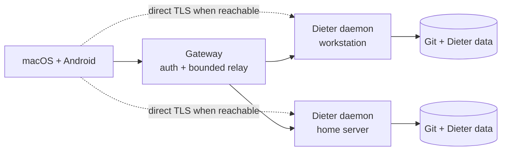

<p align="center">
  
</p>

<h1 align="center">Dieter</h1>

<p align="center">
  <strong>Many agents, many machines, one interface.</strong><br>
  Run coding agents wherever the code lives, and control them from macOS or Android.
</p>

<p align="center">
  <a href="https://github.com/dbpprt/dieter/actions/workflows/release.yml"></a>
  <a href="LICENSE"></a>
  <a href="https://dbpprt.github.io/dieter/"></a>
</p>

<p align="center">
  <a href="#quick-start">Quick start</a> ·
  <a href="#how-it-works">How it works</a> ·
  <a href="#self-hosting">Self-hosting</a> ·
  <a href="#development">Development</a>
</p>

Dieter (pronounced **DEE-ter**) is an open-source control plane for local coding
agents. It runs [Codex](https://github.com/openai/codex),
[Claude Code](https://github.com/anthropics/claude-code),
[Pi](https://github.com/badlogic/pi-mono), and
[Oh My Pi](https://github.com/can1357/oh-my-pi), and
[DeepSeek Harness](https://github.com/deepseek-ai/deepseek-harness) on the
machines that hold your Git working trees, credentials, and tools—then brings
them together in one native workspace.

- **Work across machines.** Enroll a laptop, workstation, or home server and
  see their projects in one place.
- **Keep execution local.** Agents run beside the code without sending project
  data or harness credentials through the gateway.
- **Resume real work.** Chats, boards, queues, terminals, files, schedules, and
  conversation history survive client disconnects and daemon restarts.
- **Steer without losing your place.** Follow-ups wait visibly behind the
  active turn and can be steered next, removed, or returned to the composer for
  editing before they run.
- **Use native clients.** The macOS and Android apps automatically route each
  project to the machine that owns it.
- **Bring your existing agent setup.** Dieter uses each harness's normal local
  configuration and supports per-card model and effort settings.

There is no web UI or cloud agent runtime. Dieter began as a personal system
for running coding agents at scale and remains MIT-licensed. Issues and pull
requests are welcome.

> [!WARNING]
> Harness workers have the permissions of the user running the daemon. Keep the
> raw daemon data plane loopback-only; use the authenticated gateway or a
> verified direct TLS route for remote access.

## Quick start

On Apple Silicon macOS, install the daemon and register a Git working tree:

```sh
brew install dbpprt/tap/dieter
dieter setup ~/Development/my-project
```

`dieter setup` enrolls the machine, registers the project, verifies optional
screen-sharing permissions, and starts the daemon as a Homebrew service. Add
`--skip-screen-sharing` on hosts that should never capture their display.

Install the native Mac app separately:

```sh
brew install --cask dbpprt/tap/dieter-app
open -a Dieter
```

Sign in to the configured gateway. Projects from every enrolled machine appear
in one workspace; Dieter selects the correct daemon automatically. See the
[macOS](apps/mac/README.md) and [Android](apps/android/README.md) guides for
source builds and platform-specific details.

Useful daemon commands:

```sh
dieter daemon status
dieter daemon logs --follow
dieter daemon permissions --check
brew services restart dieter
```

The same `dieter` binary is a complete daemon client. Local commands use the
running daemon on this machine. To control another enrolled machine, sign in
once and select it globally; the CLI prefers verified direct TLS and falls back
to the gateway relay:

```sh
dieter auth login
dieter machine list --format jsonl
dieter machine gateway
dieter machine info
dieter --machine <machine-id> status
dieter --machine <machine-id> machine info
dieter --machine <machine-id> project list --format jsonl
dieter --machine <machine-id> remote exec --project <project-id> -- uname -a
dieter --machine <machine-id> terminal list --format jsonl
```

`machine list`, `machine show`, and `machine watch` expose both the Dieter
release version and the data-plane API version. `machine gateway` reports the
gateway release and control-plane API versions. `machine info` returns live
host telemetry, including optional Apple, NVIDIA, and AMD GPU data with absent
sensors kept distinct from real zero values. Native clients use API versions
to keep compatible machines in a mixed-version fleet available.

Restart and shutdown use the same authenticated local, direct-TLS, or relay
route as every other machine operation and require exact confirmation phrases:

```sh
dieter --machine <machine-id> machine restart --confirm RESTART
dieter --machine <machine-id> machine shutdown --confirm "SHUT DOWN"
```

macOS uses the signed-in user's normal System Events authorization. Linux uses
non-interactive systemd-logind authorization and never accepts a sudo password;
an administrator must grant the daemon user the relevant PolicyKit permission
before the commands are advertised as available.

Messages submitted during an active turn wait in that conversation's durable
queue. Native clients can steer the next message, discard any queued message,
or return it to the composer for editing. Automation can dequeue the complete
payload (including attachments) as JSON:

```sh
dieter card queue remove --message <message-id> <card-id>
```

`dieter status` reports daemon-wide active project, board, card, and chat
counts in one snapshot, including when the selected machine is remote.

For agent automation, `dieter remote` is the SSH-like secondary interface. It
runs exact argv on the selected daemon, keeps stdout and stderr distinct,
propagates the remote exit code, supports idempotent admission, and allows
bounded output to resume by sequence after a disconnect. `remote shell` adds a
native PTY when one is actually needed:

```sh
dieter --machine <machine-id> remote exec --project <project-id> \
  --idempotency-key build-42 --format jsonl -- go test ./...
dieter --machine <machine-id> remote wait <execution-id>
dieter --machine <machine-id> remote shell --project <project-id>
```

The gateway only transports these authenticated RPCs. Execution state and
output remain on the daemon host, and dropping a watch does not stop its
process; cancellation is always explicit.

Run `dieter --help` for the complete surface and
`dieter help <group> <action>` for command-specific flags. Projects, cards and
chats, files, remote executions, terminals, workspaces and Git operations, schedules, prompts,
admission settings, screen signaling, and machine control all use the same
daemon API as the native apps. Schedule lists and occurrence history use
bounded, cursor-paginated queries so high-frequency schedules do not make
native views or CLI calls grow with all retained history:

```sh
dieter schedule list --project <project-id> --page-size 50
dieter schedule runs <schedule-id> --page-size 50
# Continue either command with the opaque NEXT PAGE value it returned:
dieter schedule runs <schedule-id> --page-token <token>
```

## How it works

Every Dieter card and standalone chat maps to one durable AI SDK Harness
conversation in a real Git working tree.

At creation, each conversation explicitly chooses one of two execution modes:

- **New worktree** gives the card/chat its own daemon-managed directory and Git
  branch. Its local changes are shown inside that conversation.
- **Project directory** runs in the registered checkout exactly as it currently
  exists, including its currently checked-out branch. Dieter never calls this
  mode “main” and does not switch branches. Because the directory is shared,
  its local changes are shown once under the project's **Files → Changes**
  surface, not attributed to individual project-mode cards.

The Changes API reports only uncommitted Git state and keeps the index and
working tree separate. The same path can therefore appear in both **Staged**
and **Changes**. Commits are history, not working changes. By default a commit
operation commits only the staged index; explicitly staging all is a separate
choice. Project-directory staging, unstaging, staged-only commits, per-file
discard with recovery artifacts, and validation all run on the owning daemon
and use optimistic changeset revisions.

The CLI exposes the same two scopes:

```sh
dieter workspace changes WORKTREE_CARD_ID
dieter workspace diff --section unstaged --path path/to/file.go WORKTREE_CARD_ID
dieter workspace changes --project PROJECT_ID
dieter workspace run --project PROJECT_ID --kind stage \
  --revision REVISION --param path=path/to/file.go --wait
dieter workspace run --project PROJECT_ID --kind commit \
  --revision REVISION --param subject="Focused change" --wait
```



The system has three components:

1. **Daemon and CLI** — own projects, conversations, terminals, schedules,
   files, and local harness workers on each machine.
2. **Gateway** — authenticates one allowed GitHub identity and connects enrolled
   daemons through a bounded relay.
3. **Native clients** — combine projects from all online daemons and prefer a
   verified direct TLS route when one is reachable.

Both network paths expose the same `dieter.v1.DieterService` API. The gateway
stores account sessions, daemon identities, presence, and route metadata. It
never stores project code, transcripts, schedules, files, or harness
credentials. Daemons prove possession of their Ed25519 identity on each tunnel
connection.

All domain data lives under `DIETER_HOME` on the daemon host (by default
`~/.dieter`). Writes are atomic and cross-process locked. Graceful shutdowns
preserve provider continuation state so work can resume without replaying the
user prompt.

## Self-hosting

### Requirements

- Go 1.26.5 or newer
- Node.js 22.19 or newer on daemon hosts
- [just](https://just.systems/) 1.58 or newer for development commands
- Git working trees for registered projects
- a configured Codex, Claude Code, Pi, Oh My Pi, or DeepSeek Harness
  installation
- macOS 15+ or Android 8+ for the official clients

Build the CLI/daemon and gateway:

```sh
just build
# Or independently:
just daemon build
just gateway build
```

The binaries are written to `bin/dieter` and `bin/dieter-gateway`. A normal
agent machine needs only `dieter`; the public host needs only
`dieter-gateway`.

Install a source build into a directory already on `PATH` (override `PREFIX` or
`DESTDIR` for packaging):

```sh
just install "$HOME/.local"
```

Published macOS and Linux archives also contain `install.sh`. For a one-command
user install, the script defaults to `/usr/local/bin` when writable and
otherwise uses `~/.local/bin`:

```sh
curl -fsSL https://raw.githubusercontent.com/dbpprt/dieter/main/scripts/install.sh | sh
```

Set `DIETER_INSTALL_DIR` to choose another destination or `DIETER_VERSION` to
pin a release. Installing the CLI does not start, stop, or replace a running
daemon; service lifecycle remains explicit through `dieter setup` or
`dieter daemon start`.

### Daemon

For a manual installation, register a project and start the local daemon:

```sh
dieter project open ~/Development/my-project
dieter daemon start
```

Create a story-only quick task with the same daemon-side GPT Spark 4–6 word
title generation used by the native Kanban popover:

```sh
dieter card create --project PROJECT --board BOARD --lane todo \
  --auto-title --prompt "Add keyboard navigation to the board" \
  --workspace worktree
```

Each board can snapshot its own Git remote into newly created cards and choose
how reviewed work is published. `manual` keeps remote actions explicit,
`pull_request` routes delivery through a PR, and `push_base` pushes the
validated local integration to the configured base branch:

```sh
dieter board git --base-remote private --remote-publish pull_request BOARD_ID
```

To reach it through your gateway, enroll the machine once:

```sh
dieter daemon enroll \
  --gateway https://dieter.example.com \
  --name "Studio Mac"
```

The raw data plane remains on `127.0.0.1:4242`. To add a trusted LAN or
tailnet route, expose a separate authenticated TLS listener—never raw port
4242:

```sh
dieter daemon start \
  --direct-addr 0.0.0.0:4244 \
  --direct-host 100.64.0.10 \
  --direct-network tailscale
```

### Gateway

Create a GitHub OAuth App, copy [`.env.example`](.env.example) to
`$DIETER_GATEWAY_HOME/.env`, and set the allowed account IDs to their immutable
numeric GitHub IDs. Use `DIETER_GITHUB_ALLOWED_USER_IDS` with a comma-separated
list for multiple isolated accounts; the singular variable remains supported.
Then run:

```sh
DIETER_GATEWAY_HOME=/var/lib/dieter-gateway just gateway run
```

The gateway can sit behind a same-host HTTPS reverse proxy or terminate TLS
itself. Proxy mode requires a loopback listener and an HTTPS
`DIETER_PUBLIC_URL`; direct TLS requires `DIETER_GATEWAY_TLS_CERT` and
`DIETER_GATEWAY_TLS_KEY`. All unspecified public routes, including `/`, return
404 by design.

### Harnesses

| Harness | Default configuration |
| --- | --- |
| Codex | `~/.codex` or `CODEX_HOME` |
| Claude Code | `~/.claude` or `CLAUDE_CONFIG_DIR` |
| Pi | `~/.pi/agent` or `PI_AGENT_DIR` |
| Oh My Pi | `~/.omp/agent`, with `OMP_PROFILE` when set |
| DeepSeek Harness | `~/.dsh` or `DSH_HOME` |

Supported models and provider options live in
[`config/harnesses.yaml`](config/harnesses.yaml). Override the registry with
`$DIETER_HOME/harnesses.yaml`, `DIETER_HARNESS_CONFIG`, or `--harness-config`.
DeepSeek Harness is installed lazily at its exact tested version through the
AI SDK ACP bootstrap; a global `dsh` installation is not required. DSH owns its
provider and credential configuration. Dieter discovers the models advertised
by DSH's standard ACP session options and returns only those models to clients.
See the [DSH integration proposal and operational notes](docs/deepseek-dsh-harness.md).
An optional model `defaultEffort` is Dieter's default for new conversations and
overrides the provider-discovered default when that model supports the selected
level. Pass `--effort default` to explicitly use the provider's native default.
Codex advertises a mutable `fast_mode` option for GPT-5.4, GPT-5.5, GPT-5.6,
and GPT-6 Astra models: native clients expose it for chats, board tasks, and
scheduled task templates, while the CLI accepts
`--provider-option fast_mode=true`. GPT-5.3 Codex and Spark do not expose Fast
mode. Turning it off explicitly selects the standard service tier for that
conversation.

## Development

For local iteration, detect changes and run only the affected components:

```sh
just check-changed --dry-run
just check-changed
just check-changed --base origin/main
```

This requires Python 3 and includes staged, unstaged, deleted, renamed, and
untracked files. By default it compares with `HEAD`; `--base REF` includes branch
changes since the merge base with that ref. Documentation-only edits skip tests.
Go changes run race tests and vet for affected packages and their reverse
dependencies (including test imports and embedded files). Native changes run
the affected client's complete unit test suite because each client is one
application module. App code, resources, or build configuration also select
that client's integration suite: macOS packaged smoke tests or Android connected
tests. Unit-test-only edits do not select device tests. Shared protobuf and
native fixture changes select both clients. Harness and website changes select
their own checks.

Checks stop on the first failure. Mac smoke tests require no Dieter app to be
running; Android connected tests require a healthy configured emulator and use
the existing instrumentation configuration, including its opt-in gateway tests.
The command never stops an app or daemon, starts an emulator, or changes gateway
credentials. `--dry-run` shows the exact commands without executing them.

Install the pinned JavaScript harness runtime and run the full Go checks:

```sh
just harness install
just check
```

Run the native client test suites separately:

```sh
just mac test
just android test
```

Every component has a discoverable command module:

```sh
just daemon
just gateway
just harness
just mac
just android
just site
just release
```

GitHub Actions keeps orchestration, permissions, caches, secrets, and artifact
transfer in YAML. Every executable repository step enters through one of these
Just modules, so the same build and packaging commands can be exercised
locally without copying workflow shell blocks.

Android builds use Android Studio's bundled JBR. If needed, set:

```sh
export JAVA_HOME="/Applications/Android Studio.app/Contents/jbr/Contents/Home"
```

The protobuf contracts are
[`dieter.proto`](api/proto/dieter/v1/dieter.proto) and
[`gateway.proto`](api/proto/dieter/gateway/v1/gateway.proto). Regenerate checked-in
outputs with `just proto`.

Daemon RPC and CLI feature parity is enforced by descriptor-driven contract
tests in `internal/server/rpc_parity_test.go` and
`internal/cli/help_contract_test.go`. Any native operation change must update
the CLI implementation, offline help, end-to-end route coverage, README, and
the Dieter CLI agent skill in the same change.

Before opening a pull request, keep changes focused, add tests for changed
behavior, run the relevant checks above, and confirm `git diff --check` passes.
Repository hooks for `gofmt` and secret scanning are available with:

```sh
brew install pre-commit
just hooks
```

Bug reports, design discussions, and contributions are welcome in
[GitHub Issues](https://github.com/dbpprt/dieter/issues).

## License

Dieter is available under the [MIT License](LICENSE). Brand assets and usage
guidance live in [`assets/brand`](assets/brand/README.md).

<p align="center"><sub>Made with &hearts; in Berlin.</sub></p>

Kanban cards display cumulative provider-reported token usage, with input/output
counts (hover on macOS). `dieter card show CARD` includes `card.tokenUsage`, and
`dieter card context CARD` includes `tokenUsage`; JSON card lists carry it too.
The aggregate counts each assistant message once, preferring cumulative
`totalUsage` over the last request's `usage`. Last-request-only data, missing
messages, and missing input/output categories are marked partial. Missing usage
is not presented as zero. Existing transcripts are included; copied fork history
and separate subagent counters are excluded to avoid attributing inherited or
potentially overlapping usage. These are reported tokens, not cost estimates.

### Merge a card's request into another task

`dieter card merge --into TARGET CARD` queues the source card's initial request
and attachments in a started target on the same board, moves the idle source to
Done, and saves its `mergedIntoCardId` link. The source must have no active turn
or queued messages. Retrying the same merge is safe. Both conversations and
workspaces are retained; this operation does not merge Git branches.

On macOS, drag a card over a started task and hold for two seconds. A merge icon
and “Release to merge request” appear; dropping then performs the merge.
Dropping earlier keeps the usual card ordering behavior.

Draft agent settings can be changed in Edit card or with
`dieter card update --provider codex --model MODEL --effort high --provider-option fast_mode=true CARD`.
Settings are locked once the initial request has been sent. These commands also
support the global `--machine ID|NAME` option for direct TLS or gateway relay.
