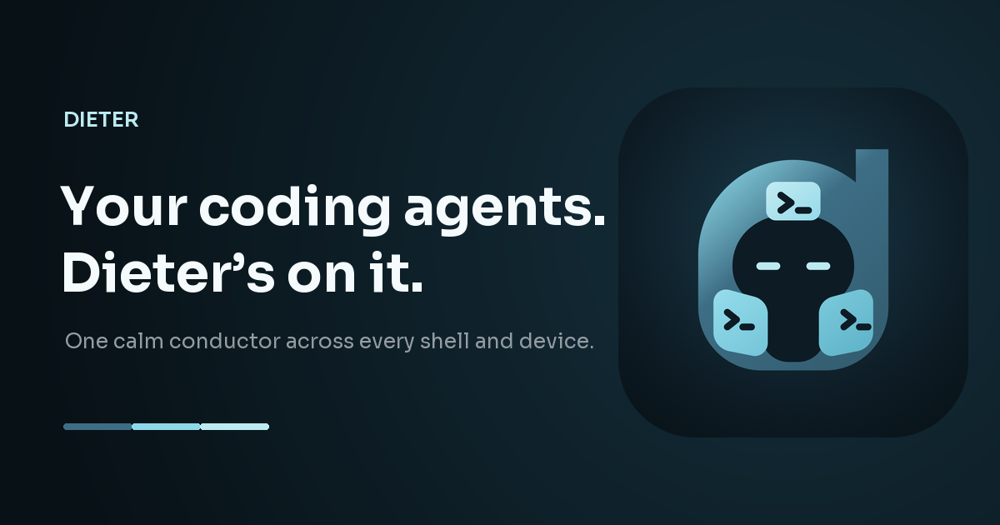
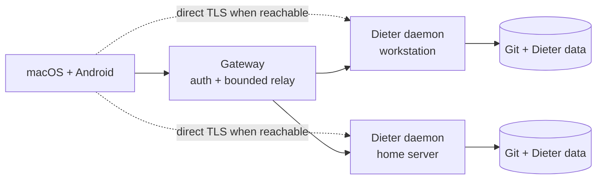

<p align="center">
  
</p>

<h1 align="center">Dieter</h1>

<p align="center">
  <strong>Many agents, many machines, one interface.</strong><br>
  Run coding agents wherever the code lives, and control them from macOS or Android.
</p>

<p align="center">
  <a href="https://github.com/dbpprt/dieter/actions/workflows/release.yml"></a>
  <a href="LICENSE"></a>
  <a href="https://dbpprt.github.io/dieter/"></a>
</p>

<p align="center">
  <a href="#quick-start">Quick start</a> ·
  <a href="#how-it-works">How it works</a> ·
  <a href="#self-hosting">Self-hosting</a> ·
  <a href="#development">Development</a>
</p>

Dieter (pronounced **DEE-ter**) is an open-source control plane for local coding
agents. It runs [Codex](https://github.com/openai/codex),
[Claude Code](https://github.com/anthropics/claude-code),
[Pi](https://github.com/badlogic/pi-mono), and
[Oh My Pi](https://github.com/can1357/oh-my-pi) on the machines that hold your
Git working trees, credentials, and tools—then brings them together in one
native workspace.

- **Work across machines.** Enroll a laptop, workstation, or home server and
  see their projects in one place.
- **Keep execution local.** Agents run beside the code without sending project
  data or harness credentials through the gateway.
- **Resume real work.** Chats, boards, queues, terminals, files, schedules, and
  conversation history survive client disconnects and daemon restarts.
- **Use native clients.** The macOS and Android apps automatically route each
  project to the machine that owns it.
- **Bring your existing agent setup.** Dieter uses each harness's normal local
  configuration and supports per-card model and effort settings.

There is no web UI or cloud agent runtime. Dieter began as a personal system
for running coding agents at scale and remains MIT-licensed. Issues and pull
requests are welcome.

> [!WARNING]
> Harness workers have the permissions of the user running the daemon. Keep the
> raw daemon data plane loopback-only; use the authenticated gateway or a
> verified direct TLS route for remote access.

## Quick start

On Apple Silicon macOS, install the daemon and register a Git working tree:

```sh
brew install dbpprt/tap/dieter
dieter setup ~/Development/my-project
```

`dieter setup` enrolls the machine, registers the project, verifies optional
screen-sharing permissions, and starts the daemon as a Homebrew service. Add
`--skip-screen-sharing` on hosts that should never capture their display.

Install the native Mac app separately:

```sh
brew install --cask dbpprt/tap/dieter-app
open -a Dieter
```

Sign in to the configured gateway. Projects from every enrolled machine appear
in one workspace; Dieter selects the correct daemon automatically. See the
[macOS](apps/mac/README.md) and [Android](apps/android/README.md) guides for
source builds and platform-specific details.

Useful daemon commands:

```sh
dieter daemon status
dieter daemon logs --follow
dieter daemon permissions --check
brew services restart dieter
```

## How it works

Every Dieter card and standalone chat maps to one durable AI SDK Harness
conversation in a real Git working tree.



The system has three components:

1. **Daemon and CLI** — own projects, conversations, terminals, schedules,
   files, and local harness workers on each machine.
2. **Gateway** — authenticates one allowed GitHub identity and connects enrolled
   daemons through a bounded relay.
3. **Native clients** — combine projects from all online daemons and prefer a
   verified direct TLS route when one is reachable.

Both network paths expose the same `dieter.v1.DieterService` API. The gateway
stores account sessions, daemon identities, presence, and route metadata. It
never stores project code, transcripts, schedules, files, or harness
credentials. Daemons prove possession of their Ed25519 identity on each tunnel
connection.

All domain data lives under `DIETER_HOME` on the daemon host (by default
`~/.dieter`). Writes are atomic and cross-process locked. Graceful shutdowns
preserve provider continuation state so work can resume without replaying the
user prompt.

## Self-hosting

### Requirements

- Go 1.26.5 or newer
- Node.js 22.19 or newer on daemon hosts
- Git working trees for registered projects
- a configured Codex, Claude Code, Pi, or Oh My Pi installation
- macOS 15+ or Android 8+ for the official clients

Build the CLI/daemon and gateway:

```sh
make build
```

The binaries are written to `bin/dieter` and `bin/dieter-gateway`. A normal
agent machine needs only `dieter`; the public host needs only
`dieter-gateway`.

### Daemon

For a manual installation, register a project and start the local daemon:

```sh
dieter project open ~/Development/my-project
dieter daemon start
```

To reach it through your gateway, enroll the machine once:

```sh
dieter daemon enroll \
  --gateway https://dieter.example.com \
  --name "Studio Mac"
```

The raw data plane remains on `127.0.0.1:4242`. To add a trusted LAN or
tailnet route, expose a separate authenticated TLS listener—never raw port
4242:

```sh
dieter daemon start \
  --direct-addr 0.0.0.0:4244 \
  --direct-host 100.64.0.10 \
  --direct-network tailscale
```

### Gateway

Create a GitHub OAuth App, copy [`.env.example`](.env.example) to
`$DIETER_GATEWAY_HOME/.env`, and set the allowed account to its immutable
numeric GitHub ID. Then run:

```sh
DIETER_GATEWAY_HOME=/var/lib/dieter-gateway bin/dieter-gateway
```

The gateway can sit behind a same-host HTTPS reverse proxy or terminate TLS
itself. Proxy mode requires a loopback listener and an HTTPS
`DIETER_PUBLIC_URL`; direct TLS requires `DIETER_GATEWAY_TLS_CERT` and
`DIETER_GATEWAY_TLS_KEY`. All unspecified public routes, including `/`, return
404 by design.

### Harnesses

| Harness | Default configuration |
| --- | --- |
| Codex | `~/.codex` or `CODEX_HOME` |
| Claude Code | `~/.claude` or `CLAUDE_CONFIG_DIR` |
| Pi | `~/.pi/agent` or `PI_AGENT_DIR` |
| Oh My Pi | `~/.omp/agent`, with `OMP_PROFILE` when set |

Supported models and provider options live in
[`config/harnesses.yaml`](config/harnesses.yaml). Override the registry with
`$DIETER_HOME/harnesses.yaml`, `DIETER_HARNESS_CONFIG`, or `--harness-config`.

## Development

Install the pinned JavaScript harness runtime and run the full Go checks:

```sh
npm --prefix internal/harness/runtime ci
make check
```

Run the native client test suites separately:

```sh
swift test --package-path apps/mac
zsh -lic 'cd apps/android && ./gradlew testDebugUnitTest'
```

Android builds use Android Studio's bundled JBR. If needed, set:

```sh
export JAVA_HOME="/Applications/Android Studio.app/Contents/jbr/Contents/Home"
```

The protobuf contracts are
[`dieter.proto`](api/proto/dieter/v1/dieter.proto) and
[`gateway.proto`](api/proto/dieter/gateway/v1/gateway.proto). Regenerate checked-in
outputs with `./scripts/generate-proto.sh`.

Before opening a pull request, keep changes focused, add tests for changed
behavior, run the relevant checks above, and confirm `git diff --check` passes.
Repository hooks for `gofmt` and secret scanning are available with:

```sh
brew install pre-commit
make hooks
```

Bug reports, design discussions, and contributions are welcome in
[GitHub Issues](https://github.com/dbpprt/dieter/issues).

## License

Dieter is available under the [MIT License](LICENSE). Brand assets and usage
guidance live in [`assets/brand`](assets/brand/README.md).

<p align="center"><sub>Made with &hearts; in Berlin.</sub></p>
