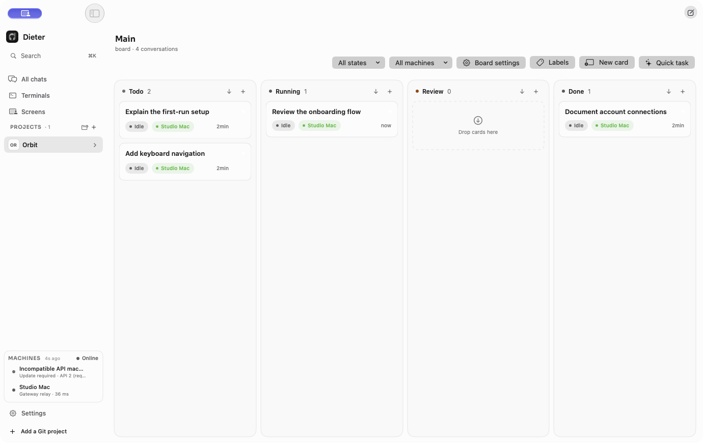

<p align="center">
  <picture>
    <source media="(prefers-color-scheme: dark)" srcset="assets/brand/assets/svg/logo-horizontal-light.svg">
    
  </picture>
</p>

<h1 align="center">Close your laptop.<br>Keep your agents running.</h1>

<p align="center">
  Run coding agents on always-on Macs and headless Linux hosts.<br>Follow the work from your Mac or phone.<br>
  Open source. Native apps. Self-hostable.
</p>

<p align="center">
  <a href="https://github.com/dbpprt/dieter/actions/workflows/ci.yml"></a>
  <a href="https://github.com/dbpprt/dieter/releases/latest"></a>
  <a href="LICENSE"></a>
</p>

<p align="center">
  <a href="https://getdieter.com/">Website</a> ·
  <a href="https://getdieter.com/docs/">Documentation</a> ·
  <a href="https://getdieter.com/docs/tour/">Product tour</a> ·
  <a href="https://github.com/dbpprt/dieter/releases/latest">Downloads</a>
</p>



Dieter is a native workspace for **Codex, Claude Code, Pi, Oh My Pi, and DeepSeek
Harness**. A local daemon runs agents on the machine with your Git checkout,
credentials, and tools. Native clients bring those machines together.
Managed OMP discovery and turns use the same pinned build. Dieter selects the
advertised model when launching OMP and keeps its catalog focused on GPT-6 Luna,
Sol, Astra, and the Tailscale GLM route. Dieter installs OMP's pinned Bun runtime
lazily, so hosts do not need a separate global OMP or Bun installation.
OMP bootstrap installs revalidate npm package metadata, including on retries, so
cached package lists cannot hide newly published pinned dependencies.
Codex models follow the installed CLI's live catalog; the bundled fallback
includes GPT-6.1 Sol when discovery is unavailable.

Your laptop is the remote control. An agent on another host keeps running when
you close the app, disconnect, or put your laptop to sleep. Keep that execution
host powered on and awake; a headless Linux host needs no desktop.

Background commands use Dieter's registered process tools. Their completion
does not wake an idle conversation: agents must collect required build/test
results before ending the turn, or verify readiness for a persistent server.
OMP and Claude native background execution is disabled to prevent promised
follow-ups from being lost when their provider session closes.

- **Give work a home.** Boards, standalone chats, labels, and schedules. Every
  task keeps one durable conversation.
- **Keep context beside the chat.** Open files, diffs, web pages, terminals, and
  background processes in the optional Mac conversation workspace.
- **Work across machines.** One shared project can have checkouts on your laptop,
  workstation, and Linux server. Each conversation keeps its execution owner.
- **Pick up from your phone.** Android, iPhone, and iPad share one app with an
  Inbox, boards, chats, files, Git review, schedules, terminals, and machine
  tools. The iPhone and iPad app is in beta.
- **Step in when needed.** Queue a follow-up, review a result, or open an
  authenticated remote screen with explicit input control. Android, macOS, and
  iOS repair transient screen interruptions within the existing session before
  replacing it; see [screen recovery](landingpage/content/docs/screens.md#lifecycle).
  The macOS daemon wakes the display before native capture and keeps it awake
  until the capture process exits, without unlocking or changing sleep/security preferences.

Experimental macOS virtual desktops are available behind the host environment
option `DIETER_SCREEN_VIRTUAL_DISPLAY=1`. The viewer's **Virtual display** screen
option uses its drawable pixels (within codec limits), with independent 1×/2× UI
scaling. CLI automation uses `dieter screen virtual status|set|presented|restore`;
see `dieter screen virtual --help`. Physical-screen disabling is a separate,
hardware-qualified opt-in (`DIETER_SCREEN_VIRTUAL_DISABLE=1`), requires an identified
physical main display, and waits for a presented frame. Temporary changes restore on
session closure, control handoff, or failure. See the [CLI skill](.agents/skills/dieter-cli/SKILL.md#experimental-macos-virtual-desktop)
for limits and recovery semantics.

[See the native apps in action →](https://getdieter.com/docs/tour/)

## Quick start

You need a configured agent account on the host and access to a Dieter gateway.
Setup defaults to `https://gateway.getdieter.com` (an allowed account is required).
For your own gateway, pass `--gateway https://YOUR-GATEWAY`; [self-hosting is documented](https://getdieter.com/docs/gateway/).

On **Apple Silicon macOS**:

```sh
brew install dbpprt/tap/dieter
dieter setup
dieter project open ~/Development/my-project

brew install --cask dbpprt/tap/dieter-app
open -a Dieter
```

Sign in to the same gateway in the app, open your project, and create a task.
`setup` enrolls the machine, starts its Homebrew service, and registers the
background privacy helper. Approve **Dieter Privacy Helper** in Login Items &
Extensions and grant Input Monitoring when prompted; privacy remains off until
enabled. The daemon and capture helper remain standalone executables.
`project open` separately registers an existing Git working tree.

The standard gateway is `https://gateway.getdieter.com`, with STUN/TURN at
`turn.getdieter.com`. Access requires an allowed account. Existing installations
retain their identity when the endpoint moves; see the
[gateway migration guide](https://getdieter.com/docs/gateway/#moving-a-gateway-endpoint).

If a machine was accidentally re-enrolled and its earlier conversations still
belong to its revoked ID, keep the original `DIETER_HOME` and private key. On
that machine, after updating the gateway and CLI, run
`dieter daemon recover --old-id ORIGINAL_ID --confirm RECOVER`. Recovery requires
the active replacement and revoked original to belong to the same account and
share the original key. Restart the daemon service, verify the original chats,
then explicitly revoke the replacement ID. Do not edit gateway storage or
`identity.json` directly; see `dieter daemon recover --help`.

On **Linux amd64/arm64**, install Node.js 22.19+, npm, Git, and
[cosign](https://docs.sigstore.dev/cosign/system_config/installation/), then:

```sh
curl -fsSL https://github.com/dbpprt/dieter/releases/latest/download/install.sh | sh
dieter setup
dieter project open ~/Development/my-project
dieter doctor
```

| Client                   | Get it                                                                                           |
| ------------------------ | ------------------------------------------------------------------------------------------------ |
| macOS 26+, Apple Silicon | Homebrew cask above or [release downloads](https://github.com/dbpprt/dieter/releases/latest)     |
| Android 8+               | [Download the APK](https://github.com/dbpprt/dieter/releases/latest/download/Dieter-Android.apk) |
| iOS 18+, iPhone and iPad | [Beta and source-build guide](apps/ios/README.md)                                                |

Gateway relay traffic uses four independently authenticated connections for
health/control, peer replication, commands, and subscriptions. A busy watch or
stalled peer does not consume the other traffic classes' admission or byte
budgets. `dieter machine route MACHINE` reports each relay channel's connectivity,
active calls, limit, buffered bytes, rejected calls, and last response time.
“Board and settings sync between … is delayed” refers to shared projects, boards,
card placement, labels, and portable settings; repository files and conversation
transcripts remain on their owner machine.

The daemon supports headless Linux hosts. Screen hosting needs an active desktop
and [platform dependencies](landingpage/content/docs/installation.md#linux).
[Full installation guide →](https://getdieter.com/docs/installation/)

## How it works

**Daemon → gateway → native client.** The daemon owns local execution and
replicates shared project metadata with your other daemons. The gateway handles
account identity, machine discovery, and bounded relay. Clients prefer verified
direct TLS, then supported WebRTC. Native clients start a parallel authenticated
relay connection after one second if WebRTC is still connecting, use the first
healthy route, and close the unused attempt. Application requests are sent once.

The gateway stores control metadata and normalized quota snapshots, **not**
repositories, transcripts, or provider credentials. Relay requests can pass
through it. Agents run with your user permissions, without a Dieter sandbox;
cloud model providers may receive prompts and code according to their settings.
Read the [security model](https://getdieter.com/docs/security/).

OpenAI and Claude quota collectors read existing OAuth credentials and call the
provider usage APIs directly. OpenAI polling does not launch Codex or refresh
plugin marketplaces. Codex credentials remain read-only; expired tokens must be
refreshed by Codex. OpenAI supports file credentials and profile-specific macOS
Keychain entries; process-only and encrypted secret stores are unsupported.
Claude quota polling runs every five minutes, with a ten-minute cooldown after
failed requests. Account discovery and manual refresh share the same limit.

There is no browser application or hosted agent runtime. The website is the
project's documentation; your agents run on your machines.

Changes behaves like a source-control panel, not a per-agent report. Project
mode shows the shared checkout; worktree mode shows the conversation checkout.
The daemon reads one lightweight status snapshot, loads diffs on selection, and
owns stage, commit, update, validation, integration, and explicit publishing so
Mac, Android, iOS, and CLI clients converge on the same Git state.

## Find your way

| You want to…                            | Read                                                                                                   |
| --------------------------------------- | ------------------------------------------------------------------------------------------------------ |
| Run your first agent                    | [Quick start](https://getdieter.com/docs/quickstart/)                                                  |
| Understand tasks, worktrees, and review | [Projects & tasks](https://getdieter.com/docs/projects/)                                               |
| Automate through the daemon             | [CLI guide](https://getdieter.com/docs/cli/)                                                           |
| Share logins and TOTP with agents       | [Vault](https://getdieter.com/docs/vault/)                                                             |
| Add machines or host a gateway          | [Machines](https://getdieter.com/docs/machines/) · [Self-hosting](https://getdieter.com/docs/gateway/) |
| Understand internals                    | [Architecture](https://getdieter.com/docs/architecture/)                                               |
| Fix a connection or setup problem       | [Troubleshooting](https://getdieter.com/docs/troubleshooting/)                                         |

## Contribute

See [CONTRIBUTING.md](CONTRIBUTING.md) for setup, repository structure, and review
expectations. Shared local tools are declared in [mise.toml](mise.toml) and
[mise.lock](mise.lock); follow the [setup guide](fastlane/README.md#setup-and-machine-configuration).
After activating mise in your shell, start local validation with:

```sh
just check-changed --dry-run
just check-changed
```

Install local formatting and secret checks with `just hooks` on each development
checkout. Run `just format`, review and stage changes, then `just pre-commit`.
The [hook guide](fastlane/README.md#local-commit-checks) covers Mac/Linux setup
and safe partial commits.

The default runs affected fast checks and lists related device/desktop work.
Select specific native cases or add `--native`; avoid full-suite reruns between
edits. Generic pipeline changes are verified through shared contracts.

Run the Android journey with `just pipeline android e2e profile:android-emulator`,
macOS with `just pipeline mac e2e suite:smoke`, or iOS with
`just pipeline ios e2e profile:ios-iphone` (also `profile:ios-ipad`). The
[native test guide](tests/e2e/README.md) covers catalog cases, suite selection,
shared lifecycle and failure evidence. [The pipeline guide](fastlane/README.md)
covers local emulator/device profiles, builds, signing and dev/stable releases.
`just pipeline ios_qualify profiles:ios-iphone,ios-ipad suite:smoke` builds and
verifies simulator products once for both layouts. Main CI qualifies once before
calling Release, preserving the existing immutable candidates and stable policy.

[Mac](apps/mac/README.md) · [Android](apps/android/README.md) ·
[iOS](apps/ios/README.md) · [Website](landingpage/README.md)

Dieter is [MIT-licensed](LICENSE). Pronounced **DEE-ter**. Made in Berlin.

### Unseen model replies

Activity on macOS (**Needs attention**) and the Android and iOS Inbox (**Needs
you**) flag completed model replies that have not been viewed and questions
waiting for an answer.
Viewing the latest transcript in the foreground acknowledges that reply across
clients. A Review lane alone does not imply an unread reply.

### Provider reconnects

A provider stream that drops mid-turn is retried by the harness, not failed.
While it retries, the Mac, iOS, and Android working indicators show
**Reconnecting to provider (2/5)…** (or **(waiting for network)…**), and
`card poll`/`card watch` output carries a transient `providerStatus`. The daemon
clears it when the stream recovers or the turn ends. A turn fails only on the
provider's final error, which leads the failure text; worker diagnostics follow
it in the log.

Card/chat metadata includes `responseSeq`, `responseMessageId`, and
`seenResponseSeq`. Automation can acknowledge a displayed response using
`dieter card read --response-seq SEQ CARD` (also `chat read`). The command supports
local, direct TLS, and relay routes with global `--machine`. Stale receipts never
clear newer replies. Board comments and the card/chat comment commands are removed.

Card placement and runtime observations carry independent causal frontiers in
`stateFields`. The gateway rejects clients or daemons below its reviewed minimum
release. Native clients join these observations before
presenting snapshots from different machines; an older replica cannot undo an
acknowledged move or revive a finished turn. `placementRevision` remains the
accepting daemon's CAS receipt (a client-only
concurrent join must first be observed by a daemon before moving again). Board
ordering follows the shared placement key in either display direction; Inbox
Recent is chronological and finishing a review does not change its activity time.

On macOS, right-click a board in the sidebar or project quick navigation and choose
**Delete board…**, then confirm. Only empty boards can be deleted; their identity,
settings, and labels are preserved. A selected deleted board offers **Restore board**.
`dieter board show BOARD_ID` resolves exact IDs across projects and
includes retired boards. `dieter board list --project PROJECT_ID` lists active
boards; add `--retired` for a bounded page of retired boards. After inspection,
use `board retire --revision REV --operation ID BOARD_ID`, or `board restore`
with the current lifecycle revision. Any surviving card (including archived or
pending cards) or schedule blocks retirement. A late replicated reference makes
the parent accessible again. Success acknowledges local durability; inspect
`dieter peer status` for per-peer replication progress and blocking records.
It retains historical failures; workspace warnings suppress offline-peer and
expired transport failures while keeping unresolved record rejections visible.
`catchup` means bounded page progress; the last completed exchange advances only
when both directions finish. Retained shared records and replay receipts use
paged SQLite access, so historical count does not exhaust a lifetime write quota.
Tombstones remain available to protect against stale offline replicas. See
[peer storage and retention](landingpage/content/docs/architecture.md#shared-identity-local-execution).

### Account vault

`dieter vault` keeps logins (name, URLs, username, password, TOTP, notes) shared
by all your machines. Items replicate end-to-end encrypted; vault commands that
return decrypted content refuse the gateway relay route. Run `vault init` once,
`vault join` on each further machine, and `vault approve MEMBER --code CODE` on a
member after comparing codes (or `vault join --recovery-key-stdin`). Secrets are
read from files, stdin, `--prompt` or `--generate`, never from arguments.
Conversations created with `card create --vault`, `chat create --vault` or
`schedule create --vault` let their agent turns use `vault list|get|totp|exec|add|edit`
through a per-turn token; agents never change membership or keys. Revealed
passwords are redacted from stored transcripts; `vault audit` lists access. See
[Vault](https://getdieter.com/docs/vault/).

### macOS local privacy

Use **Lock Local Screen…** in a Mac machine's Actions menu to blank its physical
outputs and suppress local keyboard/mouse input while agents and remote control
continue. Unlock explicitly or reboot to clear it. A small shield in the Mac
sidebar shows the live state; stale and degraded protection are identified.

```sh
dieter --machine MACHINE_ID machine privacy status
dieter --machine MACHINE_ID machine privacy setup
dieter --machine MACHINE_ID machine privacy on --key UNIQUE_LOCK_ID
dieter --machine MACHINE_ID machine privacy off --key UNIQUE_UNLOCK_ID
```

Omit `--machine` for the local daemon. **Set Up Privacy Mode…** registers the
separate signed background privacy helper; an administrator must approve it in Login Items
& Extensions and grant
Input Monitoring on the target Mac. The Go daemon and capture helper remain standalone executables; only
`DieterPrivacyHelper.app` contains the privileged input service. The main daemon
stays unprivileged. Normal `dieter setup` handles helper registration on macOS;
`--no-open` and `--no-start` defer it to `dieter machine privacy setup`. Requires
Accessibility permission and compatible display transfer tables. Protection
exclusively claims matched HID input devices, with a secondary session filter.
Status includes the protected input-device count and whether setup is required.
This protects the logged-in desktop; macOS login/FileVault and forced power/reboot
remain separate. Lost protection is degraded; a requested Lock Screen shortcut
does not establish a verified authentication lock. See
[privacy implementation and verification](native/macos-capture/privacy-mode-research.md).
