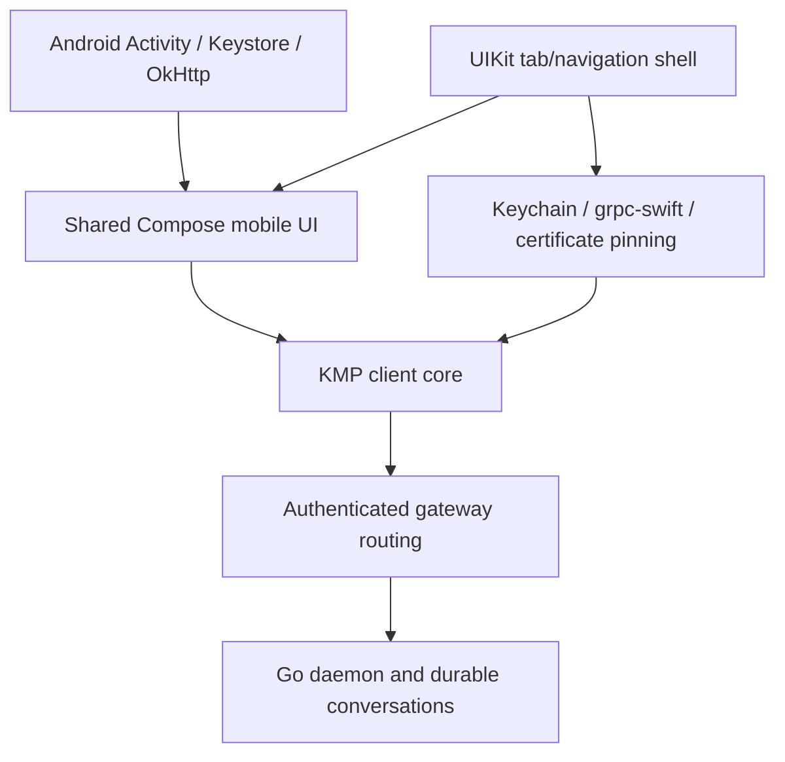

# Dieter mobile UI (Compose Multiplatform)

The Android and iOS apps share one Compose Multiplatform UI. This module
(`apps/core/mobile`, the `:mobile` project of the core's Gradle build) contains
the screens, view lifetime and navigation. Each app is a small native host:

- [Android](../../android/README.md): a Material 3 shell in `apps/android`.
- [iOS](../../ios/README.md): a UIKit shell in `apps/ios`, with its Swift host in
  `apps/mac/Sources/DieterIOS`.

Both use the same commands and state from [the shared Kotlin core](../README.md);
native code supplies credentials, transport, attachments, terminal emulation,
screen video/input and, on iOS, navigation chrome. The macOS app
([apps/mac](../../mac/README.md)) is a separate SwiftUI client of the same core.

The apps are organized as **Inbox / Projects / Chats / Tools**, with compact task
cards, project folders, agent controls, transcript tools, files, Git review,
schedules, terminals, screens and machine tools.

## Platform design

Each platform gets its own chrome and controls; the screens' content, state and
commands are shared.

- **Android:** Material 3 throughout. Colors come from the wallpaper (dynamic
  color, Android 12+, switchable in Settings) or from tonal schemes built from
  the eight Dieter palettes; Monochrome is the default. Root lists collapse a
  large top app bar, detail screens use a top app bar with an overflow menu,
  and New task is an extended FAB. Navigation is a navigation bar (rail from
  600 dp); system back pops the visible tab stack. Lanes are tabs with counts,
  pickers are dropdown menus or bottom sheets, and confirmations are dialogs.
  The Inbox uses a compact title bar and individual activity cards with status
  accents to keep more work visible. Titles use the Sora display font; the app
  draws edge to edge.
- **iOS:** UIKit owns navigation. A `UITabBarController` holds one
  `UINavigationController` per tab (a sidebar-adaptable tab bar on iPad), so
  large titles, subtitles, back gestures and bar buttons are the system's own.
  Screen actions are `UIBarButtonItem`s and `UIMenu`s, in-content "…" buttons
  open native menus, forms are sheets with detents, and confirmations and text
  prompts are alerts. Compose draws each screen's content with iOS system
  colors, Dynamic Type sizes, SF Symbols and inset-grouped lists.
- **Adaptive layouts:** Android shows list and detail side by side from 840 dp;
  iPad uses a split view in regular width. A board shows parallel lanes from
  700 dp and swipeable lane tabs below that. The same content and commands run
  on phones and tablets.

## Code boundaries



`MobileStore` binds core scopes (board, project, conversation, files,
terminals, telemetry) to the visible routes of per-tab navigation stacks
(`Navigation.kt`). It sends the core's `ClientApi` commands and observes its
slices, including keyed deltas and temporary-to-confirmed task ID resolution.
It adds no server API or business rules; put rules in the core. Android and the
JVM tests call `ClientApi` directly. On iOS, `MobileHost` uses the `DieterShared`
byte contract of the `:apple` module, which the iOS framework exports.

The Android app module depends on this project from the included core build and
keeps its credential store, control channel, clipboard, GPU screen canvas,
sideload updater and Activity. An `AndroidViewModel` (`DieterSession`) retains
the core, forms and drafts across Activity recreation; system bars follow the
selected appearance and palette.

For iOS, `just pipeline framework platforms:ios-simulator` (or `ios-device`)
assembles `apps/mac/Frameworks/DieterMobile.xcframework` from this module. The
`DieterIOS` target of `apps/mac/Package.swift`, selected with
`DIETER_SWIFT_PACKAGE=ios`, links it and compiles the Keychain store, platform
services, gRPC bridge, control channels and screen media of `SharedCore`. It
reuses WebRTC, the Metal video/input views, SwiftTerm and the system pickers.
The framework's module is named `DieterShared`, like the Mac's framework built
from `:apple`, so the two must never be linked into one binary.

The module pins Compose Multiplatform 1.12.1 and the repository's Kotlin 2.4.10
toolchain. The iOS app sets `CADisableMinimumFrameDurationOnPhone`, which
Compose requires, and builds with the iOS 26 SDK for the native bar and glass
APIs; it runs on iOS 18 or later.

| Surface                                                                      | Shared implementation                           | Native boundary                                    |
| ---------------------------------------------------------------------------- | ----------------------------------------------- | -------------------------------------------------- |
| Inbox, projects, folders, chats, boards, card actions                        | `WorkspaceScreens`, `BoardScreens`              | Navigation chrome                                  |
| Task creation, agent/model/effort/options, attachments                       | `CreationScreen`                                | Photo/document pickers                             |
| Transcript, Markdown/tables/code, tools, plans, subagents, queues and drafts | `ConversationScreen`, `RichText`                | Attachment previews                                |
| Files/editing/history, Git diffs/operations/merge                            | `ToolScreens`, `ReviewScreen`, `WorkspaceTools` | Binary previews                                    |
| Schedules/editor/history, projects/checkouts/boards/labels/archive           | `ManagementScreens`, `AdministrationScreens`    | Core administration                                |
| Machine telemetry/actions, quotas, gateways, appearance                      | `ToolScreens`, `MobileTheme`                    | Core operations                                    |
| Persistent terminals                                                         | Shared controls and bounded core output         | Termux on Android, SwiftTerm on iOS                |
| Screen sharing                                                               | `ScreenUI` and core session state               | GPU/Metal renderers, WebRTC and native touch input |

Dragging a card moves it between lanes; it does not reorder cards within a lane.
Items shared from other apps reach `MobileStore.share` as `SharedItems` once the
workspace has loaded: a new task opens prefilled, or `ShareTargetScreen` picks
the task or chat whose composer receives them. Android reads its share intents
in `AndroidShare`; iOS passes its Share extension's files through `MobileHost`.
The apps have no background service, notifications or widgets.

## Run and verify

Use the pinned repository toolchain and Fastlane ownership rules:

```sh
mise exec -- just pipeline core_test       # core and shared UI JVM tests
mise exec -- just pipeline android build
mise exec -- just pipeline android e2e profile:android-emulator
mise exec -- just pipeline ios build
mise exec -- just pipeline ios e2e profile:ios-iphone
mise exec -- just pipeline ios_qualify profiles:ios-iphone,ios-ipad
```

`core_test` runs `:shared:jvmTest` and `:mobile:jvmTest`. The JVM journey in
`MobileJourneyTest` creates a task against an isolated gateway and daemon,
resolves its local ID, receives live first and follow-up replies in the same
conversation, synchronizes Review to a second client and reopens history.
Further tests cover late updates from a closed conversation, queued command
targets, terminal delta retention, preview cancellation, draft flushing and
navigation-stack binding.

The native journeys (catalog cases `android.journey` and `ios.journey`) drive
the real controls against a disposable authenticated gateway, enrolled daemon
and mock harness: Inbox, Projects, a board, a seeded task and its subagents,
task creation with live replies, Review, Chats, Tools, Machines, Files,
Markdown preview, Schedules and dark appearance. Android recreates the Activity
before submitting the task and before the follow-up; iPad runs in landscape with
the board beside the conversation. Like production daemons, the fixture offers
WebRTC control channels, so Android reaches it over that route. Configure exact
simulator profiles with `just pipeline config_init`; Android emulator ownership
follows [the pipeline guide](../../../fastlane/README.md). Missing, skipped or
failed assertions and cleanup failures fail the run. Evidence, including the
journey screenshots, is printed as `tmp/app-pipelines/<UUID>`.

Interactive sign-in uses the exact callbacks `dieter-android://oauth/callback`
(Android) and `dieter-mac://oauth/callback` (iOS, shared with the Mac). Debug
builds accept an isolated fixture session for these journeys; release builds do
not.
