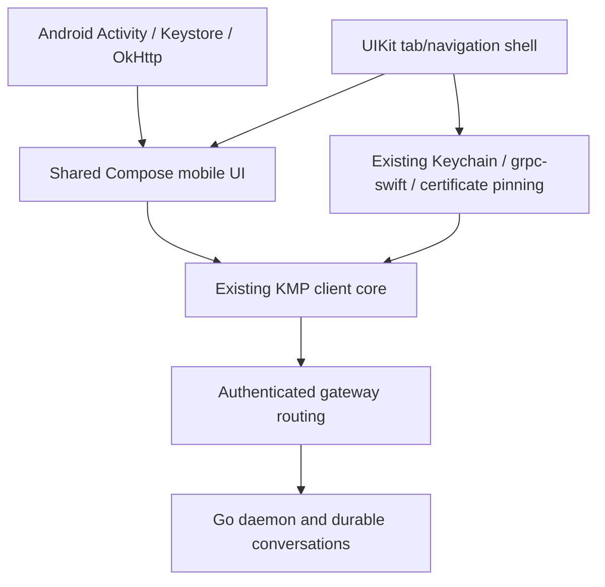

# Compose Multiplatform mobile spike

Dieter can share its mobile presentation as well as its Kotlin client core. This
experiment builds the **same Compose screens on Android and iOS**, using the
existing Go daemon/gateway and KMP client, with a small native host on each OS.
The shipping Android, iOS and macOS clients remain the reference for feature parity.

The design port follows the shipping Android app: **Inbox / Projects / Chats /
Tools**, compact task cards, project folders, agent controls, transcript tools,
files, Git review and schedules. Both platforms use the same commands and state
from `apps/core`; native code supplies credentials, transport, attachments,
terminal emulation, screen video/input and iOS navigation chrome.

## Platform design

Each platform gets its own chrome and controls; the screens' content, state and
commands are shared.

- **Android:** Material 3 throughout. Colors come from the wallpaper (dynamic
  color, Android 12+, switchable in Settings) or from tonal schemes built from
  the eight Dieter palettes; Monochrome is the default. Root lists collapse a
  large top app bar, detail screens use a top app bar with an overflow menu,
  and New task is an extended FAB. Navigation is a navigation bar (rail from
  600 dp); system back pops the visible tab stack. Lanes are tabs with counts,
  pickers are dropdown menus or bottom sheets, and confirmations are dialogs.
  Titles use the Sora display font; the app draws edge to edge.
- **iOS:** UIKit owns navigation. A `UITabBarController` holds one
  `UINavigationController` per tab (a sidebar-adaptable tab bar on iPad), so
  large titles, subtitles, back gestures and Liquid Glass bar buttons are the
  system's own. Screen actions are `UIBarButtonItem`s and `UIMenu`s, in-content
  "…" buttons open native menus, forms are sheets with detents, and
  confirmations and text prompts are alerts. Compose draws each screen's
  content with iOS system colors, Dynamic Type sizes, SF Symbols and
  inset-grouped lists.
- **Adaptive layouts:** Android shows list and detail side by side from 840 dp;
  iPad uses a split view in regular width. A board shows parallel lanes from
  700 dp and swipeable lane tabs below that. The same content and commands run
  on phones and tablets.

[Design audit and port inventory](DESIGN_PORT.md) maps the legacy surfaces to the
shared implementation. [Legacy captures](design/legacy-android/index.html)
record the actual old Android UI. The [comparison gallery](design/index.html)
shows the running shared apps; [verification](VERIFICATION.md) records native
results and remaining qualification requirements.

## Code boundaries



`apps/core/mobile` contains the shared screens and view lifetime/navigation.
It calls the existing `ClientApi` commands and observes its slices, including
keyed deltas and temporary-to-confirmed task ID resolution. It adds no server
API or business rules. On iOS, a thin Kotlin adapter uses the existing Apple
byte contract; a production integration can replace that encode/decode round
trip with a Kotlin-only typed bridge without changing the shared UI.

`apps/mobile/android` is a separate APK (`com.dbpprt.dieter.compose.spike`),
compiling the existing credential, control-channel, clipboard, GPU screen and
terminal sources through explicit source-copy tasks. Its AndroidViewModel retains
the shared session, forms and drafts across Activity recreation; system bars
follow the selected appearance and palette. The iOS app has its own
bundle ID and Keychain service. Its small `DieterComposeHost` SwiftPM graph
compiles the **existing** Keychain, platform service, gRPC, resolver and daemon
certificate-pinning sources. It reuses WebRTC, Metal video/input views, SwiftTerm and system pickers while
keeping the shipping mobile screens in their original apps.

Compose dependencies are opt-in with `-Pdieter.composeSpike=true`.
The experiment pins Compose Multiplatform 1.12.1 and the repository's Kotlin
2.4.10 toolchain. The iOS host sets `CADisableMinimumFrameDurationOnPhone`, which
Compose requires, and builds with the iOS 26+ SDK for native glass APIs.
`DIETER_SWIFT_TEST_SCOPE=compose-spike` selects only the spike's Apple graph.
The normal core and Apple graphs retain their existing products. The spike's
framework also uses the module name `DieterShared` so the platform adapters can
be reused; it is assembled at a separate path and must never be linked together
with the shipping framework in one binary.

## Run and verify

Use the pinned repository toolchain and Fastlane ownership rules:

```sh
mise exec -- just pipeline compose_spike action:test
mise exec -- just pipeline compose_spike action:android_build
mise exec -- just pipeline compose_spike action:ios_build
mise exec -- just pipeline compose_spike action:ios_e2e profile:ios-iphone
mise exec -- just pipeline compose_spike action:ios_e2e profile:ios-ipad
mise exec -- just pipeline compose_spike action:ios_qualify profiles:ios-iphone,ios-ipad
mise exec -- just pipeline compose_spike action:android_e2e profile:android-emulator
```

Configure exact simulator profiles with `just pipeline config_init`; Android
emulator setup/warm ownership follows `fastlane/README.md`. Physical targets are
intentionally rejected by these experimental E2E lanes. They never select an
attached phone, operate an existing simulator, or replace an operator daemon.

The JVM journey checks creation, local ID resolution, live replies, a follow-up
in the same conversation, cross-client synchronization of Review, and reopening
history. A separate test verifies late updates from a closed conversation do
not replace the current one. Native Compose/XCTest journeys exercise the real
controls against a disposable authenticated gateway, enrolled daemon and mock
harness, and retain screenshots. Native results use the existing exact-method
qualification contract; missing, skipped or failed assertions fail the lane.
Native cleanup uses the production ownership journals, device/build leases and
owned processes. Evidence is printed as `tmp/app-pipelines/<UUID>`.

For interactive sign-in on a development gateway, allow the exact callbacks
`dieter-compose://oauth/callback` and `dieter-compose-ios://oauth/callback`
in that gateway's native redirect configuration. The production gateway's
existing allowlist is deliberately not changed by the experiment. Debug fixture
session injection is confined to these separate spike apps.

## Implementation and qualification scope

| Surface                                                                      | Shared implementation                           | Native boundary                                       |
| ---------------------------------------------------------------------------- | ----------------------------------------------- | ----------------------------------------------------- |
| Inbox, projects, folders, chats, boards, card actions                        | `WorkspaceScreens`, `BoardScreens`              | Navigation chrome                                     |
| Task creation, agent/model/effort/options, attachments                       | `CreationScreen`                                | Photo/document pickers                                |
| Transcript, Markdown/tables/code, tools, plans, subagents, queues and drafts | `ConversationScreen`, `RichText`                | Attachment previews                                   |
| Files/editing/history, Git diffs/operations/merge                            | `ToolScreens`, `ReviewScreen`, `WorkspaceTools` | Binary previews                                       |
| Schedules/editor/history, projects/checkouts/boards/labels/archive           | `ManagementScreens`, `AdministrationScreens`    | Existing core administration                          |
| Machine telemetry/actions, quotas, gateways, appearance                      | `ToolScreens`, `MobileTheme`                    | Existing core operations                              |
| Persistent terminals                                                         | Shared controls and bounded core output         | Termux on Android, SwiftTerm on iOS                   |
| Screen sharing                                                               | Shared controls and core session state          | Existing GPU/Metal renderers, WebRTC and native input |

This opt-in spike preserves both shipping apps. A compiled action is not a
production qualification: [verification](VERIFICATION.md) records which native
journeys actually passed. Full screen/media hardware checks, complete shipping
catalogs, VoiceOver/TalkBack, physical devices, interactive OAuth and release
performance remain cutover requirements. Background notifications, widgets,
share extensions and app updating remain in the shipping apps; the spike does
not replace those platform services. Dragging supports lane moves; production
reordering/autoscroll polish remains outside the qualified journey.

The original hosts remain in `apps/android` and `apps/ios` (iOS Swift sources in
`apps/mac/Sources/DieterIOS`). Shared Compose lives in `apps/core/mobile`; the new
hosts are `apps/mobile/android` and `apps/mobile/ios`. Both sets have CI gates.
See [CI and preview delivery](PIPELINES.md). Compose has no TestFlight publishing.
