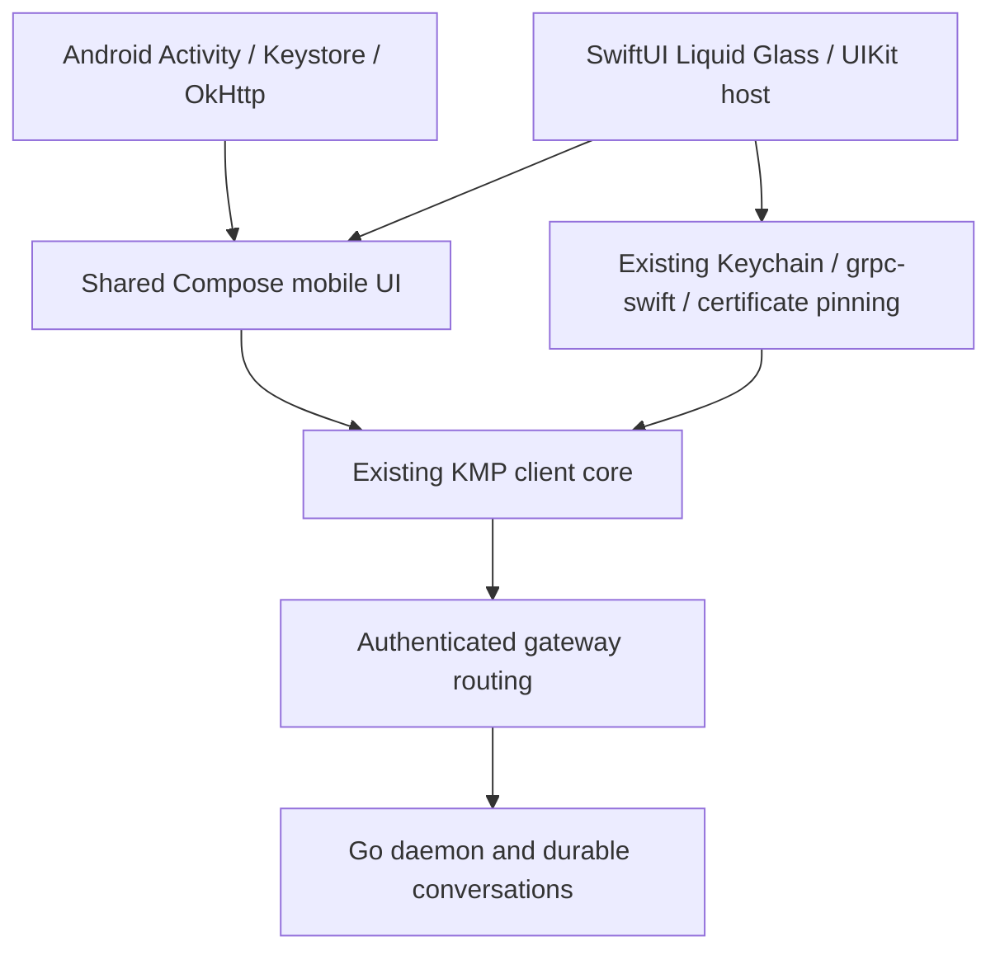

# Compose Multiplatform mobile spike

Dieter can share its mobile presentation as well as its Kotlin client core. This
experiment builds the **same Compose screens on Android and iOS**, using the
existing Go daemon/gateway and KMP client, with a small native host on each OS.
The shipping Android, iOS and macOS clients remain the reference for feature parity.

The shared slice includes board/lane browsing, search within a lane, task creation
(Todo or immediate start), a live conversation with tool groups and delivery
receipts, follow-up messages, Stop/Start, history loading, moving a task to Review,
standalone chat browsing, machine status, reconnect and gateway sign-in. A wide
viewport presents the board and conversation side by side.

## Platform design

- **iOS:** a real SwiftUI `glassEffect(.regular.interactive())` navigation bar and
  controls on iOS 26+, around `ComposeUIViewController`. It uses SF Symbols,
  native safe areas and the system keyboard. iOS 18–25 uses system material;
  Reduce Transparency uses an opaque background. The transcript and task cards
  stay opaque for readability. Glass belongs on navigation and controls, not
  every content surface. Compose owns keyboard insets; the SwiftUI host ignores
  keyboard safe-area changes so both layers do not shrink the content.
- **Android:** Compose Material 3 controls, bottom navigation, edge-to-edge
  insets, system keyboard, a warm neutral canvas and Dieter's coral accent.
- **Tablet:** the common layout chooses a board/conversation split at 700 dp.
  The breakpoint is a view decision; task state, routing and wording stay in the core.

## Code boundaries



`apps/core/mobile` contains the shared screens and view lifetime/navigation.
It calls the existing `ClientApi` commands and observes its slices, including
keyed deltas and temporary-to-confirmed task ID resolution. It adds no server
API or business rules. On iOS, a thin Kotlin adapter uses the existing Apple
byte contract; a production integration can replace that encode/decode round
trip with a Kotlin-only typed bridge without changing the shared UI.

`apps/mobile/android` is a separate APK (`com.dbpprt.dieter.compose.spike`),
compiling the existing Android credential-store source. The iOS app has its own
bundle ID and Keychain service. Its small `DieterComposeHost` SwiftPM graph
compiles the **existing** Keychain, platform service, gRPC, resolver and daemon
certificate-pinning sources. It avoids loading either shipping mobile UI and
omits WebRTC until screen/terminal integration is migrated.

Compose dependencies are opt-in with `-Pdieter.composeSpike=true`.
The experiment pins Compose Multiplatform 1.12.1 and the repository's Kotlin
2.4.10 toolchain. The iOS host sets `CADisableMinimumFrameDurationOnPhone`, which
Compose requires, and builds with the iOS 26+ SDK for native glass APIs.
`DIETER_SWIFT_TEST_SCOPE=compose-spike` selects only the spike's Apple graph.
The normal core and Apple graphs retain their existing products. The spike's
framework also uses the module name `DieterShared` so the platform adapters can
be reused; it is assembled at a separate path and must never be linked together
with the shipping framework in one binary.

## Run and verify

Use the pinned repository toolchain and Fastlane ownership rules:

```sh
mise exec -- just pipeline compose_spike action:test
mise exec -- just pipeline compose_spike action:android_build
mise exec -- just pipeline compose_spike action:ios_build
mise exec -- just pipeline compose_spike action:ios_e2e profile:ios-iphone
mise exec -- just pipeline compose_spike action:ios_e2e profile:ios-ipad
mise exec -- just pipeline compose_spike action:ios_qualify profiles:ios-iphone,ios-ipad
mise exec -- just pipeline compose_spike action:android_e2e profile:android-emulator
```

Configure exact simulator profiles with `just pipeline config_init`; Android
emulator setup/warm ownership follows `fastlane/README.md`. Physical targets are
intentionally rejected by these experimental E2E lanes. They never select an
attached phone, operate an existing simulator, or replace an operator daemon.

The JVM journey checks creation, local ID resolution, live replies, a follow-up
in the same conversation, cross-client synchronization of Review, and reopening
history. A separate test verifies late updates from a closed conversation do
not replace the current one. Native Compose/XCTest journeys exercise the real
controls against a disposable authenticated gateway, enrolled daemon and mock
harness, and retain screenshots. Native results use the existing exact-method
qualification contract; missing, skipped or failed assertions fail the lane.
Native cleanup uses the production ownership journals, device/build leases and
owned processes. Evidence is printed as `tmp/app-pipelines/<UUID>`.

For interactive sign-in on a development gateway, allow the exact callbacks
`dieter-compose://oauth/callback` and `dieter-compose-ios://oauth/callback`
in that gateway's native redirect configuration. The production gateway's
existing allowlist is deliberately not changed by the experiment. Debug fixture
session injection is confined to these separate spike apps.

## Migration decision and remaining scope

Use this approach to port Android's existing Compose surfaces into common code
one feature at a time, rather than maintain two implementations of each mobile
screen. Keep the existing KMP core authoritative throughout. Native capabilities
should be injected into shared screens through small platform interfaces.

| Surface/capability                                        | Spike                    | Production migration                                          |
| --------------------------------------------------------- | ------------------------ | ------------------------------------------------------------- |
| Board, task form, transcript, machine list                | Shared Compose           | Bring across the richer Android controls and tests            |
| Task state, delivery, sync, routing, credential policy    | Existing core            | Reuse unchanged                                               |
| iOS navigation glass                                      | Native SwiftUI           | Add native navigation transitions and scroll-edge integration |
| Credentials and gRPC                                      | Reused native adapters   | Reuse unchanged                                               |
| Remote screen / WebRTC / video decoders                   | Not integrated           | Embed existing Android and UIKit media views                  |
| Terminal renderer                                         | Not integrated           | Embed Termux and SwiftTerm via platform view factories        |
| Files, diffs, schedules, agent pickers                    | Not integrated           | Port Android layouts over existing core surfaces              |
| Photos, files, clipboard and share extension              | Not integrated           | Keep platform pickers/extensions; hand parts to the core      |
| Background sync, notifications, widgets, updates          | Not integrated           | Preserve platform services                                    |
| Rich Markdown, selection and attachments                  | Basic text/tool timeline | Port a common renderer and retain native viewers              |
| Dark appearance, navigation gestures, accessibility audit | Not qualified            | Finish before replacing the shipping UI                       |

This is a runnable architecture and end-to-end UX spike, not a feature-complete
replacement or a production release gate. Production cutover should wait for the
existing Android/iOS catalogs, VoiceOver/TalkBack, larger text, dark appearance,
keyboard and rotation checks, direct TLS/relay recovery, signing and physical
phone checks to pass against the shared UI. No compatibility branches or new
version numbering are introduced.

See [verification](VERIFICATION.md) and [screenshots](screenshots/README.md) for
this worktree's actual results and image provenance.

The original apps remain in `apps/android` and `apps/ios`; the Compose hosts are
in `apps/mobile/android` and `apps/mobile/ios`. Both sets have CI gates.
See [CI and preview delivery](PIPELINES.md) for affected checks, downloadable
Android/iOS simulator previews and local commands. Compose has no TestFlight
publishing yet.
