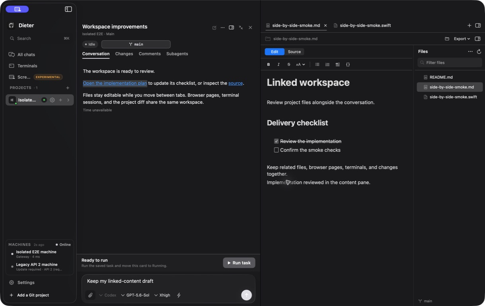
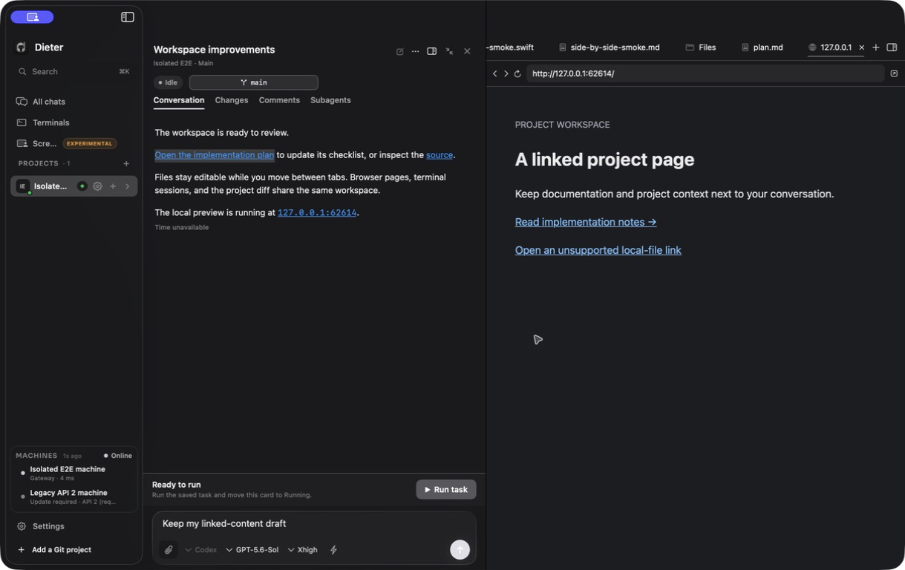
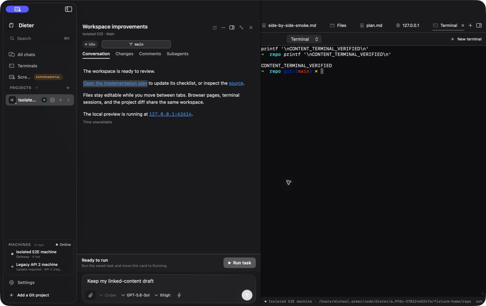
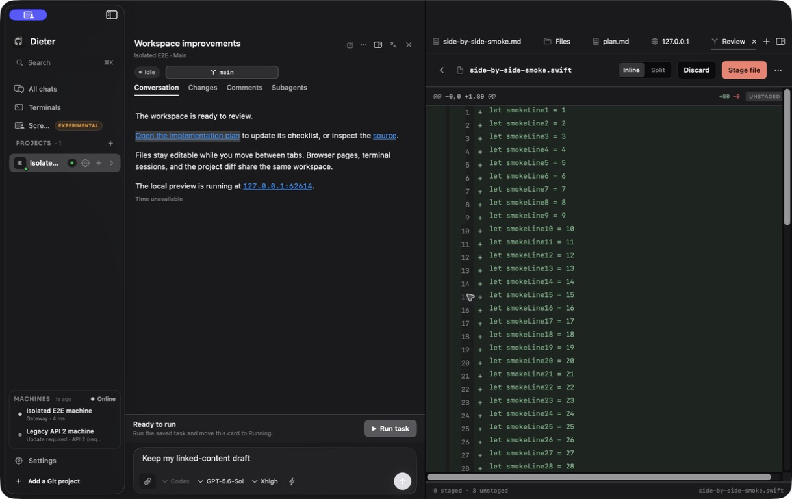
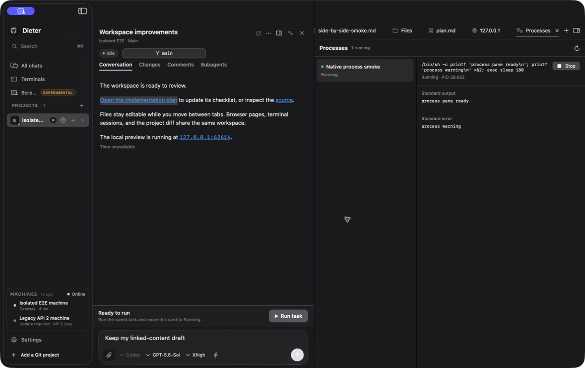
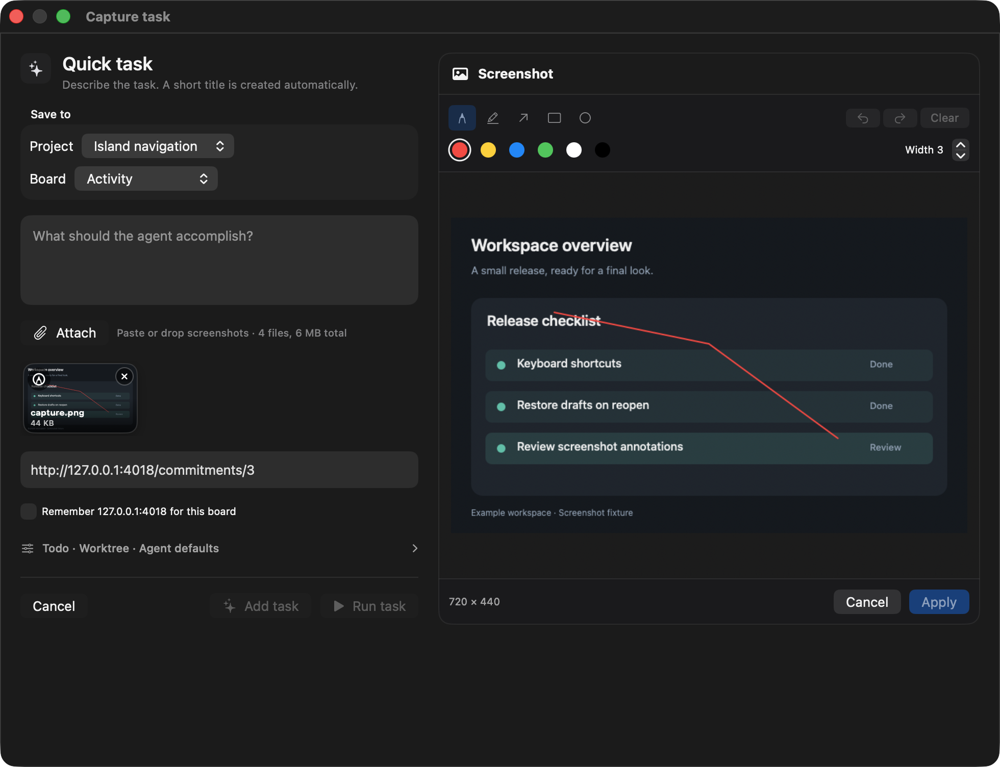

# Native conversation workspace: implementation and validation

12 September 2026. Opens linked objects in a tabbed, resizable workspace beside the conversation. Files, Browser, Terminal, Review, and Processes are available from the empty launcher and the add-tab menu. There is no side chat.

## Delivered behavior

Markdown opens in interactive Edit mode. Native formatting, checkboxes, relative links, and revision-checked saving work in place; Source is the only alternate mode. PDF and standalone HTML exports use the current draft, including unsaved changes. File toolbars expose Show in Finder for local workspace files; remote files can be saved as a local copy. Code has syntax highlighting and line navigation. Images, PDFs, and unsupported files use dedicated native preview or download surfaces.

Right-clicking a chat file link offers installed applications in Open in and Show in Finder, resolved against that conversation’s local workspace. Remote paths are never opened as local files.

Bare development addresses such as `127.0.0.1:4018`, `localhost:3000`, and `[::1]:8080` are clickable in prose and inline code. Authored links and monospace styling are preserved; fenced code and file/line references stay literal.

Quick Task exposes Add task and Run task in its shared editor. Its first local row uses the final deterministic card ID. Creation and optional first-turn admission complete before bounded background Spark title generation. Title updates change only metadata and respect later manual edits; dependent outbox messages wait for creation to finish. A failed local journal write preserves the draft.

Image attachments in Mac composers can be annotated with pen, highlighter, arrows, rectangles, and ellipses, with colors and undo/redo. Apply replaces staged bytes after size and stale-attachment checks; source files stay untouched. Island captures show the screenshot editor to the right of the Quick Task inputs, stacking below at narrow widths. Sidebar project controls appear on hover, and repository names take width priority over host labels.

Agents can start, list, read, and stop registered background processes through session-bound harness tools. The existing exact-argv execution API and CLI provide the same admission and lifecycle behavior. The Processes tab filters to the exact conversation, renders bounded separate stdout/stderr, resumes from event sequence, and offers explicit Stop. Hiding or closing the tab stops its observers, while the daemon process continues through turn completion and client disconnects.

Each tab retains its own document buffer, browser history, and exact machine/project/worktree scope. Dirty close prompts support saving, discarding, or canceling. Hiding the pane preserves its tabs. Closing a terminal tab stops its UI watch without closing the daemon-owned session. Review uses the conversation worktree or the shared project checkout as appropriate.

Opening an object expands the conversation and starts with a 45/55 chat/content split. Restoring the board preserves the actual native transcript view, selection, draft, scroll position, and remembered conversation width. Tabs scroll their selected label into view. Reconnection replaces stale transports while retaining dirty text in the same workspace.

The `present_content` harness tool and `dieter card present` / `dieter chat present` request presentation in the exact owning conversation. The latest typed request is durable and delivered through conversation snapshots and updates; it does not create a message or resume an agent. Files are bounded regular files within the owning workspace, with symlink escapes and `.git` access rejected. HTTP(S) URLs and optional line/title fields are validated before an event is emitted.

## Validation

The expanded change passed all eight native suites and the focused conversation rerun. The final Board and Island drivers exited successfully and removed their disposable runtimes. The verified app is installed and running.

- Affected Go packages: race tests and `go vet` passed through `just check-changed`.
- Harness Node tests: 51 passed.
- Mac unit tests: 533 tests in 23 suites passed.
- Android unit checks: 258 tests across 61 suites, zero failures/errors/skips; Gradle validated existing results as up to date. The working command uses `JAVA_HOME="/Users/michael.ermer/Applications/Android Studio.app/Contents/jbr/Contents/Home" just android test` (JBR 21.0.10). The default system Applications path is absent.
- Current Mac app build passed. The installed executable matches the build, and its deep, strict code-signature verification passed.
- Android connected tests: unavailable; no device or emulator is connected. No emulator was started.

`just check-changed` stopped at the missing default Android JBR path; the separate Android command above resolved that environment issue. Do not interpret the interrupted aggregate command as a complete pass.

| Native suite | Current result | Evidence directory under `apps/mac/.build/smoke/` |
| --- | --- | --- |
| Core | 69 report entries, zero failures (65 pass entries and 4 informational entries) | `core-20260912-181343-93b6c2a8-72f7-4826-ad43-f5053183ce4f` |
| Board | 42 report entries, zero failures; driver exit 0 | `board-20260912-184848-88273f10-5edd-470b-b8cd-61327a4c3a9b` |
| Conversation | 119 report entries, zero failures | `conversation-20260912-182024-637aa3b0-3f19-4988-91ff-c2c8a207b869` |
| Conversation, focused | 44 entries, all passed, including Processes output alignment | `conversation-20260912-183037-0a22c25d-240c-4f92-9fdc-27022465247e` |
| Machine | 14 entries, all passed | `machine-20260912-182521-22a2c3d2-b7e6-4eb0-84dd-1775710a38d0` |
| Sidebar | Prepare: 13 entries; relaunch: 11 entries; zero failures | `sidebar-20260912-182531-6c41d30e-7096-403c-abdc-089782909f02` |
| Terminal | Create: 13 entries; restart: 11 entries; zero failures | `terminal-20260912-182543-fbb9acfd-f1e9-4530-9768-24ed32b1b765` |
| Island | 24 entries, all passed | `island-20260912-184952-e090f575-5579-4fd3-a0e2-48c3183a6ee7` |
| Workspace | 37 entries, zero failures | `workspace-20260912-182626-096637f7-8794-4389-9e3a-d838899ba5f4` |

The final Board run passed `global-quick-task-retains-draft` by reopening through a native pointer click and asserting the actual visible editor text. The previous failure came from the smoke registry selecting a retained button inside a hidden conversation pane instead of the visible toolbar button; the lookup now rejects hidden ancestors. The Run task journey also passed: a native click started the mock task before the generated title arrived, and the same selected task ID remained after the title update. Add/Run controls were present in board, global Quick Task, and the Island capture editor.

An earlier Board driver hit a Foundation disposable-runtime removal error after its functional assertions passed. The driver now has a bounded fallback restricted to that exact owned runtime after its gateway has stopped. The final Board and Island runs completed with successful cleanup and no remaining smoke app or gateway processes.

Island's earlier timeout occurred during its optional screenshot capture pause. Capture mode now has a bounded 75-second driver budget; the normal 30-second deadline is unchanged. The completed rerun passed the right-hand annotation layout, canvas and pending-mark retention at narrow width, and Apply replacing the staged attachment bytes.

Coverage includes interactive Markdown and Source, unsaved PDF/HTML export through native Save dialogs, scoped file actions, dirty-tab retention, file navigation, browser controls, native terminal lifetime, shared-project and worktree review, process output/lifecycle, attachment markup, split restoration, and agent presentation. Model tests cover endpoint/workspace changes, reconnects, tab limits, pending-create dependencies, and manual-title protection. The Core run also passed its Markdown editor, diagrams, saving, and undo checks. The focused Conversation rerun passed every Processes behavior check and its top-left output alignment assertion. Sidebar passed the repository-name width priority and hover-control journeys. Native composer markup checks passed tool/color selection, mouse-drawn strokes, Undo, Cancel preserving original attachment bytes, and Apply producing a valid changed PNG.

The exported PDF was rendered with Poppler and visually inspected: one A4 page with clear margins, readable text, and no clipping or overlap. Both PDF and HTML contain the unsaved-draft marker, and the native export checks confirm the original file remains unchanged. HTML has balanced structure, no script elements or active event attributes, and a restrictive content policy. Checklist state is preserved as literal `[x]` / `[ ]` text.

Existing coverage limits remain explicit: the board fixture cannot exercise its separate in-process accessibility-action probe; historical-pagination behavior is covered by bounded-history unit tests rather than the renderer fixture's separate probe. The existing image-preview journey used its native accessibility-action fallback. The Quick Task reopen and markup journeys passed their actual visible-control and content assertions without fallback.

All native smoke mutations use isolated state roots and disposable daemons. The operator's running daemon remains unchanged. Background Spark title generation and the new harness presentation/process tools require the matching daemon implementation; their current validation uses updated isolated daemons. Manual workspace tabs use the existing supported service APIs.

Logs: `/tmp/dieter-workspace-final-checks.log`, `/tmp/dieter-android-unit-current.log`, `/tmp/dieter-workspace-final-smoke.log`, `/tmp/dieter-workspace-final-conversation.log`, `/tmp/dieter-workspace-final-remaining-smoke.log`, `/tmp/dieter-workspace-final-polish-smoke.log`, `/tmp/dieter-workspace-board-final.log`, and `/tmp/dieter-workspace-handoff-smoke.log`.

## Final handoff

- Installed source commit: `bc77133069522148ec715133f92889d3bd171afb`.
- App executable SHA-256: `5519e6472876e7c826e600a81e0cb841425eacb8a3bf338bc4ffebca2e8eb1e0`.
- Installed app: `~/Applications/Dieter.app`; the prior bundle is preserved at `~/Applications/.Dieter-markdown-update.zcgl9uvd/Previous.app`.
- Deep, strict signature verification and executable identity checks passed before and after replacement. Exactly one installed app process was running after launch; its native UI reported Dieter online and the existing local machine connected.
- The live operator daemon was not restarted or replaced. New daemon-backed functionality remains subject to the matching-daemon requirement above.
- Six actual native screenshots are committed in `docs/screenshots/conversation-workspace/`: Markdown Edit, Browser, Terminal, Review, Processes, and Quick Task capture markup. They contain isolated fixture data. The capture editor image uses an own-window ScreenCaptureKit capture; all images were visually inspected.

