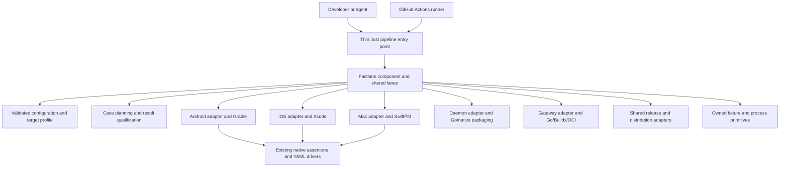
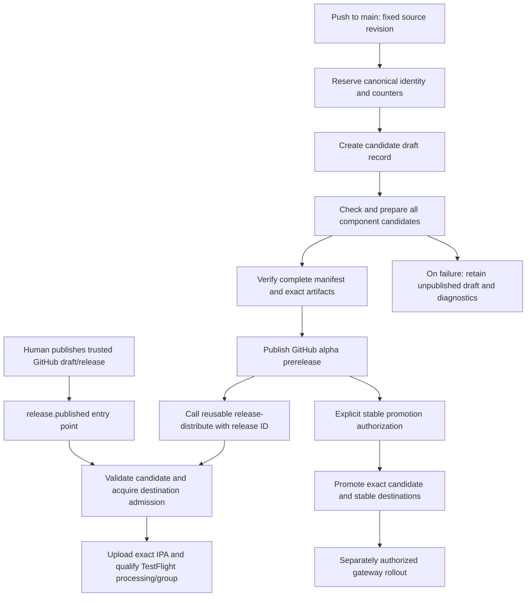

# Fastlane component pipelines and release refactor plan

Status: proposed, 3 October 2026. This document plans a replacement of native app, daemon, gateway, and cross-component release orchestration. It does not install fastlane, change commands, create local configuration, or execute builds, devices, tests, signing, or uploads. All commands, files, and configuration below marked proposed are future interfaces. The accepted direction includes a release candidate for every main revision, published as an alpha GitHub prerelease after qualification, with daemon/gateway artifacts and TestFlight distribution coordinated from that release.

Adopt fastlane for Android, iOS, and macOS builds, local tests, CI tests, device lifecycle, signing, and release preparation, and for shared daemon/gateway build-test-package orchestration. Preserve the existing native assertions and YAML case catalog while moving ownership of execution from the Go E2E runner and large Just recipes into fastlane lanes. Provide named local profiles for the Android emulator, a physical Android device, iPhone and iPad simulators, physical iOS devices, and the Mac desktop. Go, Docker Buildx, Sigstore/OCI tooling, and reviewed deployment controls retain their specialized implementations.

This is a larger refactor than adding a Fastfile around `just e2e run`. The final architecture must remove the old platform run loops and duplicated lifecycle orchestration. Dieter-specific fixtures, exact result qualification, and native platform tools remain necessary components underneath fastlane.

The final state has no component pipeline implementation in Just and no standalone build/test/release launchers under `scripts`. Just remains a small optional command facade. Fastlane composes reusable pipeline stages and component adapters; GitHub Actions selects resources and composes those same pipelines through reusable workflows. Temporary compatibility delegates have explicit deletion gates. A retained script requires a specific technical justification and named ownership, rather than being preserved merely because it already exists. Gateway deployment/recovery is an independently supported operational boundary; release publication does not deploy a live gateway or update an operator daemon.

## Goals and constraints

The outcome is one component pipeline implementation used locally and in CI, with explicit target selection, visible progress, reusable build products, isolated test data, and trustworthy results. A contributor should configure their machine once, then run the same app lane against an emulator or real device by changing its profile. Daemon/gateway profiles declare host/target architecture and packaging capabilities without device admission.

The change must preserve the following behavior:

- One canonical SemVer and source revision across gateway, daemon, and native release artifacts. Native build counters remain platform-specific.
- The running operator daemon, app data, device credentials, other checkouts, and unrelated processes are preserved. Integration uses disposable daemon/gateway state and mock agents.
- A required case passes only when every selected native method or Mac phase assertion passes exactly once. Missing, skipped, duplicate, failed, interrupted, and unavailable required results fail the gate.
- Leases cover each actual device, the Mac desktop, canonical Apple build products, shared framework publication, and mutable Android build products. Ownership is verified before cleanup.
- Existing Android hardware renderer, snapshot, boot, and graceful shutdown rules remain intact. Existing operator simulators are preserved.
- Credentials stay out of argv, logs, public plans, and uploaded artifacts. Private XCTest launch configuration and raw result bundles have separate retention rules.
- Process output, waits, execution deadlines, artifact extraction, and cleanup are bounded. Cancellation waits for owned children before releasing resources.
- No test run installs over, stops, restarts, or replaces the operator daemon. Raw daemon data planes stay loopback-only.

Fastlane is the orchestration tool. Gradle, SwiftPM, Xcode, ADB, simctl, XCTest, Compose instrumentation, Apple signing tools, and Dieter's fixture implementations continue to do their specialized work. Changing the orchestration tool does not eliminate compilation or native UI test execution time.

## Current repository baseline

These findings describe the working tree inspected for this plan, including ongoing native build and test improvements. Rebase the implementation inventory against the current tree before deleting or moving code.

| Area | Current implementation | Migration implication |
| --- | --- | --- |
| Public commands | `just/android.just`, `just/ios.just`, `just/mac.just`, `just/core.just`, `just/e2e.just` | Remove these app modules after cutover; retain one thin `just app` facade. |
| E2E execution | `tools/e2e/main.go`, `runner.go`, `android.go`, `ios.go`, `mac.go` | Move case execution, setup ordering, build decisions, and teardown sequencing to fastlane adapters. |
| Case contracts | `tests/e2e/cases`, `schema.json`, Go catalog/reference validation and affected-case selection | Keep one catalog and its strict contract. Extract the reusable compiler and validators. |
| Native cases | 52 Android, 10 Mac, 8 iOS YAML files | These are catalog-file counts, not executed-test counts. Preserve case IDs and inventories during migration. |
| Android tests | JVM tests; isolated `.e2e` and `.e2e.performance` app/test APKs; `FlowTest` and explicit native methods | Keep assertions, private plan transfer, dedicated package IDs, and APK/install fingerprints. |
| Android targets | Exact ADB serial; named visible AVD; physical Android already supported | Make these named profiles and move emulator lifecycle into the app pipeline. |
| iOS tests | Build once; one owned simulator per run; fresh fixtures and app containers per case; private xctestrun; structured xcresult qualification | Port this behavior before enabling physical iOS. Existing simulator support is real execution, not preparation-only. |
| Physical iOS | Explicitly rejected by the current runner; `build-device` only compiles an unsigned app | Requires new signing, app identities, fixture connectivity, test setup, and hardware qualification. |
| Mac tests | SwiftPM unit tests and packaged-app smoke suites with phase-qualified checks; YAML navigation flow | Keep the Swift assertions and phase protocol. `scan` does not replace these SwiftPM and packaged-app tests. |
| Shared client core | Gradle JVM/native tests, Kotlin XCFramework assembly, Swift bridge integration | Express these in shared lanes; retain the actual core tests and platform slice rules. |
| Resource coordination | Device/desktop leases and Apple build/framework publication leases, including `scripts/native_build_lock.py` | Interoperate with old entry points during migration; replace ownership only after parity. |
| CI | Changed-component filtering, Mac native gates, iOS quick build gate, Android compile/unit/lint gate, manual native E2E workflow | Keep stable check names and describe separately which jobs actually execute UI tests. |
| Releases | Main release derives SemVer; Android APK and Mac app preparation; separate manually entered iOS version | Add a common release identity input to every app lane, including iOS. |
| Daemon | Go package tests, native capture/runtime checks, Linux distribution smoke, macOS signed installer and archive | Move composition out of `just/daemon.just`; preserve target-native qualification, helper/runtime contents, signatures, and installer behavior. |
| Gateway | Go/security tests; amd64/arm64 builds; Buildx images; signed OCI deployment bundles; real gateway/TURN integration | Move build/test/distribution composition out of `just/gateway.just`; preserve deployment trust, immutable digests, and recovery controls. |
| GitHub release policy | Every main push currently publishes a regular release, prunes to two releases, and updates the Homebrew tap; TestFlight is a separate manual workflow | Keep every main revision eligible for release, switch to draft assembly then alpha publication, connect TestFlight to that exact release, and separate stable channels/retention. |

The current iOS workflow does not make simulator UI testing a normal PR gate: `ios_quick` runs portable tests and compilation, and the stable `ios` job qualifies that job. The separate Native E2E workflow runs iPhone/iPad simulator journeys. Android's ordinary CI job also does not execute its entire device catalog. The migration must make test coverage explicit instead of calling a build-only job an E2E pass.

The concurrent [native build and test investigation](native-build-test-investigation-2026-10-03.md) records simulator reuse, lease, cache, and readiness fixes. Its observed iPhone runs fell from 25m 39s to 15m 29s after changes, with different source and host conditions. Treat those as investigation evidence, not a controlled benchmark or a fastlane speed forecast. Preserve the improvements and measure new cold and warm runs independently.

## Architecture and ownership

The proposed command path is:



GitHub Actions owns runner selection, matrix scheduling, toolchain installation, caches, secret injection, artifact transport, protected release environments, and job dependencies. Fastlane owns component pipeline ordering and execution on that runner. Just provides command discovery and the existing single-invocation workflow contract. Lanes never call their public Just wrappers back recursively. Add concrete daemon and gateway adapters alongside the native platform adapters; share stages and artifact contracts rather than pretending server binaries are mobile platforms.

Fastlane's shared pipeline owns stage ordering, dependency resolution, admission, evidence publication, and cleanup. Platform adapters implement target admission, build preparation, installation, native invocation, packaging, and signing. Fixture providers implement bounded setup/control/teardown, and distribution adapters implement upload/promotion. The shared E2E stage owns the case loop; platform adapters do not copy that loop. Shared helpers implement common mechanics, with concrete reviewed implementations rather than an arbitrary plugin framework.

Keep two narrowly scoped Go tools, extracted from tested existing code:

| Proposed component | Responsibility | Boundary |
| --- | --- | --- |
| `tools/pipeline-contract` | Catalog lint/list/plan, reference coverage, affected-work planning, native result qualification, artifact/release identity validation, atomic JSON/JUnit output | No build, device launch, installation, fixture lifecycle, or pipeline execution loop. |
| `tools/pipeline-support` | Exact process ownership, cross-process leases, fixture readiness/control, private configuration transfer, bounded artifact extraction, recovery journals | Receives individual typed requests. Does not choose suites, schedule stages/cases, discover release versions, or run builds internally. |

Share portable implementation through a small Go package such as `internal/pipeline`. Extract fixture service implementations from `scripts/isolated-gateway` and `scripts/screens-fixture` into owned packages and thin fixture binaries under `tools/fixtures`; preserve their service behavior and regression coverage. Keep native capture helpers and app-side test drivers near their subsystem. Do not duplicate service logic in Ruby or introduce an alternative mock backend.

Fastlane adapters may call pipeline-support for an individual operation, but the shared pipeline controls its sequencing. An opaque `run-entire-suite` helper would recreate the old runner and does not satisfy this plan. A temporary lane calling the existing runner is allowed only as a migration bridge with an explicit removal work package.

Proposed repository layout:

```text
Gemfile
Gemfile.lock
.ruby-version
fastlane/
  Fastfile
  config.json                 # tracked portable defaults and CI profiles
  config.schema.json
  local.example.json          # tracked local configuration template
  local.json                  # ignored per-machine override
  lanes/                      # thin shared and platform lane declarations
  lib/dieter/pipeline/        # stage composition, context, typed requests
  lib/dieter/platforms/       # android, ios, mac implementations
  lib/dieter/components/      # daemon/gateway build, test, packaging adapters
  lib/dieter/fixtures/        # fixture adapters using portable service tools
  lib/dieter/distribution/    # GitHub, TestFlight, OCI, Homebrew, future Play
  spec/                       # orchestration tests with fake native tools
tools/pipeline-contract/
tools/pipeline-support/
tools/fixtures/               # isolated gateway and screen fixture entry points
internal/pipeline/
tests/e2e/                    # existing catalog, schema, native driver contract
docs/app-pipelines.md          # future operational guide
docs/releases.md               # future channel, trust, delivery, recovery guide
just/pipeline.just            # future thin component/release command facade
just/app.just                 # optional native-command discovery alias
```

Move reusable script algorithms into tested pipeline/platform libraries or a compiled portable support tool. Delete their standalone launchers after parity; simply moving shell scripts into `fastlane` does not meet the architecture. Native subsystem build tools, the public installer, and generated-code tooling may remain when they have an independently supported consumer and no app workflow sequencing. Record each retained exception and its caller in the migration inventory.

### Shared pipeline contracts

Use a small fixed set of stage contracts, composed by thin lanes. The pipeline resolves selected stages and their prerequisites; stage implementations execute real work. Avoid a configurable arbitrary task graph or executable hooks in JSON/YAML.

| Contract | Input and output | Extension boundary |
| --- | --- | --- |
| `PipelineRequest` | Operation, platform, profile, source/release identity, case selection, artifact references, validated options | The same request semantics locally and in GitHub Actions. |
| `RunContext` | Resolved configuration, run identity, resource handles, phase deadlines, private workspace, evidence sink | One lifecycle/cancellation implementation, shared by every lane. |
| `Target` | Exact identity, kind, capabilities, toolchain, ownership | Add a named profile for an existing target kind; review code for a new kind. |
| `BuildRequest` and `ArtifactSet` | Configuration, architectures, product IDs, inputs; immutable product hashes and metadata | Platform build adapters; no caller assumes a platform-specific output path. |
| `TestPlan` and `Qualification` | Expected cases/methods/checks and capabilities; exact outcomes, cleanup, provenance | Existing catalog compiler and shared case loop; native assertions remain native. |
| `ReleaseCandidate` | Canonical identity, ArtifactSet, qualification references, package/signature/notarization verification | Connect testing and release preparation without reconstructing artifacts in workflow shell. |
| `PublishRequest` and `PublicationReceipt` | Exact candidate hashes, destination/channel, explicit authorization; remote IDs/state | Destination adapters handle publishing; build/test stages never publish implicitly. |

The reusable stages are configuration/planning, preparation, build, test, qualification, candidate preparation, candidate verification, and publication. Platform-specific ordering inside candidate preparation handles cases such as signing a Mac bundle before archiving, or signing an Android APK during Gradle assembly. Do not impose an incorrect universal package-then-sign order.

Define named compositions such as `unit`, `build`, `e2e`, `verify`, `release_candidate`, and `publish`. A lane declares a composition and invokes the pipeline once. Existing stage outputs satisfy later stages only when their identities and hashes match; a failed stage blocks dependents and still runs bounded cleanup/report finalization. Keep stages individually exercisable through fake native tools and contract fixtures.

Extension points are typed component/platform, fixture, target, and distribution adapters. They expose capabilities and implement shared operations; public lane callers do not branch on Android/iOS/Mac/daemon/gateway details. Avoid one giant Fastfile, copied per-component setup, and abstract classes that contain nothing but forwarding methods. Add abstraction only around behavior shared by actual consumers, while keeping these stable contracts ready for future release destinations.

## Public command and lane contract

The proposed general entry point is `just pipeline`, forwarding positional argv to `bundle exec fastlane`. Keep `just app` as a native-command discovery alias to that same facade, not another implementation. Direct Bundler invocation is equivalent. Keep `just check-changed` as the normal affected-check planner, with component commands routed through this facade.

Use `mac` as fastlane's platform name and `ios`/`android` for the mobile platforms. Shared-core and catalog lanes are unscoped. Examples below describe the final interface; they are not currently available.

```sh
just app config_init
just app doctor
just app catalog action:lint
just app catalog action:plan platform:android suite:functional changed:true base:main

just app core_test
just app core_apple_test
just app android test_unit
just app android build configuration:debug
just app android e2e profile:android-emulator suite:smoke
just app android e2e profile:android-device suite:functional
just app android e2e profile:android-emulator cases:machines.telemetry
just app android device_start profile:android-emulator
just app android device_status profile:android-emulator
just app android device_stop profile:android-emulator

just app ios test_unit
just app ios build profile:ios-iphone configuration:debug
just app ios e2e profile:ios-iphone suite:smoke
just app ios e2e profile:ios-ipad suite:smoke
just app ios e2e profile:ios-device suite:smoke
just app ios install profile:ios-device artifact:PATH

just app mac test_unit
just app mac e2e profile:mac-desktop suite:smoke
just app mac build configuration:release
just app mac run profile:mac-desktop
just app mac quit profile:mac-desktop

just app android release identity:PATH
just app ios archive identity:PATH
just app ios beta identity:PATH artifact:PATH upload:true
just app mac release identity:PATH

just pipeline component_test component:daemon profile:linux-amd64
just pipeline component_test component:gateway profile:linux-amd64
just pipeline component_candidate component:daemon profile:darwin-arm64 identity:PATH
just pipeline component_candidate component:gateway profile:linux-arm64 identity:PATH
just pipeline release_assemble identity:PATH artifacts:PATH
just pipeline release_publish candidate:PATH destination:github channel:alpha
just pipeline release_distribute candidate:PATH destination:testflight channel:alpha
just pipeline release_promote candidate:PATH channel:stable authorization:PATH
```

| Lane group | Contract |
| --- | --- |
| `config_init`, `doctor` | Create a local override only on explicit request; inventory and validation are read-only. Report missing targets and toolchains without launching them. |
| `catalog` | Lint, list, and plan without device admission or builds. Record why cases were selected or excluded. |
| `test_unit`, `core_test`, `core_apple_test` | Preserve complete module tests and relevant bridge tests. Accept validated native filters where appropriate. Do not request a device for a unit-only lane. |
| `build`, `prepare_tests` | Produce validated artifacts plus build identity metadata; no installation or publishing. Build-for-testing is separate from archive/export. |
| `install`, `run`, `quit` | Explicit target and exact artifact/process identity. Developer app state is preserved; installing an operator app is separate from isolated E2E installation. |
| `device_status`, `device_start`, `device_stop` | Local target lifecycle with leases, checked readiness, recorded ownership, and exact cleanup. Physical devices are never booted, erased, or shut down. |
| `e2e` | Plan, admit target, prepare products once, execute cases with fresh isolation, export evidence, qualify exact required results, and clean up. Defaults to smoke; performance and manual cases stay explicit. |
| `screens` | Explicit specialization of E2E for capture/codec/input qualification; preserve synthetic, real-capture, and hardware evidence distinctions. |
| `release`, `archive`, `beta` | Consume release identity; sign and validate artifacts; upload/distribution is a separately explicit action. |

Provide offline help with parameter names, defaults, allowed values, effects, prerequisites, outputs, and concrete examples. Reject unknown parameters and incompatible combinations. `profile`, explicit target overrides, and platform must agree; never silently ignore a serial or UDID. Physical targets require an explicit profile even when a default physical profile exists locally.

`ios test_unit` runs the macOS-portable iOS policy tests. UIKit/app-hosted adapter and credential tests still need an iOS destination and run through the corresponding catalog cases. Label these separately in help and CI so the unit lane cannot be mistaken for native device coverage.

Legacy Just commands become temporary delegates during migration. Final component-related Just content is a single positional-argv `pipeline` recipe/module and thin `app` discovery alias, plus top-level `check-changed`/portable-check entry points where needed. Delete `just/android.just`, `just/ios.just`, `just/mac.just`, `just/core.just`, and `just/e2e.just`, their root module imports, and obsolete aliases after cutover. Move daemon/gateway build, test, packaging, and release compositions out of `just/daemon.just`, `just/gateway.just`, and `just/release.just`, deleting those modules when remaining independently supported operational entries have a documented thin entry point. Move formatting/proto/branding/check compositions into appropriate tooling stages as well. Just must contain no component toolchain/environment selection, resource locks, device logic, build/test sequencing, signing, packaging, release version derivation, or artifact discovery. Product daemon service management and gateway deployment/recovery retain their supported operational interfaces and safeguards.

## Local configuration and template

Use strict JSON so configuration is data rather than executable Ruby or shell. `fastlane/config.json` contains portable defaults and explicit CI profiles. `fastlane/local.json` overrides machine paths and named local targets. Commit `fastlane/local.example.json` and its schema; never commit an actual machine override.

This local file contains development toolchain and device choices. It is not Dieter application metadata, account state, enrollment, credentials, or a replacement for `DIETER_HOME`.

The proposed example template is:

```json
{
  "schema_version": 1,
  "toolchains": {
    "java_home": "/Applications/Android Studio.app/Contents/jbr/Contents/Home",
    "android_sdk": "~/Library/Android/sdk",
    "developer_dir": "/Applications/Xcode.app/Contents/Developer",
    "swift_jobs": 2
  },
  "defaults": {
    "android_profile": "android-emulator",
    "ios_profile": "ios-iphone",
    "mac_profile": "mac-desktop",
    "suite": "smoke"
  },
  "profiles": {
    "android-emulator": {
      "platform": "android",
      "kind": "emulator",
      "enabled": true,
      "serial": "emulator-5554",
      "avd": "Pixel_9_API_37_1",
      "lifecycle": "manage-if-started",
      "visible": true,
      "renderer": "host"
    },
    "android-device": {
      "platform": "android",
      "kind": "device",
      "enabled": false,
      "serial": null,
      "lifecycle": "borrow"
    },
    "ios-iphone": {
      "platform": "ios",
      "kind": "simulator",
      "enabled": true,
      "layout": "iphone",
      "device_type": "com.apple.CoreSimulator.SimDeviceType.iPhone-17-Pro",
      "runtime": null,
      "lifecycle": "disposable"
    },
    "ios-ipad": {
      "platform": "ios",
      "kind": "simulator",
      "enabled": true,
      "layout": "ipad",
      "device_type": "com.apple.CoreSimulator.SimDeviceType.iPad-Pro-11-inch-M5",
      "runtime": null,
      "lifecycle": "disposable"
    },
    "ios-device": {
      "platform": "ios",
      "kind": "device",
      "enabled": false,
      "layout": "iphone",
      "udid": null,
      "lifecycle": "borrow",
      "signing": "ios-development",
      "fixture_route": "ios-local-network"
    },
    "mac-desktop": {
      "platform": "mac",
      "kind": "desktop",
      "enabled": true,
      "lifecycle": "exclusive-test-app"
    }
  },
  "signing": {
    "android-release": {
      "keystore_file": null,
      "keystore_password_env": "DIETER_ANDROID_KEYSTORE_PASSWORD",
      "key_alias_env": "DIETER_ANDROID_KEY_ALIAS",
      "key_password_env": "DIETER_ANDROID_KEY_PASSWORD"
    },
    "ios-development": {
      "team_id": null,
      "app_bundle_id": "com.dbpprt.dieter.ios.e2e",
      "share_bundle_id": "com.dbpprt.dieter.ios.e2e.share",
      "app_group_id": "group.com.dbpprt.dieter.ios.e2e",
      "provisioning_mode": "existing-local"
    },
    "ios-distribution": {
      "certificate_file": null,
      "certificate_password_env": "IOS_DISTRIBUTION_CERTIFICATE_PASSWORD",
      "app_profile_file": null,
      "share_profile_file": null,
      "api_key_file": null,
      "api_key_id_env": "IOS_APP_STORE_CONNECT_KEY_ID",
      "api_issuer_id_env": "IOS_APP_STORE_CONNECT_ISSUER_ID"
    },
    "mac-release": {
      "certificate_file": null,
      "certificate_password_env": "CERTIFICATE_PASSWORD",
      "notary_key_file": null,
      "notary_key_id_env": "NOTARY_KEY_ID",
      "notary_issuer_id_env": "NOTARY_ISSUER_ID"
    }
  },
  "fixture_routes": {
    "ios-local-network": {
      "kind": "authenticated-tls-proxy",
      "enabled": false,
      "host_address": null,
      "certificate_file": null,
      "private_key_file": null
    }
  }
}
```

The physical target, team, network, and runtime fields are intentionally unresolved. `config_init` reads inventory, lets the developer select exact identities, and creates this override with mode 0600 using an atomic write. It preserves an existing file and never silently chooses an attached phone or registers an Apple device. Enabling a requested profile with unresolved required fields fails before building. Disabled unused profiles may retain placeholders. Runtime selection resolves an installed identifier into the file; every execution and CI profile then uses that exact identifier rather than continually choosing the latest installed runtime.

This example enumerates the six personal native-device profiles. The tracked config/schema also defines daemon/gateway host profiles with component, host/target OS and architecture, native-execution requirements, Go toolchain, capture/runtime capabilities, and reviewed OCI preparation mode. Allow only machine-path/toolchain overrides locally; publication channels, trusted destinations, signer identities, tester groups and promotion/deployment environment policies come from reviewed tracked policy and injected credentials. They cannot be overridden by a local JSON file or a free-form workflow input.

Add a second physical iOS/iPad or Android profile by copying the typed profile with a different name and exact identity. Profiles are extensible data; adding a platform adapter or fixture kind is reviewed code.

Configuration resolution has explicit rules:

1. Load and validate the tracked defaults.
2. Locally, merge an optional override by profile name; replace arrays, reject unknown keys, duplicate JSON keys, invalid types, and unsupported versions. Resolve paths relative to the repository, with only leading `~/` expansion. No expressions or arbitrary environment expansion.
3. Apply an allowlist of existing toolchain environment variables such as `JAVA_HOME`, `ANDROID_HOME`/`ANDROID_SDK_ROOT`, and `DEVELOPER_DIR`. Report conflicting values. During migration, legacy target variables may resolve a profile only if their identities agree; later remove these target aliases from agent instructions.
4. Explicit lane options select a profile and validated operation options. A conflicting target override is an error, not a hidden profile rewrite.
5. In CI, ignore `local.json` unconditionally. Use committed CI profiles plus allowlisted workflow inputs. Record CI overrides in the sanitized resolved plan.

Secrets are references to environment variables or explicit external private files, never plaintext JSON values. Signing password/private-key environment overrides are not included in public resolved configuration. CI maps its current secret names to these logical signing inputs. Validate full configuration structure, then validate runtime prerequisites only for the requested operation; unused unresolved signing profiles cannot block a unit lane. Unit tests and emulator tests remain usable without release credentials. Separate physical iOS development signing from App Store Connect distribution signing. Do not allow fastlane's implicit dotenv discovery or action-specific environment defaults to override target, reset, retry, or release policy; set these options explicitly and test that ambient variables cannot bypass the configuration contract.

Proposed `.gitignore` additions, applied during implementation:

```gitignore
# Native app pipeline machine configuration and private run state
/fastlane/local.json
/fastlane/.env
/fastlane/.env.*
!/fastlane/.env.example
/fastlane/private/
/fastlane/report.xml
/fastlane/test_output/
/vendor/bundle/
/.bundle/
*.p8
```

The existing `/tmp/`, `.jks`, `.keystore`, `.p12`, and `.mobileprovision` rules continue to apply. Keep `local.example.json`, `config.json`, schemas, Gemfile, and lockfile tracked. Add a repository test verifying that local and private paths are ignored while templates and schemas remain visible. Do not create or add the developer's real configuration as part of this planning task.

## Device lifecycle and concurrency

Define lifecycle semantics centrally and apply them in build/install/test commands, compatibility aliases, and native helpers. An already-running target is borrowed even when its profile allows launch. Only an explicit device-management lane may create a persistent managed session; an E2E run closes targets it started when its profile requires that behavior.

| Target | Admission and setup | Cleanup |
| --- | --- | --- |
| Android emulator | Exact console serial and matching AVD; reuse a healthy existing instance or start the selected AVD; complete checked boot and renderer verification | Close only an emulator started by this operation, or a recorded managed session explicitly selected for stop; preserve userdata and perform checked snapshot shutdown. |
| Physical Android | Exact authorized/unlocked serial; validate API, architecture, instrumentation, and fixture reachability | Stop/reset only owned E2E packages, remove only owned port reverses; preserve the phone and production app. |
| Disposable iOS simulator | Exact installed runtime and device type; one run-owned simulator per suite; fresh fixture and test container per case | Delete only its exact recorded UUID after evidence export; recover only verifiable owned orphan journals. |
| Borrowed iOS simulator | Optional later profile kind using an explicit UUID and separate E2E identities; validate exact runtime/type | Preserve simulator lifecycle and all unrelated apps/data. No blanket reset or uninstall. |
| Physical iPhone or iPad | Exact paired/trusted UDID, Developer Mode, device support, development provisioning, unlocked destination, authenticated reachable fixture | Remove only run-private state and stop owned test runners/apps; preserve production IDs, photos, settings, and device lifecycle. |
| Mac desktop | Logged-in interactive session; required permissions; exact process inventory; refuse conflicting DieterMac processes before build and test | Quit and await only the exact app/fixture processes owned by the run; preserve all unrelated processes. |

Retain Android's visible local emulator behavior, host GLES selection, no-wipe rules, snapshot restoration and explicit checked snapshot save, boot deadline, launcher accessibility/hierarchy readiness, and full screenshot verification. Do not replace these checks with a generic boot flag. Existing external AVD paths stay valid; do not rewrite their registry or move their data.

Audit the current stop recipe's package quiescence while porting it. Snapshot saving must stop only apps the workflow owns; do not carry broad production-app or Chrome stops into E2E cleanup. Record any browser/app launched for a test and preserve unrelated foreground sessions. Persistent managed emulator sessions need a supervisor and verified ownership journal rather than an untracked detached shell or a recreated `screen` launch.

Local developer profiles keep visible emulators. CI profiles are separate. Initially use the already provisioned healthy visible emulator on self-hosted runners. A future disposable hosted/headless emulator profile needs explicit qualification of renderer, lifecycle, and suite suitability; it cannot become a hidden local fallback. CI provisioning is a separate administrative operation, not a test lane side effect.

The run context records owner PID, device identity, created process identities, resources, fixture handles, private paths, and cleanup obligations. Machine-level lease/recovery state belongs in private OS temporary storage, keyed by canonical checkout/resource identity; run evidence goes under ignored repository scratch output. No daemon metadata is written into the repo.

Acquire resources in a documented global order: host desktop/simulator resource, exact target resource, checkout build resource, Apple build resource, framework publication resource. Release build-only leases when products can safely be reused; keep the Apple lease while tests consume mutable canonical products. Nested operations inherit verified ownership without independently reacquiring the same lease. Fastlane and old direct recipes must use interoperable locks during migration.

Different Android devices may execute concurrently after shared build preparation. Do not hold a checkout-wide execution lease for the entire Android run. The initial Apple implementation retains current conservative shared-product and host leases; safe parallel Apple execution requires independently identified immutable products and measured memory headroom. These are test resource bounds, not caps on Dieter agent conversations.

Cancellation handling must be proved with tests, including SIGINT, SIGTERM, timed-out grandchildren, and a killed owner. Ruby `ensure` handles normal failure but cannot recover SIGKILL; exact ownership journals handle later admission. Never sweep simulators/processes by name prefix, delete busy locks, use `killall`, or stop an unrelated Gradle daemon. Collect sanitized diagnostics before any bounded escalation on an exact owned PID.

Resolve one concrete process/lease session mechanism in package 2. A short-lived helper that exits immediately after acquiring a lock cannot hold ownership across later Fastlane actions. Use a run-scoped live helper/lease handle or inheritable file descriptors with verified owner identity, and supervise the pipeline's native child groups through completion. Prove built-in Gradle/scan actions obey the deadline/cancellation contract; use the shared exact-argv action when their defaults cannot do so. Do not rely on a marker environment variable alone as evidence that a resource is still held.

## Builds and caches

Fastlane's build adapter returns an artifact manifest with platform, configuration, architecture, source/input digest, release identity, toolchain versions, app/test IDs, artifact paths and hashes, and expected native test targets. Test execution validates it before reuse. Use a genuine versioned artifact format; keep its version independent from Dieter's canonical release SemVer.

| Pipeline | Native engine and policy |
| --- | --- |
| Android unit/build/lint | Fastlane `gradle` using the checked-in Gradle wrapper and exact project directory; preserve debug, E2E, performance, and release variants. |
| Android device E2E | Build app/test APK pairs once per needed variant, install on one exact serial, then run exact instrumentation selections with private plans. Generic `connectedAndroidTest` must not discover every connected device. |
| iOS simulator tests | Build shared macOS/simulator framework slices and Xcode test products once; `run_tests`/`scan` consumes a private xctestrun and explicit destination with exact methods. |
| iOS device tests | Build required device framework slice and development-signed E2E app/test products; exact physical destination; separate cache/product identity from simulator builds. |
| iOS release | `build_app`/`gym` archives/exports the release scheme with explicit export options, app/Share profiles, canonical version, and validation. |
| Mac unit/build | Invoke SwiftPM with canonical app/test scratch paths, pinned resolved dependencies, compiler options, and existing safe bundle assembly. |
| Mac E2E | Build the packaged debug app once and invoke existing native smoke/flow protocols through the Mac adapter. |
| Core JVM/native/bridge | Checked-in core Gradle wrapper, XCFramework preparation, and the Swift bridge tests; each required group runs once. |

Keep `apps/mac/.build/dieter-local`, `apps/mac/.build/dieter-tests`, the canonical iOS DerivedData path, and the shared framework publication rules. Move the implementation from standalone build/framework scripts into platform/build libraries and portable hashing/publication primitives. Do not introduce per-run scratch paths for routine incremental builds. Include platform/architecture/configuration in product validation so device and simulator products cannot be mixed.

Preserve production-source/schema/toolchain hashes, slice superset retention, identical framework bytes/timestamps, and framework publication leases. A documentation-only change must not replace a framework or rebuild APKs. A native assertion change may rebuild its test bundle; a YAML flow change should reuse unchanged Android APKs. A source, schema, toolchain, signing, or release identity change must invalidate the relevant products.

Current debug/release frameworks share a publication location and legitimately force relinks when switching configuration. Splitting publications is an optional separate work package touching SwiftPM/Xcode references; fastlane migration alone does not solve it. Likewise, do not enable Gradle configuration caching until Dieter's custom native tasks pass its compatibility checks.

Prove unchanged second-run behavior with task/build logs and artifact hashes, recording framework preparation, native compilation, fixture build, install, setup, execution, export, and cleanup separately. Use a controlled source/toolchain/device state for comparisons; do not announce a speedup based on an unrelated host run.

## Migration of the existing E2E tests

Keep all YAML IDs, suite memberships, components, fixtures, native method selections, flow steps, and Mac phase assertions at the initial boundary. Preserve schema version 1 for unchanged documents. Add target capabilities as an additive catalog field where backward-compatible; bump the contract only if its meaning actually changes, update app-side consumers, and never add historical Dieter API branches.

Move the existing catalog, schema/reference linting, affected-case selection, and exact qualification into pipeline-contract. Selection should remain conservative for shared/unclassified inputs, renames, deletions, and shared-core production changes. Fastlane consumes a sanitized immutable plan and iterates its cases. Neither CI nor Ruby maintains a second list of expected methods or selected tests.

Capability metadata is host planning data. An additive proposed field can describe it without changing the existing assertions:

```yaml
requires:
  device_kinds: [emulator, device]
  host_features: [macos-capture]
```

Use platform-appropriate kinds and validate the field in `tests/e2e/schema.json` and the compiler. Existing iOS `devices: [iphone]` continues to mean layout eligibility, not physical-device selection. The compiler emits a host plan containing these requirements and a native driver projection that omits host-only fields; old and new orchestration use the same compiler during transition. Do not break strict app-side decoders by blindly forwarding new planning metadata in the existing version 1 private payload.

An explicit changed-only plan with genuinely no affected cases may complete as `not-required`, with the selection reason recorded and no claim of executed tests. A required suite that becomes empty because its device or capabilities are unavailable fails. This distinction preserves useful incremental checks without hiding unavailable coverage.

An E2E run has a fixed lifecycle:

1. Resolve configuration/profile and compile the case plan; validate target compatibility before building.
2. Create a fresh evidence directory and publish the sanitized plan and run admission record.
3. Acquire resources, verify the target, and prepare/validate build products once per required variant.
4. For each case, establish fresh fixture and app state, transfer private launch configuration, and invoke exactly the selected native entry points under the case deadline.
5. Export structured results and sanitized evidence even when execution failed.
6. Qualify every required method, flow completion, Mac phase/check, and specialized screen artifact.
7. Clean up the case with a separate bounded context. Stop further cases after interruption or cleanup failure and account for every remaining case as interrupted.
8. Perform target/run cleanup, then atomically finalize JSON/JUnit. Cleanup failure prevents a green run.

### Android assertions and flows

Keep `FlowTest.runFlow`, the Compose flow interpreter, the native classes/methods, and the separate `com.dbpprt.dieter.e2e` packages. Preserve `build: performance` and its emulator-only eligibility during migration. Do not rewrite codecs, offline queues, background sync, or performance assertions into Ruby or shell.

Use fastlane's Gradle action for APK preparation. Execute instrumentation through a tested exact-argv action/helper, always supplying `adb -s SERIAL`. Fastlane's generic `adb` string action is insufficient for private credential transfer and process/result guarantees unless wrapped with the same tested contract.

Preserve the private `files/plan.json` path, `run-as` transfer, fixture seeding, `--no-rebind` port ownership, captures, flow events, and instrumentation result parser. Tokens cannot enter instrumentation argv. Reset only the leased E2E package per case; preserve installed APK reuse, the operator package, and incompatible-install safeguards.

### iOS XCTest

Keep `DieterIOSNativeTests`, `DieterIOSUITests`, `IOSCredentialNativeTests`, `IOSCoreAdapterTests`, and `RemoteNodeUITests`. Generate `only_testing` directly from `native.target`, class, and methods in the case plan.

Prototype `run_tests` with the existing private xctestrun injection, product relocation, exact destination, build-for-testing reuse, structured xcresult tree, and attachment export. Set simulator reset/force-quit off, parallel testing off for the existing mutable products, automatic failure retries to zero, and output-xctestrun off. Keep raw results in a private temporary directory; only sanitized exports are artifact candidates.

Fastlane reporting is additional diagnostics. The existing exact xcresult qualifier remains the authority. Some native tests call `XCTSkip` for unavailable fixture inputs; a required skipped method still fails qualification.

Current iOS orchestration retries one selected launch/destination/handshake failure. Classify these before migration: simulator infrastructure failures may retain one explicit bounded retry within the original case deadline, with both attempt identities recorded. A screen assertion or partial mutating test cannot be silently rerun to manufacture a pass. Remove broad test retries; mark an executed assertion that only passes after retry as flaky and failing for required gates. Test the resulting policy, documenting any deliberate behavioral change from the old adapter.

### Mac native smoke and flows

Retain app-side debug smoke flags and assertion reports, YAML native-accessibility navigation, and exact phase-qualified checks. Sidebar prepare/verify and terminal create/resume require different app launches and shared per-case state; preserve their phase sequence and await exact process exit before relaunch.

The shared pipeline's Mac adapter runs `swift test` for unit tests, then the packaged executable for E2E. `run_tests`/`scan` targets Xcode schemes and does not automatically run this SwiftPM app's smoke protocol. Retain stopped-app checks before compilation and packaging, canonical caches, desktop leases, isolated preferences, offline triggers, and native report readiness as library operations; remove their standalone script launchers after parity.

### Screen and specialized qualification

Extract fixture preparation into a shared screen action using current capture/native helpers and `scripts/screens-fixture`. Keep authenticated random fixture endpoints, synthetic/default mode, opt-in real capture/input into the owned target, codec modes, frame/latency evidence, and screen postconditions.

Move the fixture entry point into `tools/fixtures` during the resource/fixture extraction, and move its build ordering into the preparation stage. Preserve the native subsystem implementation and fixture protocol. Update core JVM/native fixture launchers, Swift integration tests, all test references, CI selectors, and documentation together so no hidden consumer remains on the deleted scripts path.

Android screen cases currently require a macOS capture host, even when the Android device itself is attached. A Linux Android runner cannot pass these by wrapping them in fastlane. Provide a Mac-attached Android screen profile initially; a later remote capture host needs a separately authenticated bounded interface and explicit qualification. Mac companion multi-client execution remains unavailable until implemented; do not change an unavailable capability into a skip.

Preserve specialized native Mac screen checks and physical Android qualification fixtures. Audit `scripts/qualify_screens.py` and its device package isolation before integrating it as a specialized lane; keep its measurement protocol and evidence distinct from ordinary smoke results.

## Physical iOS support

Treat physical iOS as a required implementation work package, not an assumed fastlane capability. Xcode can execute tests against a physical destination, but Dieter's current fixtures and identities need adaptation.

### Development signing and app isolation

Add a dedicated E2E scheme/configuration, proposed as `DieterIOSE2E`, with its own app ID, Share extension ID, App Group, native test host, and XCTest runner identities. Ensure imported frameworks and entitlements match. Update tests that hardcode the production bundle ID to consume generated test configuration. A borrowed simulator may use these identities as well; existing disposable simulators can keep their current setup until that migration passes.

Provision the exact physical UDIDs for development testing and validate Developer Mode, trust/pairing, device support, unlocked state, and all target signing before building. Support existing local development identities by default; CI uses explicit managed test identities/profiles. Automatic Apple account changes or device registration require a separate explicit setup operation. Do not reuse App Store distribution profiles for development XCTest.

Validate signing for the app, extension, embedded frameworks, app-hosted test bundle, and XCTest runner. Preserve production installations, Keychain items, App Groups, photos, and account credentials. Keychain tests retain unique service/account IDs with owned teardown; fixtures use ephemeral memory credentials.

### Reachable fixtures and controls

The current iOS tests use `http://127.0.0.1:PORT`, a host filesystem offline-trigger file, and loopback screen descriptors. Those do not work unchanged from a phone. ADB reverse solves Android fixture access; it is not an iOS transport.

Implement an explicit authenticated TLS fixture proxy on a selected reachable host address. Keep the raw fixture daemon and its existing local gateway listener loopback-only. The proxy forwards only approved fixture routes, authenticates every request with run-scoped credentials, has bounded requests/lifetime, and shuts down with its owner. Clients validate the configured certificate through a test-only pinned trust path or a pretrusted test certificate. Never disable verification globally or expose an insecure development gateway on all interfaces.

The first supported physical topology is USB pairing for device control plus the device and Mac sharing a reachable local network for the TLS fixture. Wired-only hosts without an established reachable network remain unavailable; do not assume an unsupported reverse tunnel. Choose a certificate whose identity matches the configured host address, handle ATS and local-network permissions explicitly, and record a credential-free route description.

Introduce a small fixture control abstraction usable from native tests. Replace host-file offline triggers with an authenticated run-scoped offline/online control operation while preserving the same user-facing connection assertions. The host can still translate that request into its existing file trigger internally. This control channel belongs only to disposable test fixtures, not the public Dieter daemon API. If later product RPCs are added, follow the full proto/server/CLI parity requirements.

Update screen signaling descriptors to carry a reachable authenticated route. Prove WebRTC media reachability separately: an HTTPS proxy forwards signaling, not UDP media. Qualify direct ICE candidates or dedicated disposable TURN credentials using the existing TURN fixtures. Never borrow production TURN/provider credentials implicitly.

The share-extension test currently inserts an image with simctl. Add physical-device setup that uses a fixture-owned test media mechanism or a reviewed native share source, tracks the precise inserted item, and removes only that item. Avoid automating a broad Photos cleanup. Handle first-use permission prompts explicitly, preserving the user's existing choices.

### Capability matrix

Add declarative target eligibility for device kind, layout, host requirements, and specialized hardware. Separate unsupported case selection from failed execution. A plan must name excluded cases and why; explicitly requesting an incompatible case is an error. A lane requesting a capability that cannot be provided fails unavailable instead of returning a successful empty run.

| Group | Android emulator | Physical Android | iOS simulator | Physical iOS | Mac desktop |
| --- | --- | --- | --- | --- | --- |
| Existing functional native/flow cases | Preserve | Preserve compatible exact-device execution | Preserve phone/tablet plans | Qualify existing methods after identity/fixture adaptation | Preserve |
| Keychain/device storage | Existing Android coverage | Device coverage | Existing iOS native methods | Development-signed isolated methods | Existing relevant native tests |
| Screen/codec/input | Requires qualified capture host | Requires host and hardware evidence | Existing native synthetic fixture | Reachable signaling/media and permission qualification | Existing specialized suites |
| Share extension | Not applicable | Not applicable | Current phone-specific journey | New isolated media/share setup; phone/tablet eligibility declared | Not applicable |
| Performance | Preserve emulator-only catalog rule | Separate qualified physical benchmark cases | No automatic equivalence to hardware timing | Explicit future hardware measurements | Existing isolated performance mode |

Physical iPhone and physical iPad qualification are distinct matrix cells. The current phone-specific share journey remains excluded from iPad plans unless a tablet implementation is added. Do not promise identical case counts across targets where capabilities differ.

## Daemon and gateway adapters

Extend the same component stages to the daemon/CLI and gateway. Fastlane invokes Go and native packaging tools through reviewed exact-argv operations; GitHub Actions owns the OS/architecture matrix. These adapters produce the same ArtifactSet, Qualification, and ReleaseCandidate contracts as the apps. Do not duplicate a second release engine in Go, Just, or workflow shell.

| Component | Preserved checks and products | Adapter boundary |
| --- | --- | --- |
| Daemon/CLI | Affected/full Go tests, CLI help/RPC parity, isolated local/direct-TLS/relay routes, harness runtime tests, Linux screen/capture tests, static Linux archives, distribution smoke, macOS capture helper and signed/notarized package/archive | Test/build/package operations invoke the actual tools; resource admission and reusable stages remain shared. Include capture/runtime files in the manifest and execute packaged products on their supported target hosts. |
| Gateway | Go/security tests, vulnerability checks, deployment regression tests, real gateway/TURN integration, Linux amd64/arm64 binaries, multiarch container images, immutable OCI deployment bundle and signed manifest/lock | Keep Buildx, OCI/Sigstore verification, and deployment protocols. Extract release coordination from existing launchers into the adapter and reusable distribution operations. |

The Linux daemon matrix remains target-native where runtime qualification requires it; cross-compilation alone does not qualify arm64 execution, native capture, or distro compatibility. The macOS daemon shares reviewed signing/keychain/notarization primitives with the Mac app but keeps its own package contents and runtime checks. The gateway image and deployment bundle bind to the same canonical SemVer and source revision as its archived binaries; verify multiarch child digests and the bundle's locked image digest.

Separate gateway candidate preparation from publication. Build and inspect an OCI image layout locally or in private CI storage, validate the bundle, and record digests before making the release visible. If the existing signing/bundle protocol requires registry-backed preparation, publish immutable candidate digests to a candidate namespace with restricted publication permissions; this is an explicit registry mutation, not a supposedly read-only build. Verify final destination digests after transport. Never rebuild images to create a channel alias, or use a mutable alpha/latest tag as the deployment identity.

Gateway rollout is an independent operational workflow consuming a verified release/digest: trust verification, configuration validation, protected environment, rollout, health/compatibility checks, and existing recovery controls. Publication of an alpha release does not roll out a gateway, alter production compatibility floors, or install/update/restart a live daemon. Keep supported host deployment/recovery entry points usable without Ruby; reviewed Python/Go service libraries can retain those independently supported callers. The Fastlane adapter consumes their library/primitive interface and must not delegate to a complete legacy release launcher.

The fixture providers used by app E2E remain disposable daemon/gateway instances. Release build/test operations never interact with the running operator service, its enrollment, or its central data.

## Reporting and diagnostics

Use one evidence directory per invocation, proposed as `tmp/app-pipelines/<run-id>/`. It contains the sanitized resolved plan, artifact identity, results.json, junit.xml, per-case console/events/captures, and cleanup outcome. CI uploads that exact run directory, not a glob covering previous runs.

Retain current statuses and extend metadata deliberately: selected target/profile, resolved runtime and toolchains, source revision/digests, selected/excluded case reason, expected/executed method inventory, preparation/install/setup/execution/export/cleanup time, retry attempts, and resource ownership outcome. Preserve version 1 report compatibility while possible; version the format if the semantic contract changes.

Generate all required case results even when admission, build, or cancellation fails. Unavailable required cases must appear as failures in JUnit, not green skipped entries. A zero native exit code cannot override incomplete assertions; a failing native process cannot be overridden by passing report fragments.

Emit credential-free progress at least every 30 seconds with current phase and elapsed/deadline information. Surface bounded sanitized tool output where it is useful; keep raw launch configuration, certificate material, enrollment tokens, and sensitive xcresult content private. Use `ensure`/finally plus recovery journals so failed invocations still produce reports.

Continue limits on extracted artifact bytes/counts, regular files, traversal, links, truncation, and malicious result content. Screenshots/attachments may expose fixture launch context; define and test their retention allowlist rather than uploading an entire result bundle. Artifacts persist until reviewed; ordinary test completion does not delete public evidence.

## Local and CI test policy

The same lane implementation runs in both environments. CI changes the profile and credentials, not which assertions count as passing. Provisioning checks are read-only during ordinary tests; separate setup commands install SDKs/runtimes or prepare runner resources when explicitly requested.

| Trigger | Proposed required work | Infrastructure |
| --- | --- | --- |
| Local affected changes | `check-changed` selects complete affected unit/core checks and relevant case plans; developer target profiles determine execution | Borrow current devices where allowed; manage only owned lifecycle. |
| PR Android | Unit tests, lint, all required APK compilation, catalog/pipeline contracts; smoke or affected functional E2E on a provisioned emulator | Dedicated self-hosted emulator initially; no silent claim that hosted build/lint is device execution. |
| PR iOS | Portable/unit/core adapter checks, build-for-testing, iPhone simulator smoke; stable aggregate client status | Qualified pinned hosted macOS simulator or dedicated Mac runner. |
| PR Mac | Unit/core/format/schema/build checks and existing required native core/board cases | Qualified interactive desktop; maintain stable branch-protection names. |
| Scheduled or manual full native | Android functional/sync/sdk plus explicit performance/screens; iPhone/iPad compatible functional; full Mac smoke | Capability-specific runner pools and committed profiles. |
| Physical devices | Explicit manual and scheduled hardware qualification with exact serial/UDID profiles | Dedicated self-hosted USB/device hosts; no automatic selection of a developer phone. |
| PR daemon/gateway | Affected Go/dependency tests, CLI/RPC contracts, packaging/security/deployment checks where affected | Isolated fixtures and target-qualified runner profiles; no publishing credentials. |
| Main release | Every pushed main HEAD gets a canonical candidate identity and complete required component candidate matrix; draft assembly, verified alpha publication, then TestFlight delivery | Trusted release runners, explicit alpha environments, no affected-file shortcut that omits a component. |
| Stable promotion | Verify the chosen complete candidate, required qualification and receipts, promote its exact artifacts, then update authorized stable destinations | Protected approval/policy boundary and explicit release ID; no rebuild. |

Enabling new mandatory device gates depends on an available qualified runner pool. First migrate existing gates without weakening them; enable Android PR device tests and iOS simulator PR gates after repeatable qualification. Do not block all PRs on an unprovisioned runner or mark an unexecuted test green. During transition, check descriptions explicitly state build-only coverage where that is all that runs.

CI setup pins Ruby and Bundler in addition to Go, Node, Java, Android SDK, Xcode, and Just. Commit Gemfile.lock, use Bundler caching keyed by runtime/lockfile, and disable fastlane update checks/telemetry in CI through documented settings. An initial candidate is fastlane 2.240.1 with a supported pinned Ruby; validate against Xcode 26.5 before choosing final pins. Do not rely on macOS system Ruby or an unpinned global fastlane.

PR jobs receive no distribution credentials. Physical test signing credentials are separate from release signing. Trusted upload/notarization jobs retain explicit environment and authorization gates. Alpha publication and internal TestFlight delivery from trusted main are an explicitly configured automatic path; stable promotion, external tester rollout, and gateway deployment use their separately configured protected environments. CI cancellation must execute owned cleanup and later journal recovery; `cancel-in-progress` cannot justify broad process termination.

Preserve the current single-Just-invocation workflow contract while moving its validation out of the large `just/release.just` recipe into portable pipeline contract checks. Execution steps use `just pipeline ...` or its `just app ...` alias; the facade only forwards argv. Native Actions handle checkout, setup, caches, artifacts, and environment admission. CI profiles specify exact device identity/type and runtime; device discovery verifies availability, not target selection. Map stable CI aggregate results to actual lanes and include test matrix cells in the aggregate dependencies when they become required.

Port `scripts/check_changed.py` and its regression tests into the portable affected-work planner exposed by pipeline-contract, then delete the standalone script. `just check-changed` delegates to that planner/executor boundary; app/daemon/gateway work is represented as typed lane requests, and remaining portable checks have explicit request types. Keep the planning step read-only. Shared orchestration changes select pipeline contract tests and relevant component qualification; component-specific adapter changes select that component; examples/docs select configuration or documentation validation only as appropriate. Preserve reverse Go dependency and conservative shared-core rules, avoid duplicate bridge executions, and preserve `--dry-run`, `--base`, rename/delete, and `--ci` outputs. PR/affected selection does not prune the main release candidate matrix. Do not add a second Ruby/CI implementation of affected-file mapping.

### Reusable GitHub Actions workflows

Prepare GitHub Actions for extension from the outset. Top-level event workflows declare policy and call reusable workflows; reusable workflows accept the validated pipeline request and invoke the same stages as local commands. They do not own another copy of build/test/signing logic.

| Proposed reusable unit | Responsibility | Stable interface |
| --- | --- | --- |
| `.github/actions/setup-pipeline` | Pin/setup Ruby/Bundler and the selected component's Go/Node/Java/Android/Xcode/OCI prerequisites; restore reviewed caches | Component and committed toolchain profile; no credentials, device launch, or build. |
| `.github/workflows/component-check.yml` | Execute unit/build/test/verify compositions on a declared runner/profile and upload exact run evidence | Component, profile, selection/suite, source revision, artifact identity references; qualification outputs. |
| `.github/workflows/component-candidate.yml` | Prepare and validate Android/Mac/iOS/daemon/gateway candidates without GitHub publication or tester distribution | Canonical release identity artifact/hash, source revision, qualified inputs; verified candidate artifact/hash; gateway registry preparation is explicitly declared. |
| `.github/workflows/component-publish.yml` | Upload or promote an already verified candidate through a destination adapter | Exact candidate artifact/hash, allowlisted destination/channel, protected environment; publication receipt. |
| `.github/workflows/release-coordinate.yml` | Join complete component candidates, validate/sign the whole-release manifest, assemble draft, publish alpha or promote approved candidate | Release identity, candidate matrix and hashes, qualification references, channel policy; GitHub release ID and durable receipts. |
| `.github/workflows/release-distribute.yml` | Resolve a published GitHub release to its verified candidates and deliver exact artifacts, including TestFlight | Exact GitHub release ID/tag and manifest digest, destination/group policy; per-destination delivery/processing receipts. |
| `.github/workflows/gateway-deploy.yml` | Verify and roll out an explicitly selected gateway bundle using existing operational controls | Protected target environment, exact verified bundle/image digest, rollout and recovery evidence; no build. |

Event workflows call these units for all components. Use matrices only for independently runnable profiles and declare runner requirements explicitly; dynamic profiles cannot select arbitrary runners or publish destinations. A single workflow_call contract validates component/platform/profile/operation enums, source revision, identity/artifact references, and channels. GitHub Actions cannot pass in-process objects between jobs: serialize contracts as bounded artifacts, pass their names/IDs and expected hashes, and validate them after download.

PR checks and manual native qualification use component-check. The main event workflow calls component-candidate for each app and daemon/gateway target, then release-coordinate after all required checks, and release-distribute with the resulting GitHub release ID. A human-published release uses the same release-distribute contract. Preserve one canonical release identity across the matrix. CI runner provisioning and resource availability remain explicit inputs rather than copied setup shell blocks.

Separate validation/candidate jobs from jobs with publishing credentials. Use the existing permission and trusted-environment boundaries, and scope each publication job to its destination. Restore caches only under the established trust boundary; never save private signing/fixture state in a shared cache. Propagate failure and cleanup through reusable workflows, retain evidence on failure, and make branch-protection aggregates depend on the actual required jobs.

Adding Google Play or another tester group/destination means extending a distribution adapter and its reviewed policy, then selecting it in the publish/distribute workflow. Component build/test stages and device lifecycle remain the same. Adding a required hardware profile changes the declared check matrix and its qualification contract, not the underlying orchestration code.

Pin all third-party Actions to full commit SHAs, with version comments and reviewed dependency updates. Define workflow/job timeouts, per-job least permissions, explicit named secrets instead of broad inheritance, environment rules, fork-safe PR execution, and cache trust boundaries. Privileged workflows must not execute arbitrary PR head code through `pull_request_target`. Validate YAML and reusable call contracts with actionlint and isolated event/policy fixtures.

Keep stable branch-protection aggregate names during cutover. Required aggregates fail for failed/canceled/unavailable required jobs; a skipped component is valid only when the affected planner explicitly excludes it from that PR. Main release candidates always include the whole required component matrix. Cache restoration is an optimization, never evidence of test completion or release qualification. Separate pipeline YAML changes from product implementation so their event, permissions, and concurrency behavior can be reviewed.

## Signing and release integration

Fastlane coordinates signing on all platforms. Android's Gradle action builds and signs through the existing Gradle signing configuration and environment inputs. macOS uses existing bundle assembly/codesign plus fastlane notarization. iOS uses Xcode archive/export plus API-key TestFlight upload.

Create a common release identity artifact containing canonical SemVer, source revision, initial candidate channel, release sequence, and native build counters. Preserve the existing numeric release line during engine migration, then move derivation/allocation into the shared release identity component and delete the Just/script derivation entry points. Channel changes use the policy below, not independently derived component versions. All component lanes consume that identity; iOS no longer accepts an unrelated marketing version. A manual TestFlight retry consumes a published release's validated IPA and fixed identity; candidate preparation is a separate operation.

Release artifacts come from an immutable clean source revision. Local development tests can use dirty source, recording its input digests, but cannot satisfy a release gate for a different committed build. A manual upload validates the IPA's hash and embedded version against its artifact manifest and identity; it never uploads a loosely discovered latest file or silently switches the developer's checkout.

| Platform | Release sequence |
| --- | --- |
| Android | Restore dedicated keystore into private storage; validate all signing inputs; Gradle release build; apksigner verification; production package/debuggable/instrumentation/version checks; package APK and release identity. AAB/Play is an extensible later destination. |
| macOS | Shared release framework; safe SwiftPM build/bundle; canonical app version; nested framework/app Developer ID signing; notarize with dedicated API key; staple; codesign/Gatekeeper assessment; archive/extract/reverify. |
| iOS | Shared device release framework; dedicated distribution cert and app/Share profiles; gym archive/export with explicit export options; archive/IPA validation; optional explicit TestFlight upload of the exact validated IPA; bounded processing/distribution qualification. |
| Daemon/CLI | Target-native tests and packaged runtime smoke; Linux static archives with required capture/runtime contents; macOS binary/helper signing, signed installer/package/archive and notarization; embedded identity/contents/signature verification. |
| Gateway | Go/security and deployment/real-transport checks; target archives and multiarch image preparation; verify binary identity, image child digests, locked OCI bundle/manifest/signatures; publish immutable verified products to the selected distribution namespace. |

Keep local build/test signing and trusted release signing distinct. Port private temporary keychains, prior search-list restoration, profile validation, app/extension/App Group checks, secret-safe error summaries, and fail-closed incomplete credential checks. Fastlane actions do not automatically prove equivalence to these helpers.

Test `notarize` Accepted handling and stapling against current regressions before deleting the custom submission launcher. Extract release identity derivation, complete release assembly, checksums/manifest validation, and publication coordination from `just/release.just` into shared pipeline/release libraries. Move daemon packaging and gateway distribution orchestration into their adapters while preserving their tested engine primitives. Temporary engine delegates have deletion gates; daemon/gateway migration is now required scope rather than a permanent imported-artifact boundary.

Make whole-release coordination a named composition, with adapters for all component candidates. It assembles one manifest, validates canonical versions and hashes, performs the existing Sigstore/signature checks, and passes exact artifacts to GitHub/OCI/TestFlight/Homebrew publication adapters. Preserve existing signing/completeness guarantees and deliberately replace regular-main-release, unconditional stable-Homebrew, and two-release-pruning policies with the channel/retention contract below. Port and extend their isolated tests before retiring the Just recipes. Unit/device tests and candidate preparation never publish implicitly; the main release event composition explicitly includes publication and distribution.

The architecture, main alpha policy, and GitHub-release-to-TestFlight path are part of this refactor. Activate them at a reviewed release cutover after signed-candidate parity, credential setup, and runner qualification; this planning task changes no live triggers. Preserve current releases until the equivalent shared composition is ready, then remove temporary delegates without adding a permanent second release implementation.

Publication is separate from building: re-running an upload must not recompile or silently re-sign the candidate. Each destination receives its exact identity/hash and returns a durable CI artifact containing the remote build/release ID and verified state. After a disconnect, inspect the destination before retrying a mutation; handle an already-published identical candidate idempotently, and reject a conflicting artifact under the same release/build identity. Record partial success across destinations and resume only unfinished publications. Platform channels do not provide a cross-store atomic transaction; report each destination's actual upload/processing/distribution state.

Do not adopt `match` as a prerequisite. Existing dedicated credentials work; optional shared certificate storage/renewal is a later decision. Publishing remains an explicit trusted action. Build/sign verification must work with upload disabled; device tests never upload or change tester groups.

Native qualification artifacts consumed by a release must match its source revision, toolchain/build identity, capability matrix, and selected required cases. Do not use an unrelated previous green run. Decide the exact release-required hardware matrix during runner qualification; physical-device coverage can initially be an explicitly reported manual requirement rather than an unavailable automated dependency.

## Main, alpha, GitHub Releases, and TestFlight policy

### Event and channel contract

The default is a published GitHub alpha prerelease for every passing pushed main HEAD, assembled privately as a draft first. A draft-only mode is available for explicitly requested candidate review; it does not upload to TestFlight. Draft is a visibility/lifecycle state, while alpha is a distribution channel; they are not interchangeable settings. Failed required checks keep the candidate incomplete and prevent publication. A main push is never skipped because it only changes documentation, and an older in-flight release is not canceled merely because a newer push arrives.

| Event | Composition and outcome | Distribution policy |
| --- | --- | --- |
| PR | Affected component checks and selected native qualification | No release creation, signing for distribution, registry publishing, or TestFlight upload. |
| Push to main | Allocate fixed identity for that pushed HEAD; run complete required checks/candidates; assemble draft; verify exact assets; publish alpha prerelease; call distribution with its release ID | Publish daemon/gateway/app products; deliver the exact iOS IPA to the configured internal TestFlight alpha group. No stable Homebrew/latest update and no gateway rollout. |
| Manual draft preparation | Same candidate matrix for an allowed immutable main revision, draft-only output | No tester distribution; later publication consumes that candidate unchanged. |
| GitHub release `published` | Resolve release ID/tag and manifest; verify trust/identity/channel/completeness; invoke reusable distribution | Allows manually published drafts and published prereleases/stable releases to use the same exact-artifact path. An unrecognized/manual release lacking a trusted manifest fails closed. |
| Manual distribution retry | Explicit release ID, destination, expected candidate digest | Inspect remote state and resume unfinished delivery; never generate a new version or rebuild. |
| Explicit stable promotion | Protected selection of one qualified published alpha candidate; verify required receipts; remove prerelease designation and promote existing artifacts | Authorized stable Homebrew/install/update destinations; optionally selected TestFlight group. Gateway rollout remains a separate protected operation. |
| Gateway deploy | Explicit environment and verified published gateway digest | Existing operational rollout/health/recovery controls; no build or release creation. |



The existing main trigger publishes after its release gates, not literally every individual commit inside a multi-commit push. Preserve that pushed-HEAD interpretation. Every delivered main push has its own identity/run and candidate record; do not use path filters or release concurrency settings that silently discard intermediate pushes. A failed revision remains visibly failed/draft and can be retried with its original identity.

### Canonical version, alpha labels, and promotion

For the initial rollout, keep a numeric canonical SemVer such as `0.4.412` and tag `v0.4.412` in every binary/app/package. Mark the GitHub release title `Alpha v0.4.412`, set `prerelease: true`, and explicitly disable GitHub's Latest designation. Record `candidate_channel: alpha` in the signed candidate manifest. Alpha is initially a channel label rather than an added `-alpha.N` binary version suffix. This retains the repository's single SemVer invariant, satisfies Apple's numeric marketing-version requirement, and permits stable promotion of the exact tested/signature-verified products without changing embedded versions.

The current iOS release validator requires exactly three numeric marketing-version components and a bounded numeric Apple build number. Allocate the Android versionCode and Apple build number centrally once with the candidate identity; use validated platform limits and monotonic ordering within the App Store Connect app/version. Do not use independent workflow run numbers/attempts, unbounded commit counts, timestamps, or semver suffix stripping that can collide. Persist the allocation and test concurrent pushes, reruns, counter rollover/exhaustion, existing uploaded-build collisions, and out-of-order completion. The metadata/reporting path must identify the same canonical SemVer everywhere.

Reserve release numbers through one ordered identity-allocation authority for this repository, persisting the main source revision, allocation sequence, and native counters in a restricted durable registry. Prefer an immutable lightweight candidate tag plus a signed identity record; the tag target is the exact pushed revision. Use a dedicated pinned GitHub App installation token when tag/release event delivery is required; constrain it to release metadata and required artifact permissions, and ensure tag creation cannot trigger another candidate build. Candidate rebuilds cannot mutate an already reserved identity. Define recovery for a tag created before its identity record, and reject a conflicting source or counter allocation.

Do not depend on the current highest release tag plus a per-workflow counter once channels/reruns/concurrent candidates coexist. Preserve existing version-line policy and existing releases, while making ordering/allocation explicit. Identity allocation has its own short serialization boundary; expensive candidate builds can run concurrently. Do not use a GitHub concurrency group's replaceable pending slot as a durable queue for every main push. Use a queue with recorded admission and drain/retry, or explicitly qualify repository runner/queue settings that preserve every admitted push. Reruns resolve the same stored identity and counters.

Stable promotion changes distribution policy and GitHub's prerelease state, not candidate contents, tag target, native counters, or embedded versions. Keep the original signed candidate manifest immutable and create a separate signed promotion receipt linking its hash and release ID to the approved stable channel. Stable selection is explicit, not whichever alpha completes last. Only advance stable Latest/Homebrew after all required stable-publication checks pass; an interrupted promotion is tracked and resumed. A later decision to introduce SemVer prerelease suffixes would need a separate Apple/version/compatibility design and cannot silently replace this contract.

### Shared event path and GitHub token behavior

Top-level `release.yml` remains the main-push/manual event entry point. It calls component-check/candidate, release-coordinate, then release-distribute through `workflow_call`; it passes the exact published GitHub release ID and manifest hash, not the current branch tip. Refactor `ios-testflight.yml` into a thin `release: types: [published]` plus manual-retry entry point that calls release-distribute, removing its free-form marketing-version/build logic. `gateway-image.yml` becomes a thin compatibility entry point during migration and then delegates to the gateway component/distribution workflows or is removed when all callers migrate.

GitHub suppresses most downstream events caused by a workflow's `GITHUB_TOKEN`. Therefore an automated main publication must explicitly call the reusable distribution workflow in the same job graph rather than assume its new release will wake `ios-testflight.yml`. A human publication or permitted GitHub App token publication can also deliver `release.published`; durable destination deduplication makes the event path and explicit call safe together. Listen to `published`, which covers publishing a draft as a prerelease; do not rely on `prereleased`, draft-created, or edited events as the only trigger.

The privileged release-event workflow uses trusted workflow/pipeline code from the protected default branch and verifies the release's target against the signed manifest, immutable tag, required checks, and allowed ancestry. It never executes arbitrary code selected by a release description or untrusted tag. Artifact download validates exact producer run/artifact ID, repository, source, hashes, and retention, including when a rerun resumes from another producer attempt. There is no `latest IPA`, loose wildcard download, or checkout of moving main for candidate compilation.

Serialize mutable distribution per destination/app where required, and use a durable publication ledger with keys including GitHub release ID, destination, App Store Connect app ID, canonical version, Apple build number, and candidate digest. A release-event run and main workflow racing cannot both upload the same build. GitHub workflow concurrency alone neither establishes idempotency nor guarantees preservation of every pending release. After acquiring admission, inspect existing remote state/receipts before mutating; conflicting identities fail without clobbering.

### Candidate matrix, visibility, and TestFlight delivery

The whole release is incomplete until all required candidates exist: Linux daemon amd64/arm64 archives; signed macOS daemon/helper installer and archive; gateway amd64/arm64 archives, multiarch image and verified signed deployment bundle; Android release APK; signed/notarized Mac app; and signed/validated iOS IPA with app/Share identity. Preserve additional existing release products and qualify changes to the supported matrix explicitly. Missing credentials, SDKs, hardware gates, or signatures fail the required job and block publication; they cannot silently turn a complete release into a subset.

Release coordination creates or reuses the matching draft, attaches the exact allowlisted assets, checks downloaded hashes/embedded identities, signs a whole-release manifest/checksums, and verifies the GitHub asset inventory before flipping to alpha publication. The manifest binds the source, canonical identity, every component/architecture, binary/image/bundle digests, toolchain provenance, qualification IDs, and intended destinations. Large/signing-sensitive XCTest/archive/debug files and raw secrets remain private. Public products include the daemon/gateway archives/bundle, Android APK, and Mac app; iOS installs through TestFlight. Retain the signed IPA as an access-controlled immutable CI artifact with its digest and exact artifact locator bound to the release's manifest.

TestFlight distribution consumes that retained IPA unchanged. Validate its app/Share IDs, canonical marketing version, allocated build number, App Store Connect app identity, signature and hash. Use the dedicated API key and configured internal alpha group. Upload, processing acceptance, and availability to testers are distinct recorded states; export-compliance declarations and required metadata are explicit reviewed inputs. External groups, invitation changes, and beta review are a separately authorized distribution policy, not implicit side effects of an alpha upload. Never skip processing and claim tester availability.

App Store Connect processing has a bounded wait with progress and a resumable pending state. If it exceeds the job deadline, retain the remote upload/build ID and mark delivery pending/unqualified; a later explicit retry or bounded reconciliation workflow inspects that same build without re-uploading. Rejected processing or failed group delivery fails the distribution aggregate. GitHub alpha publication, OCI publication, and TestFlight cannot be atomic: retain verified partial-success receipts and report exact destination states. An alpha may remain published after TestFlight fails; its release notes/status must show that failure and the main delivery check must not be green. Do not delete/recreate the release, rebuild, or bump the Apple counter to hide a delivery error.

Each main candidate must get a visible GitHub draft/failure record once identity allocation succeeds; qualification failures keep it unpublished with a link to the failing run. Publication/processing receipts are stored durably outside short-lived scratch artifacts, with bounded credential-free summaries linked from GitHub release notes. Serialize release-note updates or merge them through the coordinator so concurrent destinations do not overwrite each other's status. Keep the initial content manifest unchanged; supplemental receipts have their own hashes/signatures.

### Updates, environments, retention, and cutover

Alpha releases never become GitHub Latest, stable Homebrew formula/cask updates, default installer/updater candidates, or production gateway image aliases. Stable resolvers must select non-draft/non-prerelease releases and verify their manifests; a numerically higher alpha must not enter a stable update merely through version comparison. Provide an explicit alpha install/download path first. If daemon/client update-channel selection needs a product/API change, plan its full proto/server/CLI/help/native/core coverage separately and retain stable defaults; this pipeline refactor must not smuggle in an unreviewed update RPC or override.

Use committed, allowlisted channel policy: main -> alpha GitHub + immutable gateway OCI products + internal TestFlight; draft -> artifact preparation only; protected stable -> explicit promotion and stable destinations. Alpha environments can admit trusted main automatically once configured. Stable and gateway-production environments require their intended approval/policy boundaries. Separate credentials for signing, GitHub asset publication, OCI upload, TestFlight, Homebrew, and deployment. OIDC identities and verification policies must match the new workflow paths/ref/environment before cutover; changing YAML filenames can otherwise invalidate existing update and bundle trust. Pin the final signer workflow identity and migrate verifiers without loosening branch/source trust.

Replace the current global "keep two newest releases" pruning and unconditional main Homebrew update. Retain stable releases independently; keep at least the latest 20 published alpha releases and all alphas younger than 14 days as an initial reviewed policy. Never prune an explicitly pinned promotion candidate, pending distribution, referenced rollback bundle, or referenced image digest. Failed drafts have a separate bounded diagnostic retention policy. Retain identity allocations and signed receipts after large assets expire; never recycle a tag/build counter or delete a tag to make a rerun appear new. Coordinate OCI and IPA/private artifact retention with references, including TestFlight's independent expiration; unavailable/expired required artifacts block promotion and require a new candidate identity rather than a silent rebuild.

Cut over only after shadow preparation produces complete signed candidates with upload disabled, event/deduplication tests pass, and the full configured release matrix qualifies. Dry-run the alpha channel and TestFlight destination against a controlled trusted release, then switch the main event policy in one reviewed commit. Test publication and trusted events with disposable repository/app resources or explicitly authorized real destinations. Preserve the existing stable release and signatures; rollback disables the new event entry point or reverts the cutover rather than publishing different bytes under an existing release identity.

## Work packages and acceptance gates

Implement as reviewable work packages with temporary compatibility delegates. Keep one authoritative implementation per platform after its cutover. Migration comparison runs execute serially on identical selected targets with fresh fixtures; never run old and new orchestration concurrently against the same resources.

| Work package | Deliverables | Acceptance gate |
| --- | --- | --- |
| 0 Baseline and feasibility | Inventory current changes and every Just/script caller, assign deletion or justified retention, map each case/native method/Mac phase, capture toolchain and cold/warm baselines, prototype scan xctestrun and ownership behavior | Existing source-based contract tests pass; prototype executes one simulator native method with private credentials and bounded cleanup; document any fastlane action incompatibility and the cleanup baseline. |
| 1 Foundation and configuration | Ruby/Bundler pins, lane facade/help, strict schema/defaults/local template, config_init/doctor, ignore rules | Fake inventory tests cover exact selection, disabled placeholders, merge/precedence, invalid/duplicate keys, CI local-file exclusion, secret redaction, and gitignore behavior. No device starts during doctor/plan. |
| 2 Contracts and run resources | Extract catalog/selection/qualification, fixture/process/lease primitives, run manifests/reports; interoperability with old commands | Preserve existing Go regression cases; test timeout/cancel/grandchild/recovery, ownership conflicts, full unavailable reports, cleanup failure, bounded/private artifacts, and no global session cap. |
| 3 Shared builds and unit tests | Shared stage compositions; core JVM/Apple lanes; Android Gradle adapter; Mac SwiftPM/bundle adapter; iOS prepare/build/unit adapter; move build/framework script implementations into libraries | Meaningful existing module checks pass, source/toolchain invalidation works, unchanged second run reuses products, framework slice/timestamp rules and cache separation hold; stages are reused rather than copied between lane/platform implementations. |
| 4 Android lifecycle and E2E | Replace emulator recipes and Android host run loop with target/fixture/native/result adapters; support emulator and exact physical serial | Full compatible Android catalog on emulator; functional subset then full compatible physical matrix; renderer/snapshot checks; current codec/input/offline/sync assertions preserved; operator package/data and lease ownership preserved. |
| 5 iOS simulator E2E | Replace iOS host run loop with scan or exact-argv Xcode action, per-case private config, owned simulator and evidence lifecycle | All seven current iPhone smoke cases and six current iPad smoke cases pass with exact method inventories; full compatible functional plans; recovery/cancel/first-use/media setup and cleanup verified. |
| 6 Mac E2E | Replace packaged-app host run loop; preserve YAML flow and multi-launch smoke protocols | Ten current Mac catalog cases qualify all checks; desktop conflicts fail without mutations; phase relaunch, offline triggers, input and evidence cleanup verified. |
| 7 Physical iOS | Development E2E scheme/IDs/profiles, exact UDID admission, authenticated TLS fixture/control route, reachable WebRTC, owned share-media setup | At least one configured physical iOS device executes its full compatible required plan; qualify additional phone/tablet cells independently before advertising them as supported. Production installation and device data are preserved; network/permissions/signing failures report unavailable; no insecure external listener. |
| 8 Daemon and gateway | Component adapters for tests/builds/packaging; target-native Linux/macOS daemon matrix, capture/runtime products, distro smoke; gateway archive/image/bundle/transport qualification; extraction from Just and launchers | Existing component/runtime/security/deployment checks pass; packaged products execute on qualified hosts; image/bundle/source identities match; operational deploy/recovery remains usable without Ruby; operator services remain untouched. |
| 9 CI and affected checks | Reusable component setup/check/candidate/publish, release-coordinate/distribute and gateway-deploy workflows; runner profiles; stable aggregates; port/delete changed-check script; qualified PR device gates | CI local-file exclusion, affected mapping, full scheduled/manual qualification, exact evidence, cancellation recovery and truthful coverage; SHA pins, least permissions, trusted event inputs, stable aggregate failure tests, no duplicated component sequencing. |
| 10 Signing and candidates | Shared candidate/verify/assemble compositions for all five components; Android/Mac/daemon signing and iOS archive adapters; complete manifest and fixed identity/counters; extract Just/script release logic | Isolated signing/packaging and counter/allocation regressions pass; complete signed candidates verify with publication disabled; canonical identity, exact matrix, private retention and signer trust validate on target runners. |
| 11 Alpha release and delivery | Every-main identity admission; draft-to-alpha publication; exact-release TestFlight; GitHub-token event bridge/deduplication; promotion/receipts; channel-safe Homebrew/update/OCI policy and retention; reviewed live cutover | Two concurrent pushed main revisions are retained; reruns/duplicate release events deliver each identity once; failed checks leave drafts; partial/rejected/pending TestFlight is visible/resumable; alpha cannot reach stable defaults or deploy production; controlled published-release qualification passes. |
| 12 Remove legacy orchestration and document | Delete old platform run loops, component Just orchestration/modules/imports/aliases, standalone pipeline scripts, temporary wrappers and superseded workflow entry points; publish retained inventory; operational docs/AGENTS/skills | One pipeline facade plus thin discovery aliases, zero component workflow logic in Just, zero unexplained launchers, no retired call paths; complete component/device/release qualification, clean-checkout bootstrap, reviewed main cutover and recovery procedures pass. |

Packages 4–6 depend on 1–3; 7 depends on 5 and the resource/fixture contracts; 8 shares the stage/artifact/support contracts from 1–3. CI adoption in 9 can follow each qualified component but its complete gate depends on 4–8. Candidate work in 10 follows build/resource parity and release identity design; 11 depends on 9–10 and configured trusted destinations. Final deletion in 12 follows migrated-path qualification, including cancellation, unavailable behavior, main release event parity, and delivery recovery. Do not end after the wrapper phase.

At every cutover, retain the old implementation in version history rather than a second permanent backend. A temporary explicit migration switch may choose old/new entry points during comparison, but the final system has no fallback that silently reruns the old stack. Revert the specific cutover commit if parity fails; never weaken result qualification to make migration green.

## File migration and deletion map

| Existing code | Proposed disposition |
| --- | --- |
| `tools/e2e/main.go` execution dispatch and Android run loop | Replace with fastlane entry points; move affected-case selection to pipeline-contract. |
| `tools/e2e/runner.go` | Replace the case loop with the shared Ruby run context; port its cancellation/cleanup/report tests. |
| `tools/e2e/android.go`, `ios.go`, `mac.go` | Delete host orchestration after platform qualification. Extract reusable parsers/configuration codecs into contract/support packages before deletion. |
| `tools/e2e/catalog.go`, `references.go`, `result.go`, `qualification.go`, `artifacts.go` | Preserve tested logic in narrowly scoped contract/support packages, updating scope and imports. |
| `tools/e2e/process.go`, `fixture.go`, `screen.go` | Extract ownership/readiness/transport/qualification primitives; move build and suite sequencing to lanes. |
| `tools/e2e/*_test.go` | Move parser/support tests; port orchestration tests to fake-tool lane tests; retain named regression coverage. |
| `just/e2e.just` | Delete the complete module after migration, with root import and aliases. Portable contract checks use their new explicit entry point. |
| Large Android emulator shell recipes | Replace with tested target actions preserving renderer/boot/snapshot semantics; remove screen-based launch dependency after managed-session supervision is qualified. |
| `just/android.just`, `just/ios.just`, `just/mac.just`, `just/core.just` | Delete complete app modules, root imports, and compatibility aliases after their tooling/check/lifecycle compositions move. Keep the shared `just pipeline` facade, thin `just app` alias, and thin portable/check entry points. |
| `just/daemon.just`, `just/gateway.just` | Move component build/test/package/distribution orchestration into adapters; port regression gates. Delete modules/imports after remaining independent operations have thin supported entry points. Preserve host deploy/recover and daemon service operations. |
| `just/release.just` | Move fixed identity/counter allocation, signing setup, complete assembly/validation, checksums, publication/promotion, retention, and Homebrew coordination into shared components; replace policy intentionally, then delete module/imports/delegates. |
| `scripts/native_build_lock.py` | Port lease/publication equality behavior and tests into pipeline-support/internal packages; maintain interoperable locks during cutover, then delete launcher and marker-only admission paths. |
| `scripts/mac_app_lifecycle.py`, `scripts/mac_bundle.py` | Port identity/ownership and safe bundle assembly into the Mac adapter/support libraries; move their regression coverage, then delete standalone scripts. |
| `apps/mac/scripts/build.sh`, `apps/mac/scripts/shared-framework.sh` | Replace build sequencing with platform adapters and shared artifact/publication components; preserve hashes/slices/timestamps/caches, then delete both launchers and callers. |
| `scripts/ios_release.py`, `scripts/macos_notary_submit.py` | Port signing/metadata/private configuration logic into tested release libraries/actions; remove archive/upload/submission launchers entirely after parity. |
| `scripts/source_release_version.sh`, `scripts/configure_apple_signing.py` | Move identity derivation and explicit signing setup/validation into owned pipeline components, retaining input/secret protections and tests; delete entry-point scripts when callers migrate. |
| `scripts/check_changed.py` | Port affected-work selection and tests into pipeline-contract; keep a thin root command facade, delete Python planner/execution launcher. |
| `scripts/isolated-gateway`, `scripts/screens-fixture` | Extract service packages and thin tools/fixtures entry points; preserve protocols/tests and update every KMP/Swift/CLI fixture consumer, then remove old paths. |
| `scripts/mac_ci_desktop.swift`, `scripts/qualify_screens.py` | Integrate desktop preparation and specialized screen qualification as reviewed platform/measurement operations; retain a standalone executable only when its independent consumer and technical necessity are documented. |
| Daemon packaging/signing/runtime-smoke launchers and Homebrew release helpers | Move sequencing into component/distribution adapters; port safe archive/package construction, signatures, installer/update trust, distro/runtime regressions and tap policy; retain only documented independent installer/service primitives. Inventory exact files and callers in package 0. |
| `deploy/gateway/scripts/bundle.py` and related render/verify/recover tools | Separate release/image/OCI orchestration from independently supported host deployment libraries/entry points. Port coordination to adapters, preserve bundle signatures/locked digests and deployment regression/integration tests; do not delete operational recovery merely to eliminate scripts. |
| Native test sources and YAML/schema | Preserve assertions/catalog; modify only required target identity, physical fixture controls, media setup, and explicit capability declarations. |
| `.github/workflows/release.yml` | Thin main-push/manual event policy invoking complete candidate matrix, alpha coordinator and explicit reusable distribution; replace current regular-release/automatic-stable-tap/prune behavior. |
| `.github/workflows/ios-testflight.yml` | Thin published-release/manual-retry entry point sharing release-distribute; remove independent version/counter/build/upload sequencing. |
| `.github/workflows/gateway-image.yml` | Temporary delegate to reviewed gateway candidate/distribution contract, then remove if superseded; never create an independent version or duplicate image build. |
| Remaining `.github/workflows` | Replace repeated component setup/job bodies with reusable workflows and thin event compositions; preserve stable aggregate statuses and actual coverage. |

### Cleanup inventory and enforcement

Package 0 records each component/release recipe/script, its callers, current lines of orchestration, proposed replacement, regression tests, deletion gate, and any independent consumer. Package 12 publishes the final removed/retained inventory and the before/after count of recipes, launchers, and orchestration locations. Do not set an arbitrary percentage target or trade away lifecycle correctness for a smaller file count. The concrete target is one shared component pipeline, one pipeline facade with thin discovery aliases, no duplicate execution stack, and no unexplained retained launcher.

Default to deletion of standalone component/release launchers. An exception must identify why a library/support operation is insufficient, name its independently supported consumer, constrain its boundary, and show its owner/tests. Public installation tools, generated-code tooling, native subsystem tools, and independent gateway deployment/recovery commands are possible exceptions. Component build/test/sign/package/publish sequencing and fixture-suite orchestration belong to pipeline adapters/stages and cannot survive as a second launcher. An operational deploy/recover tool has a separate documented boundary and does not build releases.

Add architecture checks that enforce the facade boundary, banned retired call paths, reviewed script allowlist, workflow single-invocation contract, and import-free app module deletion. Exercise calls with fake tools to catch hidden delegation to old commands. Scope checks to maintained executable sources, allowing historical docs and regression fixture text to describe old paths. Update documentation/skills/core fixture callers in the same cutover so old direct commands cannot bypass the pipeline's ownership rules.

## Agent and contributor instructions

Update root `AGENTS.md`, `README.md`/development docs, component READMEs, the release/deployment guides, `tests/e2e/README.md`, Apple signing documentation, and `.agents/skills/android-emulator/SKILL.md` / `.agents/skills/mac-app/SKILL.md` together when the commands cut over. Update Dieter CLI help/docs/skill whenever supported installer/update/service behavior actually changes. Audit outdated claims in skills against the current runner; some historical guidance still describes iOS as preparation-only although it now executes simulator tests.

Proposed AGENTS.md text to add during implementation:

> Component builds, unit/integration tests, packaging and release preparation use `just pipeline`, which enters the pinned Bundler/fastlane pipeline. Native work may use the thin `just app` alias. Use `just check-changed --dry-run`, then `just check-changed` for affected validation. Do not create another launcher or duplicate fixture/case execution in shell, Ruby, or a workflow.
>
> Just is a thin facade. Put shared execution policy in pipeline stages and component/platform/fixture/distribution behavior in their reviewed adapters. Do not add component workflow logic to Just or a standalone scripts launcher. New GitHub Actions jobs call reusable workflows and the existing validated lane contracts. Retained tools require a documented independent consumer and regression coverage.
>
> Read `docs/app-pipelines.md` before native work. Inspect `just app doctor` and the selected named profile before device execution. Local machine settings live in ignored `fastlane/local.json`; copy the tracked example only through explicit configuration setup. Never commit or print local signing material, private launch configuration, or credentials. CI ignores this local file.
>
> Use an explicit named physical-device profile with its exact serial or UDID. Never choose the first connected device, silently switch to a simulator, erase device data, reset a borrowed simulator, wipe Android userdata, or replace a production installation during E2E. Tests use dedicated packages and disposable authenticated fixtures. Preserve the operator daemon and raw loopback data plane.
>
> Respect device, desktop, Apple build, and framework publication leases. A busy resource is unavailable; inspect its owner rather than deleting locks or killing unrelated processes. Start/stop targets only through the pipeline, preserving its exact ownership and Android renderer/snapshot rules. Never install runtimes/SDKs or register Apple devices as an implicit test side effect.
>
> Use the existing `tests/e2e` catalog and native assertions. Add a case, capability declaration, or reusable fixture/probe when needed. A required missing, skipped, duplicate, interrupted, failed, or unavailable result fails qualification. Read results.json/JUnit and relevant screenshots; tool exit status alone is insufficient. Report unavailable matrix cells honestly.
>
> Launch long builds/tests through the registered background-process tool and collect their final result before replying. Verify readiness for persistent developer sessions. Retain sanitized evidence and close only owned processes/targets. Never stop the operator daemon to make an integration test pass. Uploads, TestFlight distribution, release publication, and real-account operations require the task's explicit authorization and trusted release path.
>
> Read the release/channel guide before workflow or release changes. Trusted main automatically creates complete alpha candidates and distributes a published release's exact iOS artifact through its configured TestFlight policy. Never derive a second component version/build counter, rebuild during publication, infer an artifact from latest/main, or replace bytes under a reserved identity. Resume delivery using the release ID and verified receipts. Alpha must not advance stable Homebrew/updater defaults, compatibility floors, or production gateway rollout. Stable promotion and gateway deployment use their separately authorized protected paths.

This block supplements the existing repository invariants and CLI/proto parity rules. Update skill examples to the same lanes, target semantics, current supported hardware, and evidence paths. Keep low-level recovery procedures documented but outside ordinary commands. Automated agents must not bypass a busy resource through a direct native invocation.

## Verification plan and completion criteria

Validate the refactor's orchestration with fake SDK tools and isolated fixtures before live device runs. Preserve regression coverage for exact native results, required-unavailable JUnit failures, no output reuse, strict YAML references, conservative selection, APK digests, lease interoperability, owned process cancellation, simulator ownership recovery, private xctestrun generation, Mac phase readiness, artifact traversal/bounds, screen postconditions, and framework publication equality.

Add meaningful lane tests for build-once behavior, configuration/target precedence, API-specific signing inputs, per-case isolation, exact physical selection, CI/local parity, cancellation/deadline propagation, full remaining-case accounting, cleanup failures, and secret-free artifacts. Test actual command and result boundaries, not merely whether a lane calls a mocked function.

Add event/policy fixtures for main pushes, draft-only, manually published draft/prerelease, GITHUB_TOKEN suppression, GitHub App/human event delivery, duplicate/racing release events, concurrent identity allocation, reruns, out-of-order completion, unauthorized releases, missing/expired artifacts, tag/source/hash conflicts, and interrupted draft/promotion updates. Assert every admitted main push gets a record without pending-slot replacement, every required candidate is present, and alpha is excluded from stable resolvers. Exercise TestFlight duplicate upload lookup, accepted/pending/rejected processing, group failure, partial OCI/GitHub/TestFlight success, receipt persistence, and guarded retention with fake destination APIs before authorized live qualification.

Live qualification must cover the following configured targets serially where resources overlap:

- Android emulator: current smoke/functional/sync/sdk, explicit performance, and screens with a qualified capture host.
- Physical Android: compatible functional/sync/sdk and screens; keep hardware benchmark cases separate from existing emulator-only performance.
- iPhone and iPad simulators: existing exact compatible case/method plans, fresh per-case state, one owned simulator per run, and absence of owned simulator/process journals after success.
- Physical iPhone and iPad: development-signed isolated apps/test hosts, authenticated fixture/control connectivity, compatible native methods, media/permission handling, and preserved production state.
- Mac: complete catalog including multi-launch and YAML journeys, separate specialized native screen tests, operator-app conflict behavior, and no remaining owned app process.
- Daemon: target-qualified Linux amd64/arm64 archive execution and distro/runtime/capture checks; signed macOS helper/installer/archive and service runtime in disposable state.
- Gateway: amd64/arm64 archives, real gateway/TURN transport, deployment regressions, multiarch digest and signed bundle verification; rollout/recovery only against an explicitly authorized disposable target.
- CI: existing stable checks, qualified new device gates, scheduled/manual matrices, self-hosted cancellation recovery, and release artifact preparation with uploading disabled.
- Release: complete controlled alpha publication, exact-IPA internal TestFlight delivery and processing/group receipts, rerun/event deduplication, draft failure visibility, stable promotion rehearsal and updater/Homebrew/OCI channel isolation.

Review screenshots and relevant structured evidence as well as exit status. A passing semantic test is not proof of clean visual capture; the current iPad screenshot issue must remain visible in the qualification record. Record inaccessible hardware/runner cells as unavailable and keep the related work package incomplete.

The initial required personal-device matrix is the configured physical Android device and at least one configured physical iOS device, alongside the emulator, both existing simulator layouts, and Mac. An additional physical iPad or second phone is an extensibility target: implement the typed profile/capability path, but mark that particular hardware cell unqualified until it is available and exercised. Do not require the developer to acquire extra hardware to complete the initial migration or imply a phone result establishes tablet coverage.

## Extension rules

Add an ordinary journey by extending the existing YAML catalog and native driver/probe as needed. Add a new machine/device by defining a profile of a supported kind. Add a suite by catalog membership rather than a new runner. Add a distribution destination as a separate explicit lane consuming the existing validated artifact manifest. Each new fixture kind implements bounded start/readiness/control/cleanup primitives and has native assertions plus unavailable behavior tests. A new adapter must declare its capabilities, target admission, result contract, ownership, and qualification matrix before being selected by CI.

Keep shared rules in the Kotlin client core and native assertions beside the app/platform code they exercise. Fastlane must not become a home for product business rules or replace the application's real transport/client behavior with test-only Ruby mocks.

The refactor is complete when all supported component/target profiles execute the shared compositions locally and in reusable CI workflows; existing cases retain their assertions; physical iOS and daemon/gateway products are qualified; canonical identity/counters cover every component; local configuration/template/ignore works; agents use the new instructions; and legacy execution loops, component Just orchestration, standalone launchers and superseded workflows are deleted. Every admitted main push has its fixed candidate and draft/alpha outcome, GitHub release-linked TestFlight delivers exact candidates with durable resumable receipts, alpha cannot advance stable destinations, and promotion/deployment are separate qualified paths. Candidate/publication contracts support adding destinations without duplicate stages. No permanent wrapping of `go run ./tools/e2e run`, old Just recipes, or standalone orchestration scripts counts as completion.

Host-support and catalog commands are development tooling, not new Dieter operational CLI operations. Keep normal project/card/device-service operations on the supported authenticated `dieter` API/CLI. Any actual native-client product operation added during implementation still requires the repository's proto/server/Connect/CLI/help and route coverage; do not treat this tooling refactor as an exemption.

## Decisions and risks to resolve during implementation

| Decision or risk | Planned resolution |
| --- | --- |
| Fastlane scan may not preserve private logs, process deadlines, or all xctestrun behavior by default | Prototype in package 0. Configure it explicitly; if needed, use a small custom exact-argv Xcode action within the same Fastlane iOS adapter. Do not retain a second suite runner. |
| Physical iOS fixture reachability and trust are new infrastructure | Use the explicit authenticated TLS route and native control abstraction; qualify signaling and media independently. |
| Local emulator ownership can be lost on abrupt exit | Introduce exact ownership journals and managed-session supervision; preserve current no-wipe snapshot checks. |
| Multiple entry points can bypass locks during transition | Keep interoperable resource locks and direct primitive guards; test old/new mixed entry points before deletion. |
| New PR UI gates need runner capacity | Qualify and provision each pool before making its gate required; keep coverage descriptions truthful throughout. |
| Scope can grow into a second framework | Keep one Fastlane case loop, existing native drivers/catalog, and narrowly scoped support primitives; reject duplicate scheduling/fixture logic. |
| Ruby dependency and action upgrades can change behavior | Pin and lock versions; run pipeline contract tests and affected platform qualification on upgrades. |
| Better orchestration may not improve native execution cost | Measure controlled cold/warm phase costs, preserve cache fixes, and handle configuration-specific framework publications as a separate measured change. |
| Hardware/layout differences alter eligible cases | Require declarative selection reasons, exact explicit-case errors, and independently qualified phone/tablet/hardware matrices. |
| Main alpha releases can leak into stable updates through numeric version ordering | Explicit channel-aware release selection, stable resolver regression tests, no alpha Latest/Homebrew/production aliases, and canonical numeric identities for unchanged artifact promotion. |
| Automatic release publication may not deliver GitHub release events | Explicit reusable distribution call plus published-release entry point, trusted code/artifact validation and durable destination deduplication. |
| GitHub concurrency can discard pending pushes; stores can complete out of order | Durable identity/admission records and queue/drain policy, immutable per-source allocation, remote-state reconciliation, ordered stable/alpha alias advancement where used. |
| App Store Connect processing, build limits and artifact expiry differ from GitHub | Central bounded counter allocation, exact retained IPA, processing/group receipts and reconciliation, guarded retention, new identity when required bytes are unavailable. |
| Refactored workflow paths break existing Sigstore/update trust | Inventory verifier allowlists, pin canonical signing workflow/ref/environment, and qualify offline signature/update/bundle verification before live cutover. |

## Sources and inspection limits

Repository sources: [current native test guide](../tests/e2e/README.md), [Go E2E runner](../tools/e2e/), [Just app modules](../just/), [native workflows](../.github/workflows/), [shared core guide](../apps/core/README.md), [Apple signing guide](apple-release-signing.md), [native build investigation](native-build-test-investigation-2026-10-03.md), [Android lifecycle skill](../.agents/skills/android-emulator/SKILL.md), and [Mac lifecycle skill](../.agents/skills/mac-app/SKILL.md).

Additional inspected release sources: [main release workflow](../.github/workflows/release.yml), [current TestFlight workflow](../.github/workflows/ios-testflight.yml), [gateway distribution workflow](../.github/workflows/gateway-image.yml), [release recipes](../just/release.just), [daemon recipes](../just/daemon.just), [gateway recipes](../just/gateway.just), and [iOS version/signing validator](../scripts/ios_release.py). Relevant GitHub references for implementation qualification: [events and release publication](https://docs.github.com/en/actions/reference/workflows-and-actions/events-that-trigger-workflows#release), [GITHUB_TOKEN event suppression](https://docs.github.com/en/actions/how-tos/writing-workflows/choosing-when-your-workflow-runs/triggering-a-workflow#triggering-a-workflow-from-a-workflow), [workflow concurrency](https://docs.github.com/en/actions/how-tos/writing-workflows/choosing-when-your-workflow-runs/control-the-concurrency-of-workflows-and-jobs), and [reuse workflows](https://docs.github.com/en/actions/how-tos/reuse-automations/reuse-workflows). Recheck current platform behavior during the event-policy prototype; no live release-event or store-upload experiment was performed for this plan.

Upstream sources: [fastlane build_app](https://docs.fastlane.tools/actions/build_app/), [run_tests](https://docs.fastlane.tools/actions/run_tests/), [Gradle](https://docs.fastlane.tools/actions/gradle/), [notarize](https://docs.fastlane.tools/actions/notarize/), [TestFlight](https://docs.fastlane.tools/actions/upload_to_testflight/), [App Store Connect API keys](https://docs.fastlane.tools/app-store-connect-api/), [Bundler setup](https://docs.fastlane.tools/getting-started/ios/setup/), and [published fastlane 2.240.1](https://github.com/fastlane/fastlane/releases/tag/2.240.1). The relevant run_tests/Gradle/notarize options were inspected in upstream source. Their availability does not establish compatibility with Dieter's native products.

This plan uses source inspection and the existing investigation's reported evidence. It does not claim to have executed fastlane, exercised physical iOS, tested runner provisioning, or benchmarked the proposed migration. Exact local serials/UDIDs, runtime identifiers, signing teams, private paths, and network routes belong in the developer's later local configuration; no such private values were added here.
