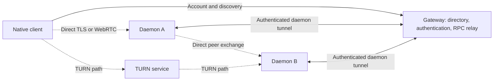

# Gateway administration in Dieter for Mac

Assessment and handoff · 22 September 2026

## Recommendation

Add a **Gateway Admin** destination in the Mac app for explicitly configured
numeric GitHub user IDs. Start with read-only gateway health, account and machine
inventory, a connection canvas, and measured gateway relay traffic. Extend the
canvas with endpoint-reported direct connections and optional TURN telemetry in
a second increment.

The gateway can support a useful first release without collecting project or
conversation data. It cannot currently describe all intermachine traffic:
direct TLS, direct WebRTC, and TURN media do not traverse its relay handler.
An advertised route is not an active connection, and an online machine is not
necessarily exchanging data with another machine.

This handoff prepares the requested sequence:

1. [Backend implementation plan](gateway-admin-implementation-plan-2026-09-22.md)
   — authorization, API, measurement semantics, limits, integration and tests.
2. [Design team brief](gateway-admin-design-brief-2026-09-22.md)
   — screens, canvas behavior, data fields, example states and deliverables.
3. Implement the Mac interface against the returned wireframes and the agreed
   API. The backend foundation can proceed before visual design is complete.

This is a source assessment of working tree `32c8de01` plus existing local
changes. It does not claim to have inspected production configuration, current
users, deployed capacity, or live traffic. No gateway or app code is changed by
this handoff; no wireframes have yet been supplied.

## What exists today

“Stored” means a current record, not a historical series or an admin API.
Existing gateway directory and quota APIs are scoped to the caller's account.

| Information | Current location and availability | Useful admin presentation / limitation |
| --- | --- | --- |
| Account identity | Gateway sessions and daemon records contain numeric GitHub ID and login. `GetAccount` exposes the caller. Login admission uses `DIETER_GITHUB_ALLOWED_USER_IDS`. | User ID, last-known login, allowed status, machine count. No independent complete user directory, signup timeline, email directory, or last-login audit. An allowed ID may never have signed in. |
| Admin identity | No admin configuration, role, or admin RPC exists. | Add a separate server-side admin ID allowlist. Being allowed to sign in must not imply admin. |
| Native sessions | Token hash, GitHub ID, login, created and expiry timestamps in gateway auth state; expired records are pruned. | Aggregate unexpired-session count and expiry distribution are derivable. They are not counts of connected clients. Tokens, hashes and pending OAuth material must never be returned. |
| Enrollment | Temporary enrollment records contain the name and public key, approval and expiry timestamps, consumption state, and resulting daemon ID. | Pending/expiring counts; machine enrollment date and certificate expiry can be derived. Temporary records are not a durable enrollment history. Do not expose user codes, secrets or approval tokens. |
| Machine inventory | Stored ID, name, owning GitHub ID/login, creation time, generation, revocation state, certificate, release/API versions and last-seen time. Public `Daemon` omits some of these. | Fleet and account tables, machine inspector, version/contract mismatches, revoked filter. Existing `ListDaemons` excludes revoked machines. |
| Live gateway presence | Hub has authenticated links and last received activity; lease is 60 seconds. Daemons normally heartbeat every 20 seconds. | “Gateway connected,” last activity and disconnected. Do not label this proof that every direct route or app operation works. Persisted last-seen is updated by presence writes, not every received frame. |
| Advertised direct routes | Stored candidate ID, host, port, network, priority, certificate identity. `ResolveDaemonRoute` also exposes current relay and control-WebRTC availability to the owner. | Candidate count and transport capabilities. Reachability, selected path and RTT are not measured by advertising a candidate. Keep addresses out of the default cross-account view. |
| Screen availability | Coarse remote-desktop presence: platform, helper version, ready/reason and active-session boolean. | Capability/status indicators; no display inventory, live viewer count, quality or traffic from this presence record. |
| Gateway build and health | Release/API version, source revision and build time in directory responses and `/healthz`. Health returns static liveness information. | Build identity and reachable status. It is not a database, OAuth, TURN, backup or certificate-renewal readiness check. |
| Relay activity | Hub holds live stream maps and bounded queues. Relay knows authenticated account, target daemon, RPC method, payload lengths and completion status while handling calls. | Add gauges, byte counters, error categories and durations. Current queue byte counts measure buffered memory, not transferred bytes; there is no traffic series/admin feed. |
| Source of a relayed call | Daemon peer proof identifies its source daemon during authentication, but `Principal` retains only account ID/login. Native sessions identify an account, not an enrolled source machine. | Preserve verified principal kind/source daemon for future attribution. Never infer the origin machine from account membership, an IP address, or an unverified request field. |
| Provider quotas | Gateway stores normalized provider accounts/sources/preferences and snapshots: windows, reset times, availability/freshness, optional balances and display email. | Service freshness/error counts are useful. Keep account-specific quota amounts and email in the existing owner view by default; these are not gateway traffic, invoice cost, or task token totals. |
| Machine CPU, RAM, disk, GPU and network | Existing daemon `MachineInformation` API and Mac machine popover; collected on the host, not uploaded to gateway. Network rates are host-wide. | Already useful in the owner workspace. Host NIC traffic cannot identify Dieter traffic or a machine-to-machine edge. Do not upload process lists or active-agent details for this feature. |
| Selected control connection | Daemon `ControlConnection` has session, state, expiry, selected direct/TURN mode and candidate types. Mac/CLI also know their own selected route. | Can seed endpoint reporting, but there is no gateway-wide connection inventory or byte accounting. SDP is present in the existing response and must not enter admin telemetry. |
| Peer synchronization | Daemon `PeerStoreStatus` records last successful exchange, peer and route. Peer sync rotates through online peers; it is not a persistent full mesh. | Endpoint instrumentation can report recent exchanges and failures. Existing last-success status cannot produce a full graph or prove convergence of every replica. |
| Screen performance | Rich session statistics remain on daemon/viewer: bitrate, timing, loss/recovery and distinct RTP byte counters. | Optional future aggregate media telemetry. RTP counts exclude SRTP/RTCP/ICE/IP/TURN overhead and cannot be called billed network bytes. |
| TURN and deployment operations | Deployment tooling configures coturn, Caddy/HAProxy, certificate management, backup and recovery checks. Gateway issues short-lived TURN credentials. | No gateway API currently imports TURN allocation/traffic counters or backup/certificate status. Configuration and credential issuance do not prove TURN usage or health. |

## What the connection canvas can honestly show

The diagram describes possible paths, not a discovered live network. A gateway
relay flow A → gateway → B is one logical flow with two gateway legs. A direct
A → B flow has no gateway data leg. TURN is a separate node even when deployed
on the same VPS as the gateway. A native client is not automatically the daemon
running on the same computer.

| Observation | First increment | Additional work for complete coverage |
| --- | --- | --- |
| Gateway ↔ machine connectivity | Authenticated live hub links | Expose connect/activity timestamps and safe disconnect reasons. |
| Gateway-relayed machine ↔ machine traffic | Instrument relay and retain verified peer identity | Track both directional gateway legs; correlate a logical flow without adding its bytes twice. |
| Native client → machine relay traffic | Group as account client activity | An authenticated client-instance identity is new work. Initially use an anonymous client group, never a guessed Mac name. |
| Direct TLS / WebRTC control traffic | Unknown to gateway | Instrument peer dialer and daemon RPC boundary; publish bounded aggregate reports over authenticated daemon links. |
| Screen and clipboard traffic | Coarse active-session indicator only | Dedicated endpoint counters and transport categories; exclude all contents. Do not start screen sessions to populate the canvas. |
| TURN traffic | Unknown to gateway | Read protected coturn metrics through a local adapter; qualify its units, reset behavior and attribution. Aggregate service totals are feasible before per-flow correlation. |
| Non-Dieter machine traffic | Outside this feature | Host-wide networking belongs in machine diagnostics, separately labeled. |

Every rate needs a source, measurement layer, interval, freshness and coverage.
Use **0 B/s** only for an observed zero over a valid interval. Use **Not measured**
for an absent source and **Stale · last seen …** after reports stop. Do not turn
missing data into healthy green edges or a misleading zero.

## Scope and boundaries

The initial surface is observational. Gateway admin access exposes fleet
control-plane metadata across accounts; it does not grant access to another
account's projects, files, screens, terminals or execution APIs. Keep existing
owner checks in route resolution, token issuance and relay dispatch.

Do not include gateway restart, deployment, certificate rotation, daemon power
control, cross-account revocation, quota reset or user editing in the first
wireframes. Those require separately designed operations, confirmation and
audit semantics. Existing owner operations keep their current meaning.

The current repository invariant permits gateway account/session, identity,
presence, route and normalized quota storage. Connection gauges fit the
control-plane purpose. Retained operational series and audit events introduce
an additional data category: explicitly amend and document that invariant when
implementing it. Do not silently use the gateway as a project or transcript
monitoring store. The first increment can use bounded in-memory telemetry;
persistent history is deferred.

The source currently uses a dedicated `DIETER_GATEWAY_HOME` SQLite store, despite
the broader repository wording about `DIETER_HOME`. Follow the existing gateway
storage abstraction for gateway work; this feature is not a storage relocation
or development-store migration project.

## Delivery order and decisions

| Stage | Deliverable | Completion evidence |
| --- | --- | --- |
| Preparation — this handoff | Source inventory, backend plan, design brief | Source-backed distinction between available, derivable and new data. |
| Backend A | Explicit admin authentication, read APIs/CLI parity, fleet inventory, gateway relay counters, bounded current topology | Isolated authorization/transport tests and fixture payloads for designers. |
| Wireframes | Native navigation, overview, canvas/table and inspectors with all missing/stale/error states | Annotated designs mapped to A/B fields in the brief. |
| Backend B | Direct peer reporting, recent traffic windows; optional independent TURN adapter | Counter reconciliation, source authentication, overload and restart tests. |
| Mac implementation | Wireframe-driven native views and feature model | Mac unit/native evidence, CLI equivalence and shared-contract checks. |

Recommended defaults: read-only first release; configured numeric GitHub IDs;
human-session admin authentication; account-filtered canvas; aggregate provider
health only; no persistent traffic history in A. The actual admin GitHub ID(s),
deployed gateway origin and operational retention budget are deployment inputs,
not facts inferred from the current checkout. The design team can start with
these defaults. No design team message or deployment has been sent/performed.

## Handoff validation

The three new documents passed local-link, code-fence and trailing-whitespace
checks. `just check-changed --dry-run` followed by `just check-changed` passed
on 22 September 2026 (registered execution `exec_9c2deb2838c986050abfcc13`).
The selector included existing work in the shared checkout and ran justfile,
workflow and site-build checks. This documentation-only change did not require
gateway, daemon or native runtime tests. Unrelated changes were left intact.

## Source references

- [Gateway schema](../api/proto/dieter/gateway/v1/gateway.proto): `GatewayService`,
  `Account`, `Daemon`, `DaemonRoute`, `GatewayInformation`, quota snapshots.
- [Gateway configuration](../internal/gateway/config.go): `AllowedUserIDs`,
  `ConfigFromEnv`, `AllowsGitHubUser`.
- [Gateway authentication](../internal/gateway/auth.go): `Principal`,
  `AuthenticateBearer`, `AuthenticateSession`, `health`.
- [Gateway records](../internal/gateway/storage.go): `Session`, `DaemonRecord`,
  `initializeSchema`, `ListDaemons`, `MarkDaemonSeen`.
- [Directory and RTC service](../internal/gateway/service.go): `ListDaemons`,
  `WatchDaemons`, `GetRTCConfiguration`, `ownedDaemon`, `protoDaemon`.
- [Tunnel hub](../internal/gateway/hub.go) and [relay](../internal/gateway/relay.go):
  link/queue limits, activity lease, request/response handling.
- [Quota manager](../internal/gateway/quota_manager.go) and
  [quota storage](../internal/gateway/quota_storage.go): normalized cache.
- [Daemon schema](../api/proto/dieter/v1/dieter.proto): `MachineInformation`,
  `ControlConnection`, `PeerStoreStatus`, remote-desktop statistics.
- [Peer dialer/sync](../internal/daemon/peer.go),
  [control RTC](../internal/controlrtc/manager.go),
  [machine collector](../internal/machine/collector.go).
- [Mac root/navigation](../apps/mac/Sources/DieterMac/UI/DieterRootView.swift),
  [sections](../apps/mac/Sources/DieterMac/Model/DieterStoreSupport.swift),
  [machine popover](../apps/mac/Sources/DieterMac/UI/MachinesView.swift),
  [client route model](../apps/mac/Sources/DieterCore/MachineDirectory.swift).
- [Gateway deployment](../deploy/gateway/README.md) and
  [renderer](../deploy/gateway/scripts/render.py): infrastructure boundary.
