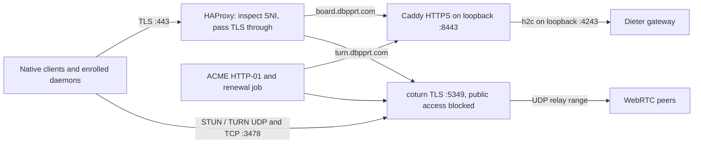

# Dieter gateway and VPS deployment plan

**Status: proposed; approval required before implementation or deployment.**

The outcome is a documented, reproducible Dieter gateway distribution in
`dbpprt/dieter`, and a small `dbpprt/vps` repository that deploys a pinned release
of it. The VPS will run the gateway, HTTPS edge, and TURN service directly.
FRP and the old shared OAuth proxy will be retired through an explicit cutover.
Existing gateway identity, enrollments, and sessions must survive deployment.

**Evidence and planning assumptions**

On September 21, I retrieved all 20 source/configuration files from
`mini-home:/Users/dbpprt/Development/vps` through Dieter remote execution. The
local snapshot is at `tmp/vps-planning/mini-home` in this workspace. Its Git HEAD
is `048d703aa5e9008bfaf742186f5ea4d0dd7ff69b`, matching GitHub, but 13 files have
different contents. Those unpublished changes add the older Board gateway while
retaining FRP, OAuth2 Proxy, `BOARD_*` configuration, and a private-image token
requirement. Neither that checkout nor GitHub contains the current coturn setup.
The snapshot will be the basis for reconciliation, rather than discarding the
unpublished changes or deploying the old GitHub configuration.

Dieter already has `Dockerfile.gateway`, `just/gateway.just`, and
`.github/workflows/gateway-image.yml`. A successful image publication was
observed, and an anonymous registry request confirmed that
`ghcr.io/dbpprt/dieter-gateway` is public and has Linux amd64/arm64 manifests.
Production can pull it without a long-lived GitHub package token.

The live VPS was previously verified to run Dieter, coturn 4.17.2, Caddy, and
OAuth2 Proxy. TURN limits are four allocations per normalized account/target
username and sixteen total, with ports 49160–49200 and TLS disabled. Details are
in the [relay investigation](investigations/2026-09-21-relay-fallback.md).
Additional live inventory attempts during this planning turn encountered SSH
refusal and intermittent gateway reachability errors. Exact persistent-volume
names, server resources, and current firewall rules therefore remain deployment
preflight checks, not assumed facts.

The proposed choices are:

| Decision | Proposed choice | Reason |
| --- | --- | --- |
| Gateway origin | Keep `https://board.dbpprt.com` | Preserve origin-bound enrollment, signed credentials, OAuth configuration, and client settings |
| TURN hostname | Add `turn.dbpprt.com` | Separate TLS/SNI routing from gateway HTTPS |
| Domain ownership | Use the `dbpprt.com` DNS zone | The gateway need not occupy the apex; DNS checks found no apex A record and no current TURN record |
| Old endpoints | Retire Hermes, Kanna, and shared auth routes | Their FRP/OAuth infrastructure is being removed |
| Registry | Public GHCR package in `dbpprt/dieter` | Existing supported distribution, no VPS pull token required |
| Deployment selection | Reviewed immutable image digest plus matching bundle | Reproducibility and rollback; `latest` remains a convenience tag |
| Production trigger | Explicit GitHub Actions workflow dispatch | Publishing an image does not unexpectedly replace the running gateway |
| Public IP layout | Support the existing single IPv4 address | Avoid requiring another paid address; share TCP 443 using SNI routing |

The hostname and legacy-endpoint choices are part of approval. Moving the
gateway to the apex or another hostname would require a separate enrollment and
origin transition design; HTTP redirects do not migrate gRPC or signed origins.

**Target network architecture**

HAProxy operates at TCP level on public port 443. It routes by an allowlist of
TLS server names without decrypting gateway or TURN traffic. Caddy terminates
gateway TLS 1.3 and preserves HTTP/2 to the loopback gateway. Coturn terminates
TURN TLS with native-client-compatible TLS settings. Its underlying TLS port is
not opened in the public firewall. The gateway remains machine-only: `/` is 404;
health, OAuth completion, and authenticated protobuf services retain their
existing contract. No OAuth2 Proxy is placed in front of Dieter.

This adds one small TCP proxy because ordinary Caddy HTTP routing cannot carry
TURN packets. The alternative for installations with two public addresses is a
simpler optional profile: Caddy owns port 443 on the first address and coturn
owns port 443 on the second. The single-address profile must pass real Go, Mac,
and Android SNI/TURN tests before activation. Missing or unknown SNI is rejected;
UDP/TCP 3478 remains available independently. TLS on 443 improves reachability
but cannot guarantee passage through an HTTP-only corporate proxy.

Use Linux host networking for the production Compose services, with explicit
listener addresses and firewall rules. This preserves Dieter's requirement
that proxy-mode plaintext traffic bind to actual host loopback. Merely mapping
a bridge-network container port to localhost would not justify changing the
gateway to listen on `0.0.0.0` in proxy mode.

| Public port | Purpose |
| --- | --- |
| Existing SSH TCP port | Deployment and administration; preserve the actual configured port |
| TCP 80 | ACME HTTP-01 and explicit HTTPS redirects |
| TCP 443 | SNI-routed gateway HTTPS and TURN TLS |
| UDP/TCP 3478 | STUN and TURN |
| UDP 49160–50183 | Proposed TURN relay range: 1,024 ports |

Gateway 4243, Caddy 8443/admin, coturn 5349, old backend ports, and monitoring
listeners remain inaccessible publicly. Remove FRP port 7000 as part of
retirement. Apply equivalent IPv6 rules before publishing any AAAA records;
keep TURN IPv4-only until its IPv6 path has been qualified. No public UDP 443
is required by this design.

For the shared-address profile, use one certificate owner: a pinned ACME client
run by a host systemd timer, with HTTP-01 challenge files served by Caddy on
port 80. It issues certificates for both hostnames. Mount certificate directories
read-only into Caddy/coturn, validate each renewed chain/key pair, and publish
the new files atomically. The host renewal wrapper handles service reloads;
certificate containers receive no Docker socket. Qualify coturn's renewal
behavior rather than assuming SIGHUP reloads certificates. If recreation is
required, document and bound the interruption to TURN sessions. Bootstrap
certificates through the HTTP-only configuration before enabling the TLS edge.

**Work in `dbpprt/dieter`: the reusable distribution**

Extend the existing implementation instead of creating a second gateway image.

| Area | Planned deliverable |
| --- | --- |
| `Dockerfile.gateway` | Explicit supported architectures, deterministic non-root ownership, persistent-state mount, OCI build identity, container health/readiness documentation |
| `deploy/gateway/` | Versioned Compose bundle, Caddy and HAProxy templates, coturn template, sample settings, secret renderer, ACME renewal units/hooks, validation and smoke-test entry points |
| `just/gateway.just` | Discoverable commands for rendering, validating, building a deployment bundle, and running isolated deployment tests |
| `.github/workflows/gateway-image.yml` | Tested multiarch image publication, digest output, SBOM/provenance, keyless image signing, matching deployment-bundle publication |
| Release integration | Call the image/bundle publisher explicitly for a release version and source SHA; do not rely on a tag created with `GITHUB_TOKEN` starting another workflow |
| `.env.example`, README, website gateway guide | Complete configuration reference, Docker quick start, production profiles, GHCR usage, upgrades, backups, restore, TURN sizing, and troubleshooting |

The distribution manifest records the image digest, source revision, release
version, supported application contract, bundle checksum, and pinned dependency
images. Release publication must pair the bundle and image from the same source
revision. Dependency updates must trigger publication; the current narrow path
filter should cover the full gateway dependency/configuration surface. Preserve
the existing gateway tests and vulnerability gate.

Use GitHub's `GITHUB_TOKEN` for package publication and OIDC for signatures, with
only the job permissions needed. Pin third-party Actions and container images
to reviewed revisions/digests. Deployment verifies signatures against the exact
repository/workflow identity and verifies bundle checksums. No deployment SSH
key or production application secret belongs in the public Dieter repository.

Configuration documentation will distinguish supported production options from
test-only switches, explain defaults/units, and cover these groups:

- Listener address, public origin, proxy versus direct TLS, certificate paths,
  container state ownership, HTTP/2, health, and build/contract identity.
- GitHub OAuth client ID/secret, immutable numeric account allowlist, auth
  secret, session lifetime, and exact native redirect URIs.
- STUN/TURN URLs, signed RTC lifetime, shared-secret encoding, allocation
  quotas, relay range, bandwidth limits, TLS, and peer address restrictions.
- Deployment image/bundle pins, hostnames/IPs, ports, ACME identity, logging
  limits, process/memory bounds, backup retention, and renewal scheduling.

The renderer must respect each target format. The existing VPS workflow uses
Bash `%q` output for Docker environment files; replace that with tested handling
for spaces, quotes, dollar signs, equals signs, and invalid newlines. Do not
print a fully expanded secret-bearing Compose configuration into CI logs.

**TURN defaults and credentials**

Propose `user-quota=64`, `total-quota=256`, and UDP relay ports 49160–50183 for
this small fleet, subject to the resource preflight and isolated load test.
With three advertised TURN transports, a two-ended connection may allocate six
times before interface/address multiplication. Sixty-four per target allows
headroom for active clients, screens, background leases, peer sync, and
reconnection overlap. These are allocation bounds, not guaranteed screen-stream
capacity. Add configurable bandwidth ceilings after measuring the VPS link;
raising quota alone must not be presented as a throughput guarantee.

Advertise UDP 3478, TCP 3478, and TLS TCP 443 on the TURN hostname. Preserve
REST authentication, deny unauthenticated relay, and restrict peers from
loopback, link-local, private management networks, multicast, and reserved
targets as appropriate. Configure and test the public relay address. Keep
administrative/metrics listeners local and rotate bounded logs. Export or
derive safe allocation, rejection, capacity, and certificate-expiry indicators;
qualify which metrics the pinned coturn image actually provides.

Use one canonical secret, `TURN_SHARED_SECRET`, containing printable random
text. Coturn receives those text bytes as `static-auth-secret`. Dieter receives
the hexadecimal encoding of the same bytes as `DIETER_RTC_TURN_SECRET`, because
`ConfigFromEnv` hex-decodes that setting. Copying identical hexadecimal text into
both fields would produce different HMAC keys. Import the existing effective
secret without rotating it during the deployment transition, verify byte
equivalence without displaying values, and test actual coturn allocation using
gateway-issued credentials. The current Pion fixture alone does not test this
rendering boundary.

**Work in `dbpprt/vps`: production selection and operations**

The VPS repository owns the host-specific configuration and deployment lifecycle;
the Dieter bundle owns reusable service templates. Avoid independently maintained
copies that can drift again.

The new layout will contain a production release lock/manifest, nonsecret
settings, a small Compose override where necessary, bootstrap/deploy/rollback/
verification scripts, ACME and backup units, and concise operational documents.
An update command fetches a verified immutable Dieter deployment bundle and
records its revision/checksum. The deployment job installs that bundle with the
reviewed production settings; it never fetches mutable `main` templates at runtime.

Replace the old workflow and its `BOARD_*` configuration with Dieter's current
contract. Remove FRPS installation, FRP configuration and service units, OAuth2
Proxy configuration, the legacy Caddy routes, and Mac FRPC installers from the
maintained deployment. Retain a one-time, explicitly scoped retirement procedure
until the installed legacy services have been removed successfully. Update
`AGENTS.md`, README, architecture, security, bootstrap, and operations documents
to describe the resulting system.

The snapshot's unpublished edits are preserved as review input. The rewrite is
prepared as a reviewable branch/PR; implementation must not silently overwrite
the original `mini-home` checkout. Current live mounts/configuration are also
reconciled before selecting a production release.

**GitHub configuration**

Create a `production` environment in `dbpprt/vps`, restrict it to the deployment
branch, and use environment review protection where supported by the account's
GitHub plan. The workflow remains manually dispatched regardless. Pull requests
run validation without production secrets. A single production concurrency group
uses `cancel-in-progress: false` so another run cannot interrupt an activation.

| Location | Names / values |
| --- | --- |
| Production secrets | `VPS_SSH_PRIVATE_KEY`, `DIETER_GITHUB_CLIENT_SECRET`, `DIETER_AUTH_SECRET`, `TURN_SHARED_SECRET`, encrypted-backup credentials/key if remote backups are enabled |
| Production variables | `VPS_HOST`, `VPS_PORT`, `VPS_USER`, `VPS_SSH_KNOWN_HOSTS`, `GATEWAY_HOST`, `TURN_HOST`, public relay IP, `ACME_EMAIL`, `DIETER_GITHUB_CLIENT_ID`, `DIETER_GITHUB_ALLOWED_USER_IDS` |
| Version-controlled production settings | Image/bundle/dependency pins, application contract, session/RTC lifetimes, native redirects, TURN quotas/range, resource/logging limits |
| Existing secrets to retire after cutover | `FRP_AUTH_TOKEN`, `OAUTH2_PROXY_*`, obsolete `BOARD_*`/GHCR pull credentials if present |

The current GitHub secret inventory contains the legacy FRP/OAuth/SSH set and
`CADDY_ACME_EMAIL`; no Dieter application secrets were listed. Existing effective
application values should be transferred from protected VPS files directly to
GitHub secret input without appearing in transcripts, artifacts, or shell traces.
Keep the existing auth secret and OAuth app. Gateway signing keys and the daemon
CA remain in the persistent state and backups, not Actions secrets.

Pin the already verified SSH host key; replace runtime `ssh-keyscan` trust with
`StrictHostKeyChecking=yes`. Use a dedicated deployment key and an explicit
host deployment privilege boundary. Bootstrap is the only step needing broad
host provisioning privileges; routine workflows invoke the documented deployment
entry point. Treat a user with Docker access as host-privileged. Remove the
unused root-password secret from Actions once an independent recovery method
has been confirmed. Anonymous GHCR pulls eliminate the need for a package PAT.

**Deployment, persistence, and rollback**

1. **Inventory and recovery first.** Confirm the exact running image digest,
   gateway data mount, ownership, configuration, signing/CA files, DNS, SSH port,
   firewall, resource headroom, and legacy FRPC owners. Capture a consistent,
   encrypted backup and verify restoration in an isolated fixture. Keep existing
   live state as the authoritative source.
2. **Build and qualify.** Produce the signed image and matching bundle in Dieter;
   validate the VPS settings against that exact bundle. Run the security,
   transport, rendering, and rollback tests below before any production activation.
3. **Prepare the host.** Separate one-time OS/Docker/bootstrap changes from normal
   deployments. Stage each release under a unique directory, acquire a host
   deployment lock, verify artifacts, render private config atomically, and
   pre-pull images. Preserve SSH reachability while updating managed firewall
   rules; do not reset unrelated host policy or upgrade the OS on each release.
4. **Preserve gateway identity.** Reference the inspected existing volume by an
   explicit external name or existing bind path. Do not let a new Compose project
   name create an empty replacement volume. Preserve SQLite state, signing key,
   daemon CA, auth secret, public origin, and OAuth app. Never use `down -v`.
   Back up SQLite through its consistent backup facility with the keys/config;
   do not copy a live WAL database file alone. No historical store migration or
   compatibility branch is introduced.
5. **Stage TLS and capacity.** Add the approved TURN DNS record, obtain and verify
   certificates, render the shared-port edge, and validate loopback bindings and
   firewall changes. Exercise staging listeners without competing for the live
   gateway database. TURN changes can interrupt existing TURN sessions; schedule
   the cutover accordingly.
6. **Activate the tested release.** Keep stable Compose/service identity where
   practical. Replace only affected services, verify local readiness and public
   build identity, then authenticated routes. Record release digest, bundle,
   source SHA, and contract in the deployment result. A gateway replacement
   briefly reconnects transport streams; local daemon agents keep running.
   No operator daemon/app restart or machine reenrollment is part of this path.
7. **Retire legacy services after gateway acceptance.** Remove old Caddy routes,
   stop/disable FRPS and OAuth2 Proxy, remove the FRP firewall allowance, and
   verify the old backend listeners are gone. Unload only identified FRPC
   LaunchAgents on their owner Macs through Dieter and remove their installer
   footprint. Retire obsolete DNS records and secrets after the rollback window.
8. **Rollback on failed acceptance.** Restore the previous release's immutable
   image/configuration pins and edge routing, retaining the same gateway state
   when contract/schema compatible. Never start two production gateway writers
   against that state. A restore requiring database rollback is explicit recovery
   from a consistent backup, with its loss window documented; it is not an
   automatic overwrite of newer sessions or enrollments.

A deployment is not committed merely because Docker reports a running process.
Use bounded readiness deadlines and an activation record with a last-known-good
release. The deployment process runs to completion on the host even if the SSH
observer disconnects; retrying inspects that operation instead of starting a
second deployment. Preserve bounded logs and the explicit outcome in Actions.

Daily encrypted backups should cover the gateway database, signing/CA material,
and necessary protected configuration. Specify retention and test restore to
temporary storage. Store a recovery copy away from this VPS; the destination and
its credentials must be configured before claiming disaster recovery is complete.
Do not put backup payloads in the repository or ordinary CI artifacts.

**Checks that define completion**

| Check | Required evidence |
| --- | --- |
| Repository validation | Affected Dieter checks, gateway tests/vulnerability scan, script syntax/lint, Compose validation, Caddy/HAProxy/coturn configuration validation, and docs build |
| Container contract | Both image architectures build; non-root gateway can write only its intended state; readiness/build identity and persistent ownership work across replacement |
| Secret rendering | Special-character cases, exact TURN HMAC byte agreement, secrets absent from generated public files and CI logs |
| Gateway security | TLS 1.3, HTTP/2/gRPC, root 404, correct OAuth callback, numeric account allowlist, rejection of unauthenticated data calls, daemon possession proof, account isolation, contract mismatch rejection |
| TURN functionality | Real coturn UDP, TCP, and TLS-443 allocations with gateway credentials; denied bad/expired credentials and prohibited peer addresses; accepted direct and TURN-selected API connections |
| Load and recovery | Concurrent clients/screens plus peer sync fit approved quota/resource bounds, no unexpected 486 responses, allocations release after disconnect, bounded logs/queues/processes |
| Native routes | Mac and Android authenticated API and screen connections over shared SNI/TURN TLS; gateway relay remains usable; tests use disposable fixtures and preserve operator app lifecycle |
| Deployment lifecycle | First install, repeat deployment, upgrade, failed activation, interrupted observer, certificate renewal, gateway restart with retained enrollment, and verified rollback/restore |
| Public exposure | Only intended ports reachable; private backends and retired FRP ports inaccessible; no old OAuth gate on gateway RPCs |

Use a disposable Debian VM and temporary gateway/daemon state for destructive
installation and recovery tests. Production verification is a bounded smoke test
through existing authenticated Dieter routes, plus fresh native route selections.
Unavailable physical-client integration must be reported as unavailable, not a
pass. Application contract 1 remains the single supported contract.

Deployment fixes address the confirmed quota and missing-TLS failures. The
investigation also found that an already healthy active UI relay lacks automatic
route promotion. That is separate client behavior: provisioning acceptance must
exercise fresh connections rather than claim the infrastructure update alone
will immediately change every existing route indicator. Client promotion can be
planned as a subsequent product change without coupling it to this VPS rewrite.

**Approval and deliverables**

Approval of this plan authorizes the described Dieter packaging/docs/CI work,
the VPS repository rewrite, GitHub configuration, and staged production cutover
after its acceptance gates pass. The proposed hostname and endpoint-retirement
choices should be confirmed or amended with that approval. Required external
inputs are DNS control for the TURN record, a working verified administration
route, and a selected off-host backup destination; any unavailable input is
reported before its dependent deployment step.

The final implementation delivery will include reviewable repository changes,
a release lock tying the deployed image to its source and bundle, an operator
runbook with exact commands/options, GitHub variable/secret setup documentation,
test evidence, and the deployed/rollback version identifiers. This planning turn
retrieved source snapshots and wrote this document only; it did not implement,
publish, rotate secrets, retire services, or deploy configuration.
