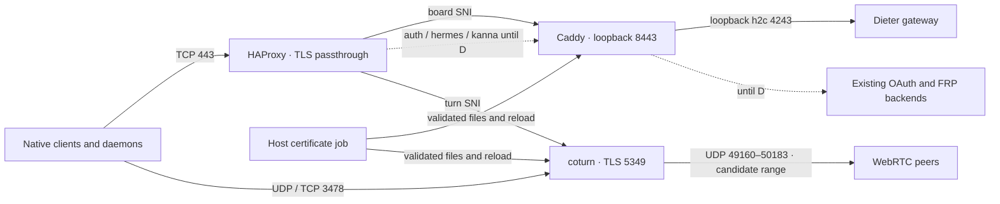

**Dieter gateway · production implementation plan**

*21 September 2026 · Proposed implementation · No deployment performed*

Deliver a reproducible, signed gateway distribution in `dbpprt/dieter`, deploy
it through a small, reliable `dbpprt/vps` repository, and complete the transition
to gateway HTTPS plus TURN over UDP, TCP, and TLS. Preserve existing accounts,
enrollments, sessions, and gateway identity throughout. Retire the older FRP and
shared OAuth infrastructure only after the replacement has passed acceptance.

This is the consolidated implementation successor to the proposal on Garuda at
`/home/dbpprt/Development/dieter/docs/gateway-vps-deployment-plan-2026-09-21.md`.
It incorporates the [live assessment](gateway-vps-plan-assessment-2026-09-21.md).
The original proposal remains the historical record; use this document to
sequence implementation. The present request authorizes producing this plan.

**The delivery path**

| Milestone | Result | Release condition |
| --- | --- | --- |
| **A · Reproducible deployment** | Signed image and bundle; reconciled VPS configuration; durable deployment and recovery | Existing topology can be replaced and rolled back without losing identity or legacy access |
| **B · Reliable TURN capacity** | Explicit public relay address, measured quotas, bounded resources and logs | Supported concurrent load passes with no unexpected quota failures |
| **C · TURN over TLS** | `turn.dbpprt.com:443`, shared-port routing, tested certificate renewal | Go, Mac, and Android exchange real traffic through the TLS relay; old HTTPS routes remain available |
| **D · Complete retirement** | FRP, shared OAuth, old routes, installers, DNS, and obsolete secrets retired | Gateway/TURN acceptance and observation complete; retirement and recovery checks pass |

Each milestone produces a reviewable release and an acceptance record. A failure
in C or D does not require undoing an accepted capacity or deployment improvement.

**Decisions carried into implementation**

| Concern | Decision |
| --- | --- |
| Public gateway | Keep `https://board.dbpprt.com` and the existing GitHub OAuth application |
| TURN hostname | Add `turn.dbpprt.com`, initially with an A record only |
| Production network | Linux host networking; one public IPv4; HAProxy passes TLS through on TCP 443 |
| Gateway hop | Caddy to `127.0.0.1:4243` over h2c; gateway proxy mode remains loopback-only |
| Transitional HTTPS | Keep `board`, `auth`, `hermes`, and `kanna` routed to Caddy until milestone D |
| Certificates | Pinned Certbot webroot issuance, host systemd renewal wrapper, versioned certificate directories |
| Reloads | Caddy through a protected Unix admin socket and forced reload; coturn `SIGUSR2`, qualified on the pinned image |
| Secrets | Preserve existing effective values; one canonical TURN text secret, hex-encoded only for Dieter |
| Release trust | Keyless image signature plus signed distribution manifest binding image, bundle, source, dependencies, and compatibility |
| Distribution retention | Durable OCI bundle publication and protected release pins; do not depend on the two newest GitHub releases |
| Production trigger | Manual workflow dispatch from the approved VPS branch; one non-canceling production concurrency group |
| Backups | Pinned restic, encrypted off-host repository, consistent SQLite snapshots, tested isolated restore |
| Legacy cleanup | A separate recorded deployment operation after C; retain recovery material through its rollback window |

Exact dependency versions and digests belong in a reviewed lockfile produced
during implementation. The currently deployed versions are the starting point,
not a claim that they satisfy the new qualification matrix.

**Production identity to preserve**

Recheck this September 21 baseline immediately before implementation touches
production. Unexpected differences stop activation for reconciliation; they must
not be overwritten with this snapshot.

| Item | Verified baseline |
| --- | --- |
| Host | `91.132.146.140`; Debian 13.6; SSH TCP 22 |
| Compose identity | `dbpprt-vpc`; gateway service `dieter-gateway` |
| Gateway volume | `dbpprt-vpc_board-gateway-data` mounted at `/var/lib/dieter-gateway` |
| State ownership | UID/GID `100:101`; state directory 0700; database and private keys 0600 |
| Authorization | Numeric GitHub IDs `60854672,7000188`; preserve both |
| Native callbacks | `dieter-mac://oauth/callback,dieter-android://oauth/callback` |
| Lifetimes | Native session 720h; signed RTC configuration 5m |
| Application contract | `1` across gateway, daemon, CLI, native clients, sync, and screen input |
| Storage | Current gateway implementation requires schema 1; verify the live schema in protected preflight |
| Gateway source | `bf18ee954c968101f0c5bbf4d5d2336b73680eb2` |
| Host capacity | One logical CPU; 967 MiB RAM; no swap; about 24 GiB disk available at inspection |
| Current TURN | coturn 4.17.2; quotas 4/16; UDP relay range 49160–49200; no TLS |

Initial gateway rollback image:

```text
ghcr.io/dbpprt/dieter-gateway@sha256:f32e92ababc3746f5454e91ee0d25059b4395ea21f73c16f9dd265c416a14ced
```

Preserve SQLite state, gateway signing key, daemon CA and key, auth secret, TURN
secret bytes, OAuth application, and origin as one recovery set. The existing
TURN key-byte comparison passed. Reenrollment, origin changes, historical API
branches, store conversion, and operator-daemon restarts are outside this change.
Automatic promotion of a healthy active client relay remains a separate product
task; acceptance here uses fresh route selections.

The gateway retains its existing data boundary: account sessions, daemon
identities/presence/routes, and normalized credential-free provider quota
snapshots. Projects, transcripts, provider responses/credentials, harness
credentials, execution ownership, and peer-replicated project metadata remain
on daemons. Keep bounded relay queues and transport cancellation semantics.

**Network design, including the transition**



| Listener | Binding and policy |
| --- | --- |
| SSH 22/TCP | Preserve the verified administrative route and existing policy |
| HTTP 80/TCP | Caddy serves only approved challenge paths and intentional redirects |
| HTTPS/TURN 443/TCP | HAProxy accepts complete ClientHello within a bounded inspection deadline; exact hostname routing; reject missing/unknown SNI |
| Gateway HTTPS 8443/TCP | Caddy on loopback; public gateway TLS 1.3; HTTP/2 retained; disable HTTP/3 advertisement and listener |
| Gateway h2c 4243/TCP | `127.0.0.1` only, in host network namespace |
| TURN 3478/UDP+TCP | Explicit IPv4 listeners, independent of the TLS edge |
| TURN TLS 5349/TCP | Reachable by HAProxy; public firewall denies it; enumerate every actual coturn listener during tests |
| Relay UDP range | Candidate 49160–50183; coturn range and firewall managed together |
| Administration/metrics | Protected Unix socket or explicit loopback binding; no public port |
| FRP 7000/TCP | Retain until D; then remove IPv4 and IPv6 allowances and verify closure |

Coturn must explicitly use `relay-ip=91.132.146.140` on this host. Choose
intentional public and loopback listener addresses; never let the proxy's local
connection select a loopback relay socket. Explicit advertised-address handling
must agree with the host topology. TLS-443 acceptance checks the returned relay
address and bidirectional payload exchange, not allocation alone.

The current host already has IPv6 TURN listeners and firewall allowances. The
first production release explicitly restricts TURN to IPv4 and removes only
managed IPv6 TURN allowances. Test literal-IP reachability; missing AAAA records
do not establish isolation. Keep unrelated host and SSH IPv6 policy intact.

Preserve gateway authentication and coturn REST authentication behind SNI
routing. Deny prohibited peer destinations, including loopback, link-local,
private management ranges, multicast, and reserved addresses, without denying
the legitimate public relay address needed for relay-to-relay ICE. Disable
unused RFC 6062 TCP relay endpoints while retaining TCP/TLS client transport.
Keep DTLS disabled unless separately qualified.

The reusable bundle also includes the original proposal's optional two-public-IP
profile: Caddy and coturn each own TCP 443 on their own address, with HAProxy
omitted. Validate that profile in disposable networking; it is not selected for
this VPS. TURN TLS improves restrictive-network reachability but does not make
TURN into HTTP or guarantee traversal of an HTTP-only corporate proxy.

**Ownership and deliverables**

| Repository | Files or areas | Responsibility |
| --- | --- | --- |
| Dieter | `Dockerfile.gateway` | Multiarch non-root image, fixed UID/GID 100:101, build identity, state mount, explicit liveness semantics |
| Dieter | `deploy/gateway/` | Versioned service templates, settings schema, renderer, validation, reusable deployment/renewal/backup helpers and units |
| Dieter | `scripts/` and disposable fixtures | Rendering, artifact trust, actual coturn, deployment lifecycle, capacity and recovery tests |
| Dieter | `scripts/check_changed.py` and CI selection | Run the new deployment checks when bundle, renderer, helper, or fixture inputs change |
| Dieter | `just/gateway.just` | Discoverable entry points for bundle, render, validate, verify, deployment tests and qualification |
| Dieter | Image/release workflows and `just/release.just` | Same-source image and bundle, signatures, SBOM/provenance, release assembly and retention |
| Dieter | README, `.env.example`, `landingpage/content/docs/gateway.md` | Docker quick start, complete production settings reference, profiles, operations and troubleshooting |
| VPS | `production/release.lock.json`, `production/settings.json` | Reviewed immutable selection, exact existing volume, hostnames, allowlist, measured limits and lifecycle policy |
| VPS | Small host overrides and `scripts/` | Host bootstrap, deployment admission/status, rollback, public checks and one-time retirement |
| VPS | `.github/workflows/` | Secret-free pull-request validation and manual production deployment |
| VPS | AGENTS, README and operations/security/bootstrap/architecture docs | Current topology, privilege boundary, recovery and exact operator commands |

Keep reusable implementations in the Dieter bundle. VPS owns their configuration,
installation, scheduling, and host-specific wrappers. Do not maintain independent
copies of service templates or certificate/backup algorithms in both repositories.

**Phase 0 · Reconcile and protect the baseline**

1. Prepare isolated implementation checkouts/branches, using the `codex/` prefix.
   Preserve the dirty Dieter and VPS checkouts. Reconcile GitHub VPS main, the
   13 unpublished VPS file changes, the mini-home planning snapshot, and live
   `/opt/dbpprt-vpc`; record source provenance without copying secrets into Git.
2. Make the first VPS change remove automatic push deployment and add validation.
   Keep production dispatch guarded until the new reconciled release exists.
   Verify that merging configuration changes cannot invoke the old deployment.
   Its `--remove-orphans` behavior can remove the live gateway and coturn.
3. Record images, mounts, ownership, schema, accounts, public certificates, host
   keys, firewall rules, resources, daemon presence, legacy services and FRPC
   owners. Capture safe fingerprints/counts for later comparison, not session
   tokens or private-key contents.
4. Capture the protected initial recovery set using SQLite's backup facility,
   including keys and effective configuration. Preserve the old service images
   and Caddy certificate storage. Verify database integrity and isolated restore.
5. Resolve the external inputs listed below; retain them as deployment preflight
   conditions rather than blocking independent repository implementation.

**Exit:** reviewed baseline and recovery evidence exist; old automatic deployment
cannot run; implementation checkouts preserve unpublished work; no service has
been removed or reconfigured by this phase.

**Phase 1 · Define and build the distribution**

Extend the existing gateway image. Use explicit UID/GID 100:101 on both target
architectures; verify replacement can read/write the existing permission layout.
Support a read-only root filesystem, dropped capabilities, no new privileges,
and only the required writable state and bounded temporary storage. Keep the
Docker socket out of runtime and certificate containers.

Build a deterministic bundle with these logical parts:

```text
deploy/gateway/
  compose.yaml                    reusable final service definitions
  profiles/                       shared-address and separate-address profiles
  templates/                      Caddy, HAProxy, coturn, systemd
  schemas/                        settings and distribution manifest
  scripts/                        render, verify, smoke, renewal, backup helpers
  tests/                          fixtures and lifecycle qualification
  dependencies.lock.json          image and tool versions/digests
  README.md                       bundle interface and operator contract
```

Use a strict settings schema and a Python renderer with tested format-specific
serialization. Public configuration and protected configuration are different
outputs; private directories are 0700 and secret files 0600, with narrowly
scoped service-readable copies where required. Replace Bash `%q` rendering.
Test quotes, spaces, backslashes, dollar signs, equals signs, Unicode where
supported, and rejection of unsupported newlines/NULs. Validate hostnames, IPs,
ports, paths, allowed keys, volume identifiers, and required settings. Avoid
Compose interpolation surprises and shell evaluation of configuration values.

`TURN_SHARED_SECRET` contains the preserved printable secret bytes. Coturn gets
those bytes as text; Dieter gets their hex encoding. Verify equivalence without
printing either representation. Gateway auth secrets retain their existing
encoding and are not regenerated during rendering or repeat deployments.

Use `/healthz` for liveness and build identity. Define readiness as successful
startup plus authenticated gateway/directory and selected-daemon operations;
TURN has its own allocation and traffic checks. A static HTTP 200 or Docker
running state is never the complete readiness gate. No new application RPC or
historical contract branch is needed for this packaging work.

**Exit:** both image architectures build; rendered profiles validate; special
characters survive round trips; secrets never appear in public artifacts/logs;
existing-state ownership and composite readiness pass in fixtures.

**Phase 2 · Publish a verifiable, retained release**

Make the publisher reusable with explicit source SHA and release version inputs.
Call it directly from the release workflow; do not depend on a tag created by
`GITHUB_TOKEN` triggering another workflow. Preserve the gateway tests and
vulnerability scan. Broaden publication triggers to the actual dependency graph,
including `internal/buildinfo`, `internal/envfile`, `internal/protocol`, bundle
inputs and dependency locks. Every Dieter workflow shell step continues to enter
through Just, as required by the existing workflow check.

Publish one signed distribution manifest with at least:

| Field | Meaning |
| --- | --- |
| `manifestVersion`, `bundleInterfaceVersion` | Deployment format compatibility, separate from the application contract |
| `releaseVersion`, `sourceRevision`, `builtAt` | Exact source/build identity |
| `image` | Gateway repository and immutable multiarch digest |
| `platforms` | Supported Linux amd64/arm64 manifests |
| `applicationContract` | Required Dieter application contract, initially 1 |
| `gatewayStoreSchema` | Current schema and explicit compatible rollback schema |
| `bundle` | Archive name and SHA-256 checksum |
| `dependencies` | Service images and host tools pinned by immutable digest/checksum |

Sign the image and manifest with GitHub OIDC/Sigstore. Verify the exact approved
repository, publisher workflow, ref and issuer identity from the real publishing
job; test verification against wrong identities and branches. The signed manifest
authenticates the relationship between the bundle and image. An unsigned checksum
beside the archive is insufficient.

Publish the bundle, manifest, and Sigstore material as a public OCI artifact,
for example under `ghcr.io/dbpprt/dieter-gateway-deploy`, with an immutable artifact
digest in the VPS lock. This is a deployment artifact, not a second gateway
image. GitHub release attachments remain convenient mirrors. Integrate release
assembly checks so an official gateway distribution cannot omit its bundle or
signature. Generate and retain SBOM/provenance with the selected image.

The existing release cleanup keeps two GitHub releases. Decouple deployment
availability from that policy: protect OCI artifacts and images selected for
production/rollback, retain them for at least 90 days, and cache verified current
and previous release material on the host. Keep a recoverable copy of the actual
images/artifacts off-host, or prove they remain downloadable by digest during a
clean-host restore. Never claim that a lockfile alone preserves an artifact.

Treat the preexisting unsigned production image as an explicitly recorded
bootstrap rollback baseline. Preserve its observed digest and recovery copy;
do not add a general signature-verification bypass for future releases.

**Exit:** anonymous clean-machine retrieval and verification succeed; tampered
bundles, mismatched image/source, wrong signatures and unsupported contracts are
rejected before any supplied script executes; an older protected deployment
remains restorable after normal release cleanup.

**Phase 3 · Build the VPS deployment and recovery lifecycle**

Keep Compose project `dbpprt-vpc`. Declare the inspected gateway volume as
external by its exact name. An existing installation with missing state must
fail closed; fresh installation is a separate explicit mode. Never create an
empty substitute, use `down -v`, or run concurrent gateway writers.

Use these host locations, separate from checked-out source:

| Location | Contents |
| --- | --- |
| `/opt/dbpprt-vpc/releases/<release-id>/` | Immutable verified bundle and public rendered configuration |
| `/opt/dbpprt-vpc/current` | Pointer to the last accepted release |
| `/etc/dbpprt-vpc/` | Protected effective settings, credentials and versioned certificate material |
| `/var/lib/dbpprt-vpc/operations/` | Durable deployment requests, outcomes and bounded sanitized logs |
| `/var/lib/dbpprt-vpc/backup-staging/` | Private consistent snapshots, bounded in size and retention |
| `/run/dbpprt-vpc/` | Deployment lock and protected Caddy admin socket |

Implement a host-owned systemd deployment operation. Actions submits an operation
ID, reviewed release lock, settings and protected inputs, then watches status.
The same ID with identical input returns the existing operation; different input
is rejected. SSH disconnection stops observation only. A host lock serializes
deployment, certificate activation, restore, and state-affecting maintenance.
Recovery after reboot reconciles recorded intent with observed services before
continuing or rolling back; it never blindly repeats a mutation.

```text
admitted → verified → staged → backed_up → activating → checking → committed
                                             └─ failure → restoring_previous
                                                           → rolled_back / failed
```

Stage unique releases; verify trust before executing bundle code; pre-pull images;
check free space; render/validate private files; back up; replace only affected
services; check local and external acceptance; then commit the current pointer.
Retain separate desired, active and last-known-good records during activation.
Use bounded deadlines and save the failure before attempting rollback. Initial
qualification targets are 60 seconds for process readiness and 120 seconds for
previously online daemon reconnection, adjusted only from recorded evidence.
Do not replay application mutations to prove recovery.

Bootstrap installs pinned prerequisites and managed units once. Routine deploys
do not upgrade the OS, reinstall FRPS, reset UFW policy, force-recreate everything,
or remove unspecified Compose services. A deployment key invokes a restricted
entry point with an explicit privilege boundary; Docker access remains
host-privileged. Keep independent administrative recovery available.

Backups use a consistent SQLite backup plus identity/configuration files under
the shared operation lock. Production state remains authoritative. Keep the
original auth/signing material and Caddy certificate storage in the protected
recovery set. Use pinned restic with daily backups and a pre-activation backup;
start with 14 daily, 8 weekly and 6 monthly retained snapshots, subject to storage
capacity. Keep the recovery key outside the VPS. Run weekly repository checks
and monthly isolated restore drills, with data verification appropriate to the
repository size. Serialize prune/check work with backup scheduling.

Document a proposed 24-hour routine data-loss objective and a 60-minute clean-host
recovery target; measure both in the restore drill before claiming them. Config
rollback normally reuses compatible current state. Database restoration is an
explicit recovery operation that declares its lost-session/enrollment window.
Restored production identity must never contact real accounts from the test
fixture: isolate egress and use mocks; validate database/key integrity separately
from disposable end-to-end enrollments.

**Exit:** fresh install, adopt-existing, repeat deploy, upgrade, failed activation,
lost observer, host restart, state-preserving rollback and clean-host restore
pass in disposable Debian. A selected off-host repository contains a verified
recovery set before production activation.

**Phase 4 · Reproduce production, then qualify TURN capacity**

First deploy a reconciled baseline retaining Caddy on public 443, current gateway
origin, all legacy routes, OAuth2 Proxy and FRPS. Preserve both allowed GitHub
accounts and compare identity fingerprints and daemon directory before/after.
Prove rollback before changing the edge topology.

Then qualify the candidate TURN quotas `64` per normalized account/target and
`256` total with UDP range `49160–50183`. They are candidates, not approved
throughput promises. Candidate gathering can allocate on each endpoint and
transport before a direct route is selected; model interface multiplication,
peer sync, screen sessions, temporary leases and reconnection overlap.

Record a supported load envelope in production settings. At minimum exercise
the enrolled fleet's peer sync alongside concurrent native API and screen
connections, plus a reconnect burst. Include same-target concentration and
multiple-account isolation. Use a one-CPU/1-GiB disposable fixture and native
clients; record allocation counts, rejection codes, selected transport, memory,
CPU, egress, file descriptors and release time after disconnect.

The initial qualification target is concurrent Mac and Android API connections,
two screen sessions across targets, and peer sync for the online enrolled fleet:
30 minutes at steady load followed by a five-minute reconnect exercise. Repeat
with connections concentrated on one target. Record screen modes/bitrates and
the number of client instances so the result can be reproduced. This defines a
minimum test workload, not a new application concurrency limit.

Set explicit `max-bps` and `bps-capacity` in bytes/second from measured link and
workload limits. Add memory/PID/open-file/log bounds for each service, leaving
host headroom for SSH, deployment and renewal. Qualify backups and certificate
jobs under load as well as steady-state services. Use rotated container logs
with an initial budget of 10 MiB × 3 per service. Export safe aggregate metrics
without tokens, credentials or ephemeral username labels. Keep monitoring
listeners local and expose bounded status through the operator tooling.

Acceptance requires no unexpected 486 errors within the declared envelope,
successful bidirectional relay traffic, allocation release within the tested
client/server lifecycle, no OOM or unbounded resource growth, and continued
gateway/SSH responsiveness. If the workload fails within a safe host budget,
reduce the declared envelope or present a measured host upgrade requirement;
do not silently remove limits.

**Exit:** milestones A and B are accepted, with measured limits committed to the
release selection. Gateway and legacy HTTPS access remain intact.

**Phase 5 · Issue certificates and qualify the shared TLS edge**

Add `turn.dbpprt.com` after DNS control and the intended address are verified.
Use Certbot's webroot mode so issuance does not compete with Caddy for port 80.
On this existing installation, add only the challenge-serving configuration
while preserving current HTTPS services; do not replace production with an
HTTP-only bootstrap server. HTTP-only bootstrap is for fresh hosts.

Because the initial Caddy configuration has `admin off`, introduce the protected
admin socket with one bounded, rollback-tested container replacement that keeps
its current public listeners, routes, and certificate storage. Subsequent
challenge/configuration changes can use the verified reload path.

Adopt one certificate owner per hostname. Obtain separate production lineages
for `board` and `turn`; move `board` from Caddy-managed issuance to the host job
only when the replacement certificate and rollback path are ready. Caddy may
continue owning the temporary legacy-host certificates until D. Do not run
competing renewal owners for the same name.

The host timer runs a pinned Certbot container without Docker-socket access.
The host wrapper validates hostname coverage, chain, expiry and matching key,
copies the complete pair into a new protected generation, and atomically changes
the current generation. Mount the containing directories read-only; coturn gets
only its own readable certificate material with verified UID/GID permissions.
Keep the previous generation until reload and fresh-handshake verification pass.

Configure Caddy's admin endpoint on the protected host Unix socket. Force reload
after manual certificate-file renewal even if configuration text is unchanged.
Use coturn `SIGUSR2` for certificate reload after testing the pinned image.
Certbot's success/no-renewal exit status is not proof that services adopted a new
certificate: track changed fingerprints and verify the certificate served by
both backends. Failure restores the previous generation and records a failed
renewal; never restart unrelated services or expose a Docker socket as a hook.

Stage and validate HAProxy without taking production 443. Then execute a bounded,
host-controlled port handoff: stop Caddy's public-443 listener, start its tested
loopback-8443 configuration, and start HAProxy on 443. Keep port-80 challenge
service and all transitional SNI routes. A timeout restores the former public
Caddy configuration. Record the interruption; do not promise zero downtime.

Advertise the TURN hostname with UDP 3478, TCP 3478 and TLS TCP 443 only after
the endpoints are ready. Separate production routing changes from disposable
test credentials. Test forced TURN on each transport; fresh Mac and Android API
and screen sessions must report the expected selected relay path and exchange
payloads. Keep authenticated gateway relay fallback usable.

Renewal tests preserve an existing TURN session and gateway watch while a new
handshake observes the replacement certificate. Also exercise expired/wrong-host
certificates, unavailable ACME, bad private-key permissions, failed reload,
unknown/missing SNI, fragmented/slow ClientHello, long idle streams, HAProxy
reload, and edge rollback. Do not enable PROXY protocol unless both receiving
services are explicitly configured and tested for it.

**Exit:** milestone C passes with real Go/Mac/Android evidence. TLS relay, gateway
and legacy authenticated/unauthenticated paths work. Renewal and failure recovery
pass against the actual pinned images.

**Phase 6 · Accept, observe, and retire legacy infrastructure**

Run production smoke checks using existing authorized routes and bounded fresh
connections. Capture image/bundle/source identity, both account configurations,
daemon possession/authentication checks, existing enrollment continuity, public
port exposure, and actual TURN relay traffic. Keep local agents and operator
apps running. Observe at least 24 hours of normal usage after milestone C,
including home/office clients and a normal peer-sync cycle under representative
load. Time alone does not substitute for successful checks.

Retirement is its own durable operation:

1. Capture the last accepted transitional configuration and identify every FRPC
   owner and matching installer footprint.
2. Remove `auth`, `hermes`, and `kanna` from Caddy and the HAProxy SNI allowlist
   together; verify gateway and TURN still work.
3. Stop/disable only the identified OAuth2 Proxy and FRPS services; remove managed
   IPv4/IPv6 FRP allowances. Verify 7000 and backend listeners are gone.
4. Through Dieter, unload only the identified FRPC LaunchAgents on their owner
   Macs. Preserve the exact previous installation details for recovery.
5. Keep protected rollback configuration, images, legacy DNS and required secrets
   for at least seven days after retirement. Then remove obsolete DNS, FRP/OAuth
   secrets, old Board/GHCR pull credentials if present, and obsolete installers
   and units. Do not delete unrelated local application data.
6. Remove the root-password Actions secret only after independent administrative
   recovery has been verified. Keep the one-time retirement procedure documented
   until the installed fleet is confirmed clean.

**Exit:** milestone D is accepted. The maintained VPS repository and live host
describe the same final system; no legacy listener, owner LaunchAgent, obsolete
deployment secret, or published route remains in scope.

**GitHub and operator interface**

Create a `production` environment in `dbpprt/vps`, restricted to the deployment
branch, with reviewer protection where the account supports it. Pull requests
validate without production credentials. Use a single production concurrency
group with `cancel-in-progress: false`. Verify pinned SSH host keys with strict
checking; no runtime `ssh-keyscan` establishes trust.

| Storage | Configuration |
| --- | --- |
| Environment secrets | Deployment SSH key, existing GitHub client secret, existing auth secret, canonical TURN secret, backup credentials and recovery-key input |
| Environment variables | VPS host/port/user, pinned known-host entry, gateway/TURN hostnames, public relay IP, ACME email, GitHub client ID, both allowed numeric IDs, backup endpoint |
| Version-controlled settings | Release/manifest/bundle/dependency pins, contract/schema, named volume, lifetimes, native redirects, tested quotas/resources, retention and observation policy |
| Persistent host state | Gateway signing/CA keys and SQLite, certificate/ACME state, deployment records and protected effective configuration |

Transfer existing application values directly from protected VPS files into
secret input without logs, shell traces, transcripts or CI artifacts. No package
PAT is required for public pulls. Do not place production SSH or application
secrets in the public Dieter repository.

Implement and document the following command surface; these are proposed
commands, not commands that exist today:

| Interface | Purpose |
| --- | --- |
| `just gateway bundle`, `render`, `validate`, `verify-bundle` | Produce and verify the reusable distribution |
| `just gateway deployment-test`, `turn-test`, `qualify` | Disposable lifecycle, real coturn and capacity evidence |
| VPS `release-update` | Fetch/verify a selected immutable distribution and propose a lockfile change |
| VPS `deploy --operation ID --release-lock FILE` | Admit one host-owned activation |
| VPS `status --operation ID`, `watch --operation ID` | Inspect/reconnect to a durable operation |
| VPS `rollback --operation ID --to RELEASE` | Restore compatible last-known-good configuration |
| VPS `backup`, `restore-test`, `recover` | Snapshot, verify and explicitly restore a declared recovery point |
| VPS `verify`, `retire-legacy` | Acceptance and separately scoped retirement |

Every command needs useful offline help, bounded human-readable and JSON output,
explicit exit status, and a documented failure/retry contract. Deployment dry-run
prints only a redacted change summary. Preserve these semantics through Actions
and direct SSH use. These infrastructure commands do not replace Dieter's daemon
API or introduce direct reads of project/conversation storage.

**Acceptance matrix**

| Area | Required evidence |
| --- | --- |
| Build and repository | `just check-changed --dry-run`, then affected checks; gateway tests/vulnerability scan; workflow/script checks; Compose/Caddy/HAProxy/coturn validation; website build |
| Image/state | Both architectures; fixed unprivileged identity; existing volume adoption; writable state only; stable fingerprints and enrollments after replacement |
| Artifact trust | Correct signatures/issuer/workflow/ref; exact same-source manifest; rejection of tampering/mismatch; retrieval after release pruning |
| Configuration | Secret round trips; invalid input rejection; TURN key-byte agreement; no secret-bearing public output |
| Gateway | TLS 1.3 and HTTP/2; root 404; valid OAuth flow; both allowed accounts and isolation; unauthorized RPC rejection; daemon key proof; contract mismatch rejection |
| TURN | UDP/TCP/TLS allocations and payload exchange; gateway-issued credentials; bad/expired credentials and prohibited peers denied; correct public relay IP |
| Native | Mac and Android API plus screen traffic over TLS-443 SNI routing; direct routes and gateway fallback preserved; fresh selection asserted |
| Capacity | Declared concurrent load and reconnect burst; no unexpected 486/OOM; measured resource headroom; allocation release; bounded labels/logs |
| Certificates | Bootstrap/adoption; renewal; existing-session continuity; served fingerprint change; invalid candidate/reload failure recovery |
| Deployment | Fresh/adopt/repeat/upgrade; failed activation; SSH observer loss; host reboot; no double admission or concurrent writers; bounded rollback |
| Recovery | Consistent off-host snapshot; integrity check; isolated and clean-host restore; measured recovery/loss objectives |
| Exposure | Intended IPv4/IPv6 ports only; no public gateway/admin/metrics backends; transitional then final SNI rules; legacy auth gates preserved until removal |
| Retirement | Actual FRPS/OAuth/FRPC owners removed; SSH/gateway/TURN retained; rollback window observed; obsolete DNS/secrets retired |

Use a disposable Debian VM and temporary Dieter state for destructive cases.
Extend the existing isolated gateway/native fixtures; follow the Mac and Android
skill lifecycle rules and Android's bundled JBR. Do not stop, replace or install
over operator daemons/apps. Real physical-client/network cells that cannot run
remain explicitly unavailable and block any readiness claim depending on them.
Keep production verification bounded; do not run stress tests against the live
VPS or create arbitrary production accounts/conversations as fixtures.

**Remaining external inputs**

| Input | Needed before | Handling |
| --- | --- | --- |
| Verified DNS administration for `turn.dbpprt.com` | Phase 5 issuance | Use the existing zone; no apex move |
| Off-host backup endpoint, quota and recovery-key custodian | First production activation | Discover an existing suitable destination or obtain a concrete selection; no claim of disaster recovery without it |
| Stable CI-to-VPS SSH route and independent recovery | First production activation | Pin known host identity; retest reachability; the assessment observed intermittent direct refusal |
| Physical Mac/Android availability and representative networks | Milestone C acceptance | Arrange isolated fixtures and preserve operator lifecycle |
| Identified FRPC owners and accepted retirement window | Phase 6 | Inventory first; no machine-wide cleanup by name guessing |

Repository implementation can proceed while these inputs are resolved. No
unspecified secret, fabricated dependency digest, unavailable integration result,
or assumed backup destination may be substituted to pass a gate.

**Final handoff**

Deliver reviewable Dieter and VPS changes; the signed distribution and production
lock; exact deployed/rollback digests and source revisions; sanitized acceptance
records for A–D; measured capacity and recovery limits; verified backup and
certificate schedules; GitHub setup documentation; and an operator runbook with
copyable commands for status, deploy, renewal failure, rollback and recovery.

The task is complete when the final live topology matches the reviewed release,
existing gateway identity and access are retained, the required route/recovery
tests pass, and legacy retirement is verified. Publishing artifacts or starting
containers alone is not completion.

**Technical references**

The certificate design uses [Certbot webroot and renewal semantics](https://eff-certbot.readthedocs.io/en/stable/using.html#webroot),
[Caddy's forced reload and admin endpoint requirements](https://caddyserver.com/docs/command-line#caddy-reload),
and [coturn 4.17.2 certificate reload implementation](https://github.com/coturn/coturn/blob/4.17.2/src/apps/relay/mainrelay.c).
TURN binding, bandwidth, metrics and relay policy follow the
[pinned coturn configuration reference](https://github.com/coturn/coturn/blob/4.17.2/examples/etc/turnserver.conf).
SNI routing follows [HAProxy's ClientHello inspection model](https://docs.haproxy.org/3.2/configuration.html#7.3.5-req.ssl_sni).
Backup procedures use [restic retention](https://restic.readthedocs.io/en/stable/060_forget.html)
and [repository verification](https://restic.readthedocs.io/en/stable/045_working_with_repos.html#checking-integrity-and-consistency).
