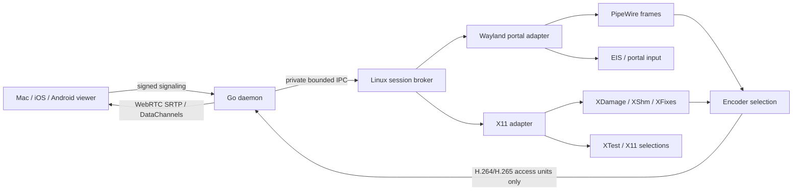

# Linux screen-sharing assessment and implementation plan

Date: 2026-09-18
Baseline: `main` at `c47209d` (`v0.4.174`)

## Outcome

Add Linux as a first-class remote-screen **host** without weakening Dieter's
authenticated WebRTC design or requiring a privileged daemon. The supported
implementation should cover modern Wayland desktops first, retain a real X11
fallback, work across Intel, AMD, NVIDIA, and CPU-only machines, and degrade
truthfully when a compositor, portal, encoder, or clipboard feature is absent.

The existing Mac, iOS, and Android viewers remain the initial Linux-host clients.
A native Linux viewer is a separate product workstream: the protocol permits one,
but this repository currently has no Linux application shell, decoder surface, or
input UI. Linux host support must not wait for that client.

## Implementation status (2026-09-19)

The first production vertical slice is now implemented in this repository:

- Linux releases contain an unprivileged `dieter-capture` companion built against
  a Debian 12 ABI baseline and staged atomically with the daemon by install and
  managed update paths on amd64 and arm64.
- The helper implements bounded DTH2/DTH3 frames, acknowledgements, watchdog,
  frame credits, four independent renditions, H.264 Annex-B output, live bitrate
  changes, geometry restart generations, keyframe refresh, and clean child/process
  cancellation using in-process GStreamer rather than FFmpeg or `gst-launch`.
- X11 uses XImage/XDamage through GStreamer, XRandR monitor enumeration, embedded
  cursor capture, and XTest pointer/button/scroll/physical-key control with held
  input release.
- Wayland uses XDG ScreenCast or combined RemoteDesktop sessions, PipeWire file
  descriptors and node IDs, persistent restore tokens kept privately under
  `DIETER_HOME`, embedded cursor mode, and bounded portal Notify input methods.
- A daemon started before login discovers only an allow-list of graphical values
  from same-UID processes. Explicit `service.env` values remain authoritative for
  ambiguous multi-session accounts.
- Capabilities, permission onboarding, doctor diagnostics, setup degradation,
  README/Linux installation docs, installer archive validation, service staging,
  rollback update, and release CI now understand the Linux helper.
- Local evidence covers the active Plasma/X11 monitor with a discarded real
  640×360 frame, passive KDE portal v5/v2 discovery, and a synthetic end-to-end
  helper/WebRTC lifecycle matrix. CI runs the deterministic matrix; compositor,
  GPU, distro, and physical viewer qualification remains a release gate, not an
  implied pass.

The following design items remain deliberately unadvertised: a multi-grant
list/rename/revoke API, a session-side autostart broker for simultaneous seats,
EIS (the standard portal Notify fallback is used), zero-copy DMA-BUF proof,
separate cursor metadata, committed Unicode text, clipboard/image/file transfer,
HEVC/LTR, physical mode switching, and Dieter-owned virtual desktops. The
remainder of this document is the assessment and phased qualification record for
those follow-ups; it must not be read as a claim that unavailable matrix cells
passed.

The architectural recommendation is:

- keep the Go daemon responsible for enrollment, authorization, signed session
  binding, WebRTC/ICE/TURN, adaptation, pacing, recovery, and bounded ownership;
- add one unprivileged native Linux session helper that owns portal/X11 access,
  raw frames, encoding, cursor metadata, input, and clipboard operations;
- use XDG ScreenCast/RemoteDesktop portals and PipeWire as the primary Wayland
  path, with `ConnectToEIS`/libei for input when available;
- use a separate X11 backend based on XDamage/XShm/XFixes/XTest when a portal is
  unavailable or unsuitable;
- keep raw pixels outside the daemon and send only bounded encoded access units
  through the existing native-helper protocol;
- require no root daemon, setuid helper, unrestricted `/dev/uinput`, DRM scraping,
  compositor patch, or desktop-specific private API for the supported path.

## Current assessment

### What is already portable

The expensive and security-sensitive network layer does not need a Linux rewrite.

| Layer | Current state | Linux reuse |
| --- | --- | --- |
| Enrollment and identity | Per-daemon Ed25519 identity, authenticated local/direct/relay routes | Reuse unchanged |
| Session binding | Offer hash, DTLS fingerprint, nonce, expiry, display, control, input protocol, and epoch are signed | Reuse, after source-selection semantics are generalized |
| Media transport | Pion WebRTC, ICE/TURN, SRTP, TWCC/GCC, bounded pacing, NACK, FEC, and recovery | Reuse unchanged |
| Session ownership | Four-client limit, one controller, leases, disconnect grace, handoff, and release semantics | Reuse with helper-reported limits |
| Adaptation | Bitrate/FPS/geometry ceilings, receiver feedback, content signals, queue/encode telemetry | Reuse; Linux helper must emit equivalent metadata |
| Viewers | Mac, iOS, and Android consume capability-driven H.264 sessions | Reuse; remove Mac-specific copy in user-facing strings |
| CLI/API routes | Local, direct TLS, and relay support every screen operation | Extend through the normal proto/core/Connect/CLI parity process |

The local helper boundary is also a good foundation. `internal/remotedesktop`
already defines bounded encoded frames, live configuration, input commands,
cursor/state events, clipboard and display service contracts, helper liveness,
one native process with up to four renditions, and a frame-credit protocol. The
Linux helper should implement this boundary rather than introducing a second
transport stack.

### What was hard-coded to macOS at the baseline

At `c47209d`, before the implementation summarized above, Linux returned:

```json
{
  "platform": "linux",
  "unavailableReason": "Native screen sharing is currently supported on macOS only",
  "controlPermission": "unsupported"
}
```

The baseline blockers were concrete; the production slice above resolves items
1–6 and the single-session cases of 7–10, while the remaining generalizations
stay in the follow-up phases below:

1. `NewFrameSource`, `SourceAvailable`, `CaptureExecutable`, and `ProbeControl`
   gate production capture/control on `runtime.GOOS == "darwin"`.
2. The native source description, permission diagnostics, and failure
   classification name ScreenCaptureKit, VideoToolbox, TCC, and macOS directly.
3. Capability readiness requires a hardware encoder and infers clipboard/control
   support from `runtime.GOOS`, rather than using helper-reported features.
4. The Swift helper implements ScreenCaptureKit, VideoToolbox, CoreGraphics input,
   AppKit pasteboards, and CoreGraphics display modes. There is no Linux helper.
5. `dieter setup` and the interactive permission guide declare every non-macOS
   host headless and only know how to open macOS privacy panes.
6. Linux release archives and the managed rollback runtime contain only `dieter`;
   macOS alone stages `dieter` and `dieter-capture` atomically.
7. The systemd unit is deliberately login-independent. A graphical environment
   may be imported into the user manager, but capture ownership is not explicitly
   tied to one login session, seat, compositor, or portal instance.
8. The API assumes displays can be passively enumerated before a session starts.
   Wayland portals intentionally require user-mediated source selection and may
   expose only previously authorized restore tokens.
9. `control_supported` and `clipboard_supported` are too coarse for Linux. A host
   may support pointer/buttons but not committed Unicode text, text clipboard but
   not files, or embedded cursor but not cursor metadata.
10. The signed binding uses the requested display ID before native capture starts.
    A portal-selected source cannot be substituted later without a new signed
    source identity.

### Live Linux feasibility evidence

The current development host is a useful first target, not the whole support
claim:

| Item | Observed |
| --- | --- |
| OS/session | Garuda/Arch, Plasma 6, active X11 session on seat0 |
| Portal interfaces | ScreenCast v5, RemoteDesktop v2 with `ConnectToEIS`, Clipboard v1 |
| Capture stack | PipeWire 1.6, WirePlumber, `pipewiresrc`, KDE and GTK portal backends |
| Input stack | libei 1.6 |
| Encoders | GStreamer VA H.264 available; OpenH264 and x264 software fallbacks available |
| Service environment | User manager has `DISPLAY`, `XAUTHORITY`, session bus, and runtime directory |
| Dieter state | Daemon healthy but screen capability is rejected by the explicit macOS-only gate |

This host should prove KDE/X11 portal and native-X11 paths. It does not establish
GNOME Wayland, KDE Wayland, wlroots, NVIDIA, multi-seat, ARM64, or headless
behavior; those remain mandatory matrix cells below.

## Linux support model

Linux desktop APIs differ by compositor, session type, and local consent. Support
must be a capability matrix, not one Boolean.

| Environment | Capture | Control | Clipboard | Product status |
| --- | --- | --- | --- | --- |
| Wayland with ScreenCast + RemoteDesktop portal | PipeWire portal stream | EIS preferred; portal Notify methods as bounded fallback | Portal clipboard when implemented | Primary supported path |
| Wayland with ScreenCast only | PipeWire portal stream | Unavailable | Backend-dependent, normally unavailable | Supported view-only |
| X11 with usable portal | Same portal path as Wayland | EIS/portal when offered | Portal when offered | Preferred X11 path |
| X11 without suitable portal | XDamage/XShm, XFixes cursor | XTest with tracked release | X11 selections | Supported fallback |
| Headless virtual desktop | Explicit Dieter-owned Xvfb or qualified nested Wayland session | Backend-local input | Backend-local clipboard | Opt-in, separately managed |
| TTY/SSH with no graphical session | None | None | None | Daemon remains supported; screen host reports unavailable |
| Container | Only with explicit session/socket/device forwarding | Never inferred from container privilege | Backend-dependent | Best effort, not default support |
| DRM/KMS console scraping | Not used | Not used | Not used | Out of scope |

Portal support remains honest about local consent. Dieter must never claim that a
restore token guarantees silent reuse: portal backends may prompt again, revoke a
grant, change the selected source, or refuse unattended use.

## Target architecture



### Graphical-session broker

Do not let the long-lived daemon guess which desktop owns `$DISPLAY` or
`$WAYLAND_DISPLAY`. Add a small session-side mode to the Linux helper and start
it through the XDG autostart mechanism, with optional integration into
`graphical-session.target` where the desktop supports it.

The broker should:

- register its login session ID, seat, session type, desktop, display/Wayland
  socket, portal versions, and process identity with the daemon over a private
  Unix socket;
- authenticate with peer credentials and a per-installation nonce under
  `DIETER_HOME`, never a network-listening helper;
- keep one broker per active graphical login and allow an operator to choose when
  the same account has multiple seats or sessions;
- own portal requests and prompts in the correct local desktop;
- disappear on logout and force release of all portal/EIS/XTest input state;
- permit the daemon to start before login and advertise "no graphical session"
  until a broker registers.

This also avoids relying on one global systemd user-manager environment in a
multi-session account. The existing daemon stays boot-persistent and headless.

### Portal authorization and source identity

Wayland source selection cannot be modeled as passive display enumeration.
Introduce locally approved **screen grants**:

1. `dieter daemon permissions` asks the active broker to create a combined
   RemoteDesktop/ScreenCast session and lets the local portal choose a monitor,
   window, or virtual source.
2. Where supported, the helper records the opaque restore token, portal backend,
   session/seat identity, source type, and a non-secret display label in a `0600`
   Dieter-owned record. Never log the token.
3. Capabilities expose opaque grant IDs as selectable sources. A remote viewer
   can select only an existing grant; it cannot silently broaden that grant.
4. The signed session binding covers the grant/source ID. The helper reports the
   actual stream geometry and a new display generation before input is armed.
5. An invalid/revoked token transitions to `local_consent_required`; it does not
   fall back to a different monitor or continue with input.
6. Add list/rename/re-authorize/revoke operations with CLI, API, help-contract,
   native-client, direct-TLS, relay, and documentation parity.

Older portal versions without persistence may run an explicitly interactive,
one-session grant. Clients must show "waiting for approval on the Linux host"
and use a bounded authorization lifetime. The current ten-second first-frame
deadline must begin after authorization, not while a person is answering a portal
dialog.

### Capture and cursor

The primary capture adapter should negotiate ScreenCast through D-Bus, obtain the
PipeWire remote FD and node IDs, then keep the raw buffers inside the helper.

- Prefer DMA-BUF through to a hardware encoder when format/modifier negotiation
  succeeds.
- Provide a measured shared-memory/copy fallback for compositors and encoders
  that cannot share a modifier.
- Translate PipeWire cursor metadata into the existing bounded cursor PNG,
  hotspot, position, visibility, generation, and input-ordinal events.
- If only embedded cursor mode is available, force it and advertise that separate
  cursor presentation is unavailable.
- Preserve damage/content metadata, monotonic timestamps, frame IDs, display
  generations, first-frame deadlines, static refresh, keyframe requests, latest
  raw-frame replacement, and frame credits.
- Never send raw BGRA/NV12/DMABUF content into the Go daemon.

The X11 adapter should use XDamage to avoid redundant frames, MIT-SHM when safe,
XFixes for cursor shape/position, and RandR for monitor geometry. A compositor
without damage support may use bounded polling with an explicit degraded reason.

### Encoding strategy

Keep encoder policy inside the Linux helper and report the exact selected
implementation. The recommended production order is:

1. VA-API H.264 for qualified Intel/AMD drivers;
2. NVENC H.264 for qualified proprietary NVIDIA drivers;
3. V4L2 request/stateful encoders on qualified ARM64 systems;
4. bounded OpenH264/x264 software fallback, initially capped at 1280×720/30;
5. no session, with an actionable reason, if no compatible encoder exists.

Use a standalone helper linked to desktop/media libraries; do not add cgo to the
portable daemon. A bounded implementation spike should compare direct
PipeWire/libei/VA-API integration with a GStreamer 1.x pipeline. GStreamer is the
default recommendation because its PipeWire, VA, NVIDIA, V4L2, format conversion,
and software encoder plugins are widely packaged, but the decision gate must
prove:

- valid H.264 Annex-B access units and actual SPS/profile/level compatibility;
- live bitrate/FPS/geometry updates and forced IDR behavior;
- 1080p60 hardware operation without unbounded queueing or CPU readback;
- one shared capture feeding independent bounded renditions;
- predictable plugin discovery and actionable errors on supported distros;
- clean cancellation, no orphaned pipeline, and no shell or `gst-launch`/FFmpeg
  subprocess protocol.

Do not advertise HEVC until each Linux encoder path is hardware-qualified against
all native viewers. Apple long-term-reference recovery is optional: add a
`reference_recovery_supported` capability and retain ordinary IDR/NACK/FEC on
Linux encoders that cannot provide equivalent reference semantics.

Readiness must no longer require hardware unconditionally. Capabilities should
distinguish encoder availability, hardware acceleration, selected backend,
operating envelopes, and degraded software limits.

### Input

For a portal session, request only the device classes the operator enabled.
Prefer `RemoteDesktop.ConnectToEIS`; retain the portal's bounded Notify methods
for older implementations. On X11, use XTest under the graphical-session broker.

Required invariants:

- map the existing USB HID page-0x07 `physical_key` values to Linux evdev/XKB
  codes in one checked-in, cross-language-tested table;
- retain state/pointer lanes, ordinals, barriers, display generations, control
  generations, epochs, one machine-wide controller, and acknowledged
  `release_all`;
- release held keys/buttons on control handoff, focus loss, helper/portal exit,
  session lock/logout, compositor restart, route expiry, and daemon shutdown;
- do not use `/dev/uinput` or grant input-group/root access in the supported path;
- report pointer, buttons, scroll, physical keyboard, committed text, and touch as
  separate capabilities.

Arbitrary committed Unicode text is not portable through EIS/XTest alone. The
first control release may support physical keys and layout-aware text that can be
proved through XKB. Do not emulate unsupported Unicode by silently overwriting
the clipboard and pasting. Add explicit text-input capability and let viewers
disable their IME text path when the host cannot honor it.

### Clipboard and files

Use the portal Clipboard interface when it is available for the same authorized
remote-desktop session. Use native X11 selection ownership only in the X11
fallback. Preserve Dieter's current control-generation checks, explicit enable,
size limits, staging cleanup, operation IDs, and no-replay rule.

Advertise text, images, and files independently. Ship text first. Image MIME and
file URI behavior varies across portals/desktops and must stay disabled until it
passes byte-for-byte tests on each claimed backend. Closing a portal session must
invalidate clipboard access immediately.

### Physical display modes and audio

Wayland has no general safe equivalent to the current temporary CoreGraphics
display-mode lease. Report physical mode switching unsupported for portal grants.
X11 RandR mode changes may be implemented later behind the existing explicit,
controller-only, auto-restore contract, but are not required for Linux launch.

System audio is currently unsupported on every host and should remain a separate
protocol/product project. Do not couple Linux video availability to audio.

## Contract changes

Extend capabilities additively and keep old clients conservative. The exact field
numbers are assigned during implementation with `just proto`.

Recommended additions:

- capture backend and graphical-session ID/type/desktop/seat;
- source-selection mode: enumerated, authorized grants, or interactive one-shot;
- opaque source/grant records and whether local consent is required;
- portal interface versions and persistence support as diagnostics, not trust;
- encoder modes with hardware/software identity and per-mode ceilings;
- helper limits for captures, encoders, and clients instead of hard-coded four;
- cursor modes: metadata, embedded, or unavailable;
- granular pointer/button/scroll/keyboard/text/touch input support;
- granular text/image/file clipboard support;
- reference recovery, live reconfiguration, and physical mode switching flags;
- structured readiness codes alongside human-readable reasons.

Generalize the local helper contract:

- retain the bounded DTH3 multiplex framing and JSON command limits where
  possible;
- add protocol/capability negotiation rather than identifying support by OS;
- replace macOS-specific error-string parsing with structured error codes;
- report encoder/backend descriptions from helper state rather than hard-coded
  `ScreenCaptureKit / VideoToolbox` strings;
- make capture, input, clipboard, and display services optional independently;
- scope every command and event to broker/session/source generations so a stale
  graphical login cannot receive input.

The Mac helper remains compatible with the generalized contract. Previous
released clients must either connect with their existing H.264 assumptions or
receive a clear upgrade requirement; absent new fields must never enable a Linux
feature by default.

## Packaging, installation, and updates

The static Linux daemon must stay portable. Package the Linux helper separately
inside the same signed release archive and atomically stage the daemon/helper pair
for managed installations.

Required work:

1. Extend `serviceruntime.PlatformRuntime` from one Linux executable to a verified
   pair, with helper architecture/libc metadata and the existing activation
   journal/rollback guarantees.
2. Extend the installer archive allowlist and tests without making a partial
   helper overwrite possible.
3. Build amd64 and arm64 helpers in a pinned, oldest-supported glibc environment.
   Continue supporting the static daemon on Alpine; advertise screen hosting
   unavailable there until a separately tested musl helper exists.
4. Sign the manifest exactly as today; verify helper digest, ELF architecture,
   regular-file mode, and protocol version before activation.
5. Install an inert XDG autostart/session-broker entry. It may register the local
   session but must not start capture or request portal permissions by itself.
6. Add `dieter doctor` checks for active graphical sessions, portal backends and
   versions, PipeWire, EIS, capture plugins, usable render devices, encoders,
   session broker registration, and saved-grant health. Never auto-install distro
   packages or add the user to privileged groups.
7. Document exact package names for Ubuntu/Debian, Fedora, Arch/Garuda, and the
   tested NVIDIA path. Keep dependency failures feature-scoped.

If one portable dynamic helper cannot meet the glibc and plugin matrix, publish
explicit `gnu`/`musl` or distro packages rather than silently breaking the static
daemon's current distribution coverage.

## Implementation sequence

### P0 — Contract and feasibility gate

- Add fake Linux helper contract tests for capabilities, grants, structured
  errors, session generations, partial input/clipboard support, and old-client
  fallback.
- Prototype portal ScreenCast + RemoteDesktop + PipeWire on KDE X11, KDE Wayland,
  and GNOME Wayland.
- Compare direct media integration with the bounded GStreamer helper design.
- Prove H.264 decode on Mac, Android, and iOS through the existing authenticated
  fixture and record actual encoder/profile/level.
- Decide the helper implementation/toolchain only after measuring CPU copies,
  startup, cancellation, packaging, and distro behavior.

Exit: one documented helper stack passes view-only 1080p60 hardware capture on at
least Intel/AMD and has a bounded 720p30 software fallback.

### P1 — Session broker, grants, and view-only portal capture

- Implement broker registration, multi-session selection, logout cleanup, portal
  authorization, restore-token storage, and grant lifecycle operations.
- Generalize source discovery/capabilities/readiness and helper IPC.
- Stream H.264 through the unchanged WebRTC path with cursor embedded when
  metadata is unavailable.
- Add Linux permission/setup CLI flows and native-client waiting/consent states.

Exit: a fresh supported Wayland install can authorize locally, connect from each
native viewer, select only the approved source, render pixels, reconnect, revoke
the grant, and leave no capture after logout or disconnect.

### P2 — Cursor metadata and control

- Add PipeWire cursor metadata, EIS input, portal Notify fallback, HID-to-evdev/XKB
  mapping, granular capabilities, and acknowledged release.
- Test control handoff, host-local interruption, locks, portal/compositor restart,
  keyboard layouts, drag/scroll, and failure during held input.

Exit: no stuck key/button across the full lifecycle matrix; unsupported text or
device classes are visibly unavailable rather than dropped.

### P3 — X11 fallback and clipboard

- Implement XDamage/XShm/XFixes capture/cursor, XTest input, and X11 selections.
- Implement portal text clipboard and independent feature reporting; add images
  and files only after backend-specific byte tests.
- Ensure portal remains preferred when it provides a stronger consent boundary.

Exit: KDE/GNOME/Xfce X11 hosts work without a suitable portal, and portal/X11
clipboard failures cannot stall capture or input.

### P4 — Hardware breadth, adaptation, and concurrency

- Qualify Intel/AMD VA-API, NVIDIA NVENC, ARM64 V4L2, and software fallback.
- Share one capture per source while keeping per-viewer encoder/recovery state
  bounded; report actual helper limits.
- Feed damage, encode cost, drops, and configuration acceptance into the existing
  controller. Validate static refresh and congestion recovery.
- Enable HEVC or reference recovery only per verified encoder mode.

Exit: one, two, and four viewers behave within advertised limits; a slow viewer
does not stall another, and aggregate memory/FD/GPU use reaches a stable plateau.

### P5 — Packaging, update, and distro release gate

- Build, sign, install, update, roll back, and uninstall the daemon/helper pair.
- Add archive execution and screen-helper probes on supported distro containers,
  plus physical graphical runners for Wayland/X11/GPU cases.
- Update README, Linux guide, public screen guide, CLI skill, offline help, and
  setup output. Preserve headless daemon support when screen dependencies are
  absent.

Exit: signed install and remote self-update cannot produce a daemon/helper version
mismatch, and all supported distributions report truthful doctor/capability state.

### P6 — Explicit virtual desktops and optional Linux viewer

- Add an opt-in managed virtual desktop profile using a qualified Xvfb or nested
  Wayland compositor. It must be isolated from the physical console, have explicit
  lifecycle/data ownership, and never imply capture of an unattended real seat.
- Separately assess a Linux viewer (for example GTK4/libadwaita with a native
  WebRTC/GStreamer decode surface). Reuse the network/input contract; do not delay
  host support or embed a browser merely to claim Linux viewing.

Exit: virtual sessions are reproducible and clearly labeled; any Linux viewer has
native decode/presentation, control safety, and the same route/trust tests as the
existing clients.

## Qualification matrix

Every claimed cell needs observable pixels and real input, not only an RPC or a
PipeWire frame.

| Axis | Required coverage |
| --- | --- |
| Desktop/session | GNOME Wayland, KDE Wayland, KDE/GNOME/Xfce X11, login before/after daemon, lock/unlock, logout/login, compositor restart, multi-seat/multi-session |
| Distribution | Ubuntu 24.04+, Debian 12+, Fedora current, Arch/Garuda; Alpine daemon-only until musl helper qualification |
| GPU/encoder | Intel VA-API, AMD VA-API, proprietary NVIDIA NVENC, ARM64 V4L2 candidate, CPU software fallback, no-encoder failure |
| Portal | Current GNOME/KDE backends, ScreenCast-only view path, EIS and Notify input, consent denied/cancelled, restore token accepted/revoked/changed |
| Capture | 1080p60 baseline, mixed scale/rotation, multiple monitors, hotplug, static desktop refresh, cursor-only movement, embedded/metadata cursor |
| Control | Pointer/buttons/drag/scroll, physical keys, layouts, supported text, handoff, viewer focus loss, host lock, helper death, release acknowledgement |
| Clipboard | Explicit opt-in, text first, image/file where claimed, lazy provider timeout, grant expiry, clipboard during loss/control handoff |
| Routes | Loopback, verified direct TLS, gateway relay; direct UDP and TURN UDP/TCP/TLS media candidates asserted separately |
| Clients | Previous and current Mac/Android/iOS clients in both directions; unsupported capability fallback; session generation and binding verification |
| Network/performance | LAN/Wi-Fi/WAN, capacity steps, jitter/loss/reordering, queue age, input-to-present distribution, 60-minute motion and idle soaks |
| Resources/security | Four-viewer bound, FD/memory/GPU plateau, no raw-frame daemon buffers, peer-credential rejection, stale broker/grant rejection, no root/uinput dependency |

Add a Linux real-screen fixture parallel to the existing Mac and Android tooling.
It should launch an owned test surface inside an isolated graphical session,
authorize a disposable portal/X11 backend, verify pixel changes caused by actual
input, and retain machine-readable evidence. Never use the operator's live daemon,
desktop, portal grants, clipboard, or network configuration.

## Definition of done

Linux screen hosting is ready to advertise only when:

- capabilities identify the real session, source, backend, encoder, limits, and
  degraded features without OS inference;
- Wayland capture uses the portal/PipeWire consent boundary and never substitutes
  a broader source after authorization;
- all control paths are unprivileged, generation-scoped, and prove release on
  every ownership/lifecycle transition;
- software fallback is bounded and visibly lower-capability, while missing media
  dependencies leave the rest of the daemon healthy;
- the signed installer/updater atomically manages compatible daemon/helper
  versions and rolls both back together;
- local/direct/relay API, CLI/help, native clients, generated schemas, README,
  Linux docs, public docs, and the CLI skill agree;
- deterministic, native, physical, compatibility, and soak gates pass for every
  claimed support tier;
- unsupported environments remain explicitly headless rather than receiving an
  unsafe or misleading fallback.

## Files expected to change

The implementation will span at least:

- `api/proto/dieter/v1/dieter.proto` and all generated/copied clients;
- `internal/remotedesktop` source selection, capabilities, permissions, helper
  protocol, clipboard, display, and test fixtures;
- a new `native/linux-capture` helper and broker implementation;
- `internal/cli` setup, permissions, doctor, service/autostart, help, and route
  tests;
- `internal/serviceruntime`, Linux update staging, installer, release archives,
  and distribution tests;
- Mac, iOS, and Android capability/UI handling;
- `scripts/qualify_screens.py` and Linux graphical integration runners;
- README, Linux support guide, public Screens guide, and
  `.agents/skills/dieter-cli/SKILL.md`.

This is deliberately a host-backend project, not a WebRTC rewrite. The current
transport, viewers, adaptation, security binding, and bounded recovery mechanisms
are assets to preserve.
