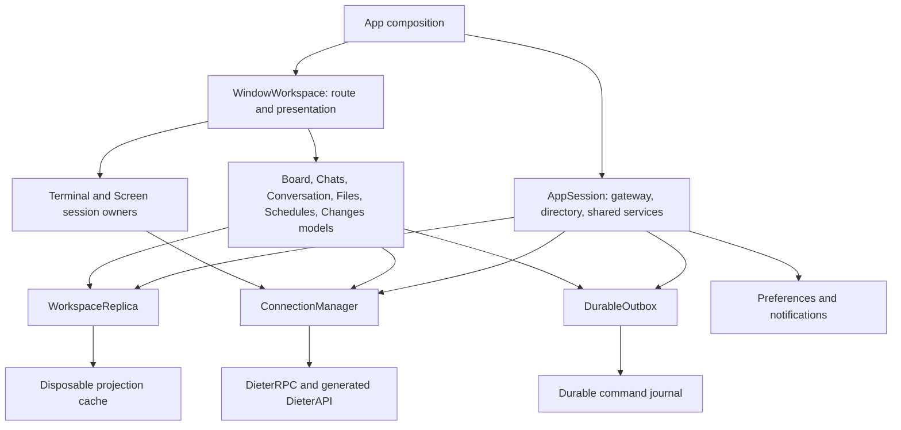

**Dieter Mac code quality review and refactoring proposal — 8 September 2026**

The Mac app has a solid functional foundation and several good reusable components. Its main constraint is ownership: connection management, replicated data, pending commands, navigation, editor sessions, and feature presentation still meet in one mutable `DieterStore`. The next refactor should make those responsibilities independently testable and give each asynchronous operation an explicit owner and destination.

I recommend an incremental refactor using the app's existing SwiftUI Observation, actors, value reducers, and small RPC protocols. First repair the correctness issues below. Then extract feature models, consolidate routing and persistence, and introduce SwiftPM boundaries once the dependencies are clear. A framework migration or a wholesale rewrite would add substantial migration risk without addressing these issues directly.

This is a proposal. Production code was not changed. The subsequent implementation is documented in [the 9 September implementation record](mac-refactoring-implementation-2026-09-09.md).

**Review scope and evidence.** The source baseline is commit `162357792460e60ffb2da5a80bb27936d260b7d4`, initially with a clean working tree. The review covered the handwritten app, transport and authentication, synchronization/outbox, every main feature surface, AppKit/WebRTC adapters, tests, packaging, CI, and vendoring policy. Generated API and vendored dependencies were reviewed at their integration boundaries; this is not an audit of every upstream implementation or a complete security assessment.

| Source inventory | Size |
|---|---:|
| Handwritten production Swift, excluding smoke hooks | 69 files / 27,976 lines |
| UI | 25 files / 16,404 lines |
| Model | 38 files / 9,132 lines |
| Networking | 5 files / 1,925 lines |
| App entry/composition | 515 lines |
| `DieterStore` and its seven feature extensions | 5,048 lines, roughly 200 mutable declarations in the root type |
| Views accessing the full store through `@Environment` | 71 declarations |
| App-side smoke hooks | 10 files / 3,991 lines |
| Permanent unit/render tests | 17 files / 5,227 lines |

Line counts include comments and blank lines. These are navigation and coupling indicators, not quality scores. In particular, Observation tracks property reads: having one large observable object does **not** mean every write automatically redraws every view.

**The existing architecture has several distinct data flows.**

1. `DieterMacApp` owns one store and injects it into the workspace windows, menu-bar content, and Island. The persistent menu-bar surface starts connection work, including when no workspace window exists.
2. `connect` discovers machines through the gateway, probes verified direct TLS before relay, checks compatibility, loads initial state, and commits the new route only after preparation. One active machine has a live global sync stream; other machines are polled into the on-device directory.
3. Global sync reduces snapshots/deltas, reconciles optimistic changes, publishes project/card/chat projections, and schedules disk checkpoints. A separately selected conversation loads a cached tail, fetches current data, and starts its own stream.
4. Conversation creates and messages enter a durable-command outbox with stable client/command IDs. Other mutations generally go directly through RPC and then change local state or refresh it.
5. Files use surface generations, shared reads, and an AppKit editor session. Project Changes has its own injected feature model. Conversation worktree changes remain in the central store. Terminals use daemon-owned sessions with local output observers. Screens has a separate controller and signaling connection.

The architecture should preserve the daemon as the authority, the gateway's machine-only role, independent remote execution lifetimes, and the distinction between transport cancellation and stopping remote work.

**Correctness findings should lead the work.** Priority P1 means address promptly because user work or an explicit lifecycle action can be affected. P2 means address in the initial refactor because it creates a concrete consistency or resource-management risk. “Source-traced” means the causal path is present in code, but the complete timing scenario was not reproduced through live UI.

| ID | Priority | Finding | Evidence level |
|---|---|---|---|
| F1 | P1 | Failed outbox persistence is swallowed before delivery is allowed | Isolated reproduction |
| F2 | P1 | Save acknowledgement can replace edits made during an in-flight save | Component reproduction and UI source trace |
| F3 | P1 | Screens can continue connecting after Disconnect or leaving the surface | Source-traced |
| F4 | P2 | Several mutation completions and background refreshes lack destination ownership checks | Source-traced |
| F5 | P2 | Workspace-card updates use a board ID in a project-keyed dictionary | Isolated reproduction |
| F6 | P2 | Terminal input is chunked but its pending queue is unbounded | Source-traced |

**F1: make local command acceptance depend on successful persistence.** [The outbox entry point](/Users/dbpprt/Development/dieter/apps/mac/Sources/DieterMac/Model/DieterStore+Sync.swift:449) uses `try? await saveSyncPersistence()` and always proceeds to start the worker. [Sending a message](/Users/dbpprt/Development/dieter/apps/mac/Sources/DieterMac/Model/DieterStore+Conversation.swift:409) clears the composer before that boundary. Its surrounding error handler cannot recover from a disk failure that was already swallowed.

An injected disk-full writer reproduced this exact offline state: one queued message in memory, empty composer, no user-facing error, zero successful writes, and zero messages restored from disk. Online delivery could also begin without a durable local record. The existing command IDs are valuable protection against replay and must be retained.

Introduce a throwing `Outbox.enqueue(command)` boundary that returns only after the command is durably recorded. Keep or restore the draft when that fails, and prevent any worker from seeing uncommitted entries. Separate the durable pending-command journal from disposable projection checkpoints: currently both share one JSON document. Cache corruption should not silently turn pending user commands into an empty queue; the current [load path](/Users/dbpprt/Development/dieter/apps/mac/Sources/DieterMac/Model/DieterSyncPersistence.swift:381) also deserves recovery handling. Start with a small atomic journal using the existing storage approach; a database is not required to fix this.

Acceptance: injected disk-full and corrupt-cache cases preserve recoverable commands; no RPC is dispatched before successful enqueue; restart after acceptance retains the same command ID; ambiguous remote success is reconciled without creating a second logical command.

**F2: distinguish document identity, server revision, and local edit revision.** [FilesView.save](/Users/dbpprt/Development/dieter/apps/mac/Sources/DieterMac/UI/FilesView.swift:224) captures the current text, waits for RPC, then calls `markSaved` with the returned content. [FileEditorSession.markSaved](/Users/dbpprt/Development/dieter/apps/mac/Sources/DieterMac/Model/FileEditorSession.swift:57) overwrites the live buffer and clears its dirty flag. Editing remains enabled while saving. The store's guards verify the selected file and read generation, but typing does not advance that generation.

A component probe captured edit A, simulated edit B while A was in flight, and applied A's acknowledgement. B was replaced and the document became clean. There is another replacement path: FilesView reacts to changes in the server revision by calling `prepare`, and the native editor is keyed by path plus that revision. Fixing only `markSaved` would leave that path active.

Use a stable document identity containing endpoint/project/workspace/path, a separate server revision, and a local edit counter. A save captures the local counter and submitted content. On success, advance the server revision; mark clean only if the current buffer still matches that submission. Retain newer edits and keep the editor dirty. Serialize or coalesce saves per document so repeated Save actions do not submit against the same obsolete server revision.

Acceptance: edit during a deliberately delayed save survives; repeated saves do not race; navigating away during a save cannot alter another document; save failure preserves the buffer; external revision conflicts remain explicit. Add the delay case to the real native editor journey, since the current smoke test covers an ordinary edit/save/revisit sequence.

**F3: give Screens one owned connection attempt and peer identity.** [ScreensView](/Users/dbpprt/Development/dieter/apps/mac/Sources/DieterMac/UI/ScreensView.swift:83) starts `connect` in an unstructured task. Disconnect cancels established signaling/media tasks, but it does not own or invalidate that setup task. [RemoteDesktopController.connect](/Users/dbpprt/Development/dieter/apps/mac/Sources/DieterMac/Networking/RemoteDesktopController.swift:199) awaits route creation, settings, capabilities, and WebRTC setup without an attempt-generation check. A result arriving after Disconnect can assign a connection and start a peer session again.

The [peer delegate callbacks](/Users/dbpprt/Development/dieter/apps/mac/Sources/DieterMac/Networking/RemoteDesktopController.swift:735) also forward to the current controller without verifying that the emitting peer is still current. A queued callback from a retired peer can therefore affect a successor session.

Own a `connectTask` and increment a session generation on connect/disconnect. Validate generation and peer identity after every suspension and before accepting callbacks. A superseded route must be closed even when its factory finishes late. Wrap WebRTC continuations with an explicit cancellation policy. Inject route creation and peer-session adapters so connect → disconnect → delayed completion and connect A → connect B → old callback are deterministic tests. Keep existing signed binding, display, control-grant, epoch, and input-channel checks intact.

**F4: apply the same ownership rule to mutations, streams, and background work.** Reads already demonstrate the desired technique in `OwnedRead`, file loading, conversation selection, and `ProjectChangesModel`. Some mutations still publish into whichever surface happens to be selected after an `await`:

- [Delete/move file](/Users/dbpprt/Development/dieter/apps/mac/Sources/DieterMac/Model/DieterStore+FilesAndSettings.swift:142) clears `fileDocument` after the remote call without confirming that the original file surface is still current.
- [Schedule save/toggle/run](/Users/dbpprt/Development/dieter/apps/mac/Sources/DieterMac/Model/DieterStore+FilesAndSettings.swift:294) updates the shared schedule array or selection without checking the captured endpoint/project. Loading schedules has substantially better guards.
- [Add comment](/Users/dbpprt/Development/dieter/apps/mac/Sources/DieterMac/Model/DieterStore+Conversation.swift:637) can replace `selectedDetail` with the original conversation's response after navigation. [Archive](/Users/dbpprt/Development/dieter/apps/mac/Sources/DieterMac/Model/DieterStore+Conversation.swift:795) closes the current conversation unconditionally after archiving its captured card.
- [Inactive-machine polling and persistence](/Users/dbpprt/Development/dieter/apps/mac/Sources/DieterMac/Model/DieterStore+Connection.swift:725) spans multiple awaits without a deployment generation guard. The detached projection transformation can finish after its machine has become active or its gateway has changed. `refreshDaemonPresence` similarly publishes its captured gateway's directory without rechecking that gateway.
- [Global sync callbacks](/Users/dbpprt/Development/dieter/apps/mac/Sources/DieterMac/Model/DieterStore+Sync.swift:105) validate the endpoint ID, while conversation callbacks also validate client identity and selection generation. Reconnecting to the same endpoint needs the latter distinction too.

Capture a typed target and a presentation generation at command submission. Successful remote work should still update its own authoritative entity even if the user navigated away; only current-owner completions may change selection, drafts, alerts, or visible loading state. Use an operation ID for Git workflows and retain their original endpoint/card across every stage. Canceling the view's observer must continue to leave daemon-owned work running.

Acceptance: A → B → A navigation and same-endpoint reconnect tests release old reads, writes, and stream frames in an adversarial order. No response may alter a different surface or clear a successor's task/loading state.

**F5: eliminate manual fan-out across overlapping card collections.** [acceptWorkspaceCard](/Users/dbpprt/Development/dieter/apps/mac/Sources/DieterMac/Model/DieterStore+Workspace.swift:429) indexes `navigationCards` using `card.boardID`, although the directory is keyed by `projectID`. The probe confirmed that selected `state.cards` updates while `navigationCards[projectID]` retains the old workspace state. Navigating back through that directory can show stale data until another authoritative update repairs it.

Correct the key immediately and add the regression. The wider repair is one entity-upsert path with typed `ProjectID`/`BoardID`/`ConversationID` and a single base entity collection. Selected-board, sidebar, chat-list, and Island projections should derive from that collection plus pending-command overlays. Several retained views of data are reasonable; several independent mutation owners are expensive and error-prone.

**F6: bound terminal input as well as output.** [TerminalInputForwarder](/Users/dbpprt/Development/dieter/apps/mac/Sources/DieterMac/Model/DieterStoreSupport.swift:50) appends into per-terminal `Data` while another flush is suspended. Splitting outgoing data into 64 KiB RPC chunks does not cap that pending allocation. The terminal write RPC also lacks the explicit deadline already used by many read RPCs. A stalled write plus repeated typing or pasting can keep accumulating input.

Give each endpoint/terminal session an owned input pump with explicit byte capacity, a write deadline, and visible backpressure. Define an admission result so rejected bytes are reported rather than silently lost. Drain or retire pending bytes on route/session changes, and never automatically replay ambiguous terminal input. Preserve the bounded output accumulator and the rule that closing a client observer does not close a PTY.

**The strongest existing patterns are worth standardizing.**

| Existing pattern | Why it works | Where to reuse it |
|---|---|---|
| [ProjectChangesModel](/Users/dbpprt/Development/dieter/apps/mac/Sources/DieterMac/Model/ProjectChangesModel.swift:22) | Small RPC protocol, private mutation ownership, coalesced reads, bounded diff cache, reconciliation before success | Files, Schedules, conversation worktree changes; use as a starting point and audit its suspend/rebind contract during extraction |
| [OwnedRead](/Users/dbpprt/Development/dieter/apps/mac/Sources/DieterMac/Model/OwnedRead.swift:6) | Shares equivalent pending reads and cancels superseded transport work | Standard feature read helper, with typed keys and explicit feature lifecycle |
| [BackgroundPreparation](/Users/dbpprt/Development/dieter/apps/mac/Sources/DieterMac/Model/BackgroundPreparation.swift:3) and snapshot decoder | CPU-heavy work is separated from main-actor publication | Markdown, diffs, large metadata projection work |
| [BoardProjection](/Users/dbpprt/Development/dieter/apps/mac/Sources/DieterMac/Model/BoardProjection.swift:6) and conversation projection | Pure transformations, indexed output, explicit rendering limits | Chat list, sidebar, shared activity presentation |
| [TerminalOutputAccumulator](/Users/dbpprt/Development/dieter/apps/mac/Sources/DieterMac/Model/TerminalOutputAccumulator.swift:6) | Bounded output and coalesced publication | Other high-frequency presentation streams where measured demand warrants it |
| [DieterTheme](/Users/dbpprt/Development/dieter/apps/mac/Sources/DieterMac/UI/DieterTheme.swift:306), pane chrome, button styles, LoadFeedback | Shared visual vocabulary and existing accessibility behavior | Feature extraction without visual regressions |
| Generated API, fingerprint checks, canonical build caches, isolated native smoke driver | Repeatable client contracts and verification | Preserve throughout the migration |

The native `BoardLaneList` recycles offscreen card rows and reloads changed rows while hosting the existing SwiftUI cards; preserve this measured response to variable-height scrolling rather than treating every AppKit bridge as technical debt.

SwiftTerm and WebRTC are sensible implementation dependencies for complex native surfaces. The transport fork documents narrow compatibility patches and an exit criterion. Preserve and test those constraints when moving code; do not casually replace the documented task-allocation workaround with another concurrency construct.

**Refactor around lifetime and ownership.** The proposed object structure is:

`AppSession` lasts as long as the menu-bar app. It owns authentication, gateway selection, the shared workspace replica, outbox, connection services, preferences, and notifications. Its public surface should expose observable summaries and commands, not every task handle or cache.

`WindowWorkspace` owns navigation and surface presentation. The current [WindowGroup](/Users/dbpprt/Development/dieter/apps/mac/Sources/DieterMac/DieterMacApp.swift:26) injects the same store into every window, including the same selected conversation, composer, and sheets. If multiple windows are supported, they need independent selection and drafts while sharing the app session. If Dieter intentionally supports only one workspace window, use an explicit single-window contract and test reopen-from-menu-bar behavior. In both cases, background sync must survive closing the window.

Feature models should own their loading/error state, selected target, task cancellation, pagination, and drafts. Views should receive a focused model or value plus actions. A coordinator may connect features, but it should not become a renamed `DieterStore` containing the same 200 fields.

| Boundary | Proposed responsibility | Existing code to move or adapt |
|---|---|---|
| `ConnectionManager` | Explicit endpoint leases, direct/relay choice, compatibility, token renewal, bounded connection lifetime | Connection extension and RPC construction scattered through Workspace/Navigation |
| `WorkspaceReplica` | One base entity state per endpoint; apply snapshot/delta; compose optimistic overlays; publish affected projections | Sync extension, directory reducer, duplicated `accept*` methods |
| `DurableOutbox` | Journal commit, retry state, per-command identity, delivery/reconciliation, recovery UI summary | Outbox section of Sync and repeated enqueue code in Conversation/Workspace |
| `FilesModel` + `FileEditorSession` | File scope, listing/history, read identity, editor ownership, save acknowledgement | FilesAndSettings extension and FilesView's save orchestration |
| `ConversationModel` + `ComposerModel` | Selected conversation read/watch/history; draft and attachments; harness choice; send intent | Conversation extension and composer/timeline orchestration |
| `SchedulesModel` + editor draft | Project-owned cursor pages, run history, mutation ownership, preview | Schedules portions of FilesAndSettings and SchedulesView |
| `WorktreeChangesModel` | Conversation workspace, revision, selected diff, comments, Git operation observation | Workspace extension; share appropriate infrastructure with ProjectChangesModel |
| `TerminalSession` | Endpoint/terminal identity, bounded input/output, replay cursor and observer lifecycle | Terminal methods currently in Navigation, support types and terminal view adapter |
| `ScreenSession` | Owned connect attempt, peer identity, signaling, control state and teardown | RemoteDesktopController; separate trust verification and native input/media adapters |

Routing should use explicit destinations instead of requiring feature commands to mutate global selection before they can obtain a client. The selected workspace, directory poll, telemetry, outbox, and screen signaling may need different leases, but direct-TLS verification and fallback policy should have one implementation. Screens can retain its separate media lifecycle while sharing that route-selection service. Current differences, such as loopback-only probing for background directory refresh, should be named policy inputs rather than erased during deduplication.

For persistence, keep a migration path from the current `sync-state.json`: atomically establish the command journal before treating its migrated entries as deliverable; retain stable IDs; make migration restartable. The daemon still owns transcripts and domain data. Native projection files and pending client commands are separate client responsibilities, and must never become metadata written into registered project repositories.

**Reuse behavior before unifying visual layouts.** There are useful shared views already, but several behavioral rules are still copied:

- Extend the existing `ConversationCreationPreferences.resolved` and `ProviderOptionValues` into a shared `HarnessSelection` and destination-catalog loader from the [new-card form](/Users/dbpprt/Development/dieter/apps/mac/Sources/DieterMac/UI/Forms.swift:227), [standalone-chat form](/Users/dbpprt/Development/dieter/apps/mac/Sources/DieterMac/UI/ChatsView.swift:792), composer, and `HarnessFields`. Centralize provider/model/effort fallback and option validation. Each surface can keep its own layout and default-selection semantics.
- Centralize message intent construction used by `sendComposer`, `retryFailedTurn`, and `sendAgentMessage`. Their source payloads differ, but destination capture, IDs, durability, and failure reporting should share one enqueue path.
- Own composer drafts by conversation identity. Currently text and attachments are global store fields, and close/open does not reset or restore them per conversation. Attachment intake tasks also publish into those shared fields after asynchronous decoding. Use an explicit draft ID so a late import cannot attach to another conversation or overwrite an intervening send.
- Create an activity/status normalization layer with an unknown-value fallback. Notification transition handling is repeated in global snapshot, selected state, and chat refresh paths; menu-bar, Island, and conversation status vocabularies also differ. Preserve genuine distinctions between workflow lane, harness runtime, delivery, and Git operation status rather than merging them into one enum.
- Reuse the existing diff parser/projection/view for project and worktree review. Keep project-index operations and conversation merge/PR workflows distinct. Share operation observation, reconciliation, typed outcomes, and revision-aware diff paging where their contracts match.
- Split the large UI files by feature and component responsibility. `WorkspaceChangesView.swift` is 2,226 lines, ConversationView 1,954, Forms 1,898, and DieterRootView 1,470. They already contain many smaller types; moving those types improves discoverability, but the substantive improvement comes from moving effects and state ownership out of views and the full-store environment.

**Introduce compiler boundaries after the first feature extraction.** Keep the existing generated `DieterAPI` target. Add a small `DieterCore` target for typed identities, command values, pure reducers, projection rules, and narrow service contracts. Add `DieterClient` for RPC adapters, connection management, and persistence. Keep SwiftUI/AppKit/WebRTC presentation adapters in `DieterMac` initially. Feature folders are sufficient until a separate target would enforce a useful dependency rule.

The desired dependency direction is `DieterMac → DieterClient → DieterCore → DieterAPI`, with direct imports of Core/API where needed. Core should not depend on SwiftUI, AppKit, a singleton store, or process arguments. Full mirror copies of every protobuf type are unnecessary: introduce typed identities, explicit command targets, and view-specific projections where they prevent mistakes. Keep protobuf messages as transport contracts.

Existing reverse dependencies need to be untangled deliberately: [ConversationPresentation](/Users/dbpprt/Development/dieter/apps/mac/Sources/DieterMac/Model/ConversationPresentation.swift:28) calls grouping policies declared in the UI file, and syntax planning depends on language definitions currently in the editor UI. Move pure policies together before enforcing the boundary. Theme colors, native editor buffers, and WebRTC objects belong on the Mac side.

Create one explicit dependency container at app composition. Inject a preferences namespace, cache/journal roots, clock, credential access, and client factory. The current constructor reads process arguments and global defaults and exposes feature-specific test overrides. New test seams should describe real capabilities—such as FilesRPC or ConversationReader—rather than adding another override field to the central store. Avoid a huge protocol mirroring every generated RPC.

**Scaling work should target measured costs.** The board, transcript, Markdown, decoder, and diff code already impose useful rendering/cache limits. The next likely costs are repeated full metadata transformations and retained background state:

- A metadata change can rebuild project dictionaries, group all cards, deduplicate/sort chats, update selected state, and recompute activity sources on the main actor. Change the replica to update affected entities/indexes and publish one coherent feature projection per transaction. Preserve the existing no-op and conversation-only fast paths.
- `ChatListProjection.resolve` runs in `ChatsView.body`; pinned membership performs another filter/sort. `store.projects` sorts on access. Cache these projections by data/query/order revision, then measure whether the work belongs off the main actor. Do not add a detached task for every small collection.
- Inactive-machine refresh is sequential, repeatedly establishing temporary routes. Refresh duration therefore grows with fleet size and slow machines. Use bounded concurrency and reusable, expiring leases, with the active surface and user actions prioritized over background refresh. Avoid opening an unlimited live stream per machine.
- Define byte/count/lifetime budgets for pending commands, retained transcript history, Git logs, attachment preparation, and native image caches. Transcript rendering is bounded, but `olderConversationMessages` can continue growing during a long-open conversation; Git operation logs are appended for the selected operation. NSCache cost limits and serialized snapshot limits are not hard process-memory limits.
- The command journal should not have to rewrite unrelated multi-megabyte conversation caches whenever a user queues a message. Separating durability from cache checkpoints improves both correctness and write amplification.

The new debug board smoke run measured three click-to-destination-drawing samples around **115–118 ms** and largest main-loop intervals around **67–120 ms** for board navigation. These are small fixture samples from a debug build, not compositor presentation timings, production p95, or proof of a specific bottleneck. Existing responsiveness reports should inform the workload selection; release profiling should justify additional optimization.

**Deliver the refactor in reviewable steps.** Each row is a coherent stage and can contain more than one focused PR. Keep the application runnable after each stage; use forwarding adapters temporarily so ownership can move without a simultaneous UI rewrite.

| Order | Deliverable | Exit condition |
|---|---|---|
| 1 | Correctness PRs for F1–F6, each with the relevant regression | Disk failures preserve work; save acknowledgements preserve new edits; cancellation cannot resurrect Screens; stale completions are rejected; workspace fan-out is correct; input is bounded |
| 2 | Typed targets and dependency seams | New feature code receives explicit endpoint/project/conversation identity; tests use disposable preferences/storage and controllable service responses |
| 3 | Files as the first complete feature extraction | FilesView depends on FilesModel; store forwarding remains only at navigation boundaries; delayed save/read and native editor journeys pass |
| 4 | ConnectionManager and explicit leases | Active, background, telemetry, outbox, and screen routing use one policy implementation; old-generation directory results cannot publish; identity and compatibility behavior is preserved |
| 5 | Separate DurableOutbox and projection persistence | Restartable migration; failure injection; same command identity through retry/relaunch; one shared message enqueue implementation |
| 6 | WorkspaceReplica plus Board/Chats projections | One entity-upsert owner; optimistic overlays reconcile once; project switching cannot restore stale workspace cards; unchanged data avoids redundant publication |
| 7 | Remaining feature models and window navigation | Conversation drafts and schedules are target-owned; Git workflows retain original target/operation; terminal and screen teardown are explicit; no feature reads another feature's mutable internals |
| 8 | Core/Client targets, feature folders, shared forms and CI policy | Core builds/tests without UI; target graph prevents reverse dependencies; no full-store dependency in extracted feature views; formatter and smoke gates cover handwritten Mac sources |

There is no need to wait for the entire architectural migration to ship the correctness fixes. Conversely, merely moving store extensions into more directories does not satisfy stages 3–7. Each extraction should remove the corresponding fields, tasks, and effects from the old owner rather than keeping two active implementations.

**The test strategy needs more adversarial integration coverage, not just more helper tests.** The existing pure-policy tests, performance projection assertions, and native interaction suites are valuable. `ProjectChangesModelTests` is a useful template: it injects controllable RPC behavior and exercises selection, operation locking, and reconciliation. Expand that technique to complete feature lifecycles.

Use controllable continuations and an injected clock to test late completions, cancellation, reconnect, retry timing, and disk failures without long arbitrary sleeps. Preserve tests of what the user can observe, including local buffers and remote operation identities. Keep opt-in live-service diagnostics separate from deterministic CI checks; direct TLS success/wrong-identity and authenticated relay fallback should have disposable integration fixtures that do not require the operator's daemon.

The current [macOS CI job](/Users/dbpprt/Development/dieter/.github/workflows/ci.yml:44) runs `just mac check`, which verifies generated clients, runs tests, and packages the app. It does not run the native smoke suites. Add a short core/navigation gate on an appropriate macOS runner and run the longer suites on a GUI-capable runner regularly or for release qualification, retaining reports/screenshots. Add Screens setup/teardown coverage; the current Screens smoke journey verifies the surface, not a real delayed WebRTC connection lifecycle.

Adopt one Swift formatting policy for handwritten code, excluding generated and vendored sources, and apply it in isolated formatting commits. The repository currently enforces Go formatting, while Swift mixes tabs, two/four-space indentation, dense semicolon-separated statements, and long inline views. Formatting is a useful final consistency improvement; it should not obscure the behavioral PRs.

Keep documentation tied to code contracts. For example, the [Mac README](/Users/dbpprt/Development/dieter/apps/mac/README.md:108) describes Screens as VP8-only and view-only, while the controller selects H.264 and supports signed control grants and input channels. That is observable documentation drift, and should be corrected alongside the ownership work. Authentication also merits explicit cancellation/retry handling: its pending callback continuation has no cancel/timeout path, and credential removal currently suppresses persistence errors. These are follow-up lifecycle concerns, not a claim that the cryptographic route verification is broken.

The repository's API/CLI parity rules still apply if any stage changes a user operation or daemon semantics. A pure client ownership refactor should preserve the protocol. Any new server behavior must include the authoritative proto, explicit core RPC, Connect adapter, CLI/help/docs/skill, generated clients, and local/direct/relay coverage required by AGENTS.md.

**Validation performed for this review.**

- `just mac proto-check` passed.
- `just mac test` completed with **223 passed and 6 skipped (229 discovered)**. The skipped cases are opt-in live/diagnostic tests. The initial sandboxed attempt could not access compiler caches; the authorized run reused `apps/mac/.build/dieter-tests`. [Full log](/tmp/dieter-mac-review-tests-20260908.log).
- Three temporary diagnostic probes reproduced F1, F5, and the editor-buffer behavior underlying F2. These probes asserted the observed problematic behavior; they were not fixes. They were removed from the permanent target after execution. [Probe source](/tmp/dieter-mac-code-review-20260908/ReviewDiagnostics.swift), [probe log](/tmp/dieter-mac-review-diagnostics-20260908.log).
- `just mac smoke-all` passed all eight suites using the debug bundle at `apps/mac/build/Dieter.app` and the existing `dieter-local` build cache. Build/package signature validation passed. Reports and representative PNGs were inspected. [Complete smoke log](/tmp/dieter-mac-review-smoke-20260908.log).
- Native interaction evidence covered board ordering/virtualization, navigation, conversation scrolling/grouping/attachments/failures, file edit/save/error recovery, schedules, settings/appearance, machines, sidebar persistence, terminal survival across client restart, Island behavior, and workspace/project Git changes.
- The conversation suite explicitly skipped its history-bound check for its fresh synthetic renderer fixture. Unit tests cover history/render-window policies. The board sort entry reports dispatch rather than an assertion; its screenshot was inspected and shows ascending Todo card order. Native smoke success does not imply exhaustive VoiceOver, multi-window, real remote-control, or production fleet/load coverage.
- Final process inventory showed **zero DieterMac processes**. No operator daemon was stopped, restarted, upgraded, or replaced. Smoke mutations were confined to disposable fixtures. No Go/Android behavior changed, so their suites were not rerun for this documentation-only deliverable.

| Suite | Retained report |
|---|---|
| Core | [Report](/Users/dbpprt/Development/dieter/apps/mac/.build/smoke/core-20260908-200324-ff06f5b9-d405-420a-9703-1ed301487688/report.json) |
| Board | [Report](/Users/dbpprt/Development/dieter/apps/mac/.build/smoke/board-20260908-200517-eb7691ec-cbbf-4e13-829b-7d9f8f8ab076/report.json) |
| Conversation | [Report](/Users/dbpprt/Development/dieter/apps/mac/.build/smoke/conversation-20260908-200552-392dba18-4c8a-419b-a353-ca7e462e0520/report.json) |
| Machine | [Report](/Users/dbpprt/Development/dieter/apps/mac/.build/smoke/machine-20260908-200630-aa69e068-7de4-415c-8070-035f74f37691/report.json) |
| Sidebar | [Prepare](/Users/dbpprt/Development/dieter/apps/mac/.build/smoke/sidebar-20260908-200639-142e1b8a-2bc8-46a6-afdc-8e0352258a52/prepare/report.json), [relaunch](/Users/dbpprt/Development/dieter/apps/mac/.build/smoke/sidebar-20260908-200639-142e1b8a-2bc8-46a6-afdc-8e0352258a52/verify/report.json) |
| Terminal | [Create](/Users/dbpprt/Development/dieter/apps/mac/.build/smoke/terminal-20260908-200653-44d3de6b-1730-437e-81c5-7b044f2f9f9b/create-report.json), [relaunch](/Users/dbpprt/Development/dieter/apps/mac/.build/smoke/terminal-20260908-200653-44d3de6b-1730-437e-81c5-7b044f2f9f9b/report.json) |
| Island | [Report](/Users/dbpprt/Development/dieter/apps/mac/.build/smoke/island-20260908-200704-5118d4c4-6bf7-4b20-b272-308adcf8b682/report.json) |
| Workspace | [Report](/Users/dbpprt/Development/dieter/apps/mac/.build/smoke/workspace-20260908-200708-5de37df0-d8b1-48cf-9e07-78ab45d68b22/report.json) |

The completion criterion is concrete: a feature should be implementable and tested through its own model and service contract, with explicit target identity and lifecycle, without editing unrelated store state or manually updating several copies of the same entity.
