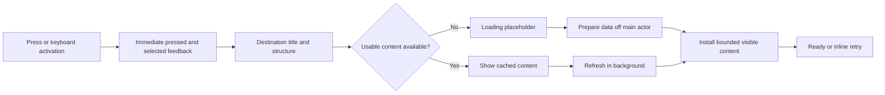

# Mac navigation and action feedback audit — 8 September 2026

The app needs a common **input → acknowledgment → destination shell → usable content** contract. Data-loading indicators alone do not provide it. A navigation method returning in 0.2 ms does not mean the selected button or destination appears in 0.2 ms.

Scope: source audit of all nine root destinations, shared sidebar controls, conversation/file/diff selection, machine and workspace shortcuts, settings tabs, and representative mutations. Native measurements cover eight sidebar destinations in the local debug app with an isolated 100-card board. Archive and secondary actions have source findings, not measured latency claims.

The installed Homebrew release is 0.4.101. The board optimizations and this diagnostic are in the local working tree and `apps/mac/build/Dieter.app`; they are not a published Homebrew update. The user's observed build was not identified. No live daemon data was changed by this audit.

## What the previous board measurements missed

The [board report](/Users/dbpprt/Development/dieter/docs/mac-board-performance-2026-09-08.md) measured projection, host construction, layout, and drawing, plus a programmatic navigation call. The optimized packaged debug board still took approximately 72–95 ms in a forced layout/display pass. That is enough to delay feedback even with cached data and fast store selection.

Distinguish these milestones:

| Milestone | Meaning | Measurement needed |
| --- | --- | --- |
| Input | Mouse/key event arrives | Event timestamp and handler entry; mouse-down feedback separate from mouse-up activation |
| Acknowledgment | Press/selection and intended destination become visible | First presented frame containing that feedback |
| Usable | Above-the-fold controls and content accept interaction | Destination-specific readiness plus actual interaction |
| Refreshed | Current data has arrived and been applied | Owned read completion and successful publication |

The new diagnostic observes native queued clicks, mouse-down delivery, the first drawing callback of a transparent native marker behind the correct destination, and gaps in an 8 ms main-run-loop timer. It does not force layout inside the measured interval. **The drawing callback is an app-side milestone, not proof that all destination drawing has finished, pixels were presented, or data is ready.** The timer gap is a scheduling diagnostic, not CPU attribution. Target lookup is included; native geometry markers keep it small. Three samples per route cannot establish a p95 or characterize release performance.

## Shared causes confirmed in source

1. **Selection and full destination construction share one update.** `DieterRootView` switches directly from `store.section` to the complete view. There is no separate lightweight entering state. The sidebar's selected background and the new content compete for the same main-thread update. The board's loaded state means its model exists, not that its rows have been prepared and displayed.
2. **Sidebar feedback omits an explicit pressed state.** `SidebarDestination`, `SidebarRailDestination`, and several utility controls use `.buttonStyle(.plain)` with hover/selected styling. The custom icon/primary/secondary button styles elsewhere already use `configuration.isPressed`. Plain buttons still have platform behavior, but the sidebar provides no equivalent explicit pressed treatment of its own.
3. **Navigation ownership is inconsistent.** Some functions select before awaiting; others wait for connection or an RPC first. Shared button closures frequently create a `Task` before selection. This is not evidence that `Task` itself costs 100 ms, but it means selection is not consistently part of the synchronous input action.
4. **Loading usually describes an RPC, not preparing a view.** Cached content can skip all loading branches while its text/layout/host creation still blocks a frame. Conversely, loading booleans set only in `.task` can leave an initial empty/default state before the read starts.
5. **Some commands provide no pending feedback.** Schedule run/toggle and saving parallel limits await the daemon without a per-command pending state. Repeated clicks may occur before completion. Git operations already demonstrate the stronger pattern: synchronously set `pendingKind`, prevent overlapping mutations, and expose reconciliation/error state.

## Destination-by-destination findings

| Surface | Current behavior | Gap and recommended treatment |
| --- | --- | --- |
| Board | Selects cached model before connection; live cache avoids redundant state RPC; visible native rows are reused. | Mount/layout still occurs in the selection update. Show board title and lane structure independently of card mounting; keep each content installation within the frame budget. Keep cached rows usable while refreshing. |
| All chats | Selects before read; lazy project list and bounded card groups; inline refresh/error feedback. | Projection filtering/sorting/grouping runs in `body`; cold loading is started by `.task`. Model initial loading explicitly, cache prepared projections by revision, and measure large chat counts independently from boards. |
| Files | Project route selects early; list and preview have independent feedback; file selection is set before reading; requests have identity guards. | Workspace shortcut waits for connection before selecting. Project connection time precedes `loadFiles` setting its loading flag. Folder breadcrumb changes only when listing succeeds. Show intended scope/path and connecting/loading state immediately without relabeling old rows as new content. |
| Changes | Header and initial progress state; model owns refresh, diff preparation, and pending Git operations. | Separate connection failure from “Reading changes”; `model.suspend()` alone does not resolve the initial progress UI for an unavailable unbound project. Retain useful cached changes during refresh and measure diff mounting separately. |
| Schedules | Explicit not-yet-loaded/loading/empty/error state; header survives loading; paginated list and occurrence feedback. | Strong starting pattern. Standardize refresh presentation, add pending feedback to run/toggle/delete, and keep selection acknowledgment independent of occurrence reads. |
| Terminals | Global route selects before list read; cold/refresh/error feedback; native terminal surface. | Machine route waits for connection. Workspace terminal route waits for connection and terminal creation before navigating. Show a scoped shell immediately, expose “Creating terminal…”, and guard repeat submission; terminal creation must remain authoritative. |
| Screens | Immediate route selection; controller models checking/connecting/reconnecting/streaming/error. | Reuse shared feedback styling and reduced-motion behavior. Mount the video surface only when needed and measure its attachment separately. This audit did not initiate a screen-sharing session. |
| Settings | Immediate top-level selection and synchronous subtab changes; prompts have an overlay loader. | Subtabs directly mount whole forms. Prompts initially expose default editors before load completes; save buttons have inconsistent pending presentation. Static settings need no obligatory spinner; remote editors need explicit initial/loading/error state. |
| Archive | Inline load/error feedback, native list, read starts in `.task`. | No explicit never-loaded state; count can initially read zero before loading. Restore buttons have no per-item pending state. Source audit only; no sidebar entry was exercised for Archive. |

Secondary navigation must use the same contract. `openConversation` selects the card/chat and clears old content before fetching; cached snapshot acceptance and timeline mounting remain separate work. Closing a conversation also cancels reads and removes its UI, so **leaving** a heavy surface belongs in navigation profiling. `openMachine` already sets the selected machine and loading flag before awaiting. `selectProject`, workspace file/terminal shortcuts, and machine terminal navigation contain pre-selection awaits.

Code entry points: [root destination switch](/Users/dbpprt/Development/dieter/apps/mac/Sources/DieterMac/UI/DieterRootView.swift:132), [sidebar button styles](/Users/dbpprt/Development/dieter/apps/mac/Sources/DieterMac/UI/DieterRootView.swift:1162), [navigation methods](/Users/dbpprt/Development/dieter/apps/mac/Sources/DieterMac/Model/DieterStore+Navigation.swift:11), [file reads](/Users/dbpprt/Development/dieter/apps/mac/Sources/DieterMac/Model/DieterStore+FilesAndSettings.swift:27), [schedule commands](/Users/dbpprt/Development/dieter/apps/mac/Sources/DieterMac/Model/DieterStore+FilesAndSettings.swift:309), [Git pending state](/Users/dbpprt/Development/dieter/apps/mac/Sources/DieterMac/Model/ProjectChangesModel.swift:208), [shared loading feedback](/Users/dbpprt/Development/dieter/apps/mac/Sources/DieterMac/UI/LoadFeedback.swift:7).

## The app-wide contract to implement

- **One route identity:** section, machine, project, scope/card, and a navigation generation. Set intent synchronously. The current destination owns its load/preparation task; late results must not change the latest route. Cancel transport/preparation work on replacement without stopping agents or daemon-owned terminals.
- **One presentation vocabulary:** entering/loading, ready, refreshing with existing content, empty, failed with retry. A destination owns these states; the spinner is a synchronous visual component. Retain the existing `LoadFeedback` rule against an attached delayed task: short-lived task teardown previously caused an All chats crash.
- **One control contract:** clear pressed state, immediate selection or pending acknowledgment, completion/error feedback, and repeat-submission protection where necessary. Navigation stays available while content loads. Commands that mutate data use pending state rather than pretending the operation succeeded.
- **Stable structure:** keep title, toolbar, lane/pane boundaries, and selected item visible while loading. Match placeholders to eventual geometry. Reuse cached content when it belongs to the same destination. Never show an old project's data under a new project's title.
- **Bounded rendering:** decoding, parsing, sorting, and indexing can run outside the main actor. Creating and laying out AppKit/SwiftUI views must remain on the UI thread. Reuse native hosts and mount visible content in small batches where profiling requires it. Four lane skeletons followed by one giant card-mount operation would still hitch.
- **No unconditional spinner delay:** fast cached surfaces can go directly to content. Do not insert a fixed 100 ms sleep, animate navigation slowly, or assume `Task {}` / `.task` / `Task.yield()` guarantees a painted loading frame. Swift's executor may immediately resume a yielding task. Verify the first frame and subsequent frame continuity. [Apple Task.yield documentation](https://developer.apple.com/documentation/swift/task/yield())

## Targets and rollout

These are proposed acceptance targets, not results already achieved:

- Press feedback on the next display frame; destination acknowledgment p95 below 50 ms on the agreed reference Mac.
- Aim for under 5 ms of main-thread work per update and no recurring 50–100 ms main-thread stalls. Apple distinguishes discrete interaction latency from the smaller frame budget required for smooth motion. [Improving app responsiveness](https://developer.apple.com/documentation/xcode/improving-app-responsiveness)
- Report time to first usable viewport separately from full refresh; network delay must not prevent navigation, cancellation, or progress feedback.

Implement in this order: shared pressed/pending controls and synchronous route intent; a stable destination shell plus owned presentation state; apply first to boards and the three connection-gated workspace/machine shortcuts; migrate other remote surfaces; then optimize any remaining expensive mounts using Instruments. Do not retain every hidden view and its live streams as a blanket caching strategy.

Validation must include actual mouse and keyboard input, cold and cached routes, slow/offline connections, 100-card and larger content, leaving a long conversation, rapid A→B→A navigation, scrolling/clicking during loading, retries, and reduced motion. Test release builds on the reference machine. Capture first presented feedback and content-ready frames alongside SwiftUI/Time Profiler traces; a method-duration assertion cannot enforce this contract. [Apple SwiftUI performance guidance](https://developer.apple.com/documentation/xcode/understanding-and-improving-swiftui-performance)

## Native diagnostic results

The repeat run used the existing packaged app, with no concurrent task-owned build or test. Board stress/navigation checks passed; all eight destination screenshots were inspected. The Mac regression suite passed **229 tests**. Initial diagnostic attempts were discarded: sidebar controls first needed geometry registration/expansion, and window-update notifications proved unreliable for several SwiftUI destinations. The final probe observes the native drawing callback instead.

Environment: macOS 26.5.1 (25F80), Xcode 26.5 (17F42), debug app, canonical `dieter-local` cache; tests used the separate `dieter-tests` cache. App executable SHA-256: `7a16d137513f78301cf09dec506d4c01daef02a57e8235589ce35b404e431149`.

All values below are milliseconds. “Draw” means the app-side destination marker callback defined above.

| Destination | Click → draw, three samples | Median | Largest main-loop interval |
| --- | --- | ---: | ---: |
| Board (100 cards) | 117.8, 112.9, 119.9 | 117.8 | 114.8 |
| All chats (empty fixture) | 103.0, 86.2, 83.3 | 86.2 | 94.7 |
| Files (one file) | 57.0, 50.4, 50.8 | 50.8 | 58.0 |
| Changes | 58.4, 59.3, 60.8 | 59.3 | 60.2 |
| Schedules (one schedule) | 79.9, 32.1, 65.7 | 65.7 | 86.8 |
| Terminals (no sessions) | 40.4, 37.6, 38.8 | 38.8 | 41.2 |
| Settings → General | 86.3, 65.9, 66.9 | 66.9 | 87.9 |
| Screens (idle) | 58.5, 71.5, 60.4 | 60.4 | 63.4 |

**The board still exceeds 100 ms:** click-to-draw is 112.9–119.9 ms, while mouse-down delivery is only 1.3–4.3 ms. Main-loop timer intervals reach 110.2–114.8 ms. This corroborates the reported delay and shows why the 0.1–0.3 ms selection method time is insufficient. It does not identify every CPU stack or measure the exact first selected-button frame; those require the presentation/trace work described above.

The fixture's All chats view has no conversations, yet its full initial surface (including the new-chat composer) takes 83.3–103.0 ms to reach the marker. The common navigation surface cost deserves attention independently of large collections. Files/Changes/Schedules screenshots may include loading state: their numbers do not represent completed remote reads. Terminal and Screens numbers exclude terminal emulator/video attachment.

Each transition starts from Screens, except Screens starts from Settings. The board was already exercised earlier in the suite; these are repeated in-process transitions, not cold launches. The sampling window ends 150 ms after the first marker draw. Differences between runs were noticeable, so this small diagnostic should establish a problem and guide profiling, not serve as a release performance certification.

Evidence: [native report](/Users/dbpprt/Development/dieter/apps/mac/.build/smoke/board-20260908-181844-5a5076ab-1e20-4214-b8c9-fe9194a828fd/report.json), [board screenshot](/Users/dbpprt/Development/dieter/apps/mac/.build/smoke/board-20260908-181844-5a5076ab-1e20-4214-b8c9-fe9194a828fd/navigation-board.png), [All chats screenshot](</Users/dbpprt/Development/dieter/apps/mac/.build/smoke/board-20260908-181844-5a5076ab-1e20-4214-b8c9-fe9194a828fd/navigation-all chats.png>), [full run log](/tmp/dieter-navigation-final-smoke.log), [Mac tests](/tmp/dieter-navigation-tests.log). Reproduce with `just mac smoke board`; the driver owns isolated fixture processes and closes them afterward.

This turn adds reusable debug-only measurement and the audit. It does **not** implement the proposed destination-shell/state migration. Existing board optimizations remain in place. The normal app does not install these native diagnostic markers; release builds compile the helper to a no-op.
