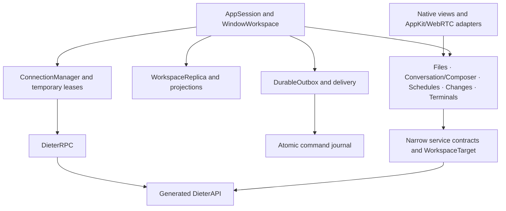

**Mac app refactoring implementation — 9 September 2026**

The refactor implements the ownership, durability, reuse, and module boundaries from the [review proposal](mac-code-quality-refactoring-proposal-2026-09-08.md). The application still uses SwiftUI Observation, Swift actors, and the existing protobuf contracts. No framework or dependency-version migration was required.

**Application structure**

`DieterCore` contains identities, service contracts, replicated metadata and optimistic reducers, selection/projection policies, and retention rules. It imports neither SwiftUI nor AppKit and does not read process arguments or global preferences. `DieterCoreTests` exercises it without the executable UI target.

`DieterClient` implements RPC adapters, transport construction, verified direct/relay routing, credentials, the command journal, and disposable projection persistence. `DieterMac` owns native presentation, feature effects, and app composition. The package graph enforces this dependency direction; generated and vendored sources remain separate.

`AppSession` owns process lifetime. `WindowWorkspace` owns the single workspace window's navigation and sheet presentation. Menu-bar sync survives closing the window. Menu-bar actions, app commands, and Island actions reopen the workspace. Native smoke covers closing and reopening the window while retaining selection and the connection.

Feature state and tasks moved into `FilesModel`, `ConversationModel`, `ComposerModel`, `SchedulesModel`, `WorktreeChangesModel`, and `TerminalsModel`. Files, Schedules, worktree Changes, Terminals, and Screens receive focused inputs. Conversation uses `ConversationContext`, containing its models and explicit app commands. Large conversation, form, schedule, and worktree files were split into components under `Features`.

`DieterStore` remains an internal type alias for `AppSession`. `FeatureCompatibility.swift` contains forwarding accessors for existing navigation, forms, and smoke fixtures. These adapters do not hold a second copy of feature state. They can be removed as individual shell call sites adopt the focused APIs; they are not a second implementation of the features.

**Correctness and recovery**

| Review issue | Implemented behavior | Regression evidence |
|---|---|---|
| F1: lost work after an unsuccessful outbox write | A command becomes deliverable, and its submitted draft clears, only after its journal transaction commits | Injected disk failure preserves text and prevents optimistic acceptance/delivery; concurrent transactions retain every command |
| F2: save acknowledgement overwrites newer edits | Editor identity includes endpoint, project, conversation and path; acknowledgement compares the submitted buffer revision | Delayed-save tests preserve typing during a save and reject another project's same-path acknowledgement |
| F3: Screens reconnects after disconnect | A connection attempt owns its task, generation, signaling callbacks and peer identity; callback bridges support cancellation | Delayed route completion after disconnect closes itself; a retired attempt cannot replace a successor |
| F4: old responses affect a new selection | Reads, mutations, watch frames and multistage workflows retain their binding and target; visible feature reads restart on connection replacement | A→B→A conversation reads, delayed schedule mutations, file operations, Git navigation and original-operation tests |
| F5: inconsistent workspace-card placement | `WorkspaceReplica.upsert` updates navigation by project ID, and optimistic reconciliation has one owner | Workspace/card fan-out regression |
| F6: unbounded terminal input | Synchronous bounded admission, one pump per terminal/client, bounded chunks and write deadlines | Stalled and failed writes enforce limits and preserve a successor route; ambiguous input is not replayed |

Outbox delivery now belongs to `DurableOutbox`, with narrow transport acquisition and completion effects supplied by the app. Message creation, retry and agent-message paths share enqueue construction. Retiring a delivery worker does not discard a confirmed remote acknowledgement: the journal records it, while the retired worker cannot publish into its successor's UI.

Drafts are owned by endpoint and conversation. Attachment intake and send completion retain the original draft and revision. Empty drafts are released during navigation; unsent text and attachments remain with their conversation.

Authentication owns its callback, exchange and timeout. Cancellation and sign-out retire the attempt, late callbacks cannot revive it, and credential deletion failures are reported. Pending authentication has an expiry. `DieterAppEnvironment` injects preferences, storage, credentials, clock and client construction. Unit fixtures use disposable namespaces and storage roots.

**Durable storage migration**

`pending-commands.json` is separate from the disposable `sync-state.json` projection. Migration decodes the legacy outbox independently of cached protobuf projections and atomically establishes the journal before commands become deliverable. Command IDs survive migration and retry. Once established, even an empty journal is authoritative; a stale legacy file cannot resurrect acknowledged commands. Corruption is reported without overwriting the evidence. A legacy journal above the count admission limit can drain, while further growth is rejected.

These files remain native-client state outside registered project repositories. Daemon transcripts and domain data remain authoritative. Direct TLS identity verification, gateway authentication, and daemon API semantics are preserved.

**Shared policies and resource bounds**

`WorkspaceReplica` owns entity upserts and optimistic card/label/board/project reconciliation. Project ordering and chat projections are cached. Runtime notification transitions share an endpoint-scoped normalization policy, retaining unknown values and keeping runtime distinct from workflow lanes, delivery and Git status. Harness selection and provider-option validation are shared by creation preferences, forms and composer selection.

Active, background, telemetry, outbox, directory browsing, project creation and screen signaling share route selection. Temporary leases keep at most eight idle transports for at most 30 seconds from admission, honor credential/endpoint identity and token expiry, validate reused transports, and are invalidated on disconnect. Inactive-machine refresh runs with concurrency three. Active UI and screen transports retain independent lifetimes.

| Resource | Policy |
|---|---|
| New pending commands | 1,000 entries and 64 MiB encoded journal |
| Terminal input | 1 MiB including queued/in-flight input; 32 pumps; 64 KiB chunks; 15-second write deadline |
| Retained transcript history | 2,000 messages / 32 MiB; earlier browsing keeps an earlier window with an explicit Return to latest action |
| Selected Git-operation logs | Latest 2,000 entries / 8 MiB |
| Buffered screen candidates | 256 |
| Attachments | Existing four-file, 5 MiB per-file, 6 MiB total admission rules retained |

Earlier transcript pages remain accessible through pagination; the live daemon transcript is not deleted. These are client retention/admission policies, not a claim of a hard bound on the entire process's memory. The existing rendering, diff, Markdown and image-cache policies remain in place. Production fleet sizing and real remote-media profiling remain separate performance qualification work.

**Development and verification policy**

Run `just mac format` for handwritten Swift and `just mac format-check` to verify it. The configuration uses four spaces and 120-column formatting. Generated clients and Vendor are excluded. `just mac check` now includes formatting, schema verification, tests and packaging. The existing Go brand-token test tolerates Swift line wrapping while checking the same tokens.

CI runs the native core and board/navigation gates on the macOS runner. Scheduled and manually dispatched CI runs qualify all eight native suites and retain JSON reports, PNGs and logs. The Mac README now reflects H.264 and signed keyboard/pointer control.

When adding another feature, pass a narrow service capability and explicit target, own cancellation in the feature model, reject completions from a retired binding, and use shared routing and command admission. Preserve the repository's proto/core/Connect/CLI parity rules for any future daemon operation changes.

**Validation record**

Qualification used the debug bundle at `/Users/dbpprt/Development/dieter/apps/mac/build/Dieter.app`, the canonical `dieter-local` app cache, and the separate `dieter-tests` test cache. No caches were cleaned. A second unchanged build completed Swift compilation in 0.74 seconds and verified the packaged signature.

| Check | Result |
|---|---|
| `just harness install` | Passed |
| `just check` | Passed, including Go race checks and 43 harness runtime tests |
| `just mac test` | 257 discovered: 251 passed and six opt-in diagnostics skipped; 9.818-second test execution |
| `just mac build`, repeated unchanged | Passed; incremental compilation reused the canonical cache |
| `just mac format-check` | Passed |
| `just mac proto-check` | Passed |
| `just mac smoke-all` | All eight suites passed; reports read and representative PNGs inspected |
| `just mac smoke island` after final packaging | Passed |
| `just android test` using Android Studio's bundled JBR | Passed; 32 tasks up to date |
| `git diff --check` | Passed |
| `just mac status` after qualification | Zero DieterMac processes |

The six skipped tests are three opt-in live-route/directory diagnostics, the live daemon attachment round trip, the board opening diagnostic, and the production chat-list window diagnostic. The native conversation renderer fixture also reports its history-budget check as skipped because it starts with fresh state; deterministic feature integration tests cover paging without joining across a missing range and returning to the live window. Real remote WebRTC media/control and production-scale profiling were not exercised by this qualification.

Command logs and the startup diagnostic are retained in the [qualification evidence directory](/Users/dbpprt/Development/dieter/apps/mac/.build/smoke/refactoring-20260909-qualification). Native reports link to sibling screenshots and fixture logs:

| Suite | Evidence and observed coverage |
|---|---|
| Core | [Report](/Users/dbpprt/Development/dieter/apps/mac/.build/smoke/core-20260909-084910-267620bc-d67d-4f79-8c15-8bdeafc00409/report.json): Files save/recovery, schedules, forms, offline outbox/reconnect, route compatibility, and closing/reopening one workspace window |
| Board | [Report](/Users/dbpprt/Development/dieter/apps/mac/.build/smoke/board-20260909-085057-9cdc3e24-6121-4f69-87c8-52a0c3afbd27/report.json): 100-card fixture, virtualization, scrolling and navigation; ascending Todo order confirmed in the screenshot |
| Conversation | [Report](/Users/dbpprt/Development/dieter/apps/mac/.build/smoke/conversation-20260909-085127-b55106ff-fc70-405c-9837-53caa67e923b/report.json): attachments, queued messages, Markdown, scrolling and turn failure/retry |
| Machine | [Report](/Users/dbpprt/Development/dieter/apps/mac/.build/smoke/machine-20260909-085202-d39ab241-e7d3-46a6-b5b6-cb858a6755a1/report.json): machine information and telemetry presentation |
| Sidebar | [Prepare](/Users/dbpprt/Development/dieter/apps/mac/.build/smoke/sidebar-20260909-085211-bfd78f2e-773e-4f71-92ea-4f80232dd5ed/prepare/report.json) and [verify](/Users/dbpprt/Development/dieter/apps/mac/.build/smoke/sidebar-20260909-085211-bfd78f2e-773e-4f71-92ea-4f80232dd5ed/verify/report.json): ordering, grouping, resizing and preference restoration across restart |
| Terminal | [Report](/Users/dbpprt/Development/dieter/apps/mac/.build/smoke/terminal-20260909-085225-c0b01ce6-9334-40ac-bdd1-05dba7c02519/report.json): persistent daemon PTY survives client restart, with input, output, cursor and resize checks |
| Island | [Full-run report](/Users/dbpprt/Development/dieter/apps/mac/.build/smoke/island-20260909-085236-b57f7db5-a29e-4927-a970-11b00bea1b96/report.json) and [final report](/Users/dbpprt/Development/dieter/apps/mac/.build/smoke/island-20260909-085835-51621276-728a-461b-a3bd-fea984c28783/report.json): expansion, collapse, settings, empty/single layouts and opening conversations |
| Workspace | [Report](/Users/dbpprt/Development/dieter/apps/mac/.build/smoke/workspace-20260909-085240-0b920535-9f60-4832-83fb-64c7c7a792e2/report.json): diff presentation, staging/commit/discard, external refresh, merge completion, cleanup, Done transition and conflict presentation |

Smoke mutations were confined to isolated daemon/gateway fixtures with disposable preferences and storage. The operator's daemon was not stopped, replaced or restarted. Two early smoke launches remained in a menu-bar-only state; sampling showed an idle run loop. Explicit window launch behavior and the debug smoke menu fallback fixed startup, and the final core journey verified close/reopen state retention. Both diagnostic processes exited through normal application quit. An app-selection tool also briefly launched the installed client during diagnosis; it was immediately quit without a data action. No TERM or KILL was used, and final inventory found no running client.

Qualification covers the implementation described in this record; release publication is separate. Formatting touched handwritten sources broadly; generated clients, vendored source, and dependency versions were not changed. Compatibility forwarding at navigation/form boundaries is documented above and remains an internal migration seam.
