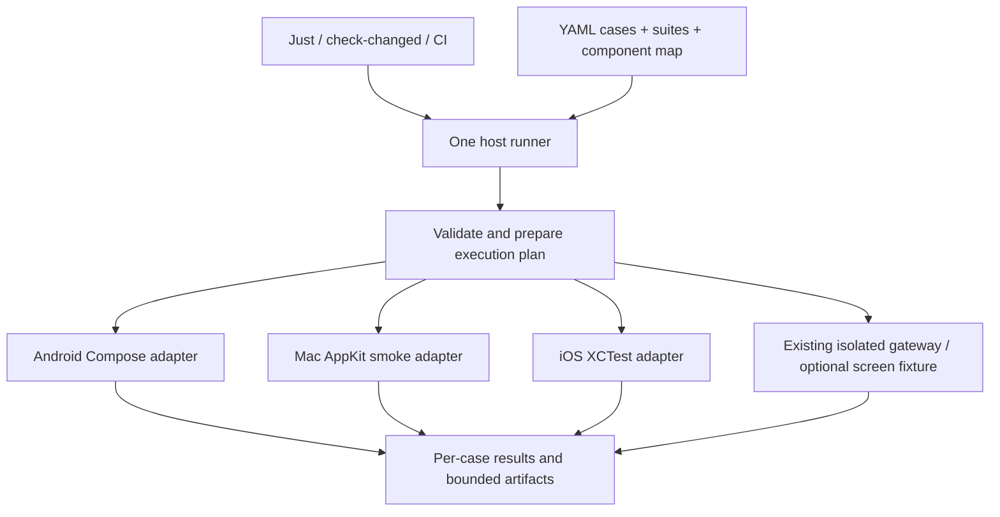

> Implementation: see [the native test guide](../tests/e2e/README.md). This

> Implementation update: all three native platforms now use `just e2e run`.
> See [the current native test guide](../tests/e2e/README.md). The inventory
> below records the pre-migration state; its legacy launchers have been removed.

> Historical record: Android launcher scripts and test aliases referenced below
> have been retired. Use the [current native test guide](../tests/e2e/README.md)
> for supported commands and selectors.
> document records the original design and pre-migration inventory. Android
> execution is implemented; Mac remains disabled and iOS is preparation-only.

# Lean native test framework proposal

Status: implementation proposal, 25 September 2026. Repository inspection at
`d16f0b4`; no native execution or performance benchmark was performed for this
proposal. Commands, directories, and YAML fields marked proposed do not exist
yet.

**Recommendation:** consolidate test execution first, then express ordinary
user journeys in a small, validated YAML format interpreted by Dieter's existing
native test drivers. Start with Android Compose instrumentation; reuse AppKit
smoke support for macOS and XCTest for iOS when those platforms migrate. Keep
detailed transport, rendering, codec, and performance assertions in native
tests, selected through the same runner.

The goal is fewer independent implementations of setup, waiting, cleanup, and
reporting, plus fewer unnecessary builds and device runs. YAML alone will not
make tests faster. Replacing every native test with YAML would add work and
weaken useful coverage.

## 1. What exists and where the cost comes from

Counts are tracked source files at the inspected revision, including helpers.
They are not test-case counts or proof that every test executes.

| Surface | Current implementation | Implication |
| --- | --- | --- |
| Android | 47 instrumentation source files / 7,848 lines; 82 JVM test files / 6,115 lines | Preserve cheap JVM coverage and useful Compose assertions. Migrate a subset of device journeys. |
| macOS | 18 app-side Testing files / 11,293 lines; nine packaged-app smoke suites | Much of the sprawl is inside large Swift journeys. Moving shell files alone is insufficient. |
| iOS | A 781-line `RemoteNodeUITests.swift` and a 353-line Python runner | iOS already has native automation. Split its monolithic journey incrementally. |
| Fixtures | Shared `scripts/isolated-gateway`, separate `scripts/screens-fixture`, deterministic harness responses | Reuse these implementations; avoid another fake Dieter backend. |
| Selection | `scripts/check_changed.py`, Just modules, CI component filtering | Extend the existing selector rather than create a competing system. |

Specific findings:

1. ``test-activity.py`` (retired),
   ``test-machines.py`` (retired), and
   ``test-android-sync.py`` (retired) each build/start a
   gateway, parse readiness, reverse an ADB port, invoke Gradle, and clean up.
   Evidence layout and serial handling differ: Activity hardcodes
   `emulator-5554`; Machines honors `ANDROID_SERIAL`.
2. [`just android connected-test`](../just/android.just) runs debug
   instrumentation, then production-mode performance instrumentation when no
   class filter is supplied. Most Android production-source edits select that
   unfiltered path. Performance installs a different build and restores debug.
3. Activity, Machines, draft/queue recall, and other Android journeys use
   `assumeTrue` when fixture arguments are missing. The generic connected command
   does not supply them. A green connected invocation therefore does not prove
   all intended E2E cases passed. Configured-account integration is separately
   opt-in and must remain so.
4. [`just mac smoke-suites`](../just/mac.just) already builds the app once.
   Preserve that improvement. Each `_smoke` still invokes `swift run`, and
   [`DieterMacSmokeDriver`](../apps/mac/Tools/DieterMacSmokeDriver/main.swift)
   invokes `go build` and starts a fresh gateway for each suite needing one.
   Cached build invocations are overhead, not necessarily full recompilations.
5. Local selection schedules `just ios build`, `just ios smoke`, and
   `just ios smoke-ipad`; both smoke commands enter the build path again. CI
   already uses `smoke-built`. The [iOS runner](../apps/ios/Scripts/smoke.py)
   prepares native screen capture and share-extension media for every run.
6. Android uses `testTag` in 27 main-source files, with no
   `testTagsAsResourceId` usage there. Compose queries those tags directly; an
   external accessibility driver needs an explicit exposure audit.
7. Safety mechanisms already exist but are scattered: Android device flock,
   separate screen-fixture package, isolated gateway state, Mac process ownership,
   two canonical Swift caches, and iOS disposable simulators.
8. The current [Android CI job](../.github/workflows/ci.yml) builds, unit-tests,
   and lints. It does not provision an emulator or run connected tests. Adding
   Android E2E CI is a coverage expansion with a CI cost, not a speedup over an
   existing Android CI E2E gate.

## 2. Framework choice

| Choice | Strength | Cost for Dieter | Decision |
| --- | --- | --- | --- |
| Maestro | Existing YAML, waits, accessibility automation, reports; Android and iOS simulator support | No native macOS target in its documented platform list. Fixtures/native probes still needed; Compose tags need exposure. | Strong alternative for a short Android comparison. |
| Appium and platform drivers | Common external protocol; Mac2 uses XCTest for macOS | Server/driver/toolchain maintenance; still needs a YAML layer, fixtures, and specialized assertions. | Consider if external black-box automation becomes a concrete requirement. |
| Narrow YAML interpreter over existing Compose/AppKit/XCTest | Reuses selectors, synchronization, screenshots, and custom assertions; no host/ADB round trip per action | Dieter owns semantics and adapter conformance; scope must stay small. | Recommended for this repository. |
| YAML containing existing script filenames | Quick common launcher | Preserves duplicated lifecycle and opaque journeys | Temporary migration technique only. |

Maestro's [upstream README](https://github.com/mobile-dev-inc/maestro#readme),
checked on 25 September 2026, documents Android, iOS, and web; physical iOS is
not supported according to that source. A tool running on macOS is distinct
from testing native macOS apps. Appium's
[Mac2 README](https://github.com/appium/appium-mac2-driver#readme) identifies
XCTest as its backend. Neither tool was installed or benchmarked for this plan.

Before committing to the custom interpreter, compare it with Maestro on the
same two Android journeys, using the same isolated fixture and app variant.
Measure authoring size, warm runtime, failure evidence, selector ambiguity, and
lifecycle behavior. Pin the tool version. Select **one** maintained mobile
journey format and remove the losing prototype.

Choose Maestro instead if it substantially reduces maintained code while meeting
required assertions, diagnosis, and speed. In that outcome, use Maestro syntax
directly and register Mac's existing native suites until migration is justified.
Do not build a custom-DSL-to-Maestro translator or maintain both mobile formats.

The following design describes the recommended native approach. Orchestration,
isolation, selection, reporting, and script retirement apply whichever pilot
wins.

## 3. One runner and command surface

Proposed commands:

```sh
just e2e list --platform android
just e2e lint
just e2e plan --platform android --changed --base main
just e2e run --platform android --suite smoke
just e2e run --platform android --case machines.telemetry
just e2e run --platform android --suite functional
just e2e run --platform android --suite performance
# just e2e run --platform mac --suite smoke  # disabled
just e2e run --platform ios --device iphone --suite smoke
just e2e run --platform ios --device ipad --suite smoke
```

`just check-changed` stays the normal development entry point. It delegates native
integration selection/execution to this runner while retaining Go/JVM/Swift
unit, lint, generation, and packaging checks. This is repository tooling; no
production `dieter test` API operation is needed.

Implement one small Go host command in proposed `tools/e2e`, behind
`just/e2e.just`. Go and `yaml.v3` already exist here. Prepare a stable runner
binary through normal build caching and execute it once per run. Avoid another
Python environment, Node service, or plugin ecosystem.



Proposed layout:

```text
tools/e2e/                         # planning, ownership, execution, reporting
tests/e2e/schema.json              # authoring schema
tests/e2e/suites.yaml              # tiers, budgets, required platforms
tests/e2e/components.yaml          # source paths -> case components
tests/e2e/cases/<feature>/*.yaml    # discoverable scenarios with stable IDs
tests/e2e/fixtures/*.yaml          # bounded declarative fixture recipes
tests/e2e/flows/<platform>/*.yaml  # only navigation fragments actually reused
apps/android/.../androidTest/.../e2e/  # interpreter and native probes
apps/mac/Sources/DieterMac/Testing/    # existing primitives and interpreter
apps/ios/DieterIOSUITests/              # XCTest interpreter and probes
```

The host owns builds, resource leases, fixtures, credentials, processes,
deadlines, and final result accounting. Adapters own UI queries/actions and
framework diagnostics. Cases own scenario intent and assertions. Existing
fixture code owns data seeding and deterministic agent responses.

Use ignored `tmp/e2e/<run-id>/` for development artifacts. Keep disposable daemon
state under a temporary `DIETER_HOME` outside the project, and credentials in
private temporary files excluded from artifacts. Test results and cache metadata
must never become a substitute for Dieter storage.

## 4. YAML contract

Illustrative proposed case using today's Android Machines selectors:

```yaml
version: 1
id: machines.telemetry
platforms: [android]
components: [machines]
tags: [smoke, functional]
fixture: enrolled-machine
isolation: fresh
timeout: 45s
steps:
  - launch: connected
  - tap: {id: nav-tools}
  - tap: {id: tool-machines}
  - expect: {id: "machine-row-${fixture.endpointId}", visible: true}
  - tap: {id: "machine-row-${fixture.endpointId}"}
  - expect: {id: machine-cpu, visible: true}
  - expect: {id: machine-memory, visible: true}
  - scroll:
      within: {id: machine-detail}
      until: {id: machine-processes}
      maxSwipes: 6
  - expect: {id: machine-processes, visible: true}
  - screenshot: telemetry
verify:
  - fixtureProbe: {name: machine-telemetry-complete}
```

`launch: connected` binds the isolated fixture before Activity startup; it does
not test login. A separate login case must use the login UI. `fixture.endpointId`
is the native connection ID returned by the binding, not an assumed daemon-ID
alias. Capture Dieter-generated IDs from creation or client projection.

The final probe preserves the native/API checks in `MachinesEndToEndTest` for
host identity, memory/CPU fields, and daemon process presence. A screenshot or
visible label does not replace those assertions. Probes are reviewed, named,
read-only native/API functions; YAML cannot execute arbitrary code.

Complex cases can remain native:

```yaml
version: 1
id: screens.codec-recovery
platforms: [android]
components: [screens, transport]
tags: [extended]
fixture: native-screen
isolation: fresh
requires: [macos-capture-host, hardware-codec]
timeout: 180s
native: android.screen-codec-recovery
```

`native` and `steps` are mutually exclusive. The registry maps native IDs to
classes/methods and exact arguments; authors cannot supply commands or executable
paths. Registry entries declare expected methods so a skip-only class cannot
count as an executed case.

Start with eight UI operations: `launch`, `tap`, `type`, `press`, `scroll`,
`expect`, `screenshot`, and `runFlow`. Text replacement is the default; append is
explicit. `press` uses a bounded enum. Add double-click, drag, restart, or other
operations only when a migrated case needs them. Offline faults, queue control,
and daemon restarts can initially remain native cases.

Rules that prevent another scripting language:

- Parse YAML once on the host and send validated typed JSON to native drivers.
  Generate/verify the schema against the Go model and use shared golden examples
  to check Kotlin/Swift decoding. Reject protocol-version mismatches explicitly.
- Reject unknown fields, duplicate keys/IDs, invalid durations, unknown
  references, unresolved variables, unsupported capabilities, and excessive
  expansion before any build or device action.
- Permit bounded `${fixture.name}` and declared fragment-argument substitution
  only. No shell, JavaScript, environment evaluation, expressions, loops,
  recursive includes, YAML merge tricks, or executable hooks.
- Initial bounds: 256 KiB per case, 100 expanded steps, one fragment nesting
  level, explicit suite/case deadlines. Common journeys should be 10–30 steps.
- Prefer stable IDs scoped to a container. Zero matches waits until deadline;
  multiple matches fail with evidence. Never silently select `first()`. Exact
  visible text and roles are appropriate for copy/accessibility assertions.
- `tap` waits for a visible enabled target, resolves current geometry if needed,
  and dispatches once. Retry observation only; an uncertain mutation fails
  without automatically tapping again.
- `expect` distinguishes existence, visibility, enabled state, text/value,
  count, and absence. Establish preceding state before asserting disappearance;
  immediate absence does not prove a transient notification behaved correctly.
- Use monotonic deadlines bounded by the case deadline, native synchronization,
  and predicate waits. No general `sleep` operation. Intentional observation
  windows remain in performance tests.
- Fixtures arrange initial state; they must never perform the action the case
  claims to exercise through the UI. Report UI and server assertions separately.

Share fixtures and outcomes before click sequences. Android bottom navigation,
iPad sidebars, and Mac menus differ. Use short platform navigation fragments
where useful, or distinct cases sharing a behavior ID when workflows differ.
Avoid giant platform-conditional flows and a universal page-object hierarchy.

## 5. Native execution and flow-only iteration

**Android first.** Add a dedicated functional build type, provisionally `e2e`,
with package `com.dbpprt.dieter.e2e` and debug behavior. Audit FileProvider
authorities, deep links, preferences, databases, and endpoint binding for package
assumptions. The existing `screenFixture` is a precedent, not a blind rename.

Build/install app and generic test APK once per compatible artifact set. Deliver
validated JSON into the debuggable fixture app's private files using a verified
`run-as` transfer; pass its relative path to instrumentation. Prove transfer
permissions, size bounds, and ownership in the pilot. Do not assume apps can
read arbitrary `/data/local/tmp` paths or pass tokens in command-line arguments.

Run compatible cases in one instrumentation invocation, with stable per-case
JUnit identities. Compose owns queries and synchronization; use Espresso or
UIAutomator narrowly for system UI. A YAML-only edit retransfers the plan without
changing APK build inputs. App/driver/schema/toolchain/dependency edits rebuild
normally. Direct instrumentation must preserve Gradle's result/failure semantics.

Prove reset of connections, watches, outbox work, preferences, and caches between
cases. Activity recreation does not reset `DieterApplication`. If isolation
cannot be established within a process, use a new instrumentation process for
that case; builds and installations still remain reusable.

**Mac next.** Accept a plan file in the existing debug-only smoke interface;
reuse `NativeUIAccessibility` and native events. Build the driver once and run
its binary instead of repeated `swift run`. Preserve `DIETER_UI_SMOKE`, canonical
app/test caches, modal-window handling, and refusal to run beside an operator
app. Reuse one owned session only after reset is proven. Window/menu-bar/restart
tests retain their separate lifecycle phases.

**iOS afterward.** Keep XCTest and signed Simulator builds. Use
`build-for-testing` once, then `test-without-building`. Transfer JSON through a
private test-run configuration; verify per-case reporting even if a generic
XCTest method executes several scenarios. Filtering must not silently omit the
requested case. Share-extension, keyboard, rotation, and screen checks may stay
native. Reuse an owned disposable simulator within a run, then shut down/delete
only that simulator. No persistent simulator pool in v1.

Input paths differ: Compose semantic actions qualify functional behavior, not
touch latency or all platform hit-testing. Retain real-input, accessibility,
keyboard, and gesture tests where those properties matter. Do not call every
adapter action equivalent physical input.

## 6. Fixture independence and lifecycle

Extract shared orchestration around the existing fixture implementations. Add
named recipes such as `enrolled-machine`, `conversation-pair`, `queued-message`,
`board-stress`, and `native-screen`. Start only what selected cases need; a
Machines case should not prepare capture helpers, Photos media, stress boards,
or long transcripts.

Reuse in this order:

1. **Compiled artifacts and pinned harness dependencies.** Safe early benefit
   without shared test state.
2. **Fresh fixture state for mutating cases.** New temporary daemon root,
   identities, and namespace; separate batches where necessary. Reuse installed
   binaries, not prior scenario state.
3. **Compatible read-only cases.** Explicit read-only fixture sharing with clean
   client bindings. Prove order independence.
4. **Resettable sessions only if measurements justify them.** Drain turns, close
   fixture terminals/screens, remove injected faults, disconnect watches, and
   bind a fresh namespace/client-cache generation. Retire any fixture that fails
   to prove quiescence.

This avoids adding a fixture-control server in the first milestone. Existing
native cases retain their restart/offline primitives. If later interactive
controls need a protocol, keep it bounded and authenticated inside the isolated
fixture executable. Do not add test/reset RPCs to the production application API.

Normal fixture operations use supported APIs/generated clients. Seeded histories
and mock responses can use existing in-process builders and locked store
operations. The host never edits daemon files or copies a live store. Validate
the single current `api/contract-version`; rebuild obsolete fixtures instead of
migrating persisted test stores. Test-plan versioning is separate from, and never
an exception to, the application contract.

Required lifecycle behavior:

- Extend the existing Android per-serial flock protocol to every device test;
  pin ADB and Gradle/instrumentation to the same serial. These resource leases
  never impose global parallel-agent caps.
- Preserve the healthy visible local AVD, GPU/snapshot policy, operator data,
  and leave-APKs-installed safeguards. No routine wipe, uninstall, cold boot,
  or extra AVD. Any test-state reset targets only the owned `.e2e` package.
- Use separate device and cache leases, canonical paths, bounded acquisition,
  and stable acquisition order. No concurrent writes to one Swift/Gradle output
  tree. Timing work also needs an uncontended host.
- Track exact owned process identities, serials/UDIDs, temporary roots, and ADB
  reverses. Clean up only resources created by the run and verify release.
  Preserve operator apps and the live daemon.
- Cancellation records interruption, captures bounded diagnostics when possible,
  and gracefully drains owned children. Cleanup failure remains a failure. No
  pattern kills or automatic device/cache repair.
- Use OS-backed leases and an ownership manifest for diagnosis. Reverify process
  identity before recovery cleanup; a stale PID alone never authorizes a kill.

## 7. Speed improvements, in priority order

Measure:

`queue/lease + build + boot + install + fixture setup + cases + diagnostics + cleanup`

Report total feedback time and case time separately. Moving work into setup is
not a speedup.

| Priority | Change | Benefit mechanism | Guardrail |
| --- | --- | --- | --- |
| 1 | Select affected cases; separate functional/performance | Avoid unrelated journeys and build transitions | Preserve required coverage and broad fallback. |
| 2 | Prepare each artifact once | Remove repeated Gradle/Swift/Go startup/packaging | Use dependency tracking, not mtime-only freshness. |
| 3 | Batch compatible cases; reuse installations | Amortize install, test-runner startup, authentication | Separate batches when isolation/lifecycle requires it. |
| 4 | Minimal fixtures | Avoid unused capture, stress data, runtime setup | Keep real daemon/gateway behavior on selected routes. |
| 5 | Native predicate waits; bounded diagnostics | Finish when ready; reduce redundant dumps/logs | Preserve required visual checkpoints and failure evidence. |
| 6 | Independent CI workers | Reduce critical path after serial execution is stable | Respect devices, caches, host limits, timing isolation. |

Gradle caching and project parallelism are already enabled. Do not present them
as new improvements or add `--no-daemon` to routine local runs.

Build identity covers source/build inputs, proto, dependency locks, toolchain,
build type, signing identity, and driver version. Install reuse also verifies
device and installed artifact identity. Invalid/unverifiable records reinstall.
YAML is separate from APK inputs. Avoid a homemade replacement for Gradle/Swift
dependency tracking: manifests explain and verify prepared outputs.

The sync script requests two 30-second idle samples. Keep these observation
windows in performance qualification. Keep Android's non-debuggable
release-equivalent frame suite and current thresholds. Initially register its
existing lifecycle unchanged; do not requalify it as debug `.e2e` performance or
change its application identity as part of the pilot.

Retain semantic/visual evidence at designated checkpoints and on failure.
Microsteps inside synchronized transactions can report semantic events rather
than repeated host UI dumps. Update any affected skill evidence/lifecycle rules
in the same implementation change; do not silently override them.

No automatic whole-case retry in gates. Explicit diagnostic reruns use fresh
state and preserve the original failure. Run timing qualification separately
from compilation, other UI suites, tracing, and heavy fixture preparation.

Local execution remains sequential on the shared visible device. Shard only
across explicitly provisioned independent CI workers; never spawn additional
routine local emulators to manufacture a speedup.

## 8. Selection and CI

| Tier | Coverage | Trigger |
| --- | --- | --- |
| Unit/component | Go, JVM, Swift models and focused native component tests | Existing change-based checks and CI |
| Smoke | Small critical paths through isolated real daemon/gateway | Relevant client changes; quick explicit run |
| Functional | Affected UI journeys and required native cases | Component changes locally and in CI |
| Extended | Restart/offline, codec/clipboard, screen, multi-client, share extension | Related edits and complete scheduled qualification |
| Performance | Release-equivalent frames, quiet CPU, long-history budgets | Relevant rendering/sync/performance edits and scheduled qualification |
| Configured environment | Real account and physical-device qualification | Explicit invocation on an appropriate owned environment |

Functional does not silently include performance. Full qualification explicitly
includes required tiers. Preserve old `connected-test` semantics until callers
and documentation migrate; then retire the mixed entry point.

Use one component map for `check-changed` and E2E. Source paths map to components;
cases declare components; tags express tier/intent. Reject orphan cases and
invalid references. Flow/fixture changes select referencing cases transitively
across platforms. Schema/contract, shared app infrastructure, dependencies,
adapter, and unclassified native changes select broad relevant platform sets.
Renames/deletions select old and new ownership. Selector edits run selection
regressions and broad affected gates.

`plan` prints case IDs, fixtures, platforms, tiers, reasons, required builds and
leases, and unavailable capabilities. Unknown cases, empty named suites, and
unsupported platforms are errors. Documentation-only change selection can
explicitly succeed with `no checks needed`.

CI consumes the same plan, builds once per worker, and publishes normalized
results. First provision an actual Android emulator worker and smoke gate,
preserving hardware-rendering requirements and explicit device ownership.
An SDK-only runner is insufficient. Expand to affected functional cases after
stability is demonstrated. Preserve required job identities and iPhone/iPad
aggregate gating, or update branch requirements deliberately.

Keep full scheduled qualification to audit selection. Start with the existing
weekly/manual schedule; increase frequency only when useful enough to justify
runner cost. Faster functional feedback cannot remove recovery/performance
qualification.

Avoid multiplying every journey by every route, device, orientation, and data
size. Run ordinary UI behavior on a nominated deterministic fixture route; keep
representative authenticated local/direct-TLS/relay/WebRTC and reconnect cases
for route behavior, backed by the existing lower-level transport/CLI tests.
Record the route actually negotiated and fail a forced-route case if fallback
silently changes it. Preserve current route coverage during migration.
Likewise, use targeted phone/tablet, keyboard/accessibility, and large-history
cases for those risks rather than an unbounded Cartesian matrix. A debug build
does not replace release-mode timing or physical-device qualification.

## 9. Results and tests of the framework itself

Each requested case gets exactly one terminal result: `passed`, `failed`,
`unavailable`, or `interrupted`. Record `not_selected` in the plan separately.
An expected JUnit/XCTest skip becomes `unavailable` with its reason. Required
unavailable/interrupted cases fail qualification, as do missing results and
failed cleanup. A native process exit code alone is insufficient.

Outputs:

- `plan.json`: resolved cases, capabilities, input/build identities.
- `events.jsonl`: bounded case/step events, monotonic timing, YAML source line,
  action/probe type, expected and observed state.
- `results.json` and JUnit XML: stable IDs, phase/case timing, outcome, cause,
  separate cleanup status. Preserve original Android/XCTest results too.
- Failure evidence: screenshot, semantic/accessibility tree, app/fixture logs,
  route/contract identity, crash/ANR diagnostics when available. Diagnostic
  failure never replaces the original cause.
- Console summary: requested/executed/passed/failed/unavailable counts, time
  breakdown, and artifact paths. A skip-only run never reports pass.

Bound log/diagnostic bytes and time. Redact credentials before truncation/export.
Do not upload daemon stores, credentials, raw launch configurations, or runtime
directories. Keep required checkpoint images; make video/traces explicit. Retain
the current 14-day CI evidence policy initially; leave unrelated history alone.

Meaningful framework verification:

1. Parser/reference/limit tests; source-line errors; unsupported versions and
   capabilities; correct zero-selection handling.
2. Fake-process lifecycle tests: exit before readiness, cancellation, timeout,
   partial fixture/install startup, wrong ownership, and failed cleanup. Port
   existing iOS lifecycle/redaction regression coverage.
3. Result tests for missing, duplicate, skipped, interrupted, and truncated
   native results.
4. Adapter conformance: ambiguous/missing targets, hidden vs absent, delayed
   enablement, text replacement, stale handles, bounded scroll, and uncertain
   tap results without mutation replay.
5. Isolation: repeat mutating cases, reverse order, inject mid-case failure,
   then prove the next case starts clean without leaked processes/ports.
6. Deliberate product regression: remove a Machines route or break queue recall;
   both old and replacement tests must detect the regression.

Avoid tests that merely restate YAML constants. Coverage integrity, device
ownership, and detection of real regressions justify the framework tests.

## 10. Migration and deletion gates

| Step | Work | Completion gate / retirement |
| --- | --- | --- |
| 0. Baseline | Inventory scenario assertions, behavior IDs, actual passes/skips, and phase timing. | Coverage ledger distinguishes configured-account, performance, manual, and executed E2E cases. |
| 1. Shared host execution | Centralize gateway preparation, readiness, lease, process ownership, evidence, and results; register existing native cases. | Activity, Machines, and sync run with exact expected results; switch callers and delete their three Python launchers. |
| 2. Android format pilot | Isolated `.e2e` binding and plan delivery; compare native YAML/Maestro for Machines telemetry and Activity navigation. | One format chosen; equivalent failures/assertions; flow-only rerun without APK build; safe interrupted cleanup. Delete comparison prototype. |
| 3. Android journeys | Navigation, board/chat opening, schedule editing, then draft/queue recall where primitives suffice. | Delete superseded journey methods/helpers after parity; retain unrelated methods and specialized native assertions. |
| 4. Faster selection and CI | Connect component selection, split performance, batch compatible cases, provision Android CI smoke. | Equal-coverage speed evidence; skips fail; Just/docs/skills/workflows updated together. |
| 5. Specialized Android | Register screen/codec/recovery; consolidate capture/build/lease/report ownership. | Retire screen wrappers after physical-device policy and qualification parity; retain codec/input assertions. |
| 6. Mac | Register nine suites; prepare driver once; migrate Machine/Sidebar, then split Core/Conversation/Workspace by behavior. | Delete migrated giant journey sections and suite-specific orchestration; retain accessibility primitives/probes/cache policy. |
| 7. iOS | Register XCTest; remove duplicate local builds; demand-load screen/share fixtures; migrate common behavior on iPhone/iPad. | Replace Python smoke orchestration and port its regression tests; split the 781-line journey into independently reported cases. |

Steps 1 and 2 can be ordered around the pilot, but no new case may acquire its
own launcher or fixture script. Initial retirement targets:

```text
apps/android/scripts/test-activity.py
apps/android/scripts/test-machines.py
scripts/test-android-sync.py
```

Later Android retirement targets:

```text
scripts/test-android-screens.sh
scripts/test-android-screens-device.sh
scripts/test-android-screens-sdk-device.sh
scripts/test-android-screens-fixture.sh
scripts/with-android-device-lease.py
```

Preserve the existing device-lock protocol when absorbing its wrapper.
[`qualify_screens.py`](../scripts/qualify_screens.py) stays specialized initially:
preserve its profile matrix/evidence checks and consume normalized results or
fold it in only when that simplifies maintenance. Release/install/signing scripts
and ordinary unit tests are outside this deletion scope.

For each retirement record `old method/command -> new case -> retained
assertions -> fixture/route -> parity evidence -> deletion change`. Compare old
and new on the same build/fixture in dedicated migration runs. Do not permanently
run both in routine CI. Temporary Just aliases can forward for one migration
step; they cannot retain independent lifecycle implementations.

Planning estimate for one experienced engineer: 1–2 days for baseline/pilot
comparison, approximately another 1–2 weeks for useful Android consolidation and
a reliable CI gate, then separate Mac/iOS increments. Revise after the pilot;
platform reset and plan delivery are the largest uncertainties. Full codec/screen
migration is a separate increment, not part of a two-day YAML prototype.

## 11. Acceptance criteria

No measured speedup is claimed yet. Establish two baselines:

1. **Equal coverage:** same outcomes/assertions, route, fixture payload, device,
   build type, and required evidence. Count skips explicitly.
2. **Developer feedback:** representative change selection plus the complete
   required check plan. This measures avoiding unrelated work without presenting
   narrower coverage as faster execution of identical tests.

Use Machines, Activity, draft/queue, sync, and one screen case as samples. Take
at least ten alternating warm runs per implementation; record cold build/boot
separately. Compare median, tail/max, flakes, build/install counts, phase timing,
and artifact sizes. Ten runs do not establish a strong p95 or a sub-1% flake rate;
confirm stability over the next 50+ routine/scheduled executions.

Initial targets to ratify against that baseline:

- YAML-only edits require no app or instrumentation recompilation.
- One compatible build/install preparation per run, visible in the report.
  Fresh-state cases can still restart processes.
- At least 30% lower median warm time for a small equal-coverage Android batch,
  without worse tail behavior or weaker assertions. Revise the target with
  evidence if setup costs are smaller than expected; never weaken tests to pass.
- Aim for a warm single-case loop below 30 seconds and Android smoke below two
  minutes on a nominated development machine. Exclude cold build/boot from these
  targets but always report total time too.
- Selected IDs, fixture/driver identity, application contract, and actual
  pass/fail/unavailable outcomes are machine-readable.
- Interrupted runs release owned processes, port mappings, and device leases;
  operator state/services remain intact.
- A new ordinary journey adds a case file and, only as needed, a small reusable
  fixture/selector addition. It never adds an executable script.
- The first consolidation deletes the three initial launchers; later increments
  retire their listed equivalents and duplicated native journey code. Measure
  maintained implementation and executable entry points, not total file count:
  more small declarative case files are intentional.
- Stop expanding the DSL if each flow requires custom actions, arbitrary scripts,
  or a new screen abstraction. Keep such cases native or adopt the pilot's
  better existing tool. The runner must not become a second application framework.

The first reviewable implementation is therefore shared Android fixture/process
ownership, exact result accounting, two pilot journeys, and an old/new timing
and deletion report. Expand only after this foundation demonstrably reduces
both runtime and maintained code.
