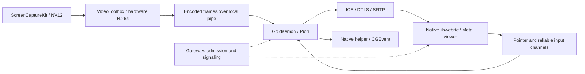

> **Historical engineering record.** This dated investigation or implementation
> report describes the state at the time it was written. For current behavior and
> setup, use the [documentation index](README.md).

# Dieter screen sharing assessment — 13 September 2026

**Historical assessment.** The subsequent Mac implementation and validation are documented in [Native Mac screen sharing implementation](screenshare-implementation-2026-09-14.md). Findings below describe the pre-change code.

**Dieter has the right native Mac capture foundation, but its current control path has correctness defects and its streaming policy is not yet sufficient for a responsive adaptive remote desktop.** Keep ScreenCaptureKit, direct VideoToolbox encoding, the native Metal viewer, and the existing authenticated WebRTC transport. Remove the experimental FFmpeg backends. Build a platform-neutral session/media/input contract around the Mac implementation, then add a Linux backend later.

This is an assessment and implementation proposal. Application code and daemon settings were not changed. Source inspection used Dieter commit `c97eb14e3135f9eaeea3e9791c32c3fe53a2b849` and RustDesk commit `bf1ebe5be2f5ac1ce634572e9ff7bc88e8b1d6aa`. The three pre-existing Mac UI edits were preserved. Verification included isolated Go/Swift tests and synthetic VideoToolbox encoding on an Apple M4 running macOS 26.5.1. Real desktop capture, remote event injection, WAN performance, and end-to-end latency were not exercised; performance targets below are proposed acceptance criteria, not measurements.

**What already exists**

On macOS, `NewFrameSource` selects the native helper unconditionally; it does not fall back to FFmpeg. The helper passes the ScreenCaptureKit pixel buffer directly to VideoToolbox, requires a hardware encoder, disables frame reordering, uses NV12, and bounds raw work to one encode plus one replaceable pending frame. Compressed H.264, rather than raw desktop pixels, crosses into Go. The viewer is an AppKit video surface using `RTCMTLNSVideoView`, not a web view. These choices should survive the work. [Source selection](/Users/dbpprt/Development/dieter/internal/remotedesktop/source.go:104), [capture and encoder](/Users/dbpprt/Development/dieter/native/macos-capture/DieterCapture.swift:214), [viewer](/Users/dbpprt/Development/dieter/apps/mac/Sources/DieterMac/Networking/RemoteDesktopController.swift:164).

The authenticated control plane is also useful: signed offer/fingerprint/control/display/input-epoch binding, bounded signaling history, one desktop session, a renewable lease, and reconnect grace. Media and input use WebRTC directly or a separately configured TURN server. The gateway does not carry desktop media. Preserve that distinction; a successful gateway signaling route does not establish that a direct media route exists. [Session construction](/Users/dbpprt/Development/dieter/internal/remotedesktop/manager.go:400), [TURN configuration](/Users/dbpprt/Development/dieter/internal/gateway/service.go:260).

**Findings, ordered by implementation priority**

1. **P1 — normal key and mouse releases are lost at the native IPC boundary.** `nativeInputPayload` marks `down`, `key_code`, `x`, and `y` with `omitempty`. Swift requires these fields to exist for the corresponding event. Consequently `down=false` disappears and the helper rejects key-up and mouse-up. Key code zero disappears too, as do pointer coordinates on the top and left boundaries. This is a concrete interoperability defect, independent of network conditions. A click can leave the helper's button state held, and a later move becomes a drag. Existing translation coverage tests a nonzero key-down only. [Go serialization](/Users/dbpprt/Development/dieter/internal/remotedesktop/source.go:372), [Swift guards](/Users/dbpprt/Development/dieter/native/macos-capture/DieterCapture.swift:73), [existing test](/Users/dbpprt/Development/dieter/internal/remotedesktop/input_test.go:55).

   An overlay test invoking the actual `nativeHelperSource.SendInput` failed all five required-scalar cases. For example, key-up became `{"input":{"kind":"key","key_code":55}}`; key code zero down became `{"input":{"kind":"key","down":true}}`. Fix presence semantics immediately and test the Go writer against the actual Swift decoder. A versioned typed IPC contract should replace the loosely typed dictionary as the feature grows.

2. **P1 — input release needs an end-to-end guarantee.** The viewer silently discards reliable events when its buffered amount reaches 256 KiB and ignores `sendData` failure. A discarded release is not repaired automatically. The host's 128-event state queue is bounded, but `SendInput` ignores its context and writes under a mutex shared with media controls. Release during session close can therefore wait behind a blocked pipe. The helper drains lines into an unbounded main-queue dispatch stream. The normal subprocess cancellation mechanism sends SIGKILL, which cannot execute the helper's cleanup. Release is attempted before cancellation, but there is no acknowledgment that it was applied. [Viewer writes](/Users/dbpprt/Development/dieter/apps/mac/Sources/DieterMac/Networking/RemoteDesktopController.swift:649), [host delivery](/Users/dbpprt/Development/dieter/internal/remotedesktop/input.go:88), [pipe writes](/Users/dbpprt/Development/dieter/internal/remotedesktop/source.go:419), [helper dispatch](/Users/dbpprt/Development/dieter/native/macos-capture/DieterCapture.swift:529), [process cancellation](/Users/dbpprt/Development/dieter/internal/remotedesktop/capture_process_unix.go:14).

   Add explicit pressed-state ownership, helper heartbeat/watchdog, bounded delivery deadlines, and a release/reset acknowledgment. Quiesce old input before releasing it; prevent queued downs from being applied afterward. Release on viewer deactivation, window loss of key status, control surrender, channel failure, display reconfiguration, and shutdown. A healthy held key must remain valid through heartbeats; a dead session must not hold it indefinitely. Prefer graceful helper stop with a bounded escalation path. Closing a session must remain possible when its helper is unresponsive.

3. **P1 — capture time is lost before RTP packetization.** The helper encodes with the sample buffer's presentation timestamp, but sends a fixed `1/fps` duration for every output. Go passes this fixed duration to `TrackLocalStaticSample`. In the pinned Pion version that duration advances the RTP clock. Capture timestamps in the pipe header are only logged, and the keyframe flag is discarded. Idle periods and dropped raw frames therefore compress the RTP timeline instead of preserving elapsed presentation time. The wall-clock timestamp is taken on callback arrival, not at WindowServer presentation. This makes the current age log incomplete and risks incorrect receiver timing as capture becomes more adaptive. [Capture callback](/Users/dbpprt/Development/dieter/native/macos-capture/DieterCapture.swift:289), [frame header](/Users/dbpprt/Development/dieter/native/macos-capture/DieterCapture.swift:504), [Go reader](/Users/dbpprt/Development/dieter/internal/remotedesktop/source.go:551), [Pion packetization](https://github.com/pion/webrtc/blob/v4.2.18/track_local_static.go#L343).

   Carry monotonic capture/presentation time, frame ID, stream generation, and keyframe status across IPC. Derive RTP timestamps from the actual media timeline, including idle gaps and discarded frames. Preserve the mapping to frame IDs for diagnostics. ScreenCaptureKit exposes presentation metadata including `displayTime`; use a defined conversion to the host monotonic clock. Never subtract arbitrary timestamps from two machines to claim end-to-end latency. [Apple frame metadata](https://developer.apple.com/documentation/screencapturekit/scstreamframeinfo/displaytime).

4. **P1 — adaptive behavior is limited to REMB-driven bitrate changes.** The Mac requests fixed 1920×1080, 30 fps, and 4,000 kbps. There is no live FPS/resolution update contract. The helper handles keyframe and bitrate requests, while the daemon only forwards PLI/FIR and REMB. Receiver statistics are logged every five seconds but do not feed a policy controller. Pion's default interceptors provide NACK/report/TWCC support; they do not automatically create and connect a send-side bandwidth estimator to Dieter's encoder. [Viewer caps](/Users/dbpprt/Development/dieter/apps/mac/Sources/DieterMac/Networking/RemoteDesktopController.swift:380), [RTCP handling](/Users/dbpprt/Development/dieter/internal/remotedesktop/manager.go:774), [receiver statistics](/Users/dbpprt/Development/dieter/apps/mac/Sources/DieterMac/Networking/RemoteDesktopController.swift:698).

   Add send-side bandwidth estimation, outgoing transport sequence numbers, and a bounded packet pacer. Feed encoder bitrate from the resulting budget, including protocol/retransmission headroom. Pion's example shows the estimator and header-extension integration. Its current GCC pacer uses a linked-list packet queue without an explicit queue ceiling, so adopting it unchanged would undermine Dieter's bounded-work requirement. Measure and bound packet age and bytes; preserve complete-frame dependency semantics when recovering from backlog. [Pion integration example](https://github.com/pion/webrtc/blob/v4.2.18/examples/bandwidth-estimation-from-disk/main.go), [pacer implementation](https://github.com/pion/interceptor/blob/v0.1.47/pkg/gcc/leaky_bucket_pacer.go).

5. **P1 for perceived responsiveness — cursor presentation waits for video.** Capture uses `showsCursor=true`; the viewer has no host cursor shape/position protocol. The host cursor therefore traverses input delivery, host rendering, capture, encoding, transport, decoding, and presentation before its movement is visible in the video. The client's own pointer is not a synchronized replacement. Higher FPS alone cannot fix this. [Capture configuration](/Users/dbpprt/Development/dieter/native/macos-capture/DieterCapture.swift:222), [input surface](/Users/dbpprt/Development/dieter/apps/mac/Sources/DieterMac/Features/Screens/ScreensView.swift:223).

   Make the cursor a separate stream: cached shape ID, bounded bitmap, hotspot, scale, visibility, host position, and last applied input sequence. Present the controlling viewer's cursor locally; reconcile host movement and shape changes without waiting for video. View-only sessions follow host positions. Keep an explicit embedded-cursor fallback where extraction fails. Mac cursor extraction requires a compatibility spike: `NSCursor.currentSystem` is documented but marked for future deprecation in the installed SDK, and RustDesk additionally uses `CGSCurrentCursorSeed`, a private API. Do not assume ScreenCaptureKit supplies a complete public cursor-shape replacement. [Apple cursor API](https://developer.apple.com/documentation/appkit/nscursor/currentsystem), [RustDesk Mac extraction](https://github.com/rustdesk/rustdesk/blob/bf1ebe5be2f5ac1ce634572e9ff7bc88e8b1d6aa/src/platform/macos.rs#L558).

6. **P2 — several desktop input semantics remain incomplete even after serialization is fixed.** Pointer motion is coalesced on an 8 ms MainActor task; keys/buttons/scroll use the reliable channel. The split is sensible, but there is no ordering relationship between channels. Button events include coordinates, yet an older pointer packet may arrive after a newer click. Mouse-up outside the video rectangle is rejected by geometry mapping. Keyboard packets contain Mac virtual key codes with no key namespace or text/IME operation. `repeat` and `precise` are serialized but ignored by the helper. Scroll deltas are rounded to integers, with no fractional accumulation, phase, momentum, or explicit unit conversion. Aggregate modifier flags cannot distinguish both sides of a modifier being held independently. Ordinary keyDown handling also does not establish a policy for menu shortcuts and OS-reserved shortcuts. [Coalescing and event encoding](/Users/dbpprt/Development/dieter/apps/mac/Sources/DieterMac/Networking/RemoteDesktopController.swift:600), [event routing](/Users/dbpprt/Development/dieter/apps/mac/Sources/DieterMac/Features/Screens/ScreensView.swift:284), [input schema](/Users/dbpprt/Development/dieter/api/proto/dieter/v1/dieter.proto:1719).

   Use portable physical key identifiers, separate committed text, explicit left/right modifier state, repeat semantics, and scroll units/phases. Define shortcut capture and the escape gesture. Once a drag begins, keep delivering its release even outside the content rectangle. Carry a shared event ordinal or pointer barrier on state transitions so stale motion cannot rewind the pointer after a click; retain the ability to discard superseded motion. Treat IME composition and password/secure-input behavior as explicit Mac acceptance cases.

7. **P2 — native encoder selection and negotiation need a stronger contract.** The current VideoToolbox setup is real-time, hardware-only, constrained-baseline H.264. It does not request Apple's dedicated low-latency rate-control mode. Apple documents that mode as disabling lookahead/reordering and using High profiles; enabling it is a negotiated codec change to validate, not just a Boolean to add. Dieter also advertises a fixed `profile-level-id=42e01f` while allowing the encoder to choose its output level. [Encoder settings](/Users/dbpprt/Development/dieter/native/macos-capture/DieterCapture.swift:316), [SDP capability](/Users/dbpprt/Development/dieter/internal/remotedesktop/manager.go:802), [Apple low-latency mode](https://developer.apple.com/documentation/videotoolbox/kvtvideoencoderspecification_enablelowlatencyratecontrol).

   A local synthetic probe produced constrained-baseline level 4.0 SPS bytes at 1080p30 and level 4.2 at 1080p60, while Dieter's declared level is 3.1. This demonstrates a contract discrepancy; it is not proof that today's Mac decoder rejects the stream. Check actual negotiated send/receive limits against SPS and requested dimensions/FPS. The same local OS accepted both baseline and High settings with the low-latency flag, despite Apple's documented restriction, and the hardware-status property was unavailable in that mode. Successful property writes therefore do not establish portable low-latency behavior. Query supported properties, inspect actual output, negotiate profiles explicitly, and test macOS 15 through current releases.

   Keep H.264 hardware encoding as the initial interoperable codec. Evaluate High profile and dedicated low-latency mode with a compatible hardware baseline path. Treat HEVC as a later negotiated experiment requiring verified viewer/WebRTC support. HDR, 4:4:4, and 120 fps require separate quality/capability work. For code and terminal readability, evaluate text and chroma edges, not only FPS; 1080p scaling and NV12 4:2:0 already discard information. The default WebRTC decoder factory and Metal renderer are native, but actual decoder implementation and hardware use still need runtime evidence.

8. **P2 — capabilities and display changes are placeholders.** The daemon reports one primary display with scale 1 and no real dimensions; hardware availability is inferred from the platform. The helper can select a numeric display but freezes its bounds and encoder dimensions at startup. The viewer always selects the reported primary display and offers no display/quality controls. Capture readiness is cached for the daemon lifetime, and a capability query can itself run a one-frame capture probe when enabled. That behavior differs from the documentation's statement that capture only starts after peer connection. Control readiness is refreshed when a control session starts. [Capabilities/probes](/Users/dbpprt/Development/dieter/internal/remotedesktop/manager.go:127), [display mapping](/Users/dbpprt/Development/dieter/native/macos-capture/DieterCapture.swift:68).

   Enumerate real displays, logical/physical bounds, scale, rotation, refresh rate, and encoder capabilities through the helper. Publish topology generations; reconfigure capture, input transforms, and decoder state atomically on display switch, resize, rotation, hotplug, and wake. Separate passive availability from an explicit capture probe, and invalidate readiness on relevant changes. The existing capture build targets arm64/macOS 15: describe that support precisely. Intel support would be an additional target and test matrix. [Helper build](/Users/dbpprt/Development/dieter/native/macos-capture/build.sh:8).

9. **P2 — recovery must work when the desktop stops changing.** A keyframe request only sets a flag for the next captured frame. The helper does not retain a refreshable last frame once its pending frame is consumed, so a damaged static image can wait for another desktop change. The startup timeout checks stream magic, not the first encoded frame; it does not diagnose a helper that emits magic and subsequently stalls. Add a bounded first-frame deadline, helper responsiveness heartbeat, and explicit refresh from a retained valid surface. Distinguish healthy static content from a stalled encoder. Rate-limit refresh requests and force an IDR with parameter sets after discontinuities. Do not discard arbitrary encoded P-frames and then continue sending their dependents. [Control handling](/Users/dbpprt/Development/dieter/native/macos-capture/DieterCapture.swift:529), [startup reader](/Users/dbpprt/Development/dieter/internal/remotedesktop/source.go:493).

**What to learn from RustDesk**

The useful reference is its behavior and subsystem separation. Its inspected Mac video backend uses `CGDisplayStream`, captures ARGB, and processes a latest-frame slot; its RAM hardware-codec path imports FFmpeg wrappers. The Cargo feature named `screencapturekit` is wired to its audio dependency. Dieter's direct ScreenCaptureKit/NV12/VideoToolbox path is already the more appropriate starting point for this requirement. [Mac capturer](https://github.com/rustdesk/rustdesk/blob/bf1ebe5be2f5ac1ce634572e9ff7bc88e8b1d6aa/libs/scrap/src/quartz/capturer.rs), [frame adapter](https://github.com/rustdesk/rustdesk/blob/bf1ebe5be2f5ac1ce634572e9ff7bc88e8b1d6aa/libs/scrap/src/common/quartz.rs), [hardware codec](https://github.com/rustdesk/rustdesk/blob/bf1ebe5be2f5ac1ce634572e9ff7bc88e8b1d6aa/libs/scrap/src/common/hwcodec.rs), [features](https://github.com/rustdesk/rustdesk/blob/bf1ebe5be2f5ac1ce634572e9ff7bc88e8b1d6aa/Cargo.toml#L48).

| RustDesk mechanism | Dieter application |
| --- | --- |
| Delay measured above a changing path baseline; confirmation before reductions; guarded recovery; bitrate reduction before FPS for bitrate-targeted encoders | Separate congestion from ordinary RTT, avoid reacting to one spike, and do not expect lower FPS alone to reduce an unchanged bitrate target. Tune for Dieter's latency goals rather than copying its thresholds. [QoS](https://github.com/rustdesk/rustdesk/blob/bf1ebe5be2f5ac1ce634572e9ff7bc88e8b1d6aa/src/server/video_qos.rs) |
| Feedback from frame consumption and live quality/FPS changes | Observe actual decode/presentation progress in addition to network estimates. Avoid copying per-frame waits into WebRTC; multiple frames must remain in flight across nontrivial RTT. [Video service](https://github.com/rustdesk/rustdesk/blob/bf1ebe5be2f5ac1ce634572e9ff7bc88e8b1d6aa/src/server/video_service.rs#L889) |
| Separate cursor shape/cache and position services | Decouple cursor movement from video, with a bounded cache and reconciliation. [Input service](https://github.com/rustdesk/rustdesk/blob/bf1ebe5be2f5ac1ce634572e9ff7bc88e8b1d6aa/src/server/input_service.rs#L329) |
| Key state bookkeeping, timeout cleanup, keyboard modes, platform adapters | Treat remote input as stateful device emulation with recovery, not a stream of independent clicks. [Key cleanup](https://github.com/rustdesk/rustdesk/blob/bf1ebe5be2f5ac1ce634572e9ff7bc88e8b1d6aa/src/server/input_service.rs#L832) |
| Wayland capture and remote-desktop portal modules | Keep capture, input, authorization, and compositor-specific behavior behind platform implementations. [Portal adapter](https://github.com/rustdesk/rustdesk/blob/bf1ebe5be2f5ac1ce634572e9ff7bc88e8b1d6aa/libs/scrap/src/wayland/remote_desktop_portal.rs) |

No RustDesk code was imported. Its repository declares AGPL-3.0; the proposal uses architectural lessons without making it a dependency. [Repository license](https://github.com/rustdesk/rustdesk/blob/bf1ebe5be2f5ac1ce634572e9ff7bc88e8b1d6aa/LICENCE).

**Recommended native architecture**

Keep the Go daemon responsible for authorization, sessions, network transport, adaptation policy, and CLI/API parity. Keep a signed per-user Mac helper responsible for WindowServer/TCC-facing operations, capture, hardware encoding, cursor extraction, and event injection. A native helper process is an appropriate boundary; compressed-frame pipe copies are not evidence that a Rust rewrite or raw shared-memory transport would improve performance. Profile before moving transport into the helper. Preserve raw pixel buffers within the native capture/encode path.

Replace the current minimal `FrameSource` contract with capabilities and an explicit streaming contract:

| Contract | Required information/behavior |
| --- | --- |
| Platform capabilities | Actual displays and geometry, permissions, graphical-session state, supported codecs/profiles/limits, cursor/input capabilities, live-reconfiguration support |
| Encoded frame | Frame ID, generation, monotonic PTS, keyframe flag, codec/config revision, dimensions, bounded payload; capture/encode timing metadata |
| Stream update | Target bitrate, max FPS, output dimensions, keyframe/refresh request, idle mode; applied configuration acknowledgment |
| Input | Portable physical keys and text, pointer coordinates tied to display generation, button/modifier state, scroll units/phases, ordering barriers, release/reset acknowledgment |
| Feedback | RTT/loss, bandwidth estimate, send-queue age/bytes, capture/encode drops, decode/presentation progress, last applied input sequence |

Version the local framing and network messages. Avoid retaining OS-specific handles in the generic contract. Bound commands, frames, cursor payloads, diagnostic retention, and dispatch work. Keep the persistent capture/input helper in the user's graphical session, with the same stable signing identity used for permissions.

For the initial macOS-only release, remove `ffmpegSource`, FFmpeg options/environment variables, the unused Mac AVFoundation branch, FFmpeg-specific readiness/errors/tests, and stale documentation. Return an explicit unsupported-backend capability on Linux until its native implementation exists. Preserve the synthetic test backend, and add a hardware-H.264 fixture that can actually be decoded by the Mac viewer: today's VP8-only synthetic source cannot exercise its H.264-only negotiation path. Audit release artifacts and transitive binary/link inputs if “no FFmpeg” is also intended to exclude statically linked third-party codec code; source imports or `otool -L` alone do not prove that absence.

For Linux later, use a per-user backend with XDG ScreenCast/RemoteDesktop portals and PipeWire on Wayland; use portal `ConnectToEIS`/libei for input where available, with the portal's supported fallback where required. Negotiate compositor capabilities and session persistence rather than assuming X11 semantics. Plan DMA-BUF import and native hardware encoders such as VA-API/NVENC as backend-specific work, with explicit format/modifier negotiation and a measured copy fallback. An X11 backend can separately use XDamage/XShm/XFixes/XTest. Do not introduce FFmpeg as the generic Linux implementation. [XDG RemoteDesktop contract](https://flatpak.github.io/xdg-desktop-portal/docs/doc-org.freedesktop.portal.RemoteDesktop.html).

**Adaptive performance policy**

Start with a 60 fps active ceiling when negotiated hardware/display limits permit, and an output size chosen from host pixels plus viewer viewport/backing scale. A smaller window should not force permanent 1080p quality on a Retina full-screen session. Keep sensible user ceilings and an automatic mode; raise 120 fps only after 60 fps meets latency and power targets.

Use one controller with several timescales. Packet pacing and network estimation operate continuously. A policy tick around 200–500 ms consumes measured bandwidth, queue age, encode time, and receiver progress. Confirm ordinary congestion across samples, react quickly to sustained backlog, and recover conservatively. Coordinate bitrate/FPS/resolution changes; do not make independent controllers fight each other. Reserve bandwidth for input, RTCP, retransmissions, and refresh bursts.

| Observed condition | Preferred response |
| --- | --- |
| Static text/editor | Avoid redundant encodes, preserve spatial detail, refresh after damage/loss or a quality increase |
| Scrolling, dragging, animation | Raise FPS promptly within budget; preserve low queue age; accept bounded temporary quality reduction |
| Network queue grows | Reduce encoder bitrate and pace; lower resolution/FPS if required after accounting for the content mode |
| Encoder overloaded or host thermally constrained | Discard superseded raw frames; reduce pixel rate/FPS; report the actual applied limit |
| Receiver cannot decode/present at target | Reduce stream workload from receiver feedback even when the network is healthy |
| Conditions improve | Increase bitrate first as appropriate, then restore spatial/temporal quality with hysteresis and an IDR when needed |

Use ScreenCaptureKit frame status/damage metadata to avoid unnecessary work. Keep queue depth 3 initially; Apple's documented minimum/default is three, and that number is a capacity rather than proof of three frames of added latency. Reconfigure capture through `updateConfiguration`; rebuild the encoder only for changes that require it, with explicit generation/SPS/IDR transitions. Bound outstanding surface ownership across capture, pending, and refresh frames. [Queue depth](https://developer.apple.com/documentation/screencapturekit/scstreamconfiguration/queuedepth), [stream updates](https://developer.apple.com/documentation/screencapturekit/scstream).

Instrument capture presentation → callback → encode start/end → IPC receive → RTP send, then receive/decode/present at the viewer. Use windowed deltas for WebRTC cumulative statistics. Track p50/p95/p99, queue age, drops by reason, bitrate, CPU/GPU/power, and actual hardware codec identity. The UI should show actual media route and measured FPS/resolution when useful; its current unconditional “Peer-to-peer media” text does not identify a TURN route.

**Implementation sequence and acceptance**

1. Fix input serialization and release semantics. Add cross-language contract tests, drag-outside-view release, modifier/repeat/scroll coverage, delivery-failure recovery, and bounded helper shutdown. These block trusting control.
2. Establish the typed native backend contract; remove FFmpeg; populate real capabilities; correct media timestamps and codec negotiation; implement first-frame/static-refresh recovery. Extend operational protobuf RPCs, CLI/help/docs/skill and local/direct-TLS/relay tests together whenever operations change, then run `just proto`.
3. Add separate cursor presentation and the input sequencing/state model. Verify text selection, menu interaction, double-click, precise scroll, shortcuts, keyboard layouts, IME, focus changes, host-local input, and mixed-scale displays.
4. Connect send-side estimation and bounded pacing, receiver feedback, live bitrate/FPS/resolution policy, and telemetry. Profile native low-latency encoding and decode/render scheduling. Ship adaptive 60 fps only after measured behavior meets the agreed budget.
5. Run a two-Mac performance/soak matrix, then implement Linux against the same contract. No Rust language migration or transport replacement is required by the evidence found here.

Proposed first performance gate: on two supported Apple-silicon Macs over a wired LAN with measured RTT under 5 ms, active 1080p60 should sustain its frame budget, with input-to-visible-response p50 ≤50 ms and p95 ≤80 ms. Local cursor motion should present on the next local refresh. These are targets to validate, not promises of current performance. For WAN, report input-to-visible latency alongside path RTT; local cursor prediction cannot remove the round trip needed for a remote application to react.

Test text entry, terminal scrolling, window dragging, browser animation/video, and a static desktop at 1080p60 and Retina resolutions. Exercise bandwidth steps, jitter/loss/reordering, Wi-Fi, TURN/UDP and TURN/TCP, decode throttling, thermal pressure, and 30-minute sustained operation. Require bounded queue age/memory, recovery after bandwidth restoration, no stuck keys/buttons, static-screen refresh after packet loss, and no task-owned helper left behind. Exercise sleep/wake, unplug/rotation/scale changes, permission changes, helper/daemon/viewer failure, secure-input fields, and escape from remote control. Use isolated daemons and test surfaces; network impairment must not alter the operator's live routes.

**Verification completed**

| Check | Result and scope |
| --- | --- |
| `go test ./internal/remotedesktop -count=1` | Passed; existing transport, binding, source, and input tests |
| `just mac test 'remoteDesktop\|screenDisconnect\|screenSuperseded'` | Six Swift tests passed using the canonical test cache; geometry, trust and asynchronous setup lifecycle |
| Temporary Go overlay with required-scalar cases | Five failures reproduced in production serialization; repository tests/source were not modified |
| Synthetic native VideoToolbox probe | Real H.264 output from generated NV12 at 1080p30/60; configuration/SPS evidence only, no screen capture or end-to-end benchmark |
| `just mac status` | No DieterMac app running at assessment start; no operator app/daemon restarted or replaced |
| `just check-changed --dry-run` | Selected Mac tests/smoke for the three pre-existing UI edits. Those unrelated changes were not revalidated by this assessment; no application source changed here. |

Temporary evidence and probes are in [the assessment evidence directory](/tmp/dieter-screens-assessment-20260913); the key reproduction is [input-contract-results.txt](/tmp/dieter-screens-assessment-20260913/input-contract-results.txt). Existing passing tests do not demonstrate real ScreenCaptureKit capture, Mac hardware decode, host event injection, or near-native interaction. Those remain explicit acceptance work for the implementation.
