# Screen-sharing performance investigation — 18 September 2026

Dieter has a credible native streaming foundation. Reaching Parsec/Moonlight-class responsiveness now depends primarily on presentation, loss recovery, device-specific decoding, and measured bandwidth policy. A transport rewrite is not the first investment justified by the evidence.

The strongest new measurement is on the Mac receiver: an exploratory synthetic run reported approximately **40 ms from decoded-frame arrival to Metal presentation**, while the final sampled encoding, sending, and jitter-buffer counters were approximately **4 ms, 0.17 ms, and 0.04 ms**. The immediate priority is to explain and reduce presentation residence. The strongest Android finding is more concrete than a hypothesis: the exact bundled Java decoder does **not** set MediaCodec's low-latency option.

“Lowest latency, lowest bandwidth, highest quality” is a set of competing objectives. The useful goal is the **least wire bandwidth that maintains the chosen visual quality, cadence, and latency deadline**, with different policies for reading text, interacting with the desktop, and sustained motion. Increasing compression effort, redundancy, buffering, frame rate, or chroma precision can help one objective and hurt another.

This is an investigation and implementation roadmap. No runtime source or operator configuration was changed. Source baseline: `6cc1a233b99b62f8de4287600551d3fd56e73141`; the existing edit to `ScreensView.swift` was preserved. Public competitor material is evidence about their techniques, not a matched performance comparison.

## Evidence collected now

Tests ran on Apple M4, macOS 26.5.1 (25F80), using disposable authenticated fixtures and the canonical Mac test cache. The viewer selected **1440×810 with a 60 fps ceiling**, not a standardized 1080p comparison. Background load was uncontrolled, including operator-owned capture processes, which were left untouched.

| Measurement | Median | p95 | Scope |
|---|---:|---:|---|
| Real application input → actual Metal presentation | **65.46 ms** | **82.44 ms** | 24 pixel-verified responses; includes host application response, ScreenCaptureKit, hardware H.264, WebRTC, decode, presentation |
| Synthetic capture → actual Metal presentation | **55.48 ms** | **73.73 ms** | 1,717 presentations; synthetic host pixels, no real application/capture scheduling |
| Synthetic input → actual Metal presentation | **47.53 ms** | **59.48 ms** | 24 responses in a different phase of the synthetic run |

Synthetic idle resumes were 39.10 and 55.49 ms. The 32-second stability phase retained 1440×810 and 60 fps, with receiver reports around 60 fps. These are one-run exploratory results, not confidence intervals or performance guarantees. Capture and input sample windows differ; the smaller synthetic input median does not imply negative application latency.

The synthetic report's final interval counters were `encodeMs=4.03`, `sendMs=0.174`, `jitterBufferMs=0.039`, and `renderMs=39.92`. They are **not aligned per-frame measurements** and must not be added to, or subtracted from, the whole-run percentiles. They identify a strong presentation lead to investigate, rather than an exact causal breakdown of all 55 ms.

Metal's presentation timestamp is better evidence than GPU submission, but it is still not physical input-to-photon timing. Same-host monotonic timestamps are valid for these fixtures; subtracting unrelated computers' monotonic clocks is invalid. No fresh two-machine LAN/WAN, physical Android, optical scanout, or matched-quality competitor benchmark was performed.

Verification:

- `just mac screens-native-test`: passed native input-state checks and the complete `internal/remotedesktop` race suite with the actual helper; Go suite took 57.530 seconds.
- `DIETER_TEST_SCREEN_CAPTURE_REAL=1 DIETER_TEST_SCREEN_LATENCY_ONLY=1 just mac screens-test`: 21 selected tests reported passing in 23.294 seconds, including the real input run, undocked journey, and authenticated HEVC transport. Some opt-in tests return early without their specific fixture flags; this is not a new recovery-matrix run.
- `DIETER_TEST_SCREEN_LATENCY_ONLY=1 just mac screens-test`: 21 selected tests reported passing in 58.695 seconds, including the synthetic measurements above.
- Inspected the installed Android `150.7871.01` AAR with `javap`, rather than assuming upstream Chromium behavior applies to this binary.
- Probed individual VideoToolbox properties on fresh hardware-required H.264 and HEVC low-latency sessions. Results below are property acceptance/readback, not encoded-quality or latency benchmarks.

`git diff --check` and local-link validation passed. `just check-changed --dry-run` was inspected at the start and end. The investigation-owned change is documentation, for which the repository planner selects no compiler/device checks. The full shared-tree runner was not executed: it also selects checks for the existing screen UI change and unrelated harness changes that appeared during this investigation. No repository-wide green result is claimed. No test-owned viewer/helper/input-target process remained after validation; the operator daemon and its capture/clipboard processes were left running. Android was inspected statically; no app/emulator/physical-device run was launched in this investigation.

Evidence is consolidated in [the local evidence directory](/tmp/dieter-screen-investigation-20260918), including [summary.json](/tmp/dieter-screen-investigation-20260918/summary.json), native/test logs, decoder bytecode, the reproducible property probe, and its JSON output. Fixture credentials were not copied into this directory. These temporary paths are not permanent evidence storage; the important results are retained in this report.

## What is already implemented

```mermaid
flowchart LR
    App[Host application / compositor] --> SC[Shared ScreenCaptureKit NV12 surfaces]
    SC --> VT[Bounded VideoToolbox encoder per rendition]
    VT --> IPC[Compressed access unit / native pipe]
    IPC --> Go[Go / RTP / GCC / pacer]
    Go --> Net[ICE / SRTP UDP or TURN]
    Net --> RTC[Native WebRTC assembly / recovery / decode]
    RTC --> GPU[Mac Metal or Android EGL / TextureView]
    GPU --> Display[Compositor / scanout]
    Input[Local input and cursor] --> DC[WebRTC input channels]
    DC --> Host[Native CGEvent injection]
    Host --> App
```

The gateway authenticates and signals sessions. It is not the screen-media path; TURN is a separate media relay. Optimizing gateway gRPC cannot remove steady-state video presentation delay.

| Area | Current implementation and implication |
|---|---|
| Capture | One ScreenCaptureKit stream per display, NV12, queue depth 3, status filtering, latest-surface replacement; audio disabled |
| Encoding | Hardware required; low-latency rate-control selection; real-time operation; no frame reordering; H.264 High when negotiated; 10-second configured keyframe interval |
| HEVC | Implemented, opt-in in native clients; Main SDR 8-bit 4:2:0, currently limited to 1080p60/40 Mbps; Automatic can fall back to H.264 |
| High refresh | H.264 supports a 120 fps ceiling at at most 1080p; 4K is capped at 60 fps; capability ceilings do not guarantee achieved cadence |
| Backpressure | One encoded-frame credit; the next encode waits until the previous access unit has passed sending/pacing; raw pending frames remain replaceable |
| Congestion | Real TWCC/GCC; 100 ms coalesced fast bitrate cuts; slower FPS/geometry adaptation; acknowledged bounded recovery probes |
| Pacing | Packet pacing at 2.5× the current transport target, a 5 ms burst allowance, bounded probe headroom; approximately 1,180-byte packetizer MTU before added extensions/repair |
| Recovery | NACK with 512-packet history, at most two retries, 50–250 ms RTT-aware usefulness window; PLI/LTR recovery and bounded refresh requests |
| FEC | Negotiated FlexFEC-03 already exists; moderate loss enables a 10% or 20% allowance; parity shares the pacer and reserves media bitrate |
| References | Hardware LTR already exists for H.264/HEVC where supported; acknowledgements require actual decoded output and correct session/generation |
| Mac rendering | Native pixel buffers into Metal; direct decoder callback, private render executor, latest-frame mailbox, two drawables, one GPU submission at a time; display synchronization remains enabled |
| Android rendering | MediaCodec → shared texture → EGL → TextureView; callback bypasses delayed track presentation; H.264 still permits platform software fallback |
| Input | First pointer movement immediate; burst coalescing at 4 ms; unordered/unreliable motion; ordered reliable key/button state with barriers; independent clipboard channel |
| Cursor | Separate shape/position feedback and local cursor response; embedded-cursor fallback; host cursor polling every 33 ms |
| Multiple viewers | Four-viewer/encoder bound; shared capture; compatible non-LTR viewers can share an encoder, but LTR viewers use independent encoders |

Source entry points: [native capture](/Users/dbpprt/Development/dieter/native/macos-capture/DieterCapture.swift:535), [shared capture](/Users/dbpprt/Development/dieter/native/macos-capture/SharedDisplayCapture.swift:93), [media configuration](/Users/dbpprt/Development/dieter/internal/remotedesktop/session_configuration.go:139), [pacer](/Users/dbpprt/Development/dieter/internal/remotedesktop/pacer.go:183), [recovery](/Users/dbpprt/Development/dieter/internal/remotedesktop/reference_recovery.go:39), [FEC](/Users/dbpprt/Development/dieter/internal/remotedesktop/fec.go:106), [Mac renderer](/Users/dbpprt/Development/dieter/apps/mac/Sources/DieterMac/Networking/RemoteDesktopMetalRenderer.swift:117), [Android decoder](/Users/dbpprt/Development/dieter/apps/android/app/src/main/java/com/dbpprt/dieter/screens/ScreenDecoderFactory.kt:14).

The September 13 assessment is historical. Recommendations to first add hardware encoding, separate cursor handling, TWCC, HEVC, immediate decode presentation, LTR, or FEC would duplicate completed work. The September 17 latency document's statement that FEC was not enabled predates the later recovery implementation.

Production host capture now supports macOS plus Linux X11 and Wayland portal
backends; synthetic transport fixtures remain test-only. The performance table
above describes the macOS hardware path. Linux uses in-process GStreamer H.264
with capability-detected hardware/software encoders and the same bounded WebRTC
transport; its qualification matrix is tracked in the
[Linux screen-sharing plan](linux-screen-sharing-plan-2026-09-18.md). The
[public screen guide](../landingpage/content/docs/screens.md) documents the
current host and viewer behavior.

## What the comparison products teach us

Parsec's published architecture emphasizes hardware codecs and keeping raw surfaces on the GPU. Its native protocol is custom UDP, but public descriptions do not expose enough detail to reproduce its current congestion/recovery algorithm. Adopt observable principles and benchmark against the product. A custom protocol by itself is not evidence of lower latency. [Parsec architecture](https://parsec.app/blog/description-of-parsec-technology-b2738dcc3842), [native/browser transport discussion](https://parsec.app/blog/game-streaming-tech-in-the-browser-with-parsec-5b70d0f359bc).

Parsec's widely quoted 4–8 ms demonstration used two 240 Hz displays, wired gigabit networking, and a 100 Mbps setting. It measured the visual offset between host and client in that setup. It is not a 60 Hz, low-bandwidth, input-to-photon guarantee. [Original experiment](https://parsec.app/blog/parsec-game-streaming-total-latency-at-240-frames-per-second-c0818cc0daa5).

Sunshine exposes codec/capture policy and uses FEC; its current configuration documents 20% FEC by default. The inspected sender packetizes and repairs frames, supports batched sends, and paces groups within frames. Its source includes an approximately 80%-of-gigabit packet-group rate calculation. Copying that aggressively into a constrained Wi-Fi/WAN link would be a poor default; copy the bounded fast-drain design and measure a path-appropriate budget. [Configuration](https://docs.lizardbyte.dev/projects/sunshine/master/md_docs_2configuration.html), [sender source](https://github.com/LizardByte/Sunshine/blob/master/src/stream.cpp).

Moonlight's Android receiver is a valuable implementation reference: codec performance-point checks, direct output to a surface, explicit low-latency options with fallback, and different presentation policies. Its low-latency render path drains available decoder output to the latest frame; balanced mode deliberately allows a small smoothing queue. It also carries substantial vendor-specific compatibility knowledge. [Decoder renderer](https://github.com/moonlight-stream/moonlight-android/blob/master/app/src/main/java/com/limelight/binding/video/MediaCodecDecoderRenderer.java), [device options](https://github.com/moonlight-stream/moonlight-android/blob/master/app/src/main/java/com/limelight/binding/video/MediaCodecHelper.java).

## Priority 1: remove measured receiver delay

### Mac: measure compositor residence before changing transport

The 39.92 ms final render interval is the largest measured stage in the new synthetic run. Encoding improvements of a millisecond will not compensate for multiple display intervals here. This does not prove that every sample, display, or codec has the same delay.

Instrument each frame at decoder output, mailbox offer/take, drawable acquisition start/end, command commit, GPU start/end, and actual presentation. Record how many submitted drawables have not yet presented. **One GPU command in flight is not the same as one frame awaiting presentation:** the current code releases its GPU-busy gate on command completion, while the compositor can still own an unpresented drawable.

Run controlled A/B experiments:

1. Current immediate mode, with explicit counts of queued presentations and actual display refresh.
2. A policy that bounds outstanding *unpresented* frames and selects the newest surface near the next useful presentation opportunity. Avoid blindly waiting a full refresh before beginning all GPU work.
3. Refined `CAMetalDisplayLink` scheduling, measuring missed deadlines and first-frame/idle behavior. The earlier implementation's display-link matrix was slower; changing the default back is not supported by current evidence.
4. An explicit lowest-latency option using unsynchronized presentation where supported, accepting possible tearing. Treat compositor behavior as something to measure on each display and OS, not a promised removal of exactly one frame.
5. Windowed versus fullscreen, Retina scaling versus 1:1 pixels, 60/120 Hz, internal/external monitor, and variable-refresh behavior.

Preserve native NV12/Metal textures, generation rejection, latest-frame selection after drawable waits, and rendering independence from MainActor. Avoid adding `waitUntilCompleted`, per-frame UI hops, or a FIFO of decoded surfaces.

### Android: low-latency MediaCodec and a direct presentation experiment

The local AAR contains `org.webrtc.AndroidVideoDecoder`. Its configuration constructs a MediaFormat, optionally sets `color-format`, then calls `configure`; it does not set `low-latency`, `priority`, or `operating-rate`. Dieter's wrapper only intercepts callbacks, so it cannot currently supply these options. Evidence: [bytecode](/tmp/dieter-screen-investigation-20260918/android-decoder-bytecode.txt:211).

Add a maintained decoder adapter or narrowly scoped SDK patch that checks `FEATURE_LowLatency`, requests `KEY_LOW_LATENCY` on supported devices, and falls back cleanly if configuration fails. Android documents this facility from Android 11. Start with the official option; vendor parameters need a tested device allowlist and fallback. Max operating-rate settings can have power or compatibility costs. [Android low-latency support](https://developer.android.com/about/versions/11/features), [Moonlight's fallback logic](https://github.com/moonlight-stream/moonlight-android/blob/master/app/src/main/java/com/limelight/binding/video/MediaCodecHelper.java).

Then compare the current path with:

- EGL rendered into a SurfaceView, retaining the existing decoder/texture interface.
- A decoder output Surface supplied directly to MediaCodec for fullscreen viewing, avoiding the intermediate texture/EGL pass where possible.

SurfaceView is officially preferred for video when its interaction constraints are acceptable, with power and timing benefits on many devices. Keep zoom/pan, cursor overlays, rotation, clipping, accessibility, and surface teardown correct. A direct path may warrant a fullscreen mode while keeping the flexible TextureView path for embedded use. [Android surface guidance](https://developer.android.com/media/media3/ui/surface).

Request an appropriate display frame rate and verify the actual mode; 120 fps decode on a 60 Hz display is not 120 fps presentation. Log actual codec name, hardware/software identity, and low-latency mode. H.264 software fallback should be visible and should reduce workload, rather than silently being classified as equivalent to hardware.

Replace the current EGL-submission metric with presentation evidence where available, plus optical measurements. Android and Mac render counters presently measure different endpoints. Test physical Qualcomm, Exynos/Tensor, and MediaTek devices; emulator success establishes functionality only.

## Priority 2: recover within the interaction deadline

The prior recovery matrix proved correctness but observed maximum inter-decode gaps of **160–277 ms**, mostly near 260 ms. LTR avoided an extra keyframe but did not establish shorter stalls. These are historical results, not a fresh matrix run. [Recovery evidence](/Users/dbpprt/Development/dieter/docs/screenshare-recovery-implementation-2026-09-17.md:47).

The current repair window is `clamp(2 × RTT + 2 frame intervals, 50 ms, 250 ms)`, reserving half an RTT for outbound repair. This is retention/usefulness policy, not an intentional playback buffer. Nevertheless, waiting to exhaust repair before requesting a new decodable reference can produce a long visible stall. The 200 ms recovery request rate limit and receiver-side missing-frame policy also deserve aligned traces.

Missing, zero, or stale RTT retains the 250 ms compatibility window. Record the actual RTT value and freshness used by each recovery decision; the real-input fixture logged zero RTT in one quality interval. This is a reason to investigate the fallback path, not proof that it caused the earlier recovery-matrix stalls.

Use an explicit per-frame presentation deadline. Retransmit only if expected arrival plus decode/presentation can meet it. If useful retransmission is unlikely, request LTR recovery early, falling back to an IDR if no valid anchor exists. Coordinate receiver dependency state, missing-frame detection, NACKs, FEC arrival, LTR request, encode, send, decode, and first recovered presentation. Do not arbitrarily discard reference P-frames and continue their dependents.

Tune policy separately for low-RTT LAN and higher-RTT WAN. A useful experiment is a small LAN recovery deadline and early LTR trigger, with bounded jitter tolerance. Validate reordering and delayed feedback so ordinary jitter does not cause recovery storms. Keep sequence/generation validation and repeated-recovery acknowledgement semantics intact.

The 512-packet retransmission history deserves a specific high-bitrate test. At roughly 1.2 KB per packet it covers about **49 ms at 100 Mbps**, or **123 ms at 40 Mbps**, even though the age cap is 250 ms. Large IDRs can exhaust it within one frame. Size retention from observed packet rate and the useful repair interval, with strict total bytes/packet/session caps. A 250 ms history at 100 Mbps is roughly 3.1 MB before metadata; keep aggregate four-viewer memory bounded.

Current FEC emits at most one repair packet for each selected bounded group; that cannot recover two arbitrary missing packets in the same group. Tune protection from *unrecovered frame loss and burst length*, not only average loss. Compare shorter groups, selective protection of IDR/reference-critical packets, and carefully bounded stronger parity. Media must never wait for a group to fill. Additional parity must stay inside the total wire budget and stop when it worsens congestion.

Evaluate usefulness, not just counters: protected packets, actually repaired packets, repair arriving before deadline, bytes saved by avoided IDRs, and first good pixels after loss. A higher `fecPackets` count alone is not success.

## Priority 3: spend fewer bits for the same useful image

### Content-aware quality

The current controller uses a fixed `bitsPerPixel = 0.055` and cost estimates to adjust FPS/geometry. It has no measured text/motion classification or codec-specific rate-distortion model. Its compute ceiling uses the maximum of encode/write/decode times; that is not a model of every serialized stage. [Controller](/Users/dbpprt/Development/dieter/internal/remotedesktop/adaptation.go:164).

Introduce a lightweight content signal from ScreenCaptureKit damage, actual encoded size, encoder QP where available, and motion/change history. No per-frame OCR is needed. ScreenCaptureKit already provides dirty rectangles; the current path only reads frame status. [Apple damage metadata](https://developer.apple.com/documentation/screencapturekit/scstreamframeinfo/dirtyrects).

Use three explicit policies:

| Workload | Preserve first | Spend less on |
|---|---|---|
| Reading/code/static desktop | Native text geometry and sharpness; fast first response | Duplicate frames, unchanged regions, constant probing |
| Interactive desktop/scrolling | Input freshness, readable text, useful cadence | Excess Retina pixels and unnecessary quality beyond visibility |
| Sustained motion | Cadence and short presentation age | Spatial resolution/quantization when capacity falls |

Existing Detail caps cadence at 30 fps and Motion trades pixels before cadence; retain those intentions. Improve transitions so one busy scene does not shrink an otherwise readable desktop for a long time. Bandwidth cuts should be fast; geometry changes should be deliberate. Persistent congestion and receiver compute pressure need separate signals from a single difficult frame.

Capture/encode only useful changes, while retaining bounded heartbeat, refresh, and recovery behavior. After motion stops, send a small number of quality-improving refreshes if the final image is visibly degraded, then stop. The existing idle recovery can request an IDR every three seconds while degraded; measure its byte cost and whether acknowledged LTR/P refresh can safely replace some of those IDRs. Never equate “static” with “delivery succeeded.”

### HEVC: finish the quality experiment before promoting Automatic

HEVC is the nearest codec opportunity because the complete path already exists. Run H.264 High and HEVC with the same source pixels, geometry, cadence, recovery policy, and network. Sweep 2/4/6/8/12/20 Mbps as appropriate; compare **equal visual quality at actual wire bytes**, not equal configured bitrate. Keep encoder/decoder p95 and power in the decision.

The previous HEVC plan's 30% bandwidth saving and ≤5 ms latency regression are reasonable proposed gates, not measured savings. Make Automatic select a verified hardware mode with a capability/performance table and bounded fallback. Extend HEVC to Retina/4K and 120 fps only after codec profile/level, actual device performance, parser/dimension limits, recovery, and transport tests are updated together. Today many larger Mac viewports cannot use HEVC; changing only the default will not fix that.

### Text fidelity and geometry

4:2:0 discards chroma detail. Raising bitrate cannot restore chroma samples already removed from colored one-pixel text. Avoid repeated scaling, distinguish logical size from physical pixels, use exact aspect-preserving geometry, and verify color matrix/range tagging. Use a 1:1 text crop and colored terminal text in every quality comparison. [Parsec's compression discussion](https://parsec.app/blog/an-introduction-to-video-compression-c5061a5d075e).

Mac already sizes the stream to its viewport with debounce. Android zoom is a client-side transform; inspect whether the requested full-desktop resolution fits the visible viewport and link. Dynamic region-of-interest capture while zoomed could save substantial pixels, but requires explicit coordinate mapping and full-desktop navigation/recovery behavior. Temporary physical display matching already exists; use it only as the explicit user-visible mode it is. Virtual displays are a separate future feature, not a latency toggle.

For text-perfect work, investigate supported hardware 4:4:4 or a small lossless/chroma enhancement layer over a low-latency video base. This is an advanced feature: stale overlays, scroll alignment, generation resets, extra bandwidth, and compositing cost must be solved. Do not assume Parsec's 4:4:4 route is universally hardware decoded; its current advanced settings document CPU decoding for that option. [Parsec settings](https://support.parsec.app/hc/en-us/articles/32381443626516-All-Advanced-Configuration-Options).

## Priority 4: bound burst and pipeline costs

### Encoder knobs: what this Mac actually accepts

Fresh 1080p hardware-required sessions, with low-latency selection and real-time/no-reordering configuration, produced these results:

| Property experiment | H.264 | HEVC | Interpretation |
|---|---|---|---|
| `MaxFrameDelayCount=0` | Rejected, -12900 | Rejected, -12900 | Not an available magic knob in these modes |
| `MaxH264SliceBytes=1200` | Rejected, -12900 | Rejected, -12900 | Do not plan slice streaming around this property on this host |
| `PrioritizeEncodingSpeedOverQuality=true` | Rejected, -12900 | Rejected, -12900 | Production ignores this setter's return value; its presence does not prove it takes effect |
| `MaxAllowedFrameQP=40` | Accepted/read back | Accepted/read back | Test a quality floor; it may cause frame drops when bitrate is insufficient |
| `MinAllowedFrameQP=10` | Accepted/read back | Accepted/read back | Can avoid spending excessive bits on imperceptible fidelity; validate text |
| `EnableLTR=true` | Accepted/read back | Accepted/read back | Consistent with the implemented recovery feature |
| `BaseLayerFrameRateFraction=0.5` | Accepted/read back | Accepted/read back | Candidate for temporal layering experiments, not proof of compatible output |
| 150,000-byte / 100 ms data-rate limit | Setter accepted; getter unsupported | Same | Candidate burst envelope; enforce/evaluate against actual encoded output |

Each property was tested on a fresh session. Combined behavior and encoded results were not tested by this probe. The actual production low-latency encoder remains useful even where another speed property is unsupported. Record accepted/rejected settings and actual codec identity in diagnostics.

The existing `DataRateLimits` window is one second, at the same rate as `AverageBitRate`. The installed Apple SDK documents a windowed hard cap, not a one-second buffering requirement, and warns that an average target close to the hard cap can undershoot. Test shorter burst envelopes with sensible headroom. Too-tight IDR limits cause poor quality or dropped frames. Do not prescribe universal QP values from the probe. Apple's low-latency API also supports temporal layers and acknowledged references, which are tools to validate, not free quality improvements. [Apple encoder design](https://developer.apple.com/videos/play/wwdc2021/10158/), [local SDK contract](/Applications/Xcode.app/Contents/Developer/Platforms/MacOSX.platform/Developer/SDKs/MacOSX.sdk/System/Library/Frameworks/VideoToolbox.framework/Headers/VTCompressionProperties.h:216).

### Whole-frame transmission and one-credit serialization

At 12 Mbps/60 fps, the average compressed frame is approximately 25 KB; at 4 Mbps/60 fps it is 8.3 KB. A 100 KB IDR takes about 200 ms to serialize over a real 4 Mbps bottleneck, before protocol overhead. Faster socket writes cannot remove that bottleneck; compression and recovery bursts matter.

The single frame credit deliberately prevents encoding from outrunning transport. It also means encode N+1 waits for encode N, IPC, pacing/sending, and credit return. A rough continuous-work upper bound is `1 / (encode + IPC/send + credit turnaround)`, not `1 / max(encode, send)`.

Experiment with **one sending access unit plus one encoding slot**, admitted only when predicted completion will remain within a short age budget. Disable overlap when queues grow. Keep dependencies intact and bound bytes as well as frame count. Two unconditional credits can make freshness worse, so this is lower priority than the measured presentation problem. There is no evidence from the new sample that sending currently dominates clean-loopback latency.

The current pacer already allows aggressive headroom. Parameterize 1×/1.5×/2.5× and small burst durations in isolated tests; prefer the fastest drain that does not grow the bottleneck queue. Evaluate packet batching and timer/allocation reduction under CPU profiles. Sunshine demonstrates batching, but wire burst tolerance is path-dependent. Preserve interleaving/priorities for useful repair and control traffic; packets protected by FEC must retain exactly the final headers the receiver reconstructs.

The hardcoded 48-byte transport allowance is an estimate, not exact Ethernet/IPv6/SRTP/TURN accounting. Measure wire bytes, including parity, retransmits, padding, RTCP, SCTP, and relay overhead. Validate final packet size after RTP extensions and FEC; a base MTU value alone does not prove no IP fragmentation. Keep conservative MTU until path-specific evidence supports change.

## Priority 5: input, multi-viewer cost, and operational performance

Local cursor motion is already independent of the video round trip. Keep it that way. Pointer coalescing at 4 ms is a reasonable starting point; test 1–4 ms and adaptive sampling against event rate, CPU, and actual motion latency. High mouse polling rates should not create a host input FIFO.

Reliable ordered keys/buttons preserve semantics but can stall after loss. Separate DataChannels still share an SCTP association and network capacity; the clipboard's separate channel is not complete congestion isolation. Existing 16 KB chunks and 32 KB buffering bounds help. Test concurrent binary clipboard transfer, lossy input, drag/release, and reference acknowledgements. Consider smaller chunks, stream priority/interleaving where negotiated, or pacing clipboard below active interaction needs.

For an advanced input protocol, use idempotent state snapshots/redundant recent state to heal dropped button/key state, while keeping text and other non-idempotent actions reliably ordered. Preserve event ordinals, barriers, authenticated control ownership, focus release, and protection against stuck keys. Do not make key transitions casually unreliable. For gaming workloads, relative mouse input/pointer lock is a separate capability to evaluate; faster absolute coordinates do not reproduce all gaming input semantics.

The host currently renders and PNG-encodes/hashes the candidate cursor before checking whether anything changed, on a 33 ms timer. Cache shape work and reduce polling when idle; preserve animated/system cursor transitions. This is a CPU/power opportunity and remote-shape latency improvement, not the main local pointer-motion bottleneck. [Cursor loop](/Users/dbpprt/Development/dieter/native/macos-capture/DieterCapture.swift:1123).

For multiple viewers, count total encoder utilization and aggregate upload. Shared capture saves capture cost; it does not remove four independent encoded streams. LTR has per-viewer reference ownership, so sharing an LTR encoder requires a deliberate common-reference design. Temporal layering could reduce duplicate encoder work for viewers needing different cadence, but requires usable dependency metadata, layer bitrate allocation, loss recovery, and decoder compatibility. It does not automatically reduce the sum of all network egress.

Keep GPU scaling in native surfaces when renditions differ. Profile HEVC's compressed-byte conversions: the Mac decoder currently copies to `[UInt8]`, builds per-NAL Data, rebuilds a length-prefixed payload, and copies into CMBlockBuffer. A bounded reusable parser/buffer can reduce allocations if profiles show meaningful cost. This is compressed-data overhead; the raw-pixel GPU path should remain intact.

Measure 30–60 minute thermal/power behavior, battery operation, wake from idle, multiple displays/viewers, and foreground/background transitions. Sustained throughput matters more than a brief peak. Avoid blanket real-time scheduling, busy spinning, huge socket buffers, global OS tuning, or disabling power management; each needs a measured benefit and bounded impact.

## Transport strategy and more experimental techniques

Keep WebRTC initially. It already provides authenticated encrypted UDP media, ICE, TURN, congestion feedback, interoperability, and recovery integration. First measure time spent inside frame assembly, decode scheduling, and loss waits in the pinned Mac M151/Android M150 receivers. The direct decoder callback bypasses delayed *post-decode* rendering; it does not bypass all pre-decode buffering. The fresh near-zero jitter sample argues against blaming that stage for the clean-loopback result.

If receiver-internal waits remain substantial after presentation work, prefer a small reproducible native WebRTC build with narrowly scoped low-latency changes and pinned tests. Compare its maintenance cost with a custom receiver using existing RTP/ICE/SRTP. Only then consider a new media transport.

| Technique | Decision |
|---|---|
| Direct UDP / nearby TURN-UDP | Prefer the lowest measured-RTT viable route; expose actual candidate type and transport. An authenticated signaling route says nothing about the media route. |
| TURN/TCP or TLS fallback | Useful reachability fallback; measure ordered-transport head-of-line delay and select lower workload when necessary. |
| QUIC DATAGRAM | Possible future transport with authentication, congestion control, deadlines, NAT/relay integration; no inherent latency win over working SRTP/UDP. QUIC reliable streams are unsuitable for obsolete video frames. |
| Separate media/control sockets | Experiment only if traces demonstrate contention that channel prioritization cannot fix; preserve security and bounded lifecycle. |
| DSCP / Wi-Fi prioritization | Opportunistic, never assumed honored; validate on target networks. |
| AV1 | Future hardware/capability experiment; no AV1 path currently exists. Do not confuse hardware decode support with encode support or introduce CPU encoding as an invisible latency regression. |
| Temporal SVC | Promising for safely discardable enhancement frames and multi-viewer efficiency; requires negotiated dependency/recovery support. |
| Intra refresh / reference invalidation | Use supported hardware mechanisms to avoid IDR bursts; current acknowledged LTR is already the closest implemented mechanism. |
| Slice/subframe streaming | Only valuable when capture/encoder output/transport/decoder all expose useful partial work; the current VideoToolbox callback emits full access units and the slice-size probe was rejected. |
| ROI / tile / lossless refinement | Potentially valuable for desktop text and sparse changes; larger protocol/compositor project with strict stale-tile invalidation. |
| 4:4:4 / HDR / 10-bit | Fidelity options with bandwidth/device costs; separate product modes, not universal low-latency defaults. |
| Predictive remote application response | Avoid general UI prediction: a local cursor is safe, but inventing unseen remote application pixels/actions breaks correctness. |
| Audio | Not captured today. If added, use a separate low-latency audio path and avoid forcing interactive video into an unnecessarily deep audio-sync buffer. |

## Performance contract and benchmark plan

Use a complete latency model:

`input sampling → uplink → injection → application/compositor → capture → scale/encode → send queue/pacing → downlink → assemble/repair → decode → presentation → scanout`

For remote application response, network transit is approximately one RTT on a symmetric route, plus local/host processing. An independent periodic 60 Hz stage can contribute 0–16.7 ms of phase wait; at 120 Hz that range halves. Stages can overlap, so do not blindly add average half-frame waits. Report local cursor latency separately from actual application response.

Instrument aligned per-frame stage timestamps with frame/session/generation IDs and input ordinals. Use monotonic clocks locally; for two-machine stage analysis estimate offset/skew and uncertainty, while input-to-present can be measured entirely on the client. Measure physical input-to-photon separately with a high-speed camera or photodiode and the same visible marker for all products.

Record p50/p95/p99, frame age, missing/late presentations, consecutive freeze duration, dropped frames by reason, input release correctness, actual codec/hardware mode, wire bytes by traffic type, QP/frame sizes, CPU/GPU, power and temperature. Capture-to-send already overlaps encode; Mac render means decode-to-presentation; Android currently means EGL submission. Keep definitions explicit.

Proposed initial goals, subject to a controlled baseline:

- Two supported Macs, wired RTT <5 ms, 1080p60: input-to-presentation p50 ≤40 ms and p95 ≤60 ms; stretch to ≤30/45 ms after compositor work. These are targets, not current results.
- Matched 120 Hz host/client at 1080p120: beat the matched 60 Hz input latency while sustaining presentation cadence. Do not choose 120 just because it is offered.
- Moderate induced loss: materially reduce the existing 160–277 ms decode stalls; initial target p95 visible recovery <100 ms at low RTT, with no recovery/IDR storm.
- HEVC: at least 30% lower wire bytes at matched accepted text/motion quality and ≤5 ms p95 input-latency regression on supported physical devices. If a workload fails, keep its previous codec choice.
- Static desktop: no repeated video work absent damage or justified recovery/refinement; separately account for bounded control/ICE keepalives.
- No stuck input, stale-generation pixels, growing memory, or cross-viewer interference during all performance tests.

Run a staged matrix rather than changing everything at once:

| Axis | Required cases |
|---|---|
| Content | Small grayscale/colored code text; terminal scroll; window drag; browser animation; 60 fps video; photographic/noisy motion; static → input → static |
| Geometry/cadence | 1080p60 baseline; actual Retina viewport; 4K60; supported 1080p120; client 60/120 Hz |
| Codec | H.264 High vs HEVC; actual hardware identity; recovery on/off in isolated experiments |
| Network | Wired low RTT; Wi-Fi; controlled 20/50/100 ms RTT; jitter/reordering; 0/0.1/0.5/1/3% random loss plus bursts; 20→4→20 Mbps capacity steps; TURN-UDP and TCP fallback |
| Client | Two physical Macs; physical Android across major decoder vendors; emulator only for functional coverage |
| Concurrency | One/two/four viewers; clipboard load; background host work; sleep/wake; 30–60 minute thermal soak |

Use an owned deterministic app/content replay, fixed display modes and scaling, three or more randomized repetitions, warmup, exact revision/build/compiler/codec settings, and the same impairment/quality target for Dieter, Sunshine/Moonlight, and Parsec. Measure local non-streamed app latency as a reference. Avoid comparing our complete input loop with a competitor's encode/decode-only overlay.

For quality, use text-edge crops and reading/OCR error as well as perceptual video metrics such as SSIM/VMAF. VMAF alone is not a text-readability contract. Compare motion and the settled frame after scrolling stops. Use offline source captures; do not add expensive quality analysis to the live pipeline without evidence.

## Implementation order

| Order | Deliverable | Completion evidence |
|---|---|---|
| 1 | Aligned render/input/wire tracing and reproducible 1080p two-machine baseline | Stage histograms, physical presentation check, versioned results and exact metric definitions |
| 2 | Mac presentation experiments and selected bounded presentation policy | Lower input p50/p95 on repeated tests; no cadence/idle/resize/generation regressions |
| 3 | Android low-latency codec adapter, actual hardware diagnostics, SurfaceView/direct-surface A/B | Physical-device latency/power improvement with safe decoder/surface fallback |
| 4 | Deadline-driven NACK/LTR/IDR policy and high-rate history sizing | Shorter visible recovery under random and burst loss, bounded bytes, no input regression |
| 5 | Matched-quality HEVC study and content-aware budget model | Wire savings with text/motion and latency gates; justified codec selection |
| 6 | Encoder burst-envelope and bounded encode/send overlap experiments | Lower frame age under constrained capacity; preserved reference correctness |
| 7 | Multi-viewer temporal layers, ROI/refinement, larger HEVC modes | Hardware/decoder proof and meaningful bandwidth/compute improvement |
| Conditional | WebRTC patch or new media transport | Residual measured bottleneck and repeatable benefit after earlier stages |

Implement each experiment behind a disposable-fixture flag first, compare one variable at a time, and keep a known-good fallback. A new native operation or exposed performance control must include the authoritative proto, explicit gRPC implementation, thin Connect adapter, CLI/help/docs/skill parity, regenerated clients, and local/direct-TLS/relay coverage. Internal tuning that adds no operation need not invent a new RPC.

The immediate recommendation is **Mac presentation tracing/tuning, Android low-latency decoding, and deadline-driven recovery**, followed by **measured HEVC/content-aware bandwidth reduction**. The existing architecture supports this sequence without giving up its authentication, bounded resource use, or native GPU pipeline.
